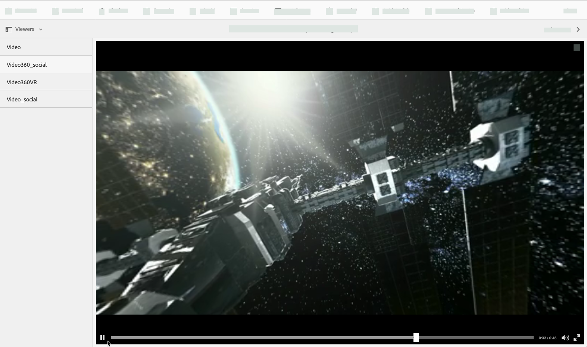
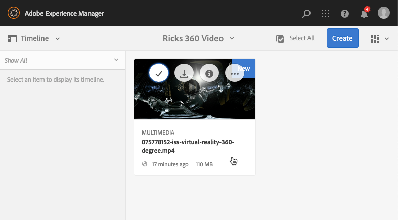
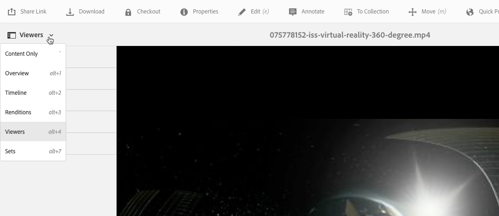
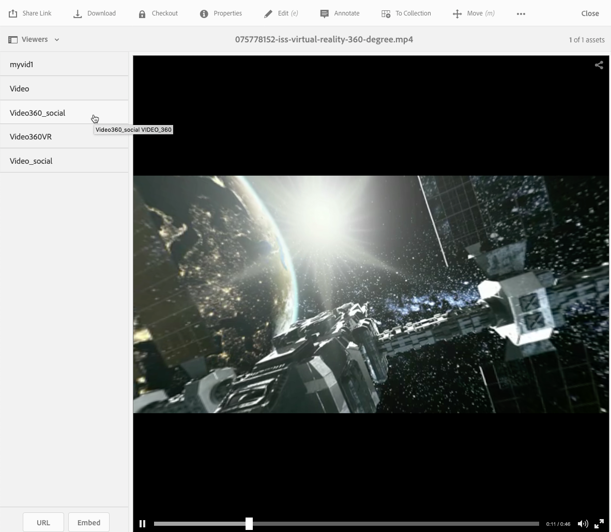
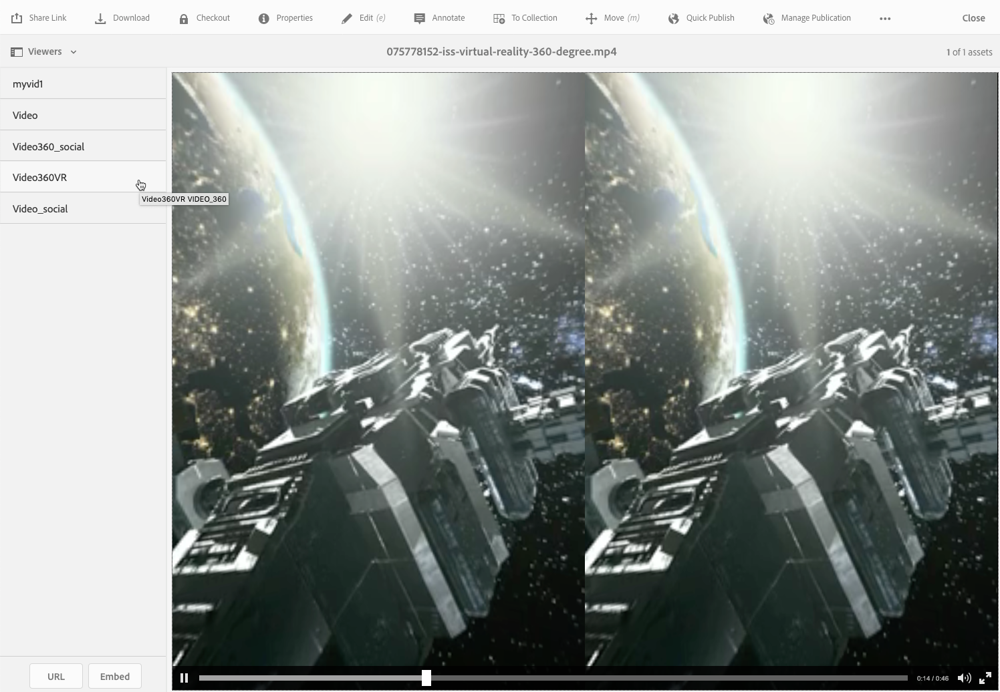

# 360/VR Video {#vr-video}

360-degree videos record a view in every direction at the same time. They are shot using an omnidirectional camera or a collection of cameras. During playback on a flat display, the user has control of the viewing angle; playbacks on mobile devices usually use their built-in gyroscopic controls.

Dynamic Media &ndash; Scene7 mode includes native support for the delivery of 360 video assets. By default, no additional configuration is necessary for viewing or playback. You deliver 360 Video using standard video extensions such as .mp4, .mkv, and .mov. The most common codec is H.264.

This section describes working with the 360/VR Video viewer to render equirectangular video for an immersive viewing experience of a room, property, location, landscape, medical procedure, and so on.

Spatial audio is not currently supported; if audio is mixed in stereo, the balance (L/R) does not change as the customer changes the camera viewing angle.

See also [Managing Viewer Presets](/help/assets/managing-viewer-presets.md).

## 360 Video in action {#video-in-action}

Select [Space Station 360](https://s7d1.scene7.com/s7viewers/html5/Video360Viewer.html?asset=Viewers/space_station_360-AVS) to open a browser window and watch a 360-degree video. During video playback, drag the mouse pointer to a new location to change the viewing angle.

*Video frame from Space Station 360*

## 360/VR Video and Adobe Premiere Pro {#vr-video-and-adobe-premiere-pro}

You can use Adobe Premier Pro to view and edit 360/VR footage. For example, you can place logos and text properly in a scene and apply effects and transitions that are designed specifically for equirectangular media.

See [Edit 360/VR video](https://helpx.adobe.com/premiere-pro/how-to/edit-360-vr-video.html).

## Upload assets for use with the 360 Video viewer {#uploading-assets-for-use-with-the-video-viewer}

360 video assets that are uploaded into Adobe Experience Manager are labeled as **Multimedia** on an Asset page, similar to normal video asset.

*An uploaded 360-video asset seen in the Card view. The asset is labeled as Multimedia.*

**Upload assets for use with the 360 Video viewer:**

1. Created a folder that is dedicated to your 360-video asset.
1. [Apply an adaptive video profile to the folder](/help/assets/video-profiles.md#applying-a-video-profile-to-folders).

   Rendering 360-video content places higher requirements for source video resolution and for encoded renditions resolution than standard non-360 video content.

   You can use the out-of-the-box Adaptive Video Profile that already comes with Dynamic Media. However, it results in perceptibly lower 360-video quality than you would get for non-360 video encoded with the same settings rendered with a non-360 video viewer. Therefore, if high quality 360 video is required, do the following:

    * Ideally, your original 360-video content is best to have either one of the following resolutions:

        * 1080p - 1920 x 1080, known as Full HD or FHD resolution or,
        * 2160p - 3840 x 2160, known as 4k, UHD, or Ultra HD resolution. This large display resolution is most often found on premium television sets and computer monitors. The 2160p resolution is often called "4k" because the width is close to 4000 pixels. In other words, it offers four times the pixels of 1080p.

    * [Create a custom Adaptive Video Profile](/help/assets/video-profiles.md#creating-a-video-encoding-profile-for-adaptive-streaming) with higher-quality renditions. For example, create an Adaptive Video Profile that contains the following three settings:

        * width=auto; height=720; bitrate=2500 kbps
        * width=auto; height=1080; bitrate=5000 kbps
        * width=auto; height=1440; bitrate=6600 kbps

    * Process 360-video content in a folder that is dedicated exclusively to 360 video assets.

   This approach places greater demands on the network and CPU of the end user.

1. [Upload your video to the folder](/help/assets/managing-video-assets.md#upload-and-preview-video-assets).

## Override the default aspect ratio of 360 videos  {#overriding-the-default-aspect-ratio-of-videos}

For an uploaded asset to qualify as a 360 video that you intend to use with the 360 Video viewer, the asset must have an aspect ratio of 2.

By default, Experience Manager detects video as "360" if its aspect ratio (width/height) is 2.0. If you are an Administrator, you can override the default aspect ratio setting of 2 by setting the optional `s7video360AR` property in CRXDE Lite at the following:

* `/conf/global/settings/cloudconfigs/dmscene7/jcr:content`

  * **Property type** - Double
  * **Value** - floating-point aspect ratio, default 2.0.

After you set this property, it takes effect immediately on both existing videos and newly uploaded videos.

The aspect ratio applies to 360 video assets for the asset details page and the [Video 360 Media WCM component](/help/assets/adding-dynamic-media-assets-to-pages.md#dynamic-media-components).

Start by uploading 360 Videos.

## Preview 360 Video {#previewing-video}

You can use Preview to see what your 360 Video looks like to customers and ensure it is behaving as expected.

See also [Edit viewer presets](/help/assets/managing-viewer-presets.md#editing-viewer-presets).

When you are satisfied with the 360 Video, you can publish it.

See [Embed the Video or Image Viewer on a Web Page](/help/assets/embed-code.md).
See [Link URLs to your web application](/help/assets/linking-urls-to-yourwebapplication.md). The URL-based method of linking is not possible if your interactive content has links with relative URLs, particularly links to Experience Manager Sites pages.
See [Add Dynamic Media Assets to pages](/help/assets/adding-dynamic-media-assets-to-pages.md).

**To preview 360 Video:**

1. In **[!UICONTROL Assets]**, navigate to an existing 360 Video that you have created. Select the 360 Video asset so you can open it in preview mode.

   

   Select the 360-video asset so you can preview the video.

1. On the preview page, near the upper-left corner of the page, select the drop-down list, then select **[!UICONTROL Viewers]**.

   

   From the Viewers list, select **[!UICONTROL Video360_social]**, then do one of the following:

    * Drag the mouse pointer across the video if you want to alter the viewing angle of the static scene.
    * Select the video's **[!UICONTROL Play]** button if you want to begin playback. As the video plays, drag the mouse pointer across the video to alter your viewing angle.

   *A 360-video screenshot.*

    * From the Viewers list, select **[!UICONTROL Video360VR]**.

        Virtual Reality (VR) video is immersive video content that is accessed by using virtual reality headsets. As with ordinary videos, you create VR videos at the beginning when a video is being recorded or captured using 360-degree video cameras.

   
   *A 360 VR video screenshot.*

1. Near the upper right of the preview page, select **[!UICONTROL Close]**.

## Publishing 360 Video {#publishing-video}

Publish the 360 Video so you can use it. Publishing a 360 Video activates the URL and Embed Code. It also publishes the 360 Video to the Dynamic Media cloud which is integrated with a CDN for scalable and performant delivery.

See [Publish Dynamic Media assets](/help/assets/publishing-dynamicmedia-assets.md) for details on how to publish 360 Video.
See also [Embed the Video or Image Viewer on a web page](/help/assets/embed-code.md).
See also [Link URLs to your web application](/help/assets/linking-urls-to-yourwebapplication.md). The URL-based method of linking is not possible if your interactive content has links with relative URLs, particularly links to Experience Manager Sites pages.
See also [Add Dynamic Media assets to pages](/help/assets/adding-dynamic-media-assets-to-pages.md).
