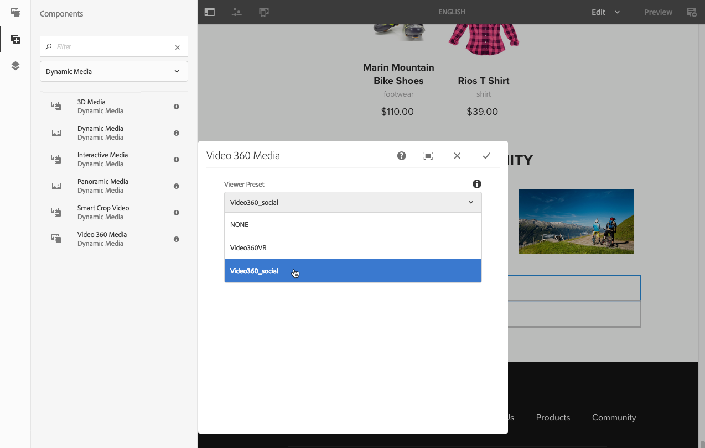
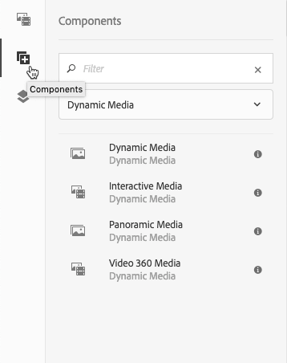
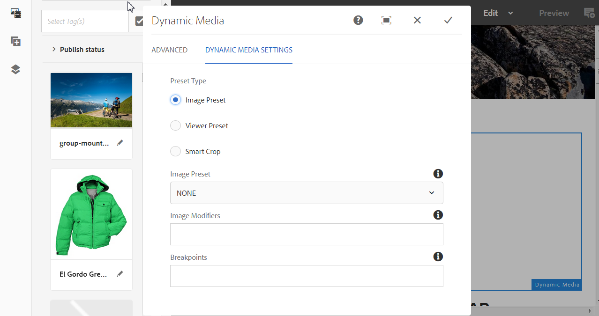
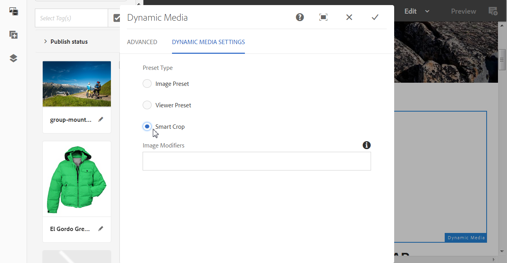
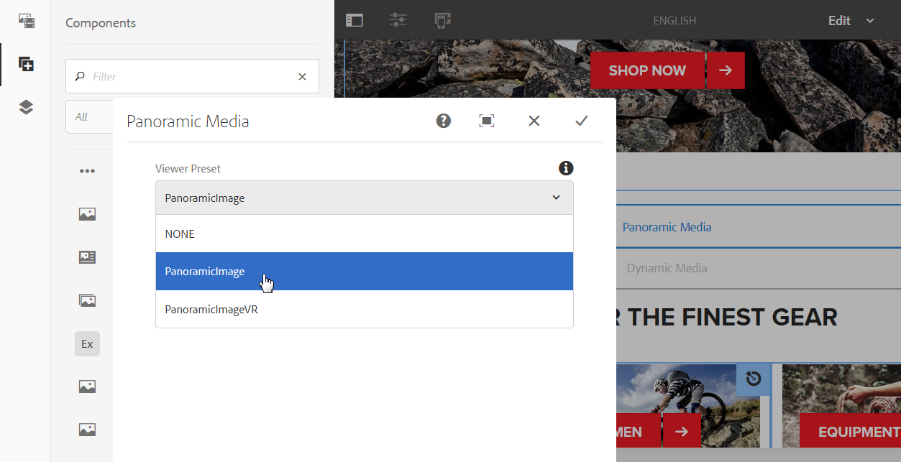
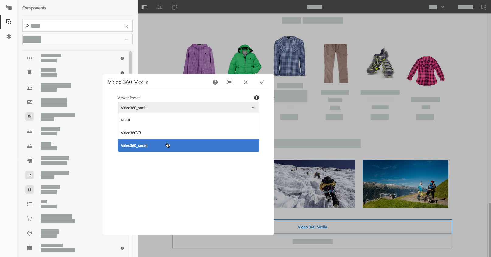

# Add Dynamic Media assets to pages{#adding-dynamic-media-assets-to-pages}

To add the Dynamic Media functionality to assets that you use on your websites, you can add the **Dynamic Media**, **Interactive Media**, **Panoramic Media**, or **Video 360 Media** component directly on the page. You add components by entering Layout mode and enabling the Dynamic Media components. Then you can add these components to the page and add assets to the component. The Dynamic Media components are smart - they know whether you are adding an image or a video and the configuration options available change accordingly.

You add Dynamic Media assets directly to the page if you are using Adobe Experience Manager as your WCM. If you are using a third party for your WCM, either [link](/help/assets/linking-urls-to-yourwebapplication.md) or [embed](/help/assets/embed-code.md) your assets. For a responsive third-party web site, see [delivering optimized images to a responsive site](/help/assets/responsive-site.md).

>[!NOTE]
>
>Be sure you publish assets before you add them to pages in Experience Manager. See [Publish Dynamic Media assets](/help/assets/publishing-dynamicmedia-assets.md).

## Add a Dynamic Media component to a page {#adding-a-dynamic-media-component-to-a-page}

Adding a 3D Media, Dynamic Media, Interactive Media, Panoramic Media, Smart Crop Video, or Video 360 Media component to a page is the same as adding a component to any page. The Dynamic Media components are described in the following sections.

**To add a Dynamic Media component to a page:**

1. In Experience Manager, open the page where you want to add the Dynamic Media component.
1. In the panel on the left side of the page (if necessary, toggle the display of the side panel), select the **[!UICONTROL Components]** icon.
1. Under the **[!UICONTROL Components]** heading, in the drop-down list, select **[!UICONTROL Dynamic Media]**.

    If no list of Dynamic Media components is available, you must enable the Dynamic Media components that you want to use. See [Enable Dynamic Media components](#enabling-dynamic-media-components).

   

1. Drag a **[!UICONTROL Dynamic Media]** component that you want to use and drop it in the desired location on the page.

1. Hover the mouse pointer directly on the component. When the component is surrounded by a blue box, select once to display the component's toolbar. Select the **[!UICONTROL Configuration (wrench)]** icon.

   

1. Depending on the Dynamic Media component you dropped onto the page, a configuration dialog box opens. [Set the component's options](/help/assets/adding-dynamic-media-assets-to-pages.md#dynamic-media-components) as necessary.

   The example below shows the Dynamic Media **[!UICONTROL Video 360 Media]** component dialog box and the options available from the Viewer Preset drop-down list.

   

   The Dynamic Media Video 360 Media component.

1. When you are finished, in the upper-right corner of the dialog box, select the checkmark to save your changes.

### Enable Dynamic Media components {#enabling-dynamic-media-components}

If no Dynamic Media components are available to add to a page, it likely means that you must first enable the components that you want to use.

**To enable Dynamic Media components:**

1. In Experience Manager, open the page where you want to add the Dynamic Media component.
1. On the left side of the toolbar near the top of the page, select the Page Information icon, then select **[!UICONTROL Edit Template]** from the drop-down list.

    

1. On the right side of the toolbar near the top of the page, from the drop-down list, select **[!UICONTROL Structure]**.

    

1. Near the bottom of the page, select **[!UICONTROL Layout Container]** to open its toolbar, then select the Policy icon.
1. On the **[!UICONTROL Layout Container]** page, under the **[!UICONTROL Properties]** heading, make sure that the **[!UICONTROL Allowed Components]** tab is selected.

    

1. Scroll until you see **[!UICONTROL Dynamic Media]**.
1. Select the > icon to the left of **[!UICONTROL Dynamic Media]** so you can expand the list, then select the Dynamic Media components you want to enable.

    

1. Near the upper-right corner of the **[!UICONTROL Layout Container]** page, select the Done (checkmark) icon.

1. On the right side of the toolbar near the top of the page, from the drop-down list, select **[!UICONTROL Initial Content]**, then [add a Dynamic Media component to a page](#adding-a-dynamic-media-component-to-a-page) as usual.

## Localize Dynamic Media components {#localizing-dynamic-media-components}

You can localize Dynamic Media components in one of two ways:

* Within a web page in Sites, open **[!UICONTROL Properties]** and select the **[!UICONTROL Advanced]** tab. Select the desired language for localization.

  

* From the site selector, select the desired page or page group. Select **[!UICONTROL Properties]** and select the **[!UICONTROL Advanced]** tab. Select the desired language for localization.

  >[!NOTE]
  >
  >Not all languages available in the **[!UICONTROL Language]** menu currently have tokens assigned.

## Dynamic Media Components {#dynamic-media-components}

Dynamic Media components are available when you select the **[!UICONTROL Components]** icon, then filter on **[!UICONTROL Dynamic Media]**.

The Dynamic Media components that are available include the following:

* **[!UICONTROL Dynamic Media]** - Use for such assets as images, video, eCatalogs, and spin sets.
* **[!UICONTROL Interactive Media]** - Use for any interactive assets such as interactive video, interactive images, or carousel sets.
* **[!UICONTROL Panoramic Media]** - Use for panoramic image or panoramic VR image assets.
* **[!UICONTROL Video 360 Media]** - Use for 360 video and 360 VR video assets.

>[!NOTE]
>
>These components are not available by default; they must be made available by way of the template editor before you use them. [After they are made available i](/help/sites-authoring/templates.md#editing-templates-template-authors)n the template editor, you can add the components to your page as you would any other Experience Manager component.

### Dynamic Media component {#dynamic-media-component}

The Dynamic Media component is smart. Whether you add an image or a video, you have various options. The component supports image presets, image-based viewers such as image sets, spin sets, mixed media sets, and video. In addition, the viewer is responsive - the size of the screen changes automatically based on-screen size. All viewers are HTML5 viewers.

>[!NOTE]
>
>If your web page has the following:
>
>* Multiple instances of the Dynamic Media component being used on the same page.
>* Each instance uses the same asset type.
>
>Assigning a different viewer preset to each Dynamic Media component on that page is not supported.
>
>You can, however, use the same viewer preset for all Dynamic Media components that use assets of the same type, within the page.

When you add the Dynamic Media component, and **[!UICONTROL Dynamic Media Settings]** is blank or you cannot add an asset properly, check the following:

* You have [enabled Dynamic Media](/help/assets/config-dynamic.md). Dynamic Media is disabled by default.
* The image has a pyramid tiff file. Images that you import before you enable Dynamic Media do not have a pyramid tiff file.

#### When working with images {#when-working-with-images}

The Dynamic Media component lets you add dynamic images, including image sets, spin sets, and mixed media sets. You can zoom in, zoom out, and if applicable turn an image within a spin set or select an image from another type of set.

You can also configure the viewer preset, image preset, or image format directly in the component. To make an image responsive, you can either set the breakpoints or apply a responsive image preset.

Edit the following Dynamic Media Settings by selecting the **[!UICONTROL Edit]** icon in the component and then **[!UICONTROL Dynamic Media Settings]**.

>[!NOTE]
>
>By default, the Dynamic Media image component is adaptive. If you want to make it a fixed size, set it in the component in the **[!UICONTROL Advanced]** tab with the **[!UICONTROL Width]** and **[!UICONTROL Height]**.

* **[!UICONTROL Viewer preset]** - Select an existing viewer preset from the drop-down menu. If the viewer preset you are looking for is not visible, you must make it visible. See [Manage viewer presets](/help/assets/managing-viewer-presets.md). You cannot select a viewer preset if you are using an image preset and conversely.

    This option is the only one available if you are viewing image sets, spin sets, or mixed media sets. The viewer presets displayed are smart - only relevant viewer presets appear.

* **[!UICONTROL Viewer modifiers]** - Viewer modifiers take the form of name=value pair with a & delimiter and let you change viewers as outlined in the Viewers Reference Guide. An example of a viewer modifier is `posterimage=img.jpg&caption=text.vtt,1` which sets a different image for the video thumbnail and associates a closed caption/subtitle file with the video.

* **[!UICONTROL Image preset]** - Select an existing image preset from the drop-down menu. If the image preset you are looking for is not visible, you must make it visible. See Managing Image Presets. You cannot select a viewer preset if you are using an image preset and conversely.

    This option is not available if you are viewing image sets, spin sets, or mixed media sets.

* **[!UICONTROL Image Modifiers]** - You can apply image effects by supplying additional image commands. These effects are described in Image Presets and the Image Serving Command reference.

    This option is not available if you are viewing image sets, spin sets, or mixed media sets.

* **[!UICONTROL Breakpoints]** - If you are using this asset on a responsive site, you must add the image breakpoints. Image breakpoints are separated by commas (,). This option works when there is no height or width defined in an image preset.

    This option is not available if you are viewing image sets, spin sets, or mixed media sets.

    You can edit the following Advanced Settings by selecting **[!UICONTROL Edit]** in the component.

* **[!UICONTROL Optimize for higher resolution devices]** - Select (default) the checkbox to allow DPR (Device Pixel Ratio) optimization.

  The **[!UICONTROL Optimize for higher resolution devices]** option is only shown when the following is true:
  
  * Under Preset Type, **[!UICONTROL Image Preset]** is selected, and **[!UICONTROL RESS_IP]** is selected from the **[!UICONTROL Image Preset]** drop-down list.

  

    See also [About device pixel ratio optimization](/help/assets/imaging-faq.md#dpr). Any Adobe Experience Manager Dynamic Media Smart Imaging DPR values are ignored.

* **[!UICONTROL Title]** - Change the title of the image.

* **[!UICONTROL Alt Text]** - Add a title to the image for those users who have graphics turned off.

    This option is not available if you are viewing image sets, spin sets, or mixed media sets.

* **[!UICONTROL URL, Open in]** - You can set an asset to open a link. Set the URL and in Open in indicate whether you want it to open in the same window or a new window.

    This option is not available if you are viewing image sets, spin sets, or mixed media sets.

* **[!UICONTROL Width]** - Enter value in pixels if you want the image to be a fixed size. Leaving this value blank makes the asset adaptive.

* **[!UICONTROL Height]** - Enter value in pixels if you want the image to be a fixed size. Leaving this value blank makes the asset adaptive.

#### When working with Video {#when-working-with-video}

Use the Dynamic Media component to add dynamic video to your web pages. When you edit the component, you can choose to use a predefined video viewer preset for playing the video on the page.

Edit the following Dynamic Media Settings by selecting **[!UICONTROL Edit]** in the component.

>[!NOTE]
>
>By default, the Dynamic Media video component is adaptive. If you want to make it a fixed size, set it in the component with the **[!UICONTROL Width]** and **[!UICONTROL Height]** in the **[!UICONTROL Advanced]** tab.

* **[!UICONTROL Viewer preset]** - Select an existing video viewer preset from the drop-down menu. If the viewer preset you are looking for is not visible, you must make it visible. See [Manage viewer presets](/help/assets/managing-viewer-presets.md).

* **[!UICONTROL Viewer modifiers]** - Viewer modifiers take the form of name=value pair with a & delimiter and let you change viewers as outlined in the Adobe Viewers Reference Guide. An example of a viewer modifier is `posterimage=img.jpg&caption=text.vtt,1`

    With viewer modifiers, for example, you can do the following:

  * Associate a caption file with a video: [caption](https://experienceleague.adobe.com/docs/dynamic-media-developer-resources/library/viewers-aem-assets-dmc/video/command-reference-url-video/r-html5-video-viewer-url-caption.html)
  * Associate a navigation file with a video: [navigation](https://experienceleague.adobe.com/docs/dynamic-media-developer-resources/library/viewers-aem-assets-dmc/video/command-reference-url-video/r-html5-video-viewer-url-navigation.html)

    You can edit the following Advanced Settings by selecting **[!UICONTROL Edit]** in the component.

* **[!UICONTROL Title]** - Change the title of the video.

* **[!UICONTROL Width]** - Enter value in pixels if you want the image to be a fixed size. Leaving this value blank makes the asset adaptive.

* **[!UICONTROL Height]** - Enter value in pixels if you want the image to be a fixed size. Leaving this value blank makes the asset adaptive.

#### When working with Smart Crop {#when-working-with-smart-crop}

Use the Dynamic Media component to add Smart Crop image assets to your web pages. When you edit the component, you can choose to use a predefined video viewer preset for playing the video on the page.

See also [Image Profiles](/help/assets/image-profiles.md).

Edit the following Dynamic Media Setting by selecting **[!UICONTROL Edit]** in the component.

>[!NOTE]
>
>By default, the Dynamic Media image component is adaptive. If you want to make it a fixed size, set it in the component in the **[!UICONTROL Advanced]** tab with the **[!UICONTROL Width]** and **[!UICONTROL Height]**.

* **[!UICONTROL Image Modifiers]** - You can apply image effects by supplying additional image commands. These effects are described in Image Presets and the Image Serving Command reference.

    This option is not available if you are viewing image sets, spin sets, or mixed media sets.

    You can edit the following Advanced Settings by selecting **[!UICONTROL Edit]** in the component.

* **[!UICONTROL Enable Aspect Ration match]** - To let Dynamic Media pick a smart crop rendition with an aspect ratio that best matches the aspect ratio of the original image, select this option.

* **[!UICONTROL Optimize for higher resolution devices]** - Select (default) the checkbox to allow DPR (Device Pixel Ratio) optimization. 

  The **[!UICONTROL Optimize for higher resolution devices]** option is only shown when the following is true:

  * Under Preset Type, **[!UICONTROL Smart Crop]** option is selected.

  

    See also [About device pixel ratio optimization](/help/assets/imaging-faq.md#dpr). Any Adobe Experience Manager Dynamic Media Smart Imaging DPR values are ignored.

* **[!UICONTROL Title]** - Change the title of the Smart Crop image.

* **[!UICONTROL Alt Text]** - Add a title to the smart crop image for those users who have graphics turned off.

    This option is not available if you are viewing image sets, spin sets, or mixed media sets.

* **[!UICONTROL URL, Open in]** - You can set an asset to open a link. Set the URL and in Open in indicate whether you want it to open in the same window or a new window.

    This option is not available if you are viewing image sets, spin sets, or mixed media sets.

* **[!UICONTROL Width]** - Enter value in pixels if you want the image to be a fixed size. Leaving this value blank makes the asset adaptive.

* **[!UICONTROL Height]** - Enter value in pixels if you want the image to be a fixed size. Leaving this value blank makes the asset adaptive.

### Interactive Media Component {#interactive-media-component}

Interactive Media component is for those assets that have interactivity on them such hotspots or image maps. If you have an interactive image, interactive video, or carousel banner, use the **[!UICONTROL Interactive Media]** component.

The Interactive Media component is smart. Whether you add an image or a video, you have various options. In addition, the viewer is responsive - the size of the screen changes automatically based on-screen size. All viewers are HTML5 viewers.

>[!NOTE]
>
>If your web page has the following:
>
>* Multiple instances of the Interactive Media component being used on the same page.
>* Each instance uses the same asset type.
>
>Assigning a different viewer preset to each Interactive Media component on that page is not supported.
>
>You can, however, use the same viewer preset for all Interactive Media components that use assets of the same type, within the page.

You can edit the following **[!UICONTROL General]** settings by selecting **[!UICONTROL Edit]** in the component.

* **[!UICONTROL Viewer preset]** - Select an existing viewer preset from the drop-down menu. If the viewer preset you are looking for is not visible, you must make it visible. Viewer Presets must be published before they can be used. See Managing Viewer Presets.

* **[!UICONTROL Title]** - Change the title of the video.

* **[!UICONTROL Width]** - Enter value in pixels if you want the image to be a fixed size. Leaving this value blank makes the asset adaptive.

* **[!UICONTROL Height]** - Enter value in pixels if you want the image to be a fixed size. Leaving this value blank makes the asset adaptive.

    You can edit the following **[!UICONTROL Add To Cart]** settings by selecting **[!UICONTROL Edit]** in the component.

* **[!UICONTROL Show Product Asset]** - By default, this value is selected. The product asset shows an image of the product as defined in the Commerce module. Clear the check mark to not show the product asset.

* **[!UICONTROL Show Product Price]** - By default, this value is selected. Product price shows the price of the item as defined in the Commerce module. Clear the check mark to not show the product price.

* **[!UICONTROL Show Product Form]** - By default, this value is not selected. The Product Form includes any product variants such as size and color. Clear the check mark to not show the product variants.

### Panoramic Media Component {#panoramic-media-component}

Panoramic Media component is for those assets that are spherical panoramic images. Such images provide a 360° viewing experience of a room, property, location, or landscape. For an image to qualify as a spherical panorama, it must have either one OR both of the following:

* An aspect ratio of 2:1.
* Tagged with the keywords `equirectangular` or (`spherical` + `panorama`) or (`spherical` + `panoramic`). See [Using Tags](/help/sites-authoring/tags.md).

Both the aspect ratio and keyword criteria apply to panoramic assets for the asset details page and the **[!UICONTROL Panoramic Media]** WCM component.

>[!NOTE]
>
>If your web page has the following:
>
>* Multiple instances of the **[!UICONTROL Panoramic Media]** component being used on the same page.
>* Each instance uses the same asset type.
>
>Assigning a different viewer preset to each **[!UICONTROL Panoramic Media]** component on that page is not supported.
>
>You can, however, use the same viewer preset for all Panoramic Media components that use assets of the same type, within the page.

You can edit the following setting by selecting **[!UICONTROL Configure]** in the component.

* **[!UICONTROL Viewer Preset]** - Select an existing viewer from the Viewer preset drop-down menu.

If the viewer preset you are looking for is not visible, check to ensure that it is published. Publish viewer presets before you use them. See [Managing Viewer Presets](/help/assets/managing-viewer-presets.md).

### Video 360 Media Component {#video-media-component}

Use the **[!UICONTROL Video 360 Media]** component to render equirectangular video on your web page for an immersive viewing experience of a room, property, location, landscape, or medical procedure.

During playback on a flat display, the user has control of the viewing angle; playback on mobile devices usually uses their built-in gyroscopic controls.

The viewer includes native support for the delivery of 360 video assets. By default, no additional configuration is necessary for viewing or playback. You deliver 360 Video using standard video extensions such as .mp4, .mkv, and .mov. The most common codec is H.264.

You can edit the following setting by selecting **[!UICONTROL Configure]** in the component.

* **[!UICONTROL Viewer Preset]** - Select an existing viewer from the Viewer preset drop-down menu. Use Video360VR for end users who use virtual reality glasses. Includes basic video playback controls and social media features. Use Video360_social which includes basic video playback controls. Video rendering is done in stereo mode. Manual point-of-view control is off but gyroscopic control is on. There are no social media features.

If the viewer preset you are looking for is not visible, check to ensure that it is published. Be sure you publish viewer presets before you use them. See [Managing Viewer Presets](/help/assets/managing-viewer-presets.md).

### Using HTTP/2 to delivery Dynamic Media assets {#using-http-to-delivery-dynamic-media-assets}

HTTP/2 is the new, updated web protocol that improves the way browsers and servers communicate. It provides faster transfer of information and reduces the amount of processing power that is needed. Delivery of Dynamic Media assets can now be over HTTP/2 which provides better response and load times.

See [HTTP2 Delivery of Content](/help/assets/http2.md) for complete details on getting started using HTTP/2 with your Dynamic Media account.

>[!MORELIKETHIS]
>
>* [Use the video player in Experience Manager Dynamic Media](https://experienceleague.adobe.com/docs/experience-manager-learn/assets/dynamic-media/video/dynamic-media-video-player-feature-video-use.html)
>* [Use Interactive Video with Experience Manager Dynamic Media](https://experienceleague.adobe.com/docs/experience-manager-learn/assets/dynamic-media/video/dynamic-media-interactive-video-feature-video-use.html)
>* [Understand the Asset Viewer with Experience Manager Dynamic Media](https://experienceleague.adobe.com/docs/experience-manager-learn/assets/dynamic-media/viewers/dynamic-media-viewer-feature-video-understand.html)
>* [Use custom video thumbnail with Experience Manager Dynamic Media](https://experienceleague.adobe.com/docs/experience-manager-learn/assets/dynamic-media/video/dynamic-media-video-thumbnails-feature-video-use.html)
>* [Understand color management with Experience Manager Dynamic Media](https://experienceleague.adobe.com/docs/experience-manager-learn/assets/dynamic-media/images/dynamic-media-color-management-technical-video-setup.html)
>* [Using image sharpening with Experience Manager Dynamic Media](https://experienceleague.adobe.com/docs/experience-manager-learn/assets/dynamic-media/images/dynamic-media-image-sharpening-feature-video-use.html)
