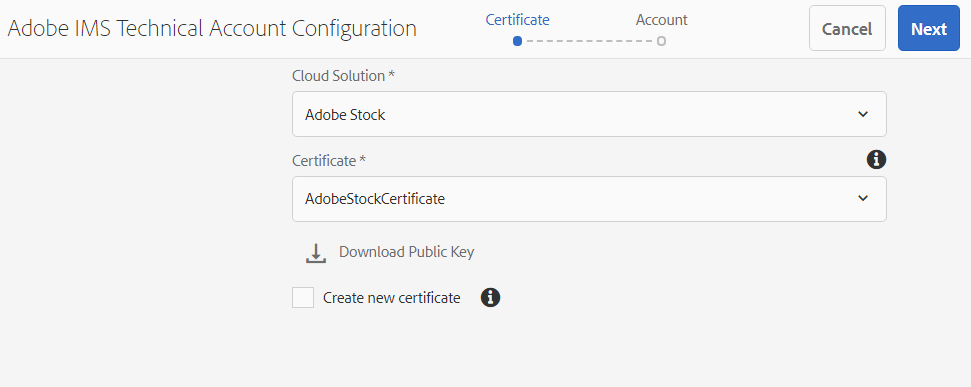
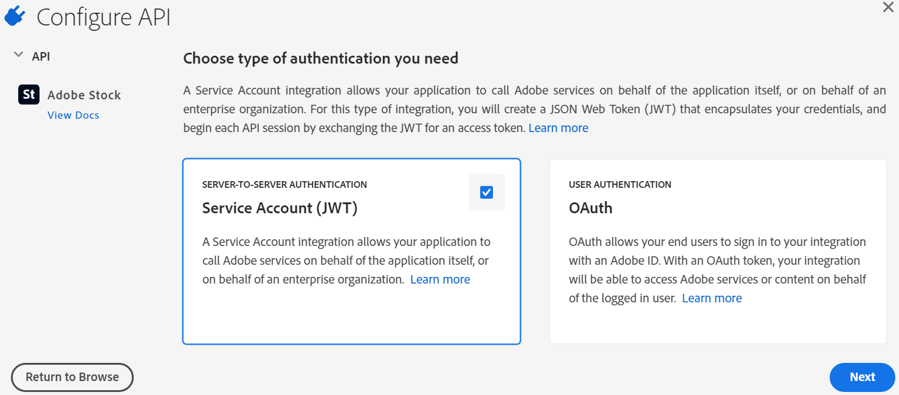
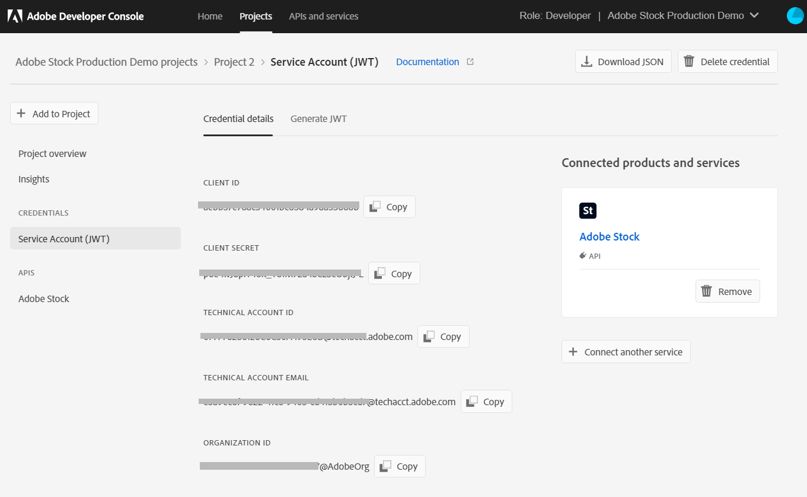
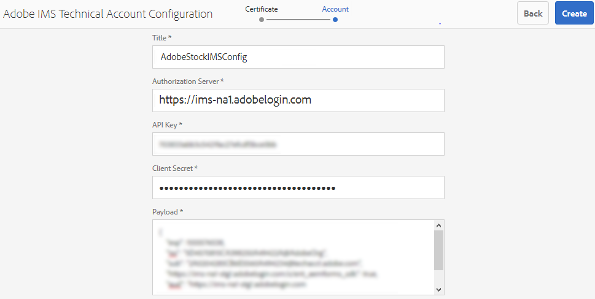
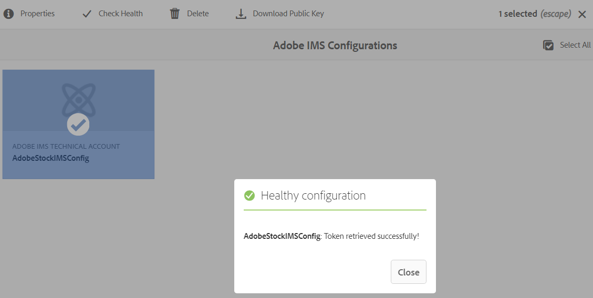
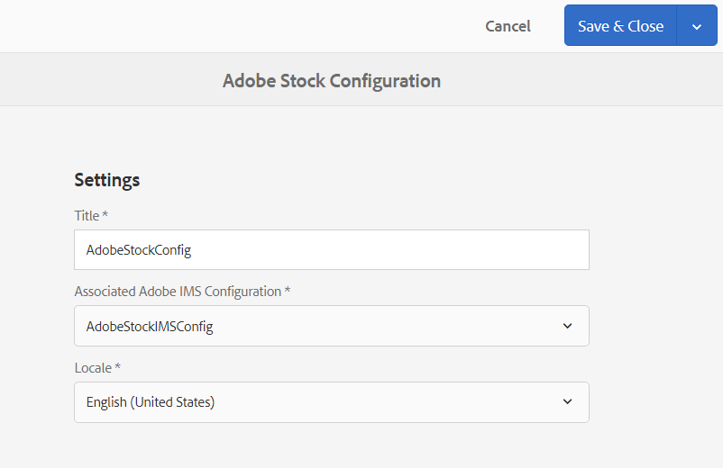
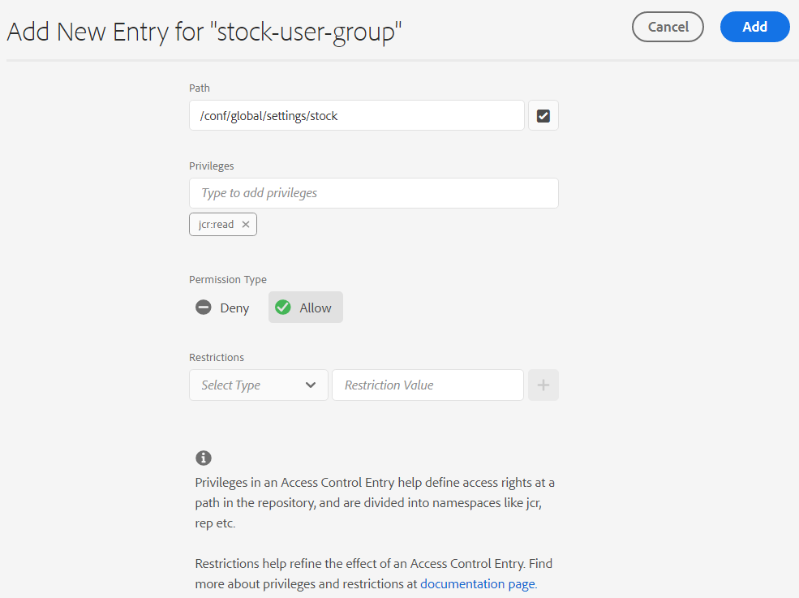
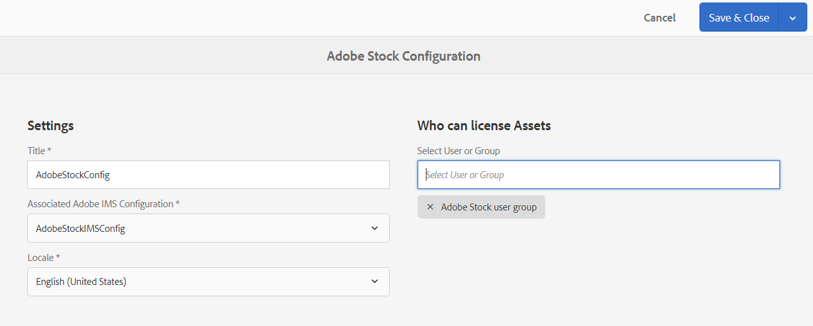
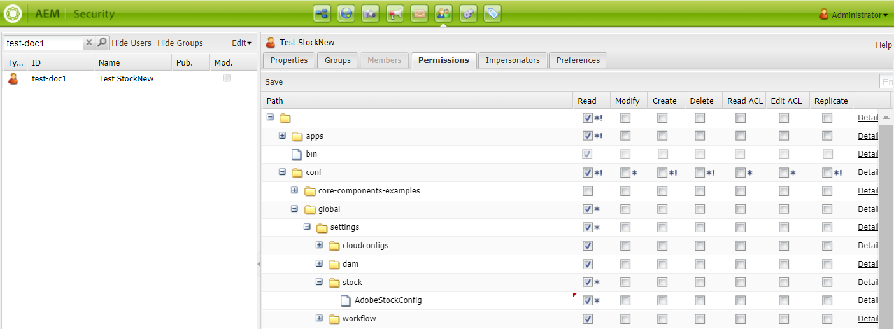
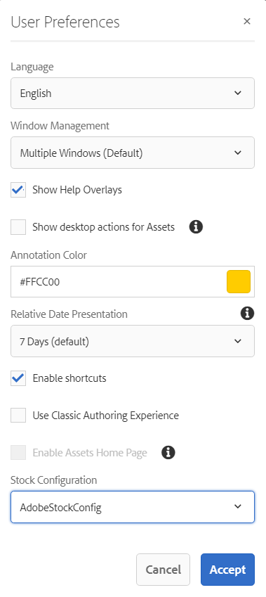

# Use [!DNL Adobe Stock] assets in [!DNL Adobe Experience Manager Assets] {#use-adobe-stock-assets-in-aem-assets}

| Version | Article link |
| -------- | ---------------------------- |
| AEM as a Cloud Service  |    [Click here](https://experienceleague.adobe.com/docs/experience-manager-cloud-service/content/assets/manage/aem-assets-adobe-stock.html?lang=en)                  |
| AEM 6.5     | This article         |

<!-- old content

[!DNL Experience Manager Assets] provides users the ability to search, preview, save, and license [!DNL Adobe Stock] assets directly from [!DNL Experience Manager]. 

Organizations can integrate their [!DNL Adobe Stock] enterprise plan with [!DNL Experience Manager Assets] to ensure that licensed assets are broadly available for their creative and marketing projects, with the powerful asset management capabilities of [!DNL Experience Manager].

[!DNL Adobe Stock] service provides designers and businesses with access to millions of high-quality, curated, royalty-free photos, vectors, illustrations, videos, templates, and 3D assets for all their creative projects. [!DNL Experience Manager] users are able to quickly find, preview, and license [!DNL Adobe Stock] assets that are saved in [!DNL Experience Manager], without leaving the [!DNL Experience Manager] interface.
-->

<!-- New overview content
-->

[!DNL Adobe Stock] service provides designers and businesses with access to millions of high-quality, curated, royalty-free photos, vectors, illustrations, videos, templates, and 3D assets for all their creative projects. 

[!DNL Adobe Stock] for enterprise offering, by default, includes sharing rights across the organization. Once an asset has been licensed by a user of your organization, other users of your organization can identify, download, and use this asset without having to license it again. Once an asset has been licensed by your organization, the right to use it is perpetual.

Organizations can integrate their enterprise [!DNL Adobe Stock] plan with [!DNL Experience Manager Assets] to ensure that licensed assets are broadly available for their creative and marketing projects, with the powerful asset management capabilities of [!DNL Experience Manager]. [!DNL Experience Manager] users can quickly find, preview, and license Adobe Stock assets that are saved in [!DNL Experience Manager], without leaving the [!DNL Experience Manager] interface.

<!-- Old content
## Prerequisites {#prerequisites}

The integration requires an [enterprise [!DNL Adobe Stock] plan](https://stockenterprise.adobe.com/).
-->

## Integrate [!DNL Experience Manager] and [!DNL Adobe Stock] {#integrate-aem-and-adobe-stock}

[!DNL Experience Manager Assets] provides users the ability to search, preview, save, and license [!DNL Adobe Stock] assets directly from [!DNL Experience Manager].

**Prerequisites**

The integration requires: 

* An [enterprise [!DNL Adobe Stock] plan](https://stockenterprise.adobe.com/)
* A user with permissions in Admin Console to the default Stock product profile
* A user with permissions to the Developer Access profile for creating integration in Adobe Developer Console

An enterprise [!DNL Adobe Stock] plan,

* Provides product entitlement for [!DNL Adobe Stock] (Stocks connected to Experience Manager)
* Credits purchased into the [!DNL Adobe Admin Console] for your stock entitlement
* Enables Service Account (JWT) authentication within [!DNL Adobe Developer Console] for your stock entitlement
* Enables managing the credits and licensing globally from within [!DNL Adobe Admin Console]

Within the entitlement, a default product profile for [!DNL Adobe Stock] exists in [!DNL Admin Console]. Multiple profiles can be created, and these profiles determines who can license Stock assets. A user having access directly to the product profile can access [https://stock.adobe.com/](https://stock.adobe.com/) and license Stock assets. Whereas there is another method of using the Developer Access to create integration (API) to authenticate communication between [!DNL Experience Manager] and [!DNL Adobe Stock].

>[!NOTE]
>
>The Stock service account (JWT) authentication comes with the enterprise Stock entitlement.
>
>The integration does not support Oauth authentication for enterprise Stock entitlement.

<!-- old content
To allow communication between [!DNL Experience Manager] and [!DNL Adobe Stock], create an IMS configuration and an [!DNL Adobe Stock] configuration in [!DNL Experience Manager].

>[!NOTE]
>
>Only [!DNL Experience Manager] administrators and [!DNL Admin Console] administrators for an organization can perform the integration as it requires administrator privileges.
-->

## Steps to integrate [!DNL Experience Manager] and [!DNL Adobe Stock] {#integration-steps}

To integrate [!DNL Experience Manager] and [!DNL Adobe Stock], perform the following steps in the listed sequence: 

1. [Obtain public certificate](#public-certificate)
   
   In [!DNL Experience Manager], create an IMS account and generate a public certificate (public key).

1. [Create service account (JWT) connection](#createnewintegration) 
   
   In [!DNL Adobe Developer Console], create a project for your [!DNL Adobe Stock] organization. Under the project, configure an API using the public key to create a service account (JWT) connection. Get the service account credentials and JWT payload information.

1. [Configure IMS account](#create-ims-account-configuration)

   In [!DNL Experience Manager], configure the IMS account using the service account credentials and JWT payload.

1. [Configure cloud service](#configure-the-cloud-service)

   In [!DNL Experience Manager], configure an [!DNL Adobe Stock] cloud service using the IMS account.

### Create an IMS configuration {#create-an-ims-configuration}

The IMS configuration authenticates your [!DNL Experience Manager Assets] author instance with the [!DNL Adobe Stock] entitlement. 

IMS configuration includes two steps:

* [Obtain public certificate](#public-certificate) 
* [Configure IMS account](#create-ims-account-configuration)

### Obtain public certificate {#public-certificate}

The public key (certificate) authenticates your product profile in Adobe Developer Console.

1. Log in to your [!DNL Experience Manager Assets] author instance. The default URL is `http://localhost:4502/aem/start.html`.

1. From the **[!UICONTROL Tools]** panel, navigate to **[!UICONTROL Security]** > **[!UICONTROL Adobe IMS Configurations]**.

1. In Adobe IMS Configurations page, click **[!UICONTROL Create]**. The **[!UICONTROL Adobe IMS Technical Account Configuration]** page opens. 

1. In the **[!UICONTROL Certificate]** tab, select **[!UICONTROL Adobe Stock]** from the **[!UICONTROL Cloud Solution]** dropdown list.  

1. You can create a certificate or reuse an existing certificate for the configuration. 

   To create a certificate, select the **[!UICONTROL Create new certificate]** check box and specify an **alias** for the public key. The alias serves as name of the public key. 

1. Click **[!UICONTROL Create certificate]**. Then, click **[!UICONTROL OK]** to generate the public key.

1. Click the **[!UICONTROL Download Public Key]** icon and save the public key (.crt) file on your machine. The public key is used later to configure API for your Brand Portal tenant and generate service account credentials in Adobe Developer Console.

   Click **[!UICONTROL Next]**.

   

1. In the **Account** tab, Adobe IMS account is created which requires the service account credentials.

   Open a new tab and [create a service account (JWT) connection in Adobe Developer Console](#createnewintegration). 

### Create service account (JWT) connection {#createnewintegration}

In Adobe Developer Console, projects and APIs are configured at organization level. Configuring an API creates a service account (JWT) connection. There are two methods to configure API, by generating a key pair (private and public keys) or by uploading a public key. In this example, the service account credentials are generated by uploading the public key.

To generate the service account credentials and JWT payload:

1. Log in to Adobe Developer Console with system administrator privileges. The default URL is [https://www.adobe.com/go/devs_console_ui](https://www.adobe.com/go/devs_console_ui).

   Ensure that you have selected the correct IMS organization (Stock entitlement) from the dropdown (organization) list.

1. Click **[!UICONTROL Create new project]**. A blank project with a system-generated name is created for your organization. 

   Click **[!UICONTROL Edit project]**. Update the **[!UICONTROL Project Title]** and **[!UICONTROL Description]**, and then click **[!UICONTROL Save]**.
   
1. In the **[!UICONTROL Project overview]** tab, click **[!UICONTROL Add API]**.

1. In the **[!UICONTROL Add an API window]**, select **[!UICONTROL Adobe Stock]**. Click **[!UICONTROL Next]**. 

1. In the **[!UICONTROL Configure API]** window, select **[!UICONTROL Service Account (JWT)]** authentication. Click **[!UICONTROL Next]**.

   

1. Click **[!UICONTROL Upload your public key]**. Click **[!UICONTROL Select a File]** and upload the public key (.crt file) that you have downloaded in the [obtain public certificate](#public-certificate) section. Click **[!UICONTROL Next]**.

1. Verify the public key and click **[!UICONTROL Next]**.

1. Select the default **[!UICONTROL Adobe Stock]** product profile and click **[!UICONTROL Save configured API]**. 

1. Once the API is configured, you are redirected to the API overview page. From the left navigation under **[!UICONTROL Credentials]**, click on the **[!UICONTROL Service Account (JWT)]** option. Here, you can view the credentials and perform actions such as generate JWT tokens, copy credential details, and retrieve client secret.

1. From the **[!UICONTROL Client Credentials]** tab, copy the **[!UICONTROL client ID]**. 

   Click **[!UICONTROL Retrieve Client Secret]** and copy the **[!UICONTROL client secret]**.

   

1. Navigate to the **[!UICONTROL Generate JWT]** tab and copy the **[!UICONTROL JWT Payload]** information. 

You can now use the client ID (API key), client secret, and JWT payload to [configure the IMS account](#create-ims-account-configuration) in [!DNL Experience Manager Assets].

### Configure IMS account {#create-ims-account-configuration}

You must have the [certificate](#public-certificate) and [service account (JWT) credentials](#createnewintegration) to configure the IMS account.

To configure the IMS account: 

1. Open the IMS Configuration and navigate to the **[!UICONTROL Account]** tab. You kept the page open while [obtaining the public certificate](#public-certificate).

1. Specify a **[!UICONTROL Title]** for the IMS account.

   In the **[!UICONTROL Authorization Server]** field, enter the URL: [https://ims-na1.adobelogin.com/](https://ims-na1.adobelogin.com/).  

   Enter the client ID in the **[!UICONTROL API key]** field, **[!UICONTROL Client Secret]**, and **[!UICONTROL Payload]** (JWT payload) that you have copied while [creating the service account (JWT) connection](#createnewintegration).

1. Click **[!UICONTROL Create]**. An IMS account configuration is created. 

   
   
1. Select the IMS account configuration and click **[!UICONTROL Check Health]**.

   Click **[!UICONTROL Check]** in the dialog box. On successful configuration, a message appears that the *Token is retrieved successfully*.

   

### Configure cloud service {#configure-the-cloud-service}

To configure the [!DNL Adobe Stock] cloud service:

1. In the [!DNL Experience Manager] user interface, navigate to **[!UICONTROL Tools]** > **[!UICONTROL Cloud Services]** > **[!UICONTROL Adobe Stock]**.

1. In the [!DNL Adobe Stock Configurations] page, click **[!UICONTROL Create]**.

1. Specify a **[!UICONTROL Title]** for the cloud configuration. 

   Select the IMS configuration that you have created while [configuring the IMS account](#create-ims-account-configuration).

   Select your locale from the dropdown list.

   

1. Click **[!UICONTROL Save & Close]**. 

   Your [!DNL Experience Manager Assets] author instance is now integrated with [!DNL Adobe Stock]. You can create multiple [!DNL Adobe Stock] configurations (for example, locale-based configurations). You can now access, search, and license the [!DNL Adobe Stock] assets from within the [!DNL Experience Manager] user interface. 

   

   >[!NOTE]
   >
   >At this stage of integration, only the administrators can access the [!DNL Adobe Stock] assets, search Stock assets (using omnisearch), and license the [!DNL Adobe Stock] assets.
   >
   >Administrators can further add users or groups to the [!DNL Adobe Stock] cloud service and give permissions to these non-admin users in [!DNL Experience Manager] to access the Stock configuration. 

1. To add users or groups, select the [!DNL Adobe Stock] cloud configuration and click **[!UICONTROL Properties]**. 

1. Search to add the users or groups to whom you have assigned permissions to access the Adobe Stock configuration. See [assign permissions to user group](#assign-permissions-to-group). 
   

## Assign permissions to user group {#assign-permissions-to-group}

Administrators can create user groups and give permissions to certain users or groups to access the [!DNL Adobe Stock] cloud service. 

Following are the permissions required for a user to search and license Adobe Stock assets:

* Configure the path: `/conf/global/settings/stock`
* Privileges: `jcr:read`
* Permission Type: `Allow`

You can create a user group or assign permissions to an existing user group. Permissions can be assigned from the [!DNL Experience Manager Assets] interface or from the [!DNL User Admin] Console.

**To provide access to a user group from [!DNL Experience Manager]:**

1. In the [!DNL Experience Manager] user interface, navigate to **[!UICONTROL Tools]** > **[!UICONTROL Security]** > **[!UICONTROL Groups]**. Create a user group for [!DNL Adobe Stock].

1. Navigate to **[!UICONTROL Tools]** > **[!UICONTROL Security]** > **[!UICONTROL Permissions]**. 

1. Search for the user group in the left panel and add new **[!UICONTROL Access Control Entry (ACE)]** for Adobe Stock. 

   * Configure the path: `/conf/global/settings/stock`
   * Privileges: `jcr:read`
   * Permission Type: `Allow`

   Click **[!UICONTROL Add]**.

   

1. Navigate to **[!UICONTROL Tools]** > **[!UICONTROL Cloud Services]** > **[!UICONTROL Adobe Stock]**. Select the [!DNL Adobe Stock] cloud configuration and click **[!UICONTROL Properties]**.

1. Add the newly created user group to the [!DNL Adobe Stock] configuration. Click **[!UICONTROL Save & Close]**.
   
   

**To provide access to a user from [!DNL User Admin Console]:**

1. Open the [!DNL Experience Manager] User Admin Console. The default URL is `http://localhost:4502/userdamin`.

1. In the left panel, search for the user by entering the `user_id` or `name`. Double-click to open the user properties. 

1. Navigate to the **[!UICONTROL Permissions]** tab and allow `read` permissions for the [!DNL Adobe Stock] cloud configuration: `/conf/global/settings/stock`.
   
   >[!CAUTION]
   >
   >If the cloud configuration is not allowed, the user can only access **[!UICONTROL Assets]** in the [!DNL Experience Manager] interface. 
   >
   >To allow access to [!UICONTROL Assets] and [!DNL Adobe Stock] assets, ensure that the cloud configuration is allowed for the user.  
   
1. Click **[!UICONTROL Save]** to update the permissions. 

   

1. Add the user or the group to the [!DNL Adobe Stock] cloud configuration. 

## Access Adobe Stock assets {#access-stock-assets}

A non-admin user having permissions to the [!DNL Adobe Stock] cloud configuration can search and license the [!DNL Adobe Stock] assets from the [!DNL Experience Manager] interface. 

The user has to perform an extra step of activating the [!DNL Adobe Stock] cloud configuration before accessing [!DNL Adobe Stock] assets. It is a one-time activity. If the user is assigned permissions on multiple [!DNL Adobe Stock] cloud configurations, the user can select the desired configuration from the **[!UICONTROL User Preferences]**.

To activate the [!DNL Adobe Stock] cloud configuration:

1. Log in to [!DNL Experience Manager].

1. Click the user icon from the upper-right corner and then click **[!UICONTROL My Preferences]**. The **[!UICONTROL User Preferences]** window opens.

1. Select the desired **[!UICONTROL Stock Configuration]** from the dropdown list and click **[!UICONTROL Accept]** to activate the configuration. 

   

1. Navigate to **[!UICONTROL Assets]** > **[!UICONTROL Adobe Stock]**. You can now view, search, and license [!DNL Adobe Stock] assets.

The following table explains how the user permissions work while accessing the [!DNL Adobe Stock] assets:

| User | Group | Permissions | Accept Stock configuration in User Preferences | Access Assets | Access Adobe Stock |
| --- | --- | --- | --- | --- | --- |
| admin | N/A | All | N/A | Yes | Yes |  
| test-doc1 | DAM user | /conf/global /settings/stock/cloud-config | Yes | Yes | Yes |
| test-doc1 | DAM user | /conf/global /settings/stock/cloud-config | No | Error: Failed to load data | No |
| test-doc1 | DAM user | **allow**: /conf/global /settings/stock     **deny**: /cloud-config | Stock configuration is not visible | Yes | No |

## Use and manage [!DNL Adobe Stock] assets in [!DNL Experience Manager] {#usemanage}

Using this capability, organizations can allow its users to work using [!DNL Adobe Stock] assets in [!DNL Experience Manager Assets]. From within the [!DNL Experience Manager] user interface, users can search [!DNL Adobe Stock] assets and license the required assets.

Once an [!DNL Adobe Stock] asset is licensed in [!DNL Experience Manager], it can be used and managed like a typical asset. In [!DNL Experience Manager], the users can search and preview the assets; copy and publish the assets; share the assets on [!DNL Brand Portal]; access and use the assets via [!DNL Experience Manager] desktop app; and so on.

![Search for [!DNL Adobe Stock] assets and filter results from your [!DNL Adobe Experience Manager] workspace](assets/adobe-stock-search-results-workspace.png)

**A.** Search assets similar to the assets whose [!DNL Adobe Stock] ID is provided. **B.** Search assets that match your selection of shape or orientation. **C.** Search for one of more supported asset types **D.** Open or collapse the filters pane **E.** License and save the selected asset in [!DNL Experience Manager] **F.** Save the asset in [!DNL Experience Manager] with watermark **G.** Explore assets on [!DNL Adobe Stock] website that are similar to the selected asset **H.** View the selected assets on [!DNL Adobe Stock] website **I.** Number of selected assets from the search results **J.** Switch between Card view and List view

### Find assets {#find-assets}

Your [!DNL Experience Manager] users, can search for assets in both, [!DNL Experience Manager] and [!DNL Adobe Stock]. When the search location is not limited to [!DNL Adobe Stock], the search results from [!DNL Experience Manager] and [!DNL Adobe Stock] are displayed.

* To search for [!DNL Adobe Stock] assets, click **[!UICONTROL Navigation]** > **[!UICONTROL Assets]** > **[!UICONTROL Search Adobe Stock]**.

* To search for assets across [!DNL Adobe Stock] and [!DNL Experience Manager Assets], click search .

Alternatively, start typing `Location: Adobe Stock` in the search bar to select [!DNL Adobe Stock] assets. [!DNL Experience Manager] offers advanced filtering capabilities on the searched assets, allowing users to quickly zero-in on the required assets using filters, such as types of supported assets, image orientation, and licensed state.

>[!NOTE]
>
>Assets searched from [!DNL Adobe Stock] are displayed in [!DNL Experience Manager]. [!DNL Adobe Stock] assets are fetched and stored in [!DNL Experience Manager] repository only after a user either [saves an asset](/help/assets/aem-assets-adobe-stock.md#saveassets) or [licenses and saves an asset](/help/assets/aem-assets-adobe-stock.md#licenseassets). Assets that are already stored in [!DNL Experience Manager] are displayed and highlighted for ease of reference and access. Also, the [!DNL Stock] assets are saved with some additional metadata to indicate the source as [!DNL Stock].

![Search filters in [!DNL Experience Manager] and highlighted [!DNL Adobe Stock] assets in search results](assets/aem-search-filters2.jpg)

### Save and view the required assets {#saveassets}

Select an asset that you want to save in [!DNL Experience Manager]. Click [!UICONTROL Save] in the toolbar at the top and provide the name and location of the asset. The unlicensed assets are saved locally with a watermark.

Next time when you search for assets, the saved assets are highlighted with a badge, to indicate that such assets are available in [!DNL Experience Manager Assets].

>[!NOTE]
>
>The recently added assets display a New badge instead of Licensed badge.

### License assets {#licenseassets}

Users can license [!DNL Adobe Stock] assets by using the quota of their [!DNL Adobe Stock] enterprise plan. When you license an asset, it is saved without a watermark and is available for searching and using in [!DNL Experience Manager Assets].

![Dialog to license and save [!DNL Adobe Stock] assets in [!DNL Experience Manager Assets]](assets/aem-stock_licenseandsave.jpg)

### Access metadata and asset properties {#access-metadata-and-asset-properties}

Users can access and preview the metadata, including the [!DNL Adobe Stock] metadata properties for the assets saved in [!DNL Experience Manager], and add **[!UICONTROL License References]** for an asset. However, the updates to license reference are not synced between [!DNL Experience Manager] and [!DNL Adobe Stock] website.

Users can see the properties for both, licensed and unlicensed assets.

## Known limitations {#known-limitations}

* **Issues in integration with [!DNL Experience Manager] Service Pack 6.5.7.0 and above**: An unexpected issue is identified during integration with [!DNL Experience Manager] 6.5.7.0 and above. The issue is under testing and expected to be available in [!DNL Experience Manager] 6.5.11.0. Contact [!DNL Customer Support] for an immediate hotfix.

* **Functionality to restrict users from licensing is not working properly**: All users having `read` permissions to the stock configuration are allowed to search and license the [!DNL Adobe Stock] assets. 

* **Non-admin users have to manually activate the [!DNL Adobe Stock] cloud configuration**: In the **[!UICONTROL User Preferences]** window, the **[!UICONTROL Stock Configuration]** shows the [!DNL Adobe Stock] cloud configuration as enabled but it does not work for a non-admin user. The user has to click on the **[!UICONTROL Accept]** button to activate the Stock configuration. In absence of this step, the system reflects an error message on accessing **[!UICONTROL Assets]**.   

* **Editorial image warning is not displayed**: When licensing an image, users cannot check if an image is Editorial Use Only. To prevent possible misuse, the administrators can turn off the access to editorial assets from the Admin Console.

* **Wrong license type is displayed**: It is possible that an incorrect license type is displayed in [!DNL Experience Manager] for an asset. Users can log into the [!DNL Adobe Stock] website to see the license type.

* **Reference fields and metadata are not synced**: When a user updates a license reference field, the license reference information is updated in [!DNL Experience Manager] but not on the [!DNL Adobe Stock] website. Similarly, if the user updates the reference fields on the [!DNL Adobe Stock] website, the updates are not synchronized in [!DNL Experience Manager].

>[!MORELIKETHIS]
>
>* [Video tutorial on using [!DNL Adobe Stock] assets with [!DNL Experience Manager Assets]](https://experienceleague.adobe.com/docs/experience-manager-learn/assets/creative-workflows/adobe-stock.html)
>* [[!DNL Adobe Stock] enterprise plan help](https://helpx.adobe.com/enterprise/using/adobe-stock-enterprise.html)
>* [[!DNL Adobe Stock] FAQ](https://helpx.adobe.com/stock/faq.html)

<!--old content

### Create an IMS configuration {#create-an-ims-configuration}

1. In the [!DNL Experience Manager] user interface, navigate to **[!UICONTROL Tools]** > **[!UICONTROL Security]** > **[!UICONTROL Adobe IMS Configurations]**. Click **[!UICONTROL Create]** and select **[!UICONTROL Cloud Solution]** > **[!UICONTROL Adobe Stock]**.
1. Either reuse an existing certificate or select **[!UICONTROL Create new certificate]**.
1. Click **[!UICONTROL Create certificate]**. Once created, download the public key. Click **[!UICONTROL Next]**. Leave the [!UICONTROL Adobe IMS Technical Account Configuration] screen open to provide the required values shortly.
1. Access [Adobe Developer Console](https://console.adobe.io). Ensure that your account has administrator permissions for the organization for which the integration is required.
1. Click **[!UICONTROL Create new project]** and click **[!UICONTROL Add API]**. Select **[!UICONTROL Adobe Stock]** from the list of APIs that are available to you. Select [!UICONTROL OAUTH 2.0 Web].
1. Provide **[!UICONTROL Default redirect URI]** and **[!UICONTROL Redirect URI pattern]** values. Click **[!UICONTROL Save configured API]**. Copy the generated ID and secret.
1. In [!UICONTROL Adobe IMS Technical Account Configuration] screen, provide the values in the boxes titled **[!UICONTROL Title]**, **[!UICONTROL Authorization Server]**, **[!UICONTROL API Key]**, **[!UICONTROL Client Secret]**, and **[!UICONTROL Payload]**. For detailed information about these values, see [JWT authentication quick start](https://www.adobe.io/authentication/auth-methods.html#!AdobeDocs/adobeio-auth/master/JWT/JWT.md).

-->

<!-- TBD: Update the URL to update the terminology when AIO team updates their documentation URL. Logged issue github.com/AdobeDocs/adobeio-auth/issues/63.
-->

<!--
### Create [!DNL Adobe Stock] configuration in [!DNL Experience Manager] {#create-adobe-stock-configuration-in-aem}

1. In the [!DNL Experience Manager], navigate to **[!UICONTROL Tools]** > **[!UICONTROL Cloud Services]** > **[!UICONTROL Adobe Stock]**.
1. Click **[!UICONTROL Create]** to create a configuration and associate it with your existing IMS Configuration. Select `PROD` as the environment parameter.
1. In **[!UICONTROL Licensed Assets Path]** field, leave a location as is. Do not change the location where you want to store the [!DNL Adobe Stock] assets.
1. Complete creation by adding all the required properties. Click **[!UICONTROL Save & Close]**.
1. Add [!DNL Experience Manager] users or groups, who can license the assets.

>[!NOTE]
>
>If there are multiple [!DNL Adobe Stock] configurations, select the desired configuration in [!UICONTROL User Preferences] panel. To access the panel from [!DNL Experience Manager] home page, click the user icon and then click **[!UICONTROL User Preferences]** > **[!UICONTROL Stock Configuration]**.
-->

