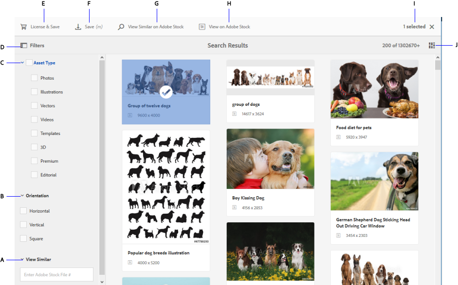

# Use Adobe Stock assets in AEM Assets {#use-adobe-stock-assets-in-aem-assets}

Organizations can integrate their Adobe Stock enterprise plan with AEM Assets to ensure that licensed assets are broadly available for their creative and marketing projects, with the powerful asset management capabilities of AEM.

Adobe Stock service provides designers and businesses with access to millions of high-quality, curated, royalty-free photos, vectors, illustrations, videos, templates, and 3D assets for all their creative projects. AEM users are able to quickly find, preview, and license Adobe Stock assets that are saved in AEM, without leaving the AEM workspace.

## Prerequisites {#prerequisites}

The integration requires an [enterprise Adobe Stock plan](https://landing.adobe.com/en/na/products/creative-cloud/ctir-4625-stock-for-enterprise/index.html) and AEM 6.4 with at least Service Pack 2 deployed. For AEM 6.4 service pack details, see these [release notes](/help/release-notes/sp-release-notes.md).

## Integrate AEM and Adobe Stock {#integrate-aem-and-adobe-stock}

To allow communication between AEM and Adobe Stock, create an IMS configuration and an Adobe Stock configuration in AEM.

>[!NOTE]
>
>Only AEM administrators and Admin Console administrators for an organization can perform the integration as it requires administrator privileges.

### Create an IMS configuration {#create-an-ims-configuration}

1. Navigate to **[!UICONTROL AEM]** > **[!UICONTROL Tools]** > **[!UICONTROL Security]** > **[!UICONTROL Adobe IMS Configurations]**. Click **[!UICONTROL Create]** and select **[!UICONTROL Cloud Solution]** > **[!UICONTROL Adobe Stock]**.
1. Either reuse an existing certificate or select **[!UICONTROL Create new certificate]**.
1. Click **[!UICONTROL Create certificate]**. Once created, download the public key. Click **[!UICONTROL Next]**.
1. Provide appropriate values in the fields titled **[!UICONTROL Title]**, **[!UICONTROL Authorization Server]**, **[!UICONTROL API Key]**, **[!UICONTROL Client Secret]**, and **[!UICONTROL Payload]**. See [JWT authentication quick start](https://www.adobe.io/authentication/auth-methods.html#!AdobeDocs/adobeio-auth/master/JWT/JWT.md), for detailed information to fetch these values from Adobe I/O.
1. Add the downloaded public key to your Adobe I/O service account.

### Create Adobe Stock configuration in AEM {#create-adobe-stock-configuration-in-aem}

1. Navigate to **[!UICONTROL AEM]** > **[!UICONTROL Tools]** > **[!UICONTROL Cloud Services]** > **[!UICONTROL Adobe Stock]**.
1. Click **[!UICONTROL Create]** to create a configuration and associate it with your existing IMS Configuration. Select `PROD` as the environment parameter.
1. In **[!UICONTROL Licensed Assets Path]** field, leave a location as is. Do not change the location where you want to store the Adobe Stock assets.
1. Complete creation by adding all the required properties. Click **[!UICONTROL Save & Close]**.
1. Add AEM users or groups, who can license the assets.

>[!NOTE]
>
>If there are multiple Adobe Stock Configurations, select the desired configuration in User Preferences panel (**[!UICONTROL AEM]** > **[!UICONTROL User Icon]** > **[!UICONTROL User Preferences]** > **[!UICONTROL Stock Configuration]**).

## Use and manage Adobe Stock assets in AEM {#use-and-manage-adobe-stock-assets-in-aem}

Using this capability, organizations can allow its users to work using Adobe Stock assets in AEM Assets. From within the AEM user interface, users can search Adobe Stock assets and license the required assets.

Once an Adobe Stock asset is licensed in AEM, it can be used and managed like a typical asset. In AEM, the users can search and preview the assets; copy and publish the assets; share the assets on Brand Portal; access and use the assets via AEM desktop app; and so on.

**Figure:** *Search for Adobe Stock assets and filter results from your AEM workspace*

**A.** Search assets similar to the assets whose Adobe Stock ID is provided. **B.** Search assets that match your selection of shape or orientation. **C.** Search for one of more supported asset types **D.** Open or collapse the filters pane **E.** License and save the selected asset in AEM **F.** Save the asset in AEM with watermark **G.** Explore assets on Adobe Stock website that are similar to the selected asset **H.** View the selected assets on Adobe Stock website **I.** Number of selected assets from the search results **J.** Switch between Card view and List view

### Find assets {#find-assets}

Your AEM users, can search for assets in both, AEM and Adobe Stock. When the search location is not limited to Adobe Stock, the search results from AEM and Adobe Stock are displayed.

* To search for Adobe Stock assets, click **[!UICONTROL Navigation]** > **[!UICONTROL Assets]** > **[!UICONTROL Search Adobe Stock]**.  

* To search for assets across Adobe Stock and AEM Assets, click the search icon .

Alternatively, start typing `Location: Adobe Stock` in the search bar to select Adobe Stock assets.  AEM offers advanced filtering capabilities on the searched assets, allowing users to quickly zero-in on the required assets using filters, such as types of supported assets, image orientation, and licensed state.

>[!NOTE]
>
>Assets searched from Adobe Stock are just displayed in AEM. Adobe Stock assets are fetched and stored in AEM repository only after a user either [saves an asset](aem-assets-adobe-stock.md#saveassets) or [licenses an asset](aem-assets-adobe-stock.md#licenseassets). Assets that are already stored in AEM are displayed and highlighted for ease of reference and access. Also, such assets are saved with some additional metadata to indicate the source as Adobe Stock.

**Figure:** *Search filters in AEM and highlighted Adobe Stock assets in search results*

### Save and view the required assets {#saveassets}

Select an asset that you want to save in AEM. Click Save in the toolbar at the top and provide the name and location of the asset. The unlicensed assets are saved locally with a watermark.

Next time when you search for assets, the saved assets are highlighted with a badge, to indicate that such assets are available in AEM Assets.

>[!NOTE]
>
>The recently added assets display a New badge instead of Licensed badge.

### License assets {#licenseassets}

Users can license Adobe Stock assets by using the quota of their Adobe Stock Enterprise plan. When you license an asset, it is saved without a watermark and is available for searching and using in AEM Assets.

**Figure:** *Dialog to license and save Adobe Stock assets in AEM Assets*

### Access metadata and asset properties {#access-metadata-and-asset-properties}

Users can access and preview the metadata, including the Adobe Stock metadata properties for the assets saved in AEM, and add **[!UICONTROL License References]** for an asset. However, the updates to license reference are not synced between AEM and Adobe Stock website.

Users can see the properties for both, licensed and unlicensed assets.

**Figure:** *View and access metadata and license references of saved assets*

## Known limitations {#known-limitations}

<!--These next 3 sections used to be accordions until converted to straight Markdown. When accordions are enabled, revert-->

### Editorial image warning is not displayed

When licensing an image, users cannot check if an image is Editorial Use Only. To prevent possible misuse, the administrators can turn off the access to editorial assets from the Admin Console.

### Wrong license type is displayed

It is possible that an incorrect license type is displayed in AEM for an asset. Users can log into the Adobe Stock website to see the license type.

### Reference fields and metadata are not synced

When a user updates a license reference field, the license reference information is updated in AEM but not on the Adobe Stock website. Similarly, if the user updates the reference fields on the Adobe Stock website, the updates are not synchronized in AEM.

## Related resources {#related-resources}

[Video tutorial on using Adobe Stock assets with AEM Assets](https://helpx.adobe.com/experience-manager/kt/assets/using/stock-assets-feature-video-use.html)

[Adobe Stock enterprise plan help](https://helpx.adobe.com/enterprise/using/adobe-stock-enterprise.html)

[Adobe Stock FAQ](https://helpx.adobe.com/stock/faq.html)