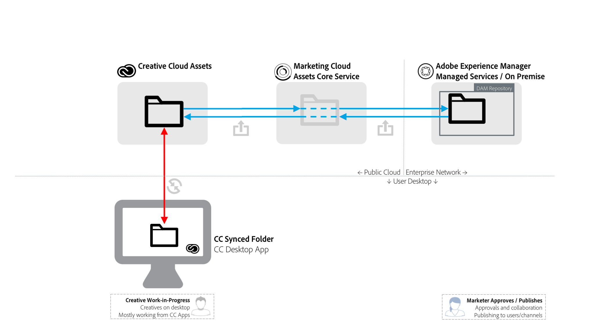
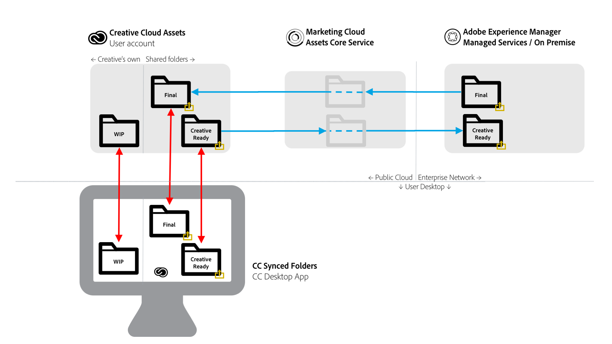

# [!DNL Adobe Experience Manager] to [!DNL Adobe Creative Cloud] folder sharing {#aem-to-creative-cloud-folder-sharing-best-practices}

>[!CAUTION]
>
>The [!DNL Experience Manager] to [!DNL Creative Cloud] Folder Sharing feature is deprecated. Adobe strongly recommends using newer capabilities such as [Adobe Asset Link](https://helpx.adobe.com/enterprise/admin-guide.html/enterprise/using/adobe-asset-link.ug.html) or [Experience Manager desktop app](https://experienceleague.adobe.com/docs/experience-manager-desktop-app/using/using.html). Learn more in [Experience Manager and Creative Cloud integration best practices](/help/assets/aem-cc-integration-best-practices.md).

[!DNL Adobe Experience Manager] can be configured to allow users in [!DNL Assets] to share folders with the users of [!DNL Adobe Creative Cloud] apps, so they are available as shared folders in the [!DNL Adobe Creative Cloud] assets service. The feature can be used to exchange files between creative teams and [!DNL Assets] users, especially when the creative users do not have access to the [!DNL Assets] deployment (they are not on the enterprise network).

This type of integration can be used in the following use cases, especially when working with users who do not have direct access to [!DNL Assets]:

* [!DNL Assets] users share a set of specific digital assets with users of [!DNL Adobe Creative Cloud] files (for example, a creative brief and set of approved assets for design work for a new marketing activity).
* [!DNL Assets] users receive new files created by [!DNL Adobe Creative Cloud] app users.

>[!NOTE]
>
>Before reading this document, you can review the overall [Experience Manager and Creative Cloud integration best practices](/help/assets/aem-cc-integration-best-practices.md) for an overview of the integration.

## Overview {#overview}

[!DNL Experience Manager] to [!DNL Creative Cloud] folder sharing relies on the server-side sharing of folders and files between [!DNL Assets] and [!DNL Creative Cloud] accounts. Creative professionals, who use the [!DNL Creative Cloud] desktop app on their desktops, can additionally make the shared folders available directly on their disks using [!DNL Adobe CreativeSync] technology.

The following diagram provides an overview of the integration.

The integration includes the following elements:

* **[!DNL Experience Manager Assets]** deployed in the enterprise network (managed services or on-premise): Folder sharing is initiated here.
* **[!DNL Adobe Marketing Cloud Assets] core service**: Acts as an intermediary between [!DNL Experience Manager] and [!DNL Creative Cloud] storage services. An administrator of an organization that uses the integration needs to established trust relationship between the Marketing Cloud organization and the [!DNL Assets] deployment. They also [define a list of approved Creative Cloud collaborators](https://experienceleague.adobe.com/docs/core-services/interface/assets/t-admin-add-cc-user.html), that [!DNL Assets] users can share folders too for additional security.

* **[!DNL Creative Cloud] Assets web services** (storage and [!DNL Creative Cloud] files web UI): This is where specific Creative Cloud app users, with whom an [!DNL Assets] folder was shared, would be able to accept the invitation and see the folder in their Creative Cloud account storage.
* **Creative Cloud desktop app**: (Optional) Allows for direct access to shared folder/files from creative user’s desktop via sync with [!DNL Creative Cloud] Assets storage.

## Characteristics and limitations {#characteristics-and-limitations}

* **One-way propagation of changes:** File changes are propagated in one direction only - from the system ([!DNL Experience Manager] or [!DNL Creative Cloud Assets]), where the asset was originally created (uploaded). The integration does not provide a fully automated, two-way synchronization between the two systems.
* **Versioning:**

  * [!DNL Experience Manager] only creates versions of an asset on updates if the file originated in [!DNL Experience Manager] and is updated there.
  * [!DNL Creative Cloud] Assets provides its own [versioning feature](https://helpx.adobe.com/creative-cloud/help/versioning-faq.html) that is targeted at Work in Progress updates (basically, stores updates for up to 10 days)

* **Space limitations:** Sizes and volumes of files exchanged is limited by the specific [Creative Cloud Assets quota](https://helpx.adobe.com/creative-cloud/kb/file-storage-quota.html) for creative users (depends on subscription level) and a limitation of 5 GB maximum file size. Space is additionally limited by the asset quota that the organization has in Adobe Marketing Cloud Assets core service.

* **Space requirements:** The files in shared folders also need to be physically stored in [!DNL Experience Manager] and then in [!DNL Creative Cloud] account, with a cached copy in [!DNL Marketing Cloud Assets] core service.
* **Networking and bandwidth:** The files in shared folders and all the updates need to be transported over the network between the systems. You should ensure that only relevant files and updates are shared.
* **Folder type**: Sharing an [!DNL Assets] folder of the type `sling:OrderedFolder`, is not supported in the context of sharing in [!DNL Adobe Marketing Cloud]. If you want to share a folder, when creating it in [!DNL Assets], do not select the [!UICONTROL Ordered] option.

## Best practices {#best-practices}

Best practices for leveraging the [!DNL Experience Manager] to [!DNL Creative Cloud] folder sharing include:

* **Volume considerations:** [!DNL Experience Manager] and [!DNL Creative Cloud] Folder Sharing should be used to share smaller number of files, for example, relevant to a specific campaign or activity. To share larger sets of assets, like all approved assets in the organization, use other distribution methods (for example, [!DNL Assets Brand Portal]) or [!DNL Experience Manager] desktop app.
* **Avoid sharing deep hierarchies:** The sharing works recursively and does not allow for selective un-sharing. Typically, only folders without sub-folders, or with a very shallow hierarchy, like 1 sub-folder level, should be considered for sharing.
* **Separate folders for one-way sharing:** Separate folders should be used for sharing final assets from [!DNL Assets] to [!DNL Creative Cloud] files, and for sharing creative-ready assets back from [!DNL Creative Cloud] files to [!DNL Assets]. Together with a good naming convention for these folders, it creates an easier-to-understand working environment for [!DNL Assets] and [!DNL Creative Cloud] users alike.
* **Avoid WIP in the shared folder:** Shared folder should not be used for Work in Progress - use a separate folder in Creative Cloud Files to carry out work that requires frequent changes to the file.
* **Start new work outside of shared folder:** New designs (creative files) should be started in the separate WIP folder in Creative Cloud Files, and when they are ready to be shared with [!DNL Assets] users, they should be moved or saved to the shared folder.
* **Simplify sharing structure:** For a more manageable operating set up, think about simplifying the sharing structure. Instead of sharing with all creative users, [!DNL Assets] folders should be shared with team representative(s) only, like a creative director or team manager. The manager on the creative side would receive final assets, decide on work assignments, and then let designers work in their own Creative Cloud accounts on WIP assets. They can use Creative Cloud collaboration features to coordinate the work, and finally select and put assets that are ready to share back to [!DNL Assets] into their creative-ready shared folder.

The following diagram illustrates an example configuration for creating new designs based on existing final assets from [!DNL Assets].

