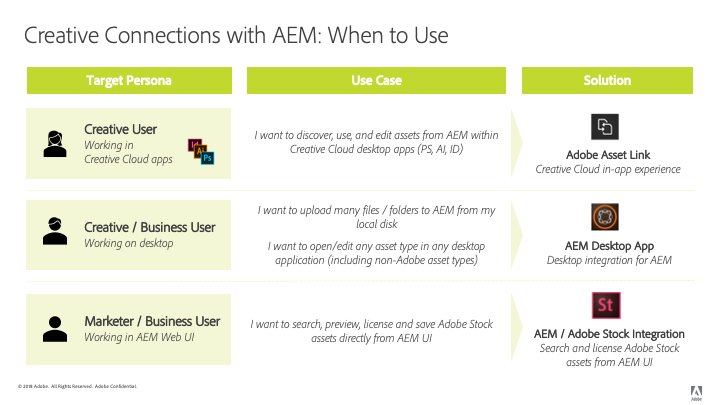

# [!DNL Adobe Experience Manager] and [!DNL Creative Cloud] integration best practices {#aem-and-creative-cloud-integration-best-practices}

| Version | Article link |
| -------- | ---------------------------- |
| AEM as a Cloud Service  |    [Click here](https://experienceleague.adobe.com/docs/experience-manager-cloud-service/content/assets/manage/aem-cc-integration-best-practices.html?lang=en)                  |
| AEM 6.5     | This article         |

[!DNL Adobe Experience Manager Assets] is a digital asset management (DAM) solution that can integrate with [!DNL Adobe Creative Cloud] to help DAM users work together with creative teams, streamlining collaboration in the content creation process.

[!DNL Adobe Creative Cloud] provides creative teams with an ecosystem of solutions and services to help them to create digital assets. It includes desktop and mobile applications, cloud services like storage with desktop sync or web experience, as well as marketplaces such as [!DNL Adobe Stock].

Read on to know what integrations to pick between desktop and the enterprise-grade DAM based on your use case and what are the associated best practices for the connecting workflows.

>[!NOTE]
>
>[!DNL Experience Manager] to [!DNL Creative Cloud] folder sharing is deprecated and no longer covered in this guide. Adobe recommends using newer capabilities such as [Adobe Asset Link](https://helpx.adobe.com/enterprise/using/adobe-asset-link.html) or [Experience Manager desktop app](https://experienceleague.adobe.com/docs/experience-manager-desktop-app/using/troubleshoot.html) to provide creative user with access to assets managed in [!DNL Experience Manager].

## Collaboration needs of creatives, marketers, and DAM users {#collaboration-needs-of-creatives-marketers-and-dam-users}

| Requirements | Use case | Involved surfaces |
|---|---|---|
| Simplify experience for creatives on desktop | Streamline access to asset from a DAM ([!DNL Experience Manager Assets]) for creative professionals, or more broadly, users on desktop working in native asset creation applications. They need an easy and straightforward way to discover, use (open), edit and save changes to [!DNL Experience Manager], as well as upload new files. | Win or Mac desktop; [!DNL Creative Cloud] apps |
| Provide high-quality, ready-to-use assets from [!DNL Adobe Stock] | Marketers help accelerate the content creation process by assisting with asset sourcing and discovery. Creative professionals use the approved assets right from within their creative tools. | [!DNL Experience Manager Assets]; [!DNL Adobe Stock] marketplace; metadata fields |
| Distribute and share assets by organizations | Internal departments/local branches and external partners, distributors, and agencies use the approved assets shared by the parent organization. The organization wants to securely and seamlessly share the created assets for wider reuse. | Brand Portal, Asset Share Commons |

## Adobe offerings to support the collaboration need {#adobe-offerings-to-support-the-collaboration-need}

| Value proposition for the involved personas | Adobe offering | Involved surfaces |
|---|---|---|
| Creative users discover assets from [!DNL Experience Manager], open and use them, edit and upload changes to [!DNL Experience Manager], as well as upload new files into [!DNL Experience Manager], without leaving [!DNL Creative Cloud] apps. | [Adobe Asset Link](https://helpx.adobe.com/enterprise/using/adobe-asset-link.html) | [!DNL Adobe Photoshop], [!DNL Adobe Illustrator], and [!DNL Adobe InDesign]. |
| Business users simplify opening and using assets, editing and uploading changes to [!DNL Experience Manager], and uploading new files into [!DNL Experience Manager] from the desktop environment. They use a generic integration to open any asset type in the native desktop application, including non-Adobe ones. | [Experience Manager desktop app](https://experienceleague.adobe.com/docs/experience-manager-desktop-app/using/using.html) | [!DNL Experience Manager] desktop app on Win and Mac desktop |
| Marketers and business users discover, preview, license and save, and manage the [!DNL Adobe Stock] assets from within [!DNL Experience Manager]. Licensed and saved assets provide select [!DNL Adobe Stock] metadata for better governance. | [Experience Manager and Adobe Stock integration](aem-assets-adobe-stock.md) | [!DNL Experience Manager] web interface |

This article focuses primarily on the first two aspects of the collaboration needs. Distribution and sourcing of assets at scale is briefly mentioned as a use case. For such needs solutions, consider Adobe Brand Portal or Asset Share Commons. Alternate solutions such as [Brand Portal](https://experienceleague.adobe.com/docs/experience-manager-brand-portal/using/home.html), solutions that can be built based on [Asset Share Commons](https://adobe-marketing-cloud.github.io/asset-share-commons/) components, [Link Share](/help/assets/link-sharing.md), using [Experience Manager Assets](/help/assets/manage-assets.md) should be reviewed based on specific requirement.

### Mapping of use cases and Adobe solutions {#mapping-of-use-cases-and-adobe-solutions}

<!-- TBD: Add some info about XD integration and possibly info about DA v2.0.
-->

| Use Case | [!DNL Adobe Asset Link] | [!DNL Experience Manager] desktop app | Remarks / Other Solutions |
|---|---|---|---|
| Discover - browse DAM folders | Yes | [!DNL Experience Manager] Web interface and desktop actions | |
| Discover - access DAM collections| Yes | [!DNL Experience Manager] Web interface and desktop actions | |
| Discover - search for assets from DAM | Yes | [!DNL Experience Manager] Web interface and desktop actions| |
| Use - open asset | Yes | Yes | [Open from Web interface](manage-assets.md#previewing-assets) or from Finder |
| Use - place asset from DAM into a document | Yes - embedding | Yes - linking or embedding | [!DNL Experience Manager] desktop app gives access to assets as files on the local file system. These links in the native apps are represented by local paths. |
| Edit - open for editing | Yes - Check-out action | Yes - Open action (in the network share) | [Check-out in AAL](https://helpx.adobe.com/enterprise/using/manage-assets-using-adobe-asset-link.html) saves the asset to user's creative cloud storage account (synchronized by Creative Cloud app) by default. |
| Edit - work in progress outside DAM | Yes - Asset available in user's Creative Cloud storage account synced to desktop. | Yes | |
| Edit - upload changes | Yes - [Check-in action](https://helpx.adobe.com/enterprise/using/manage-assets-using-adobe-asset-link.html) with optional comment | Yes | |
| Upload - single file | Yes - uploads current active document | Yes | [Upload via web interface](manage-assets.md#uploading-assets) |
| Upload - multiple files / hierarchical folder structures | No | Yes | [Upload via web interface](manage-assets.md#uploading-assets) or via custom scripting or tool. |
| Misc - user and login | Creative Cloud user logged into Creative Cloud desktop app gets recognized (SSO) | [!DNL Experience Manager] user and credentials | Users of both solutions count towards the [!DNL Experience Manager] user quota. |
| Misc - network and access | Requires access from user's desktop to [!DNL Experience Manager] deployment over network | Requires access from user's desktop to [!DNL Experience Manager] deployment over network | [!DNL Adobe Asset Link] does not share network proxy environment. |
| Misc - Migrate large number of assets | No | No | [Assets migration guide](assets-migration-guide.md) |

To support asset distribution use cases, other solutions should be considered:

* [Brand Portal](https://experienceleague.adobe.com/docs/experience-manager-brand-portal/using/home.html) for a configurable, SaaS add-on to [!DNL Experience Manager Assets] to publish assets.
* Custom solutions are created based on [Asset Share Commons](https://adobe-marketing-cloud.github.io/asset-share-commons/) code base.
* [!DNL Experience Manager] [link share](/help/assets/link-sharing.md) to share assets ad hoc using links.
* [Experience Manager Assets web interface](/help/assets/manage-assets.md) with areas for external parties secured by [!DNL Experience Manager] access control setup and with necessary IT / network configuration adjustments, giving these external users access to [!DNL Experience Manager].

## Key concepts and use cases {#key-concepts-and-use-cases}

### Glossary of common terms {#glossary-of-common-terms}

* **Work-in-progress or creative work-in-progress (WIP):** A phase in asset lifecycle where an asset undergoes multiple changes and is typically not yet ready to be shared with broader teams.
* **Creative-ready assets:** [!DNL Assets] that are ready to be shared with a broader team, or have been selected or approved by the creative team for sharing with marketing or LOB teams.
* **Asset approvals:** The approval process that runs for assets already uploaded to DAM, which typically includes brand approvals, legal approvals, and so on.
* **Final asset:** An asset that has gone through all approvals/metadata tagging and is ready to be used by the broader team. Such an asset is stored in DAM and made available to all (or all interested) users. It can be used in marketing channels or by creative teams to create designs.
* **Minor asset update/change :** A quick and small change to a digital asset. It is often made in response to a retouching or minor editing request, asset review, or approval (for example, reposition, change text size, adjust saturation/brightness, color, and so on).
* **Major asset update/change :** A change to a digital asset that requires considerable work, and sometimes must be done over a longer period of time. It typically includes multiple changes. The asset must be saved multiple times while being updated. Major asset updates typically cause the asset to enter a WIP stage.
* **DAM:** Digital asset management. In this document, it is synonymous with [!DNL Experience Manager Assets], unless specifically mentioned otherwise.
* **Creative user:** A creative professional, who creates digital assets using Creative Cloud apps and services. In some cases, a creative user may be a member of a creative team who may use Creative Cloud, but does not create digital assets (like a creative director or creative team manager).
* **DAM user:** A typical user of a DAM system. Depending on the organization, a DAM user can be a marketing or a non-marketing user, for example a Line-of-Business (LOB) user, librarian, sales person, and so on.

### Considerations when using [!DNL Experience Manager] and [!DNL Creative Cloud] integration {#considerations-when-using-aem-and-creative-cloud-integration}

* See [desktop app best practices](https://experienceleague.adobe.com/docs/experience-manager-desktop-app/using/troubleshoot.html#best-practices-to-prevent-troubles)
* See [Adobe Stock integration](aem-assets-adobe-stock.md)
* See [Adobe Asset Link](https://helpx.adobe.com/enterprise/using/adobe-asset-link.html)

This is a brief summary of best practices for [!DNL Experience Manager] and [!DNL Creative Cloud] integration. Read the rest of this document to get the detailed understanding of these.

* **For creative users, working in Photoshop, InDesign, or Illustrator:** Adobe Asset Link provides the best user experience, including clean handling of the Work-in-progress on assets checked out from [!DNL Experience Manager].
* **For simplifying access to assets from desktop for any generic file format or application:** use [!DNL Experience Manager] desktop app.
* **Understand why and when to store assets in DAM:** Updates to be made available to the broader team in your organization.
* **Mind the volume of assets shared:** If your use case is asset distribution, governance and security might be the most important aspects. Consider using tools built for doing that at scale, like Brand Portal.
* **Understand asset lifecycle:** Know how assets are handled in your organization by different teams
* **Handle frequent saves to assets with care:** Adobe Asset Link takes care of that for you with PS, AI, ID. For other applications, don't carry out work in progress tasks in mapped/shared folder unless you need all the changes in DAM

### Access to [!DNL Adobe Stock] assets from [!DNL Assets] {#access-to-adobe-stock-assets-from-aem-assets}

[Experience Manager and Adobe Stock integration](/help/assets/aem-assets-adobe-stock.md) provides [!DNL Experience Manager] users with the ability to search, preview, license and save, assets from [!DNL Adobe Stock] into [!DNL Experience Manager]. Licensed and saved [!DNL Stock] assets have selected [!DNL Stock] metadata, which can be used to search for them with extra filters.

A few important points about this integration:

* When assets from Adobe stock are saved to [!DNL Experience Manager], they become a regular [!DNL Assets], with binary saved to the [!DNL Experience Manager] repository. Some metadata related to [!DNL Adobe Stock] are saved for the asset in [!DNL Experience Manager], otherwise the ingestion process looks the same as for any other file. For example, if Smart Tags are active, the tags are added to these assets upon saving.
* The asset saved to [!DNL Experience Manager] is a copy, not a link back into [!DNL Adobe Stock].

**Working with assets saved from [!DNL Adobe Stock] into [!DNL Experience Manager] in [!DNL Creative Cloud]**. This integration is independent of [!DNL Adobe Asset Link], but [!DNL Adobe Asset Link] recognizes these assets saved from [!DNL Stock] that way, and displays additional metadata and a [!DNL Adobe Stock] logo on these assets in [!DNL Adobe Asset Link] extension UI in [!DNL Photoshop], [!DNL Illustrator], or [!DNL InDesign]. The files are available for browsing, opening, and so on - because they are regular assets when saved to [!DNL Experience Manager].
Creative users working in [!DNL Creative Cloud] apps with [!DNL Adobe Asset Link] extension present, in addition to having access to already-licensed assets from [!DNL Adobe Stock] into [!DNL Experience Manager], can also use [!DNL Creative Cloud] Libraries panel to search, preview, and license [!DNL Adobe Stock] assets.
[!DNL Assets] from [!DNL Adobe Stock] licensed and saved into [!DNL Experience Manager] become available to the broader teams accessing [!DNL Experience Manager Assets] deployment, whereas creatives licensing assets from [!DNL Adobe Stock] via [!DNL Creative Cloud] Libraries panel make them available to themselves only by default in their [!DNL Creative Cloud] account.

<!-- 
TBD: A condensed version of the below content is better placed in the Adobe DAM introduction article.
-->

## About storing assets in a DAM {#about-storing-assets-in-a-dam}

To design an efficient workflow between creative and marketing/line-of-business (LOB) teams and choose the best support capabilities, it is important to understand when and why assets are stored in DAM.

### Why assets are stored in DAM {#why-assets-are-stored-in-dam}

Storing assets in DAM makes them easily accessible and findable. It ensures that the assets can be leveraged by numerous users across the organization or ecosystem, which includes partners, customers, and so on.

Most organizations choose to only store assets that are relevant to the downstream marketing/LOB processes (publishing to channels like web channel via [!DNL Experience Manager Sites] or other channels served by Adobe Experience Cloud - Marketing Cloud, Advertising Cloud, and measured by Analytics Cloud, providing to users/partners, and so on). In addition, organizations store assets that may be subjected to a review/approval process in DAM. This way, DAM stores mostly assets that have high chances of being leveraged, and avoids storing idle assets.

Storing assets is also subject to technical and resource utilization considerations. DAM provides additional services around stored assets, including extracting metadata, versioning, generating previews/transcoding, managing references, and adding access control information. These services consume additional time and infrastructure resources.

Often, storing all of the assets and updates is not desirable. For example, if updates to specific assets are of poor quality and consume excessive resources, the assets may not be stored in DAM.

#### When assets are stored in DAM {#when-assets-are-stored-in-dam}

Creative teams (and organizations) are usually not interested in storing assets at each stage of the asset lifecycle. For example, they avoid storing assets in the following cases:

* Assets that are yet to be finalized or are subject to experimentation.
* Assets that fail to pass the creative/internal team review cycle.
* Compared to the asset in question, the team has better candidates to represent their work to external teams.

Usually, the following classes assets are stored in DAM:

* Assets that reached a certain maturity and are considered ready to be shared.
* Assets that were pre-selected by the creative team.
* Specific asset formats that are usable or requested by marketing, depending on a specific contract or agreement (for example, JPG files converted from RAW files, TIFFs/images from PSD originals).

#### When updates to assets are stored in DAM {#when-updates-to-assets-are-stored-in-dam}

As a rule, only updates to assets that are relevant to the broader set of DAM users should be stored in DAM. It ensures that users (marketing and similar functions) only see relevant versions in the DAM asset timeline.

Typically changes related to major milestones in the asset lifecycle. For example, the initial marketing-ready asset or an official update based on request/review provided by the creative team should be stored and versioned in DAM.

The creative team's update for review by the marketing team after a request for a change in the existing asset in DAM is an example of a relevant update. It should be stored and versioned in DAM for further reference or for reverting to the previous version.

The following are examples of updates that are typically not relevant:

* Early versions of assets uploaded before it is ready for marketing review
* Frequent creative changes to the asset in the work-in-progress phase before creative and marketing teams decide that the asset is ready

### User access to DAM {#user-access-to-dam}

[!DNL Assets] supports two types of users based on their access to the [!DNL Assets] deployment. Typically, users inside the enterprise network (firewall) have direct access to DAM. Other users outside the enterprise network would not have direct access. The user type determines which integrations can be used from the technical standpoint.

#### Creative users with direct access to DAM {#creative-users-with-direct-access-to-dam}

Typically, in-house creative teams or agencies/creative professionals onboarded to the internal network have access to the DAM deployment, including [!DNL Experience Manager] login. [!DNL Experience Manager] and network infrastructure can be set up to allow direct access to external parties - usually trusted organizations like agencies working for a client - to have access to [!DNL Experience Manager] over network, for example via VPN or IP allowed list.

In such cases, Adobe Asset Link or [!DNL Experience Manager] desktop app helps provide easy access to final/approved assets and lets you save creative-ready assets to DAM.

#### Creative users without access to DAM {#creative-users-without-access-to-dam}

External agencies and freelancers without direct access to the DAM deployment may require access to approved assets or want to add their new designs to the DAM.

Use the following strategies to provide access to final/approved assets:

* Use desktop app if Asset Link does not work.
* Use [Experience Manager Assets Brand Portal](https://experienceleague.adobe.com/docs/experience-manager-brand-portal/using/home.html) for distributing assets securely to external partners
* Use a custom implementation of a distribution and sourcing portal based on [Asset Share Commons](https://adobe-marketing-cloud.github.io/asset-share-commons/)
* Use Access Control set up in [!DNL Experience Manager] and necessary network infrastructure (for example, VPN and IP allowed list) to give external parties access to a dedicated area of content in your DAM. They can use [!DNL Experience Manager] Web UI to get assets and upload new content into your DAM.

#### Work in progress on assets from [!DNL Experience Manager] {#work-in-progress-on-assets-from-aem}

As discussed in this document, it is recommended to carry out major updates on assets, sometimes called work in progress, without having all the edits saved to the local file also uploaded to [!DNL Experience Manager] as changes. This speeds up a desktop user's work, limit network bandwidth used, and keep the assets timeline clean and focused on controlled, major updates.

Adobe Asset Link offers a good support for this use case:

* When users in [!DNL Photoshop], [!DNL InDesign], or [!DNL Illustrator] intent to edit a file, they execute a Check-out operation on the given asset
* The asset is downloaded in background, put into users Creative Cloud account synchronized to disk by Creative Cloud desktop app, and the check-out flag is toggled in [!DNL Experience Manager] on the asset to minimize editing conflicts
* From there on, the user works in a file that's stored locally in the synced location, and can continue working and saving necessary changes at any frequency required
* Additionally, because the asset is in the Creative Cloud account, it is also available on other devices that the user might have (for example, can be opened or edited in a dedicated Creative Cloud mobile app), and can be shared with other Creative Cloud users for collaboration purposes.
* When the creative user is done with the changes, they can execute a Check-in operation on that file in their Creative Cloud application, with an optional comment. The corresponding asset in [!DNL Experience Manager] are versioned and updated to with the new binary. [!DNL Experience Manager] users like Marketers or LOB users have access to major asset changes, or milestones, via [!DNL Experience Manager] asset timeline UI.

[!DNL Experience Manager] desktop app provides a network share for assets opened in the native app. By default, all the changes done locally are uploaded to [!DNL Experience Manager] automatically after a brief while. With such a configuration, frequent saves during the work-in-progress phase would all be uploaded into [!DNL Experience Manager] and versioned, creating a lot of network traffic and potential scalability challenges - not to mention unnecessary versions in [!DNL Experience Manager].

The recommended approach here is to use an option in [!DNL Experience Manager] desktop app to turn off automated updates, and upload changes to assets to [!DNL Experience Manager] manually, leveraging the upload changes action in the app's Asset Status UI.

#### Bulk upload to DAM {#bulk-upload-to-dam}

You may have a requirement to simultaneously upload a larger number of files into DAM in some scenarios, for example:

* Uploading results of photoshoots or larger projects
* Uploading assets provided by creative agencies
* Uploading selected assets from a larger set if the selection is done outside DAM

The description refers to uploading files operationally (for example, every week or with every photoshoot), as a normal part of desktop user's workflow. Large asset migrations are not covered here.

You can leverage the following upload capabilities:

* To upload large/hierarchical folders in bulk, use [!DNL Experience Manager] desktop app that provides [folder upload](https://experienceleague.adobe.com/docs/experience-manager-desktop-app/using/using.html#upload-and-add-new-assets-to-aem) functionality. You can also upload hierarchical folder structures. [!DNL Assets] are uploaded in background and, therefore, it is not tied to a web browser session
* To upload a few files from a single folder, drag the files directly to the web interface or use the Create option in the [!DNL Assets] web interface.
* Depending upon your business requirements, you can also use custom uploader.

#### Manage digital assets directly from desktop {#managing-digital-assets-directly-from-desktop}

If you use Network File Shares to manage digital assets, just using the network share mapped by [!DNL Experience Manager] desktop app could be seen as a convenient substitute. When transitioning from network file shares, [!DNL Experience Manager] web interface provides a rich set of Digital Asset Management capabilities that go well beyond what is possible on a network share (search, collections, metadata, collaboration, previews, and so on), and [!DNL Experience Manager] desktop app provides a handy link to connect the server-side DAM repository with the work on desktop.

Avoid using [!DNL Experience Manager] desktop app to manage assets directly in the network share of [!DNL Assets]. For example, avoid using [!DNL Experience Manager] desktop app to move/copy multiple files. Instead, use the [!DNL Assets] interface to drag folders from Finder/Explorer to the network share or use the [!DNL Assets] Folder Upload feature.

#### Asset migration {#asset-migration}

To plan and execute asset migrations from existing system to a new system or migration of large volume of assets stored on servers, see the [Migration Guide](/help/assets/assets-migration-guide.md). [!DNL Experience Manager] desktop app and [!DNL Experience Manager] to [!DNL Creative Cloud] integrations do not support such migrations. Due to the large volumes of assets to be ingested, and additional requirements around metadata mapping, transformation, and ingestion, migrations should be handled using different tools and approaches.

>[!MORELIKETHIS]
>
>* [Adobe Asset Link](https://helpx.adobe.com/enterprise/using/adobe-asset-link.html)
>* [Experience Manager desktop app best practices](https://experienceleague.adobe.com/docs/experience-manager-desktop-app/using/archive/best-practices-for-v1.html)
>* [Experience Manager Brand Portal](https://experienceleague.adobe.com/docs/experience-manager-brand-portal/using/introduction/brand-portal.html)
>* [Experience Manager and Adobe Stock integration](aem-assets-adobe-stock.md)
