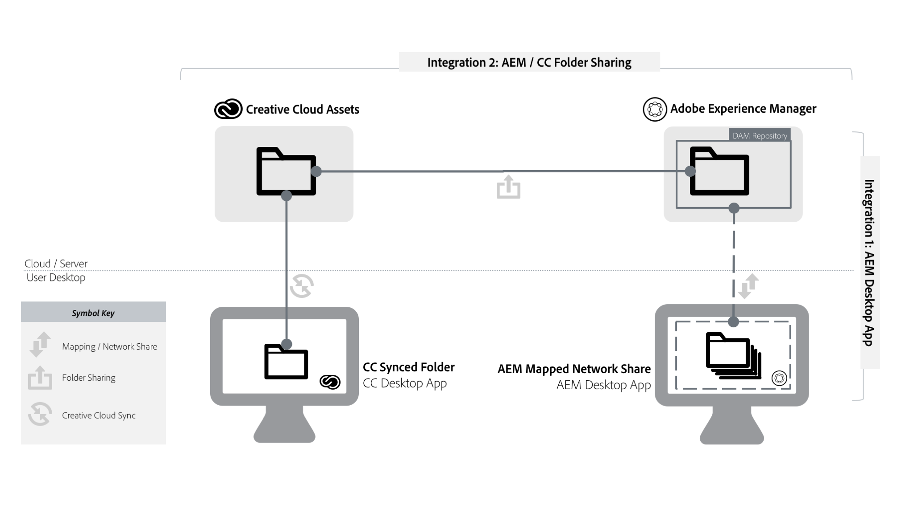
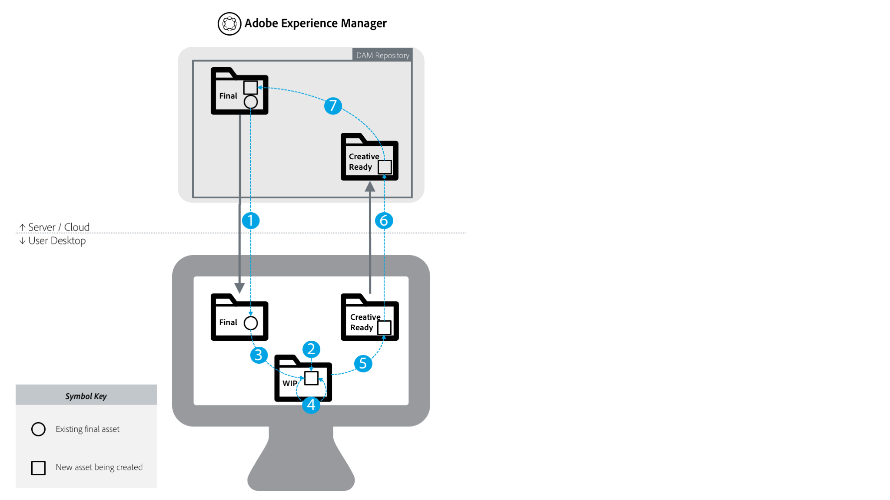

# AEM and Creative Cloud Integration Best Practices {#aem-and-creative-cloud-integration-best-practices}

Best practices for integrating an AEM instance with Adobe Creative Cloud to streamline asset transfer workflows and achieve maximum efficiency.

## Overview {#overview}

Adobe Experience Manager (AEM) Assets is a digital asset management (DAM) solution that can integrate with Adobe Creative Cloud to help DAM users work together with creative teams, such as creative agencies, freelancers, and internal studios.

You can work with Creative Cloud and AEM in multiple ways and use various methods to add approved assets to AEM. Moreover, Creative Cloud includes diverse apps and services, such as Creative Cloud apps (such as Photoshop,  InDesign  and Illustrator), Creative Cloud cloud services, Creative Cloud Desktop App, and so on.

You can integrate your AEM instance with Creative Cloud in multiple ways. Following some best practices to streamline your integration and asset transfer workflows helps achieve maximum efficiency. This guide includes best practices around integrating AEM Assets with Adobe Creative Cloud, or more broadly, with the work done on  desktop  that involves assets from DAM.

This document includes the following:

* [Overview of integrations and summary of best practices](aem-cc-integration-best-practices.md#summary-of-best-practices)
* [Key concepts and use cases](aem-cc-integration-best-practices.md#key-concepts-and-use-cases)

You can also review the following best practices documents around specific types of integration in more depth:

* [AEM desktop app best practices](https://helpx.adobe.com/experience-manager/desktop-app/aem-desktop-app-best-practices.html)
* [Adobe Asset Link](https://helpx.adobe.com/enterprise/using/adobe-asset-link.html)

>[!NOTE]
>
>The article is updated as of April 2019 and covers a new native connection from Creative Cloud - Adobe Asset Link.
>AEM to Creative Cloud folder sharing is now deprecated and no longer covered in this guide. We recommend newer capabilities like Adobe Asset Link or AEM desktop app to provide creative user with access to assets managed in AEM.

## Terms and definitions {#terms-and-definitions}

The terms used in this document may have a different meaning in other contexts. In particular, the following terms pertaining to the digital asset lifecycle are used when referring to workflows between a creative professional's desktop and DAM:

* **Work-in-progress or creative work-in-progress (WIP):** A phase in asset lifecycle where an asset undergoes multiple changes and is typically not yet ready to be shared with broader teams.
* **Creative-ready assets:** Assets that are ready to be shared with a broader team, or have been  selected / approved  by the creative team for sharing with marketing or LOB teams.
* **Asset approvals:** The approval process that runs for assets already uploaded to DAM, which typically includes brand approvals, legal approvals, and so on.
* **Final asset:** An asset that has gone through all  approvals/metadata  tagging and is ready to be used by the broader team. Such an asset is stored in DAM and made available to all (or all interested) users. It can be used in marketing channels or by creative teams to create designs.
* **Minor asset  update/change:** A quick and small change to a digital asset. It is often made in response to a retouching or minor editing request, asset review, or approval (for example, reposition, change text size, adjust saturation/brightness, color, and so on).
* **Major asset  update/change:** A change to a digital asset that requires considerable work, and sometimes must be done over a longer period of time. It typically includes multiple changes. The asset must be saved multiple times while being updated. Major asset updates typically cause the asset to enter a WIP stage.
* **DAM:** Digital asset management. In this document, it is synonymous with AEM Experience Manager Assets, unless specifically mentioned otherwise.
* **Creative user:** A creative professional, who creates digital assets using Creative Cloud apps and services. In some cases, a creative user may be a member of a creative team who may use Creative Cloud, but does not create digital assets (like a creative director or creative team manager).
* **DAM user:** A typical user of a DAM system. Depending on the organization, a DAM user can be a marketing or a non-marketing user, for example a Line-of-Business (LOB) user, librarian, sales person, and so on.

## Summary of best practices {#summary-of-best-practices}

### Integration types {#integration-types}

The following types of integration are described in this guide:

* **Integration 1 - [AEM desktop app](https://helpx.adobe.com/experience-manager/desktop-app/aem-desktop-app.html):** Linking AEM Assets with the desktop and desktop applications directly. It uses a network share that  is  mounted on the local  filesystem,  and maps assets from DAM into virtualized folders/files on the local disk share. This type of integration requires network connection on the user's desktop and direct user access to AEM (including AEM login).
* **Integration 2 - [AEM / Creative Cloud folder sharing](/help/sites-administering/creative-cloud.md):** Sharing AEM folders with Creative Cloud file storage, to let creative users access selected assets and provide new assets back into DAM. This type of integration does not require the creative user to have access / login to AEM, only their login with Adobe ID to Creative Cloud.

The follow diagram depicts both types of integration and describes how they connect work and assets in DAM with user's work on desktop:

 

### Determining which integration to use {#determining-which-integration-to-use}

The following table provides a concise summary of when to use which solution or integration and the alternatives.

* **AEM desktop app:** When users have direct access to AEM Assets and/or require access to larger parts of the DAM, including the whole repository.
* **AEM / Creative Cloud folder sharing:** When users don't have direct access to AEM or only require access to a smaller number of files.
* Alternative solutions (for example, [AEM Assets Brand Portal](https://helpx.adobe.com/experience-manager/brand-portal/user-guide.html), solutions that can be built based on [Asset Share](assets-finder-editor.md) components, [Link Share](link-sharing.md), using [AEM Assets web UI](managing-assets-touch-ui.md)): Support similar use cases and should be reviewed based on specific requirement.

<table> 
 <tbody> 
  <tr> 
   <th>Use case </th> 
   <th>Desktop app</th> 
   <th>Folder sharing</th> 
   <th>Other solutions</th> 
  </tr> 
  <tr> 
   <td>Share smaller number [1] of DAM assets with Creative user</td> 
   <td>✔✔</td> 
   <td>✔</td> 
   <td> </td> 
  </tr> 
  <tr> 
   <td>Share larger number [2] of DAM assets with Creative user</td> 
   <td>✔✔</td> 
   <td>✘</td> 
   <td>
<a href="https://helpx.adobe.com/experience-manager/brand-portal/user-guide.html">Brand Portal</a>
 
<a href="/help/assets/assets-finder-editor.md">Asset Share</a>
 </td> 
  </tr> 
  <tr> 
   <td>Share DAM assets with users who have access to DAM</td> 
   <td>✔✔</td> 
   <td>✔</td> 
   <td><a href="/help/assets/link-sharing.md">Link Share</a></td> 
  </tr> 
  <tr> 
   <td>Share DAM assets with users who don't have access to DAM</td> 
   <td>✘</td> 
   <td>✔✔</td> 
   <td>
<a href="https://helpx.adobe.com/experience-manager/brand-portal/user-guide.html">Brand Portal</a>
 
<a href="/help/assets/assets-finder-editor.md">Asset Share</a>
 </td> 
  </tr> 
  <tr> 
   <td>Save smaller number/volume of assets to DAM</td> 
   <td>✔✔</td> 
   <td>✔</td> 
   <td><a href="/help/assets/managing-assets-touch-ui.md#uploading-assets">Web UI Upload</a></td> 
  </tr> 
  <tr> 
   <td>Save larger number of assets to DAM [3]</td> 
   <td>✔✔</td> 
   <td>✘</td> 
   <td>
<a href="/help/assets/managing-assets-touch-ui.md#uploading-assets">Web UI Upload</a>
 
Custom script / tool 
 </td> 
  </tr> 
  <tr> 
   <td>Migrate huge number of assets to DAM    </td> 
   <td>✘    </td> 
   <td>✘    </td> 
   <td><a href="/help/assets/assets-migration-guide.md">Migration Guide</a></td> 
  </tr> 
  <tr> 
   <td>Quickly open an asset on desktop</td> 
   <td>✔✔</td> 
   <td>✘</td> 
   <td> </td> 
  </tr> 
  <tr> 
   <td>Quickly open and change asset on desktop</td> 
   <td>✔✔</td> 
   <td>✘</td> 
   <td> </td> 
  </tr> 
 </tbody> 
</table>

The meaning of the symbols:

* ✔✔: preferred solution
* ✔: acceptable solution
* ✘: shouldn't be used for the use case

Additional remarks:

* [1] Smaller number of assets: for example, a small set of assets related to a project or campaign
* [2] Larger number of assets: for example, all approved assets in the organization
* [3] Use AEM desktop app upload folder feature

### Best Practices for AEM and Creative Cloud Integrations {#best-practices-for-aem-and-creative-cloud-integrations}

This is a brief summary of best practices for AEM and Creative Cloud integration. Read the rest of this document to get the detailed understanding of these.

* **Understand why and when to store assets in DAM:** Which updates should be available to the broader team in your organization.
* **Mind the access to DAM:** Use the right tools for users inside or outside your enterprise network with or without access to DAM.
* **Mind the volume of assets shared:** Use the right tool depending on the volume of assets in collaboration.
* **Understand asset lifecycle:** Know how assets are handled in your organization by different teams.
* **Handle frequent saves to assets with care:** Don't carry out work in progress tasks in mapped/shared folder unless you need all the changes in DAM.
* **Separate mapped/shared folders for clarity**: Use separate folders mapped/shared from DAM for different classes of assets - final assets from DAM and new or updated assets meant for storing in DAM.

### Best Practices for AEM desktop app {#best-practices-for-aem-desktop-app}

This is a brief summary of best practices for AEM desktop app. Refer to [AEM desktop app best practices](https://helpx.adobe.com/experience-manager/desktop-app/aem-desktop-app-best-practices.html) document for more information.

* **Understand how desktop app works:** Linking between Web UI and desktop, repository mapping, asset caching, saving locally and uploading in background  
* **Quick access to assets on desktop:** Find your asset in Web UI and open or reveal on desktop
* **Minor updates - save directly to DAM:** Save to the file mapped by AEM desktop app for minor asset updates
* **Major updates - use a separate WIP folder:** copy asset to a separate WIP folder outside of the mapped areas, work there, save back to the mapped location when ready
* **Use Folder Upload for large/hierarchical folders:** AEM desktop app helps with uploading large/hierarchical folders in background with monitoring
* **Use the latest version**: Always use the latest AEM desktop app Version, it's compatible with the latest and two previous major releases of AEM  
* **Mind the network:** network performance is key to AEM desktop app performance, turn off features that might cause lots of network traffic (like thumbnails in Finder for the mapped network share).
* **Mind the server performance:** AEM desktop app works better for the users if your AEM server is optimized for uploads.
* **How not to use AEM desktop app:** examples include

    * **Asset migration**: Needs planning and other tools
    * **Replacement for network file share**: Heavy-duty DAM operations like moving large folders, large uploads, finding files are better done from the Web UI
    * **AEM desktop app is not a full “sync” client**: Design principles and usage patterns are different than in "Sync" clients like Microsoft OneDrive or Adobe Creative Cloud Desktop sync

### Best Practices for AEM / Creative Cloud Folder Sharing {#best-practices-for-aem-cc-folder-sharing}

This is a brief summary of best practices for AEM to Creative Cloud folder sharing. Refer to [AEM to Creative Cloud folder sharing best practices](aem-cc-folder-sharing-best-practices.md) for more information.

* **One-direction flow of assets:** folder sharing can be used to share assets to Creative Cloud, or get new assets from Creative Cloud to DAM - it won't work for modifying existing assets in DAM
* **Volume considerations:** Share smaller number/sizes of files
* **Avoid sharing deep hierarchies:** Sharing works recursively - you have better control over what is shared by sharing flat or shallow folders
* **Separate folders for one-way sharing:** Use separate folders for final assets (**[!UICONTROL AEM > Creative Cloud Files]**) and new/updated assets (**[!UICONTROL Creative Cloud Files > AEM]**)
* **Avoid WIP in the shared folder:** Use a dedicated WIP folder in Creative Cloud Files, and copy/save finalized update back to the shared folder
* **Start new work outside of shared folder:** When a new asset reaches "creative-ready" state, copy/save the update to the shared folder
* **Simplify sharing structure:** Sharing with all creatives might not make sense - consider sharing with creative director / manager, and let them handle sharing with the creative team (e.g, using Creative Cloud collaboration)

## Key concepts and use cases {#key-concepts-and-use-cases}

### Storing assets in DAM {#storing-assets-in-dam}

To design an efficient workflow between creative and marketing/line-of-business (LOB) teams and choose the best support capabilities, it is important to understand when and why assets are stored in DAM.

#### Why assets are stored in DAM {#why-assets-are-stored-in-dam}

Storing assets in DAM makes them easily accessible and findable. It ensures that the assets can be leveraged by numerous users across the organization or ecosystem, which includes partners, customers, and so on.

Most organizations choose to only store assets that are relevant to the downstream marketing/LOB processes (publishing to channels like web channel via AEM Sites or other channels served by Adobe Experience Cloud - Marketing Cloud, Advertizing Cloud, and measured by Analytics Cloud, providing to users/partners, and so on). In addition, organizations store assets that may be subjected to a review/approval process in DAM. This way, DAM stores mostly assets that have high chances of being leveraged, and avoids storing idle assets.

Storing assets is also subject to technical and resource utilization considerations. DAM provides additional services around stored assets, including extracting metadata, versioning, generating previews/transcoding, managing references, and adding access control information. These services consume additional time and infrastructure resources.

Often, storing all of the assets and updates is not desirable. For example, if updates to specific assets are of poor quality and consume excessive resources, the assets may not be stored in DAM.

#### When assets are stored in DAM {#when-assets-are-stored-in-dam}

Creative teams (and organizations) are usually not interested in storing assets at each stage of the asset lifecycle. For example, they avoid storing assets in the following cases:

* Assets that are yet to be finalized or are subject to experimentation
* Assets that fail to pass the creative/internal team review cycle
* Compared to the asset in question, the team has better candidates to represent their work to external teams

Usually, the following classes assets are stored in DAM:

* Assets that reached a certain maturity and are considered ready to be shared
* Assets that were pre-selected by the creative team
* Specific asset formats that are usable or requested by marketing, depending on a specific contract or agreement (for example, JPG files converted from RAW files, TIFFs/images from PSD originals)

#### When updates to assets are stored in DAM {#when-updates-to-assets-are-stored-in-dam}

As a rule, only updates to assets that are relevant to the broader set of DAM users should be stored in DAM. It ensures that users (marketing and similar functions) only see relevant versions in the DAM asset timeline.

Typically changes related to major milestones in the asset lifecycle. For example, the initial creative-ready asset or an official update based on request/review provided by the creative team should be stored and versioned in DAM.

The creative team's update for review by the marketing team after a request for a change in the existing asset in DAM is an example of a relevant update. It should be stored and versioned in DAM for further reference or for reverting to the previous version.

The following are examples of updates that are typically not relevant:

* Early versions of assets uploaded before it is ready for marketing review
* Frequent creative changes to the asset in the work-in-progress phase before creative team decides the asset is ready

### User access to DAM {#user-access-to-dam}

AEM Assets supports two types of users based on their access to the AEM Assets deployment. Typically, users inside the enterprise network (firewall) have a direct access to DAM. Other users outside the enterprise network would not have a direct access. The user type determines which integrations can be used from the technical standpoint.

#### Creative users with direct access to DAM {#creative-users-with-direct-access-to-dam}

Typically, in-house creative teams or agencies/creative professionals  onboarded  to the internal network have access to the DAM instance, including AEM login.

In such cases, AEM desktop app helps provide easy access to final/approved assets and lets you save creative-ready assets to DAM.

#### Creative users without access to DAM {#creative-users-without-access-to-dam}

External agencies and freelancers without direct access to the DAM instance may require access to approved assets or want to add their new designs to the DAM.

In such cases, you can leverage the AEM/Creative Cloud integration to improve the workflow. The prerequisite is for the creative users to have an Adobe ID and have a Creative Cloud account with storage service.

Use the following strategies to provide access to final/approved assets:

* To provide access to a large number assets: Use [AEM Assets Brand Portal](https://helpx.adobe.com/experience-manager/brand-portal/user-guide.html), or customer’s implementation of [Asset Share](assets-finder-editor.md) on AEM publish infrastructure

* To provide access to a few assets: [AEM / Creative Cloud folder sharing](/help/sites-administering/creative-cloud.md) can be used in addition to AEM Assets Brand Portal or Asset Share. Please note there are certain limitations related to this integration, covered in more detail in its [dedicated best practices guide](aem-cc-folder-sharing-best-practices.md).

### Use Cases {#use-cases}

The following use cases describe various types of workflows between DAM and designer’s desktop.

### Creating new designs using assets from DAM {#creating-new-designs-using-assets-from-dam}

The following diagram illustrates the digital asset lifecycle. It depicts how creative users and DAM users (marketers, LOB users) leverage existing assets and use them to create more assets, and send them for approval.

The asset lifecycle includes the following stages:

1. Share approved assets to creative desktop: Final assets from DAM are made available to the creative user (on desktop)
1. Create a new design (creative digital asset): A new file is stored in the work-in-progress (WIP) area.
1. Use (place) approved assets in a new design: The creative user produces a new asset using existing approved assets in Creative Cloud apps  
1. Frequently saving WIP updates: The creative user iterates quickly and saves the file frequently. At this stage, the creative user may collaborate with others, but the frequently-saved updates are  typically  of no interest to DAM users.
1. Asset reaches the creative ready status and is saved to the Creative Ready folder
1. Asset  update : An asset update or a new file is available to the users in DAM
1. Asset  is put to production: This is a DAM process, which depending  upon  the organization, might comprise tagging, approvals, and changing access control. At this stage, the asset is considered final, and can it be used by broader teams leveraging DAM. It can also be used by creative users to create other assets.

Here are a few general recommendations on how to manage assets through this process:

* Use a dedicated storage area/system, such as Adobe Creative Cloud Assets synced folder, for the WIP files: Frequent updates that are not relevant to DAM users are best handled by a dedicated system, and not from within AEM Assets. WIP assets can be synchronized to local disk using Adobe Creative Cloud Desktop App, saved on local storage, and so on.
* Use separate folders/shares for final assets and assets that are uploaded to DAM: for clarity, final assets should have it's own mapped/shared folder ("Final" example above), and the assets to be uploaded back into DAM should have their own ("Creative Ready")

### Changing existing assets managed in DAM {#changing-existing-assets-managed-in-dam}

In some cases, assets in DAM might require changes. Examples include:

* Request for changes in assets from the review and approval done in AEM Assets
* Major updates to existing final assets
* Quick edits to an existing file (especially before it is finally approved)

In such cases, AEM desktop app provides the easiest way of performing these operations.

Here is the flow of events depicted in the diagram:

* **1:** Share the asset from DAM to desktop, or open it directly on  desktop  in the application of choice (for example, Adobe Photoshop, and so on). Check out is recommended to lock the file.
* **2:** Minor update: Edit the file and save the changes.
* Alternative flow to Step 2

    * **A:** Major update: If the file requires an elaborate set of changes, it should be saved intermittently and copied to a WIP folder/area.
    * **B:** Work continues on the file in the WIP folders. The saved changes are not being synched to the version in DAM
    * **C:** After the updates are complete, the file is copied back or saved to the mapped folder

* **3:** Asset updates are reflected in DAM. Check in the asset to unlock it.
* **4:** Asset is put  to  production.

Here are a few general recommendations on how to manage assets throughout this process:

* Avoid directly saving a file that you opened from a network share mapped by AEM desktop app unless the changes you made to the file are small.
* Copy the file to a separate WIP folder if you want to make additional changes to it, save intermittently, or collaborate with the Creative team.

### Bulk upload to DAM {#bulk-upload-to-dam}

You may have a requirement to simultaneously upload a larger number of files into DAM in some scenarios, for example:

* Uploading results of  photoshoots  or larger projects
* Uploading assets provided by creative agencies
* Uploading selected assets from a larger set if the selection is done outside of DAM

Note that this description refers to uploading files operationally (e.g., every week, or with every  photoshoot , etc), as a normal part of desktop user's workflow. Large asset migrations are not covered here.

You can leverage the following capabilities if you want to upload assets in bulk:

* To upload large/hierarchical folders, use AEM desktop app, which provides a [Folder Upload](https://helpx.adobe.com/experience-manager/desktop-app/aem-desktop-app.html#bulkupload) feature. You can also upload hierarchical folder structures. Assets are uploaded in background and, therefore, it is not tied to a web browser session
* If you want to upload a few files from a single folder, drag them directly from desktop to the Web UI or use the Create option in the AEM Assets web UI.

>[!NOTE]
>
>Depending upon your business requirements, you can also use custom uploaders.

### Managing digital assets directly from desktop {#managing-digital-assets-directly-from-desktop}

If you use Network File Shares to manage digital assets, just using the network share mapped by AEM desktop app could be seen as a convenient substitute. When transitioning from network file shares, please remember that AEM Web UI provides a rich set of Digital Asset Management capabilities that go well beyond what is possible on a network share (search, collections, metadata, collaboration, previews, etc), and AEM desktop app provides a handy link to connect the server-side DAM repository with the work on desktop.

Avoid using AEM desktop app to manage assets directly in the network share of AEM Assets. For example, avoid using AEM desktop app to move/copy multiple files. Instead, use the AEM Assets web UI to drag folders from Finder/Explorer to the network share or use the AEM Assets Folder Upload feature.

### Asset migration {#asset-migration}

Neither AEM desktop app nor AEM to Creative Cloud folders sharing  were  built to support migration of assets from existing systems or large volumes of assets stored on servers. Due to the large volumes of assets to be ingested, and additional requirements around metadata mapping, transformation, and ingestion, migrations should be handled using different tools and approaches.

Please refer to the [Migration Guide](assets-migration-guide.md) to see how to plan and execute asset migrations.

>[!MORELIKETHIS]
>
>* [Adobe Asset Link](https://helpx.adobe.com/in/enterprise/using/adobe-asset-link.html)
>* [AEM desktop app best practices](https://docs.adobe.com/content/help/en/experience-manager-desktop-app/using/archive/best-practices-for-v1.html)
>* [AEM Brand Portal](https://docs.adobe.com/content/help/en/experience-manager-brand-portal/using/introduction/brand-portal.html)
>* [AEM and Adobe Stock integration](aem-assets-adobe-stock.md)
>* [AEM to Creative Cloud folder sharing best practices](aem-cc-folder-sharing-best-practices.md)
