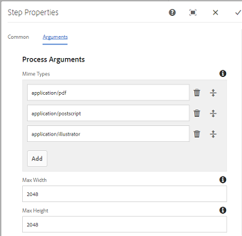
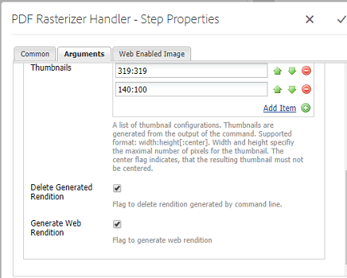
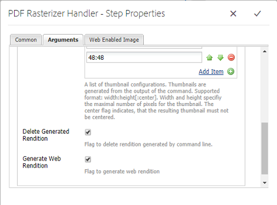

# Use PDF Rasterizer {#using-pdf-rasterizer}

When you upload large, content-intensive PDF or AI files to [!DNL Adobe Experience Manager Assets], the default library may not generate an accurate output. Adobe's PDF Rasterizer library can generate a more reliable and accurate output when compared to the output from a default library. Adobe recommends using the PDF Rasterizer library for the following scenarios:

Adobe recommends using the PDF Rasterizer library for the following:

* Heavy, content intensive AI files or PDF files.
* AI files and PDF files with thumbnails that are not generated by default.
* AI files with Pantone Matching System (PMS) colors.

Thumbnails and previews generated using PDF Rasterizer are better in quality compared to out-of-the-box output and, therefore, provide consistent viewing experience across devices. The Adobe PDF Rasterizer library does not support any color space conversion. It always outputs to RGB irrespective of the color space of the source file.

1. Install the PDF Rasterizer package on your [!DNL Adobe Experience Manager] deployment from [Software Distribution](https://experience.adobe.com/#/downloads/content/software-distribution/en/aem.html?package=/content/software-distribution/en/details.html/content/dam/aem/public/adobe/packages/cq650/product/assets/aem-assets-pdf-rasterizer-pkg-4.6.zip).

   >[!NOTE]
   >
   >The PDF Rasterizer library is available for Windows and Linux&reg; only.

1. Access the [!DNL Assets] workflow console at `https://[aem_server]:[port]/workflow`. Open [!UICONTROL DAM Update Asset] workflow.

1. To prevent the thumbnail and web rendition generation for PDF files and AI files using the default methods, follow these steps:

    * Open the **[!UICONTROL Process Thumbnails]** step, and add `application/pdf` or `application/postscript` in the **[!UICONTROL Skip Mime Types]** field under the **[!UICONTROL Thumbnails]** tab as necessary.

   

    * In the **[!UICONTROL Web Enabled Image]** tab, add `application/pdf` or `application/postscript` under **[!UICONTROL Skip List]** depending upon your requirements.

   

1. Open the **[!UICONTROL Rasterize PDF/AI Image Preview Rendition]** step, and remove the MIME type for which you want to skip the default generation of preview image renditions. For example, remove the MIME type `application/pdf`, `application/postscript`, or `application/illustrator` from the **[!UICONTROL MIME Types]** list.

   

1. Drag the **[!UICONTROL PDF Rasterizer Handler]** step from the side panel to below the **[!UICONTROL Process Thumbnails]** step.
1. Configure the following arguments for the **[!UICONTROL PDF Rasterizer Handler]** step:

    * MIME types: `application/pdf` or `application/postscript`
    * Commands: `PDFRasterizer -d -s 1280 -t PNG -i ${file}`
    * Add Thumbnail sizes: 319:319, 140:100, 48:48. Add custom thumbnail configuration, if necessary.

   The command-line arguments for the `PDFRasterizer` command can include the following:

   * `-d`: Flag to enable smooth rendering of text, vector artwork, and images. Creates better quality images. However, including this parameter causes the command to run slowly and increase the size of images.

   * `-s`: Maximum image dimension (height or width). This is converted to DPI for each page. If pages are of different size, each page can potentially scale by different amount. The default is actual page size.

   * `-t`: Output image type. Valid types are JPEG, PNG, GIF, and BMP. The default value is JPEG.

   * `-i`: Path for input PDF. It is a mandatory parameter.

   * `-h`: Help

1. To delete intermediate renditions, select **[!UICONTROL Delete Generated Rendition]**.
1. To let PDF Rasterizer generate web renditions, select **[!UICONTROL Generate Web Rendition]**.

   

1. Specify the settings in the **[!UICONTROL Web Enabled Image]** tab.

   

1. Save the workflow.
1. To enable PDF Rasterizer to process PDF pages with PDF libraries, open the **[!UICONTROL DAM Process Subasset]** model from the [!UICONTROL Workflow] console.
1. From the side panel, drag the PDF Rasterizer Handler step under the **[!UICONTROL Create Web-Enabled Image Rendition]** step.
1. Configure the following arguments for the **[!UICONTROL PDF Rasterizer Handler]** step:

    * MIME types: `application/pdf` or `application/postscript`
    * Commands: `PDFRasterizer -d -s 1280 -t PNG -i ${file}`
    * Add thumbnail sizes: `319:319`, `140:100`, `48:48`. Add custom thumbnail configuration as required.

   The command-line arguments for the `PDFRasterizer` command can include the following:

   * `-d`: Flag to enable smooth rendering of text, vector artwork, and images. Creates better quality images. However, including this parameter causes the command to run slowly and increase the size of images.

   * `-s`: Maximum image dimension (height or width). This is converted to DPI for each page. If pages are of different size, each page can potentially scale by different amount. The default is actual page size.

   * `-t`: Output image type. Valid types are JPEG, PNG, GIF, and BMP. The default value is JPEG.

   * `-i`: Path for input PDF. It is a mandatory parameter.

   * `-h`: Help

1. To delete intermediate renditions, select **[!UICONTROL Delete Generated Rendition]**.
1. To let PDF Rasterizer generate web renditions, select **[!UICONTROL Generate Web Rendition]**.

   

1. Specify the settings in the **[!UICONTROL Web Enabled Image]** tab.

   

1. Save the workflow.
1. Upload a PDF file or an AI file to [!DNL Experience Manager Assets]. PDF Rasterizer generates the thumbnails and web renditions for the file.
