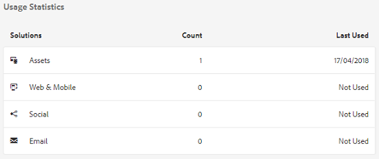
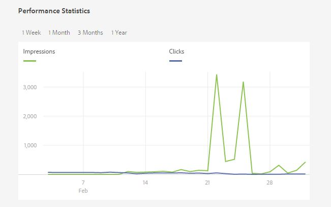
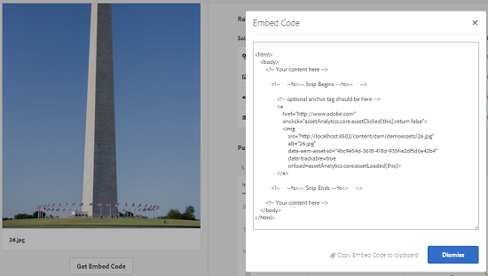

# Assets Insights {#asset-insights}

| Version | Article link |
| -------- | ---------------------------- |
| AEM as a Cloud Service  |    [Click here](https://experienceleague.adobe.com/docs/experience-manager-cloud-service/content/assets/manage/assets-insights.html?lang=en)                  |
| AEM 6.5     | This article         |

The Assets Insights feature enables you to track user ratings and usage statistics of images that are used in third-party websites, marketing campaigns, and Adobe's creative solutions. It helps derive insights regarding their performance and popularity.

[!DNL Assets] Insights captures user activity details, such as the number of times an image is rated, clicked, and impressions (number of times an image is loaded on the website). It assigns scores to images based on these statistics. You can use the scores and performance statistics to select popular images for inclusion in catalogs, marketing campaigns, and so on. You can even formulate archival and license renewal policies based on these statistics.

For [!DNL Assets] Insights to capture usage statistics for images from a website, you must include the embed code for the image in the website code.

To let Assets Insights display usage statistics for assets, first configure the feature to fetch reporting data from Adobe Analytics. For details, see [Configure Assets Insights](/help/assets/configure-asset-insights.md). To use this feature in an on-premise installation, purchase [!DNL Adobe Analytics] license separately. Customers on [!DNL Managed Services] receive [!DNL Analytics] license bundled with [!DNL Experience Manager]. See [Managed Services product description](https://helpx.adobe.com/legal/product-descriptions/adobe-experience-manager-managed-services.html).

>[!NOTE]
>
>Insights are only supported and provided for images.

## View statistics for an image {#viewing-statistics-for-an-image}

You can view the Assets Insights scores from the metadata page.

1. From the [!DNL Assets] user interface (UI), select the image and then click **[!UICONTROL Properties]** from the toolbar.
1. From the Properties page, click the **[!UICONTROL Insights]** tab.
1. Review the usage details for the asset in the **[!UICONTROL Insights]** tab. The **[!UICONTROL Score]** section describes the total asset usage and performance sores of an asset .

   Usage score describes the numbers of times asset is used in various solutions.

   The **[!UICONTROL Impressions]** score is the number of times the asset is loaded on the web site. The number displayed under **[!UICONTROL Clicks]** is the number of times the asset is clicked.

1. Review the **[!UICONTROL Usage Statistics]** section to know which entities the asset was part of and which creative solutions recently used it. The higher the usage, the greater the chances that the asset is popular among users. Usage data is displayed under the following heads:

    * **Asset**: The number of times the asset was part of a collection or compound asset
    * **Web & Mobile**: The number of times the asset was part of websites and apps
    * **Social**: The number of times the asset was used in solutions, such as Adobe Social and Adobe Campaign
    * **Email**: The number of times the asset was used in email campaigns

   

   >[!NOTE]
   >
   >Because the Assets Insights feature typically fetches the Solutions data from Adobe Analytics in a periodic manner, the Solutions section may not display the most recent data. The time period for which the data is displayed depends the schedule of the fetch operation that Assets Insights runs to retrieve Analytics data.

1. To view performance statistics for the asset graphically over a period of time, select period in the **[!UICONTROL Performance Statistics]** section. Details, including clicks and impressions are displayed as trend lines of a graph.

   

   >[!NOTE]
   >
   >Unlike the data in the Solutions section, the Performance Statistics section displays the most recent data.

1. To obtain the embed code for the asset that you include in websites to gets performance data, click **[!UICONTROL Get Embed Code]** below the asset thumbnail. For more information on how to include your Embed code in third-party web pages, see [Using Page Tracker and embed code in web pages](/help/assets/use-page-tracker.md).

   

## View aggregate statistics for images {#viewing-aggregate-statistics-for-images}

You can view scores of all assets within a folder simultaneously using **[!UICONTROL Insights View]**.

1. In the [!DNL Assets] user interface, navigate to the folder containing the assets for which you want to view insights.
1. Click Layout from the toolbar, and then choose **[!UICONTROL Insights View]**.
1. The page displays usage scores for the assets. Compare the ratings of the various assets and draw insights.

## Schedule background job {#scheduling-background-job}

Assets Insights fetches usage data for assets from Adobe Analytics report suites in a periodic manner. By default, Assets Insights runs a background job every 24 hours at 2 AM to the fetch data. However, you can modify both the frequency and the time by configuring the **[!UICONTROL Adobe CQ DAM Asset Performance Report Sync Job]** service from the web console.

1. Click the [!DNL Experience Manager] logo, and go to **[!UICONTROL Tools]** > **[!UICONTROL Operations]** > **[!UICONTROL Web Console]**.
1. Open the **[!UICONTROL Adobe CQ DAM Asset Performance Report Sync Job]** service configuration.

   

1. Specify the desired scheduler frequency and the start time for the job in the property scheduler expression. Save the changes.
