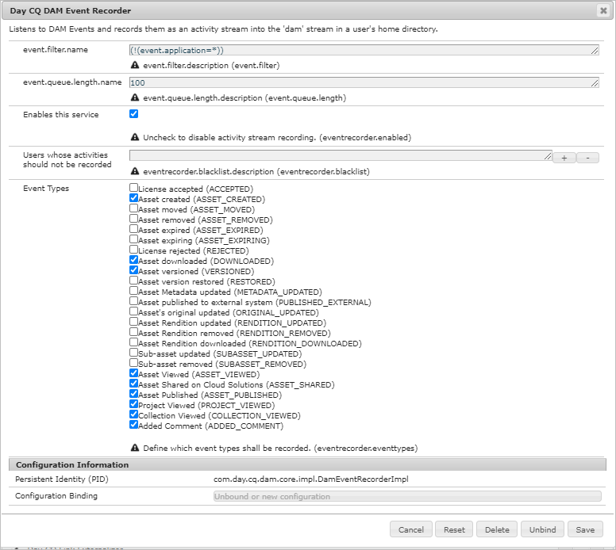
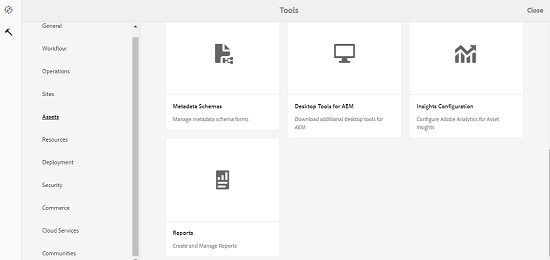
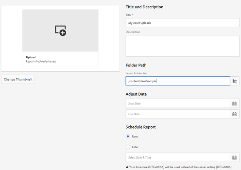
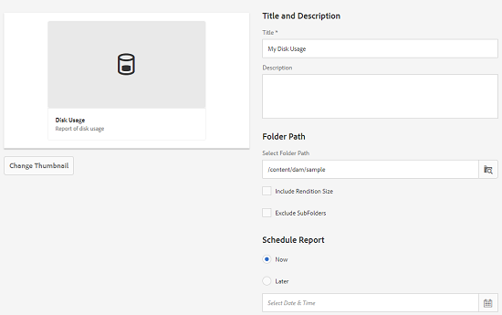
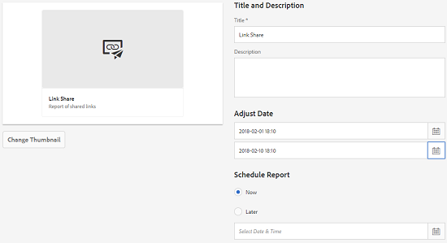

# Asset reports {#asset-reports}

| Version | Article link |
| -------- | ---------------------------- |
| AEM as a Cloud Service  |    [Click here](https://experienceleague.adobe.com/docs/experience-manager-cloud-service/content/assets/admin/asset-reports.html?lang=en)                  |
| AEM 6.5     | This article         |

Asset reporting lets you assess the utility of your [!DNL Adobe Experience Manager Assets] deployment. With [!DNL Assets], you can generate various reports for your digital assets. The reports provide useful information about your system's usage, how users interact with assets, and which assets are downloaded and shared.

Use the information in the reports to derive key success metrics to measure the adoption of [!DNL Assets] within your enterprise and by customers.

The [!DNL Assets] reporting framework uses [!DNL Sling] jobs to asynchronously process report requests in an ordered manner. It is scalable for large repositories. Asynchronous report processing increases the efficiency and speed with which reports are generated.

The report management interface is intuitive and includes fine-grained options and controls to access archived reports and view report run statuses (success, failed, and queued).

When a report is generated, you are notified through an email (optional) and an inbox notification. You can view, download, or delete a report from the report listing page, where all previously generated reports are displayed.

## Prerequisite {#prerequisite-for-reporting}

To generate reports, do the following:

* Enable [!UICONTROL Day CQ DAM Event Recorder] service from **[!UICONTROL Tools]** > **[!UICONTROL Operations]** > **[!UICONTROL Web Console]**.
* Select the activities or events that you want reporting on. For example, to generate report on downloaded assets, select [!UICONTROL Asset downloaded (DOWNLOADED)].

## Generate reports {#generate-reports}

[!DNL Experience Manager Assets] generates the following standard reports for you:

* Upload
* Download
* Expiration
* Modification
* Publish
* [!DNL Brand Portal] publish
* Disk Usage
* Files
* Link Share

[!DNL Adobe Experience Manager] administrators can easily generate and customize these reports for your implementation. An administrator can follow these steps to generate a report:

1. In [!DNL Experience Manager] interface, click **[!UICONTROL Tools]** > **[!UICONTROL Assets]** > **[!UICONTROL Reports]**.

   

1. On the [!UICONTROL Asset Reports] page, click **[!UICONTROL Create]** from the toolbar.
1. From the **[!UICONTROL Create Report]** page, choose the report you want to create and click **[!UICONTROL Next]**.

   

   >[!NOTE]
   >
   >By default, the Content Fragments and link shares are included in the Asset [!UICONTROL Download] report. Select the appropriate option to create a report of link shares or to exclude Content Fragments from the download report.

   >[!NOTE]
   >
   >The [!UICONTROL Download] report displays details of only those assets which are downloaded after selecting individually or are downloaded using Quick Action. However, it does not include the details of the assets that are inside a downloaded folder.

1. Configure report details such as title, description, thumbnail, and folder path in the CRX repository where the report is stored. By default, the folder path is `/content/dam`. You can specify a different path.

   

   Choose the date range for your report.

   You can choose to generate the report now or at a future date and time.

   >[!NOTE]
   >
   >If you choose to schedule the report later, ensure that you specify the date and time in the Date and Time fields. If you do not specify any value, the report engine treats it as a report that is to be generated instantly.

   Configuration fields may differ based on the type of report you create. For example, the **[!UICONTROL Disk Usage]** report provides options to include asset renditions when calculating the disk space used by assets. You can choose to include or exclude assets in sub-folders for disk usage calculation.

   >[!NOTE]
   >
   >The **[!UICONTROL Disk Usage]** report does not include date range fields because it indicates current disk space usage only.

   

   When you create the **[!UICONTROL Files]** report, you can include/exclude sub-folders. However, you cannot include asset renditions for this report.

   

   The **[!UICONTROL Link Share]** report displays URLs to assets that are shared with external users from within [!DNL Assets]. It includes email ids of the user who shared the assets, emails ids of users with which the assets are shared, share date, and expiration date for the link. The columns are not customizable.

   The **[!UICONTROL Link Share]** report, does not include options for sub-folders and renditions because it merely publishes the shared URLs that appear under `/var/dam/share`.

   

1. Click **[!UICONTROL Next]** from the toolbar.

1. In the **[!UICONTROL Configure Columns]** page, some columns are selected to appear in the report by default. You can select more columns. Cancel the selection of a column to exclude it in the report.

   

   To display a custom column name or property path, configure the properties for the asset binary under the `jcr:content` node in CRX. Alternatively, add it through property path picker.

   

1. Click **[!UICONTROL Create]** from the toolbar. A message notifies that report generation has been initiated.
1. On the [!UICONTROL Asset Reports] page, the report generation status is based on the current state of the report job, for example [!UICONTROL Success], [!UICONTROL Failed], [!UICONTROL Queued], or [!UICONTROL Scheduled]. The same status appears in the notifications inbox.To view the report page, click the report link. Alternatively, select the report, and click **[!UICONTROL View]** from the toolbar.

   

   Click **[!UICONTROL Download]** from the toolbar to download the report in CSV format.

## Add custom columns {#add-custom-columns}

You can add custom columns to the following reports to display more data for your custom requirements:

* Upload
* Download
* Expiration
* Modification
* Publish
* [!DNL Brand Portal] publish
* Files

To add custom columns to these reports, follow these steps:

1. In the [!DNL Manager interface], click **[!UICONTROL Tools]** > **[!UICONTROL Assets]** > **[!UICONTROL Reports]**.
1. On the [!UICONTROL Asset Reports] page, click **[!UICONTROL Create]** from the toolbar.

1. From the **[!UICONTROL Create Report]** page, choose the report you want to create and click **[!UICONTROL Next]**.
1. Configure report details such as title, description, thumbnail, folder path, and date range as applicable.

1. To display a custom column, specify the name of the column in under **[!UICONTROL Custom Columns]**.

   

1. Add the property path under the `jcr:content` node in CRXDE using the property path picker. Alternatively, type the path in the property path field.

   

   To add more custom columns, click **[!UICONTROL Add]** and repeat steps 5 and 6.

1. Click **[!UICONTROL Create]** from the toolbar. A message notifies that report generation has been initiated.

## Configure purging service {#configure-purging-service}

To remove reports that you no longer require, configure the DAM Report Purge service from the web console to purge existing reports based on their quantity and age.

1. Access the web console (configuration manager) from `https://[aem_server]:[port]/system/console/configMgr`.
1. Open the **[!UICONTROL DAM Report Purge Service]** configuration.
1. Specify the frequency (time interval) for the purging service in the `scheduler.expression.name` field. You can also configure the age and the quantity threshold for reports.
1. Save the changes.

## Troubleshooting information, tips, and limitations {#best-practices-and-limitations}

* If some reports or numbers in the reports are not available or as expected, ensure that [!UICONTROL Day CQ DAM Event Recorder] service is enabled.

* Remove the reports that are no longer required. Use the configuration options in the DAM Report Purge service to configure the criteria to purge reports.

* If the Disk Usage Report does not generate and you are using [!DNL Dynamic Media], ensure that all assets are proceed correctly. To resolve, reprocess the assets and then generate the report again.
