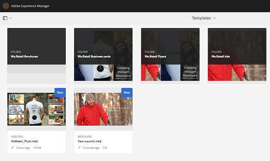
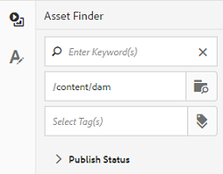
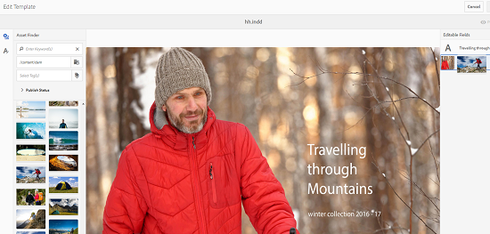
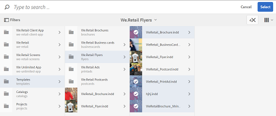
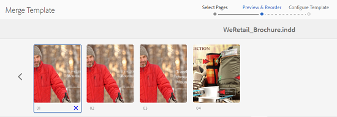

# Asset templates {#asset-templates}

Asset templates are a special class of assets that facilitate quick repurposing of visually rich content for digital and print media. An asset template includes two parts, the fixed messaging section and the editable section. The fixed messaging section can contain proprietary content, such as brand logo and copyright information that are disabled for editing. The editable section can contain visual and textual content in fields that can be edited to customize messaging.

Asset templates offer the flexibility to make limited edits while keeping global signage secure. This ability makes them ideal building blocks for quickly adapting and distributing content across various functions. Repurposing content helps reduce the cost for managing print and digital channels and deliver holistic and consistent experiences across these channels.

As a marketer, you can store and manage templates within [!DNL Experience Manager Assets] and use a single base template to create multiple personalized print experiences with ease. You can create various types of marketing collateral, including brochures, flyers, postcards, business cards, and so on, to convey your marketing message lucidly to customers. You can also assemble multi-page print outputs from existing or new print outputs. Above all, you can simultaneously deliver both digital and print experiences with ease to provide a consistent, integrated experience for users.

While asset templates are mostly [!DNL Adobe InDesign] files, proficiency in [!DNL Adobe InDesign] is not a barrier to creating stellar artifacts. You do not need to map the fields of your [!DNL Adobe InDesign] template with your product fields that you otherwise require to when creating catalogs. You can edit the templates in WYSIWYG mode directly on the web interface. However, for [!DNL Adobe InDesign] to process your editing changes, you must first configure [!DNL Experience Manager Assets] to integrate with [!DNL Adobe InDesign Server].

The ability to edit [!DNL Adobe InDesign] templates from the Web interface helps foster greater collaboration between creative and marketing personnel. The increased content velocity reduces the time-to-market for marketing collaterals.

You can achieve the following with asset templates:

* Modify editable template fields from the Web interface.
* Control the basic styling of text, for example, font size, style, and type at the tag level.
* Change images within the template using Content Picker.
* Preview template edits.
* Merge multiple template files so you can create a multi-page artifact.

When you choose a template for your collateral, [!DNL Experience Manager Assets] creates a copy of the template that you can edit. The original template is preserved, which ensures that your global signage remains intact and can be reused to enforce brand consistency.

You can export the updated file within the parent folder in INDD, PDF, or JPG formats. You can also download the output in these formats to your local file system.

## Create a collateral piece {#creating-a-collateral}

Consider a scenario where you want to create digital printable collateral, such as brochures, flyers, and ads for an upcoming campaign and share with outlet stores globally. Creating collateral based on a template helps deliver a unified customer experience across channels. Designers can create the campaign templates (single-page or multi-page) using a creative solution, such as [!DNL InDesign] and upload the templates to [!DNL Experience Manager Assets] for you. Before creating a collateral piece, have one or more INDD templates uploaded to and available in [!DNL Experience Manager] in advance.

1. In the [!DNL Experience Manager] interface, select [!UICONTROL Assets].

1. From the options, choose **[!UICONTROL Templates]**.

   

1. Select **[!UICONTROL Create]**, and then choose the collateral you want to create from the menu. For example, choose **[!UICONTROL Brochure]**.

   

1. Have one or more INDD templates uploaded to and available in [!DNL Experience Manager] in advance. Choose a template for your brochure, and click **[!UICONTROL Next]**.
1. Specify a name and an optional description for the brochure.

   

1. (Optional) Click **[!UICONTROL Tags]** and select one or more tags for the brochure. Click **[!UICONTROL Confirm]** to confirm your selection.
1. Click **[!UICONTROL Create]**. A dialog confirms that a new brochure is created. Click **[!UICONTROL Open]** to open the brochure in edit mode.

   <!-- -->

   Alternatively, close the dialog and navigate to the folder in the Templates page you started with to view the brochure you created. The type of the collateral appears on its thumbnail in card view. For example, in this case, the word [!UICONTROL Brochure] is displayed on the thumbnail.

   

## Edit a collateral piece {#editing-a-collateral}

You can edit a collateral piece immediately after you create it. Alternatively, you can open it from the [!UICONTROL Templates] page or the Asset page.

1. To open the collateral for editing, do one of the following:

    * Open the collateral (brochure in this case) you created in step 7 of [Create a collateral piece](/help/assets/asset-templates.md#creating-a-collateral).
    * From the Templates page, navigate to a folder where you created the collateral, and click the [!UICONTROL Edit] quick action on the thumbnail of a collateral piece.
    * In the asset page for the collateral, click **[!UICONTROL Edit]** from the toolbar.
    * Select the collateral and click **[!UICONTROL Edit]** from the toolbar.

   <!-- -->

   The asset finder and the text editor are displayed on the left of the page. The text editor is open by default.

   Use the text editor to modify the text you want displayed in the text field. You can modify the font size, style, color, and type at the tag level.

   To use the asset finder, you can browse or search for images within [!DNL Experience Manager Assets] and replace the editable images in the template with images of your choice.

   

   The editable images are displayed on the right. For a field to be editable in [!DNL Experience Manager Assets], corresponding field in the template must be tagged in [!DNL InDesign]. In other words, they should be marked as editable in [!DNL InDesign].

   >[!NOTE]
   >
   >Integrate your [!DNL Experience Manager] deployment with an [!DNL InDesign Server] so that [!DNL Experience Manager Assets] can extract data from the [!DNL InDesign] template and make it available for editing. For details, see [Integrate Experience Manager Assets with InDesign Server](/help/assets/indesign.md).

1. To modify the text in an editable field, click the text field from the list of editable fields and edit the text in the field.

   

   You can edit the text properties, for example, font style, color, and size using the options provided.

1. Select **[!UICONTROL Preview]** so you can preview the text changes.

1. To swap an image, select the **[!UICONTROL Asset Finder]** .

1. Select the image field from the list of editable fields and then drag a desired image from the asset picker to the editable field.

   

   You can also search for images using keywords, tags, and based on their publishing status. You can browse through the [!DNL Experience Manager Assets] repository and navigate to the location of the desired image.

   

1. Select **[!UICONTROL Preview]** so you can preview the image.
1. To edit a specific page in a multi-page collateral, use the page navigator at the bottom.

1. Select **[!UICONTROL Preview]** on the toolbar so you can preview all the changes. Select **[!UICONTROL Done]** to save the editing changes to the collateral piece.

   >[!NOTE]
   >
   >The Preview and Done options are enabled only when the editable image fields within the collateral do not have any missing icons. If there are missing icons in your collateral, it is because [!DNL Experience Manager] is unable to resolve the images in the [!DNL InDesign] template. Usually, [!DNL Experience Manager] is unable to resolve images in the following cases:
   >
   >* Images are not embedded in the underlying [!DNL InDesign] template.
   >* Images are linked from the local file system.
   >
   >To enable [!DNL Experience Manager] to resolve images, do the following:
   >
   >* Embed images while creating [!DNL InDesign] templates (See [About links and embedded graphics](https://helpx.adobe.com/indesign/using/graphics-links.html)).
   >* Mount [!DNL Experience Manager] to your local file system, and then map the missing icons with existing assets in [!DNL Experience Manager].
   >

1. To generate a PDF rendition for the brochure, select the Acrobat option in the dialog and then click **[!UICONTROL Continue]**.
1. The collateral piece is created in the folder that you started with. To view the renditions, open the collateral and choose **[!UICONTROL Renditions]** from the GlobalNav list.

   

1. Select the PDF rendition from the list of renditions so you can download the PDF file. Open the PDF file to review the collateral.

   

## Merge collateral {#merge-collateral}

1. In the [!DNL Experience Manager] interface, select [!UICONTROL Assets] on the Navigation page.

1. From the options, select **[!UICONTROL Templates]**.

1. Select **[!UICONTROL Create]**, then from the menu, select **[!UICONTROL Merge]**.

   

1. From the [!UICONTROL Template Merge] page, select **[!UICONTROL Merge]** .

1. Navigate to the location of the collateral piece that you want to merge, select the thumbnails of the collateral that you want to merge to select them.

   

   You can also search for templates from the Omnisearch box.

   You can browse through the [!DNL Experience Manager Assets] repository or collections, and navigate to the location of the desired templates and then select them to merge.

   You can apply various filters to search the desired templates. For example, you can search for templates based on file type or tags.

1. Select **[!UICONTROL Next]** from the toolbar.
1. In the **[!UICONTROL Preview & Reorder]** screen, rearrange the templates if necessary and preview the selection of templates to merge. From the toolbar, select **[!UICONTROL Next]**.

   

1. In the [!UICONTROL Configure Template] screen, specify a name for the collateral. Optionally, specify any tags that you consider appropriate. If you want to export the output in PDF format, select **[!UICONTROL Acrobat (.PDF)]**. By default, the collateral is exported in JPG and [!DNL InDesign] format. To change the display thumbnail for the multi-page collateral, click **[!UICONTROL Change Thumbnail]**.

   

1. Select **[!UICONTROL Save]**, then close the dialog box by selecting **[!UICONTROL OK]**. The multi-page collateral is created in the folder that you started with.

   >[!NOTE]
   >
   >You cannot edit a merged collateral piece later or use it to create other collateral piece.

## Best practices and limitations {#best-practices-limitations-tips}

* The [!DNL InDesign] editor in [!DNL Experience Manager] works at a tag level and all the text under a single tag is considered a single entity. To preserve text formatting and styles when editing, separately tag each paragraph (or text with different styling).
