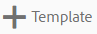
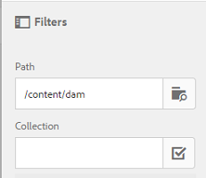

# Asset Templates {#asset-templates}

Asset templates are a special class of assets that facilitate quick repurposing of visually-rich content for digital and print media. An asset template includes two parts, the fixed messaging section and the editable section.

The fixed messaging section can contain proprietary content, such as brand logo and copyright information that are disabled for editing. The editable section can contain visual and textual content in fields that can be edited to customize messaging.

The flexibility to make limited edits while securing global signages makes asset templates ideal building blocks for quick content adaptation and distribution as content artifacts for various functions. Repurposing content helps reduce the cost for managing print and digital channels and deliver holistic and consistent experiences across these channels.

As a marketer, you can store and manage templates within AEM Assets and use a single base template to create multiple personalized print experiences with ease. You can create various types of marketing collateral, including brochures, flyers, postcards, business cards, and so on to lucidly convey your marketing message to customers. You can also assemble multi-page print outputs from existing or new print outputs. Above all, you can simultaneously deliver both digital and print experiences with ease to provide a consistent, integrated experience for users.

While asset templates are mostly InDesign files, proficiency in InDesign is not a barrier to creating stellar artifacts. You need not map the fields of your InDesign template with your product fields that you otherwise require to when creating catalogs. You can edit the templates in WYSIWYG mode directly on the web interface. However, for InDesign to process your editing changes, you must first configure AEM Assets to integrate with InDesign server.

The ability to edit InDesign templates from the web interface helps foster greater collaboration between Creative and Marketing personnel, while reducing the time to market for local promotion initiatives.

You can do the following with asset templates:

* Modify editable template fields from the web interface
* Control the basic styling of text, for example font size, style, and type at the tag level
* Change images within the template using Content Picker
* Preview template edits
* Merge multiple template files to create a multi-page artifact

When you choose a template for your collateral, AEM Assets creates a copy of the template that you can edit. The original template is preserved, which ensures that your global signage remains intact and can be reused to enforce brand consistency.

You can export the updated file within the parent folder in the following formats:

• INDD

• PDF

• JPG

You can also download the output in these formats to your local system.

## Creating a Collateral {#creating-a-collateral}

Consider a scenario where you want to create digital printable collateral, such as brochures, flyers, and ads for an upcoming campaign and share with outlet stores globally. Creating collateral based on a template helps deliver a unified customer experience across channels. Designers can create the campaign templates (single-page or multi-page) using a creative solution, such as InDesign and upload the templates to AEM Assets for you.

1. Click or tap the AEM logo, and then click/tap **[!UICONTROL Assets]** on the Navigation page.

   

1. From the options, choose **[!UICONTROL Templates]**.

   

1. Click/tap **[!UICONTROL Create]**, and then choose the collateral you want to create from the menu. For example, choose **[!UICONTROL Brochure]**.

   

1. Choose a template for your brochure, and click/tap **[!UICONTROL Next]**.

   

1. Specify a name and an optional description for the brochure.

   

1. (Optional) Click/tap the **[!UICONTROL Tags]** icon beside **[!UICONTROL Tags]** field, and select one or more tags for the brochure. Click/tap **[!UICONTROL Confirm]** to confirm your selection.

   

1. Click **[!UICONTROL Create]**. A dialog confirms that a new brochure is created. Click/tap **[!UICONTROL Open]** to open the brochure in edit mode.

   

   Alternatively, close the dialog and navigate to the folder in the Templates page you started with to view the brochure you created. The type of the collateral appears on its thumbnail in card view. For example, in this case, Brochure is displayed on the thumbnail.

   

## Editing a Collateral {#editing-a-collateral}

You can edit a collateral immediately after you create it. Alternatively, you open it from the Templates page or the asset page.

1. To open the collateral for editing, do one of the following:

    * Open the collateral (brochure in this case) you created in step 7 of [Creating a Collateral](asset-templates.md#creating-a-collateral).
    * From the Templates page, navigate to a folder where you created the collateral, and click/tap the Edit quick action on the thumbnail of a collateral.
    * In the asset page for the collateral, click/tap the Edit icon from the toolbar.
    * Select the collateral, and click/tap the Edit icon from the toolbar.

   

   The asset finder and the text editor is displayed on the left of the page. The text editor is open by default.

   You can uses the text editor to modify the text you want displayed in the text field. You can modify the font size, style, color, and type at the tag level.

   Using the asset finder, you can browse or search for images within AEM Assets and replace the editable images in the template with images of your choice.

   

   The editable are displayed on the right. For a field to be editable in AEM Assets, corresponding field in the template must be tagged in InDesign. In other words, they should be maked as editable in InDesign.

   

   >[!NOTE]
   >
   >Ensure that your AEM instance is integrated with an InDesign server to enable AEM Assets to extract data from the InDesign template and make it available for editing. For details, see [Integrating AEM Assets with InDesign Server](indesign.md).

1. To modify the text in an editable field, click/tap the text field from the list of editable fields and edit the text in the field.

   

   You can edit the text properties, for example font style, color, size using the options provided.

1. Click/tap the **[!UICONTROL Preview]** icon to preview the text changes.

   

1. To swap an image, click/tap the **[!UICONTROL Asset Finder]** icon. 

   

1. Select the image field from the list of editable fields and then drag a desired image from the asset picker to the editable field.

   

   You can also search for images using keywords, tags, and based on their publish status. You can browse through the AEM Assets repository and navigate to the location of the desired image.

   

1. Click/tap the **[!UICONTROL Preview]** icon to preview the image.

   

1. To edit a specific page in a multipage collateral, use the page navigator at the bottom. 

   

1. Click/tap the **[!UICONTROL Preview]** icon on the toolbar to preview all the changes. Click/tap **[!UICONTROL Done]** to save the editing changes to the collateral.

   >[!NOTE]
   >
   >The Preview and Done icons are enabled only when the editable image fields within the collateral do not have any missing icons. If there are missing icons in your collateral, it is because AEM is unable to resolve the images in the InDesign template. Usually, AEM is unable to resolve images in the following cases:
   >
   >* Images are not embeded in the underlying InDesign template
   >* Images are linked from the local file system
   >
   >To enable AEM to resolve images, do the following:
   >
   >* Embed images while creating InDesign templates (See [About links and embedded graphics](https://helpx.adobe.com/indesign/using/graphics-links.html)).
   >* Mount AEM to your local file system, and then map missing icons with existing AEM assets.
   >
   >For more information around working with InDesign documents, see [Best Practices for Working with InDesign Documents in AEM](https://helpx.adobe.com/experience-manager/kb/best-practices-idd-docs-aem.html).

1. To generate a PDF rendition for the brochure, select the Acrobat option in the dialog and then click **[!UICONTROL Continue]**.
1. The collateral is created in the folder you started with. To view the renditions, open the collateral and choose **[!UICONTROL Renditions]** from the GlobalNav list.

   

1. Click/tap the PDF rendition from the list of renditions to download the the PDF file. Open the PDF file to review the collateral. 

   

## Merge Collateral {#merge-collateral}

1. Click or tap **[!UICONTROL Tools > Assets]**.
1. From the options, choose **[!UICONTROL Templates]**.
1. Click/tap **[!UICONTROL Create]** and the choose **[!UICONTROL Merge]** from the menu.

   

1. From the Template Merge page, click/tap the Merge icon.

   

1. Navigate to the location of the collateral you want to merge, click/tap the thumbnails of the collateral you want to merge to select them.

   

   You can even search for templates from the OmniSearch box.

   

   You can browse through the AEM Assets repository or collections, and navigate to the location of the desired templates and then select them to merge.

   

   You can apply various filters to search the desired templates. For example, you can search for templates based on file type or tags.

   

1. Click/tap **[!UICONTROL Next]** from the toolbar.
1. In the **[!UICONTROL Preview & Reorder]** screen, rearrange the templates if required and preview the selection of templates to merge. Then, click/tap **[!UICONTROL Next]** from the toolbar.

   

1. In the Configure Template screen, specify a name for the collateral. Optionally, specify any tags that you consider appropriate. If you want to export the output in PDF format, select the **[!UICONTROL Acrobat (.PDF)]** option. By default, the collateral is exported in JPG and InDesign format. To change the display thumbnail for the multipage collateral, click/tap **[!UICONTROL Change Thumbnail]**.

   

1. Click/tap **[!UICONTROL Save]** and then click/tap **[!UICONTROL OK]** in the dialog to close the dialog. The multipage collateral is created in the folder you started with.

   >[!NOTE]
   >
   >You cannot edit a merged collateral later or use it to create other collateral.

