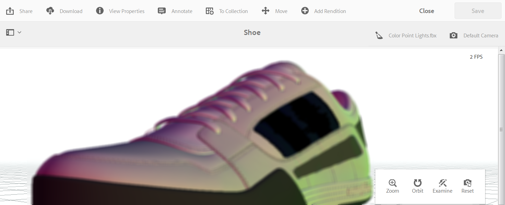

# Working with 3D assets {#working-with-d-assets}

Dynamic Media lets you upload, manage, view, and deliver 3D assets as immersive experiences. 

* One-click publishing of 3D images to generate its URL.
* Optimized support for viewing 3D assets with the high-quality, interactive Dimensional viewer preset powered by Adobe Dimension. The viewer preset includes, among other things, a collection of interactive camera controls that let you orbit, zoom, and pan.
* The 3D Media WCM component lets you easily add 3D assets to your AEM Sites pages.

There is no installation or configuration of any kind to use 3D assets in Dynamic Media.

<!-- See also [Dynamic Media 3D Release Notes](/help/release-notes/aem3d-release-notes.md). -->

## Supported 3D file formats in Dynamic Media {#supported-3d-file-formats-in-dm} 

Dynamic Media supports the following 3D file formats: 

|3D file extension |File format | MIME type |Notes |
|---|---|---|---|
| GLB |Binary GL Transmission|model/gltf-binary | Includes the textures with the asset instead of referencing them as external images.|
| OBJ |WaveFront 3D Object File|application/x-tgif ||
| STL |Stereolithography|application/vnd.ms-pki.stl ||
| USDZ |Universal Scene Description Zip archive|model/vnd.usdz+zip |Support for ingestion only; preview not available. USDZ is Apple's proprietary 3D format that can only be view by Safari or iOS.|

## Quick Start: 3D assets in Dynamic Media {#quick-start-3d}

The following step-by-step workflow description is designed to help you get up and running quickly with 3D assets in Dynamic Media - Scene7 mode. 

>[!NOTE]
>
>3D assets are not supported in Dynamic Media - Hybrid mode.

Before you work with 3D assets in Dynamic Media, make sure that your AEM administrator has already enabled and configured Dynamic Media Cloud Services in Dynamic Media - Scene7 mode.

See [Configuring Dynamic Media Cloud Services](/help/assets/config-dms7.md#configuring-dynamic-media-cloud-services) in Configuring Dynamic Media - Scene7 mode and [Troubleshooting Dynamic Media - Scene7 mode.](/help/assets/troubleshoot-dms7.md)

1. **Upload your 3D assets into Dynamic Media** by doing the following:

    * Upload your 3D assets to folders.

        * [Upload your 3D assets for use with the Dimensional viewer](/help/assets/managing-assets-touch-ui.md#uploading-assets).
        * Learn more about [Supported 3D file formats for upload in Dynamic Media](supported-3d-file-formats-in-dm).

1. **Manage your 3D assets in Dynamic Media** by doing any of the following:

    * Organize, browse, and search 3D assets

        * [Organizing digital assets](/help/assets/organize-assets.md#organize-digital-assets).

        * [Searching 3D assets](managing-assets-touch-ui.md#search-assets) and [Using custom predicates to filter search results](search-assets.md#custompredicates).

    * Preview 3D assets

        * [Previewing 3D assets](previewing-assets.md).
        * [Managing Viewer Presets](managing-viewer-presets.md).
        * [Publishing assets](publishing-dynamicmedia-assets.md).

    * Work with 3D asset metadata

        * [Editing the properties of a 3D asset such as the title, description, and tags, custom metadata fields](managing-assets-touch-ui.md#editing-properties).
        * [Managing metadata for digital assets](metadata.md).
        * [Metadata schemas](metadata-schemas.md).

1. **Publish your 3D assets in Dynamic Media** by doing one of the following:

    * If you are using Adobe Experience Manager as your web content management system you can add 3D assets directly to your web pages.

        * [Adding 3D assets to your web pages](adding-dynamic-media-assets-to-pages.md).

    * If you are using a third-party web content management system, you can link or embed 3D assets to your web pages.

        * Integrate a 3D asset using URL:
          [Linking URLs to your web application](linking-urls-to-yourwebapplication.md).

        * Integrate a 3D asset using embed code on web page:
          [Embedding the video viewer on a web page](embed-code.md).

## Uploading 3D assets for use with the Dimensional viewer {#uploading-3d-assets-for-use-with-the-dimensional-viewer}

For an uploaded asset to qualify as a spherical panorama image that you intend to use with the Panoramic Image viewer, the asset must have either one or both of the following:

* An aspect ratio of 2.
  You can override the default aspect ratio setting of 2 in CRXDE Lite at the following:
  `/conf/global/settings/cloudconfigs/dmscene7/jcr:content`

* Tagged with the keywords `equirectangular`, or `spherical`and `panorama`, or `spherical` and `panoramic`. See [Using Tags](/help/sites-authoring/tags.md).

Both the aspect ratio and keyword criteria apply to panoramic assets for the asset details page and the `Panoramic Media` WCM component.

To upload assets for use with the Panoramic Image viewer, see [Uploading Assets](/help/assets/managing-assets-touch-ui.md#uploading-assets).

<!-- ## About 3D models in Dynamic Media {#about-models-and-stages-in-aem-d}

3D in Dynamic Media lets you view and render high-quality static, stand-alone 3D assets.

Uploaded 3D files that contain lights are assumed to be a stage. You can revert such assets to be simple 3D objects by opening the asset in the asset details page. Tap **[!UICONTROL View Properties]**, then tap the **[!UICONTROL Basic]** tab. Under the Metadata heading, from the Asset Class drop-down list, select **[!UICONTROL 3D object]**.

When you create 3D assets for use in Dynamic Media, be aware of the following:

* Your 3D asset files should contain only one object, with no backgrounds, ground planes, scene lighting, or cameras.
* Place the model above the ground plane. This positioning is especially important when you view or render the assetith stages that provide a ground plane. A configuration setting is available (and enabled by default) that causes the object to be moved above the ground plane when previewing or rendering with Rapid Refine. This setting does not affect rendering with third-party renderers (for example, by way of Maya), and thus objects that are not located above the ground plane may be partially hidden.  
* Position the model so that it is reasonably centered laterally around the coordinate system origin (0,0,0). Doing so ensures a good interactive viewing experience for you.
* Other than texture maps, external file references are supported. Therefore, you must embed any referenced content in the primary model file before you upload it into AEM.  

  See [About the uploading and processing of 3D assets in AEM](upload-processing-3d-assets.md).

* The general scene lighting is provided by the stage. As such, Adobe does not recommend that you include lights with 3D model files. You can include lights in the model. However, they must be specific to the model only. For example, it may be necessary to include additional lighting to brighten a part of the object that is obscured by other parts. Therefore, it would not be sufficiently visible with just the stage lights.  

## Supported 3D files in Dynamic Media {#supported-files-in-aem-d}

A typical 3D asset has a primary model file and none or more referenced files. Referenced files include such things as texture maps or **IBL (Image-Based Lighting)** images.

### About the primary 3D model file {#about-the-primary-d-model-file}

The primary 3D model file contains the actual 3D model geometry and definitions for the (default) materials that are applied to the model surfaces. AEM 3D supports the following primary 3D model file formats:

* Wavefront OBJ file format (`.obj`)  

  The OBJ format requires one or more separate, external MTL files (Material Template Library) (`.mtl`).

* Autodesk FBX (Filmbox) file format (`.fbx`)  

  The Autodesk 3D file interchange format; both binary and ASCII formats.  

  When you create FBX files in third-party applications, Adobe recommends the following configuration settings (see table below). These settings can help you achieve the best results for 3D files that you intend to use in AEM. The option names are taken from the **[!UICONTROL Autodesk Maya FBX Export Options]** dialog box.

<table> 
 <tbody> 
  <tr> 
   <td><strong>Option in Autodesk Maya FBX Export dialog box</strong></td> 
   <td><strong>Description</strong></td> 
  </tr> 
  <tr> 
   <td>Preserve References  </td> 
   <td>
Deselect.
 
AEM 3D currently does not support external references.
 </td> 
  </tr> 
  <tr> 
   <td>Smooth Mesh  </td> 
   <td>Select.</td> 
  </tr> 
  <tr> 
   <td>Convert NURBS surfaces to</td> 
   <td><strong>Software Render Mesh</strong></td> 
  </tr> 
  <tr> 
   <td>Animation</td> 
   <td>
Select or deselect.
 
If you choose to select this option, AEM 3D ignores the animation information in the file.
 </td> 
  </tr> 
  <tr> 
   <td>Cameras</td> 
   <td>
Select for <strong>3D stages</strong>.
 
Deselect for 3D models.
 </td> 
  </tr> 
  <tr> 
   <td>Lights</td> 
   <td>
Select for <strong>3D stages</strong>.
 
Deselect for <strong>3D models</strong>.
 </td> 
  </tr> 
  <tr> 
   <td>Units - Automatic</td> 
   <td>Select. AEM 3D converts on import.</td> 
  </tr> 
  <tr> 
   <td>Axis Conversion - Up Axis</td> 
   <td>
<strong>Y-up</strong>
 
Y-up gives consistent results when you export from Maya and is the preferred coordinate system for FBX files in this AEM 3D release.
 </td> 
  </tr> 
  <tr> 
   <td>Embed Media</td> 
   <td>Both options are supported. If embedded is selected, AEM 3D extracts the embedded media to an adjacent folder that has the same name as the model file with <code>.fbm</code> appended to it.</td> 
  </tr> 
  <tr> 
   <td>FBX File Format - Type</td> 
   <td>Both <strong>Binary </strong>or <strong>ASCII </strong>are supported.</td> 
  </tr> 
  <tr> 
   <td>FBX File Format - Version</td> 
   <td>FBX 2014/2015 is recommended. Other versions may also work fine.</td> 
  </tr> 
 </tbody> 
</table>
 -->

<!-- The following additional file formats are supported if Autodesk Maya is installed and configured on AEM authoring servers:

* Autodesk Maya  

  Both ASCII `.ma` and binary `.mb` formats.

* `Jupiter Tesselation (ISO 14306-1).jt`.  

  An industry-standard CAD data exchange, collaboration, and product visualization format. -->

<!-- ### Support for texture map files {#support-for-texture-map-files}

Material definitions in 3D model files can include references to external image files that provide texture maps. AEM 3D supports the following types of texture map files:

* Diffuse color textures
* Specular color textures
* Ambient color textures
* Displacement paps (also called Bump maps)
* Normal maps
* Opacity maps
* Roughness maps (also called Gloss, Reflectivity, or Cosine Power maps)

Materials in the primary 3D model file can reference other types of maps which are ignored in Dynamic Media. -->

<!-- ### IBL (Image-Based Lighting) images {#ibl-image-based-lighting-images}

A 3D model file that defines a stage can reference a single IBL environment image. Currently, AEM 3D supports only 32-bit TIFF images in latitude/longitude format for diffuse IBL and for reflections. For the spherical scene background, 8-bit RGB images are also supported.

See [About working with IBL stages](working-with-ibl-stages.md). -->

>[!NOTE]
>
>File references that are present in the primary 3D model file are currently ignored. Dynamic Media does not support references to secondary 3D model files.
>
><!-- Y-up is the preferred coordinate system for FBX files this release. -->

<!-- ## Material shading in a primary 3D model file {#material-shading-in-a-primary-d-model-file}

The original native model file can contain material definitions that are used with shaders such as Blinn, Lambert, or with procedural shaders. These potentially complex materials are supported only when you render using the corresponding native application (such as Autodesk Maya).

For viewing purposes or when you render using the default Rapid Refine™ renderer, all materials are either simplified, substituted, or both so they can be used with a Phong-like shader. This shader supports a limited set of attributes. Other attributes in the material definition are ignored. -->

<!-- See [Viewing 3D assets](viewing-3d-assets.md). -->

<!-- See [Rendering 3D assets](rendering-3d-assets.md). -->

<!-- ## Naming materials in a primary 3D model file {#naming-materials-in-a-primary-d-model-file}

A *surface* is defined as the surface area of a 3D model covered by the same material. This material also provides the name for the surface. As such, Adobe recommends that you name the materials included in primary 3D model files accordingly. For example, the use of specific names such as "Body", "Windows", "Tires", or "Rims" is preferred to the use of vague names such as "Red", "Glass", "Rubber", "Aluminum". -->

# Viewing 3D assets {#viewing-d-assets}

This section describes both how to view 3D assets in asset details and how to view assets that are in the 3D Media component in sites.

## Viewing 3D assets in the Asset Details page {#viewing-d-assets-in-the-asset-details-page}

The interactive 3D viewer is available from the asset details page in AEM. The viewer includes, among other things, a collection of interactive camera controls that let you orbit, zoom, and pan the 3D asset.

Besides using the default stages in AEM 3D, you can also use stages that you have created in a third-party application and uploaded into AEM.

See [About the use of stages in AEM 3D](about-the-use-of-stages-in-aem-3d.md).

>[!NOTE]
>
>To view a 3D asset, your device or desktop browser must be WebGL-enabled. Also, the underlying graphics hardware must have sufficient capabilities and memory to render models of the desired size and complexity. Certain preview features, such as cast shadow, are not available on all browsers.

### Performance considerations when you view 3D assets {#performance-considerations-when-you-view-d-assets}

The time it takes to open a 3D asset in the asset details page view depends on several factors. These factors include such things as the following:

* Bandwidth and latencies to the server.
* Model size (number of faces).
* Number and size of maps.
* Complexity of the stage. For example, the size of the IBL image.

In addition, the capabilities of the client computer-such as a workstation, notebook, or mobile touch device-are also important to consider when you manipulate the camera interactively. A reasonably powerful system with good graphics capabilities can make the interactive 3D viewing experience smoother and more favorable.

**To view 3D assets**:

1. Make sure you have uploaded 3D assets into AEM. 
   
   See [About the uploading and processing of 3D assets in AEM](upload-processing-3d-assets.md).

1. From AEM, on the **[!UICONTROL Navigation]** page, tap **[!UICONTROL Assets]**.
1. Near the upper-right corner of the page, from the **[!UICONTROL View]** drop-down list, tap **[!UICONTROL Card View]**.
1. Navigate to a 3D asset that you want to view.
1. Tap the card of the 3D asset to open it in the asset details page.  
1. Do any of the following:

   * In the lower-right corner of the asset details page, use the camera control palette to change various views of the asset.
  
      If you use a non-touch input device without a scroll wheel, such as a classic Apple single-button mouse, you can still change the zoom or perspective of a 3D asset, while in each respective mode. You accomplish the action by pressing and holding down the `SHIFT`key while depressing the mouse button and dragging up or down.  

      When using a touch pad on a typical notebook computer, it is often difficult to control the zoom or perspective behaviors with the two-finger gesture. In such cases, you can press and hold down `SHIFT`during the action. This kind of effort reduces the velocity of the pinch gesture and makes it easier to achieve the exact zoom level or perspective that you want. Alternately, you can use a one finger drag up or down while the `SHIFT`key is pressed to affect zoom or perspective behaviors.

    <table> 
    <tbody> 
      <tr> 
      <td><strong>Camera control name</strong>  </td> 
      <td><strong>Description</strong></td> 
      </tr> 
      <tr> 
      <td>
Zoom
 
or
 
Persp
 </td> 
      <td>
Tap or click to toggle between Zoom and Perspective modes.
 
Or, press and hold down the <code>ALT/OPTION</code> key during the action to temporarily toggle to Perspective  mode. Release the key to revert to Zoom mode.
 
      <ul> 
      <li><strong>Zoom</strong>-Dolly in and out behavior which moves the camera closer or further away from the asset  that you are viewing. Zoom is the default behavior for the scroll wheel on a mouse (if available0, for two-finger pinch gestures on mobile devices, or when you hold down the Shift key while dragging up or down using the left mouse button.</li> 
      <li><strong>Perspective</strong>-Changes the focal length (also known as field-of-view) of the camera while maintaining the relative size of the asset in the view. Perspective is the alternate behavior for the scroll wheel (if available), for two-finger pinch gestures on mobile devices, or when you hold down the Shift key while dragging up or down using the left mouse button.</li> 
      </ul> </td> 
      </tr> 
      <tr> 
      <td>
Orbit
 
or
 
Pan
 </td> 
      <td>
Tap or click to toggle between Orbit and Pan modes.
 
Or, press and hold the <code>ALT/OPTION</code> key during the action to temporarily toggle to Pan mode. Release the key to revert to Orbit mode.
 
      <ul> 
      <li><strong>Orbit</strong>- Moves the viewing camera on a sphere centered on a target point which is located near the center of the 3D asset be default. Orbit is the default behavior for a left-button drag or a single touch drag on mobile devices.</li> 
      <li><strong>Pan</strong>-Moves the camera in the viewing plane. The target point is moved correspondingly, so subsequent orbit actions will move the camera around a new target point. Pan is the alternate behavior for the left-button drag and single touch drag.</li> 
      </ul> </td> 
      </tr> 
      <tr> 
      <td>
Examine
 
or
 
Target
 </td> 
      <td>
Tap or click to toggle between Examine and Target modes.
 
      <ul> 
      <li><strong>Examine</strong>-Tap or click to enter Target mode.</li> 
      <li><strong>Target</strong>-Tap or click a point anywhere on the 3D asset to center the view on that part of the asset.  Orbit actions use the new target point.</li> 
      </ul> </td> 
      </tr> 
      <tr> 
      <td>Reset</td> 
      <td>Tap or click to restore the view target point to the center of the model. Reset also moves the camera  closer or further away to show the asset in its entirety and at a reasonable viewing size.</td> 
      </tr> 
    </tbody> 
    </table>

    * Near the upper-right corner of the asset details page, tap the **[!UICONTROL Stage Selector]** icon. Select a stage name with the background and lighting that you want to apply to the 3D asset.

   

   Stages provide the environment-background, ground plane, and lighting-in which the 3D model is viewed. 

   See [About the use of stages in AEM 3D](about-the-use-of-stages-in-aem-3d.md).

    * Near the upper-right corner of the asset details page, tap the **[!UICONTROL Camera Selector]** icon, then select a camera view that you want to apply to the 3D asset.

   

   Stages often provide pre-defined cameras. You can re-select the current camera to restore it to its pre-defined settings. 

   See [About the use of stages in AEM 3D](about-the-use-of-stages-in-aem-3d.md).

1. In the upper-right corner of the page, tap **[!UICONTROL Save]**.
1. Do one of the following:

    * Render the 3D asset.  

      See [Rendering 3D assets](rendering-3d-assets.md).
  
    * In the upper-right corner of the page, tap **[!UICONTROL Close]** to return to the Assets page.

## Viewing 3D assets in the Sites 3D component {#viewing-d-assets-in-the-sites-d-component}

>[!NOTE]
>
>This section applies only to the classic webGL viewer used for 3D asset types other than Adobe Dimension.

Depending on the type of device, you access the 3D component features in a variety of ways.

For more information, see the following:

* [Touchscreen devices](#touchscreen-devices)
* [Touchpad devices](#touchpad-devices)
* [Mouse and trackball devices](#mouse-and-trackball-devices)

See also [Previewing a web page that has a 3D component](using-the-3d-sites-component.md#previewing-a-web-page-that-has-a-d-component).

 

### Touchscreen devices {#touchscreen-devices}

To work with 3D components with touchscreen devices:

1. Use a one-finger drag or swipe to move ("orbit") the viewpoint ("camera") around the object. You can view the object from any direction.  

1. Use a two-finger pinch to move the camera closer to or farther away from the object. This action is similar to zooming in or out and lets you inspect details on the object. Alternatively, press and hold the + or - buttons to move the camera closer or farther away from the object.  

1. Use a two-finger drag to pan the camera. This action moves the camera laterally to let you look at different parts of the object while zoomed in. Alternatively, tap the **[!UICONTROL Orbit/Pan Toggle]** button to toggle to Pan mode, then use a one-finger drag to pan the camera. Tap the **[!UICONTROL Orbit/Pan Toggle]** button to revert to **[!UICONTROL Orbit]** mode.  

1. Tap **[!UICONTROL Reset Viewer]** to reset the camera. This action brings the object back into full view and, if enabled, resumes auto-spin.  

1. Tap **[!UICONTROL Full Screen]** to enter full-screen mode (if supported by the device). Tap **[!UICONTROL Full Screen]** again to restore the 3D viewer to page-embedded mode.

### Touchpad devices {#touchpad-devices}

To work with 3D components with touchpad devices:

1. Use a one-finger drag while holding the (left) touchpad button down to move ("orbit") the viewpoint ("camera") around the object. You can view the object from any direction.  

1. Use a two-finger drag down or up with touchpad buttons up to move the camera closer to or farther away from the object. This action is similar to zooming in or out and allows inspecting details on the object. Alternatively, click and hold the **[!UICONTROL Zoom In]** or **[!UICONTROL Zoom Out]** buttons to move the camera closer or farther away from the object.  

1. Use a one-finger drag while holding the **ALT/option** key and the (left) touchpad button to pan the camera. This action moves the camera laterally to let you look at different parts of the object while zoomed in. Alternatively, click the **[!UICONTROL Orbit/Pan Toggle]** button to toggle to **[!UICONTROL Pan]** mode, then use a one-finger drag while holding the (left) button to pan the camera. Click the **[!UICONTROL Orbit/Pan Toggle]** button again to revert to **[!UICONTROL Orbit]** mode.  

1. Click **[!UICONTROL Reset Viewer]** to reset the camera. This action brings the object back into full view and, if enabled, resumes auto-spin.  

1. Click **[!UICONTROL Full Screen]** to enter full-screen mode. Use the **Escape** key on your keyboard or click **[!UICONTROL Full Screen]** again to restore the 3D viewer to page-embedded mode.

### Mouse and trackball devices {#mouse-and-trackball-devices}

To work with 3D components with mouse and trackball devices:

1. Drag while holding the left mouse button down to move ("orbit") the viewpoint ("camera") around the object. You can view the object from any direction.  

1. Use the scroll wheel to move the camera closer to or farther away from the object. This is similar to zooming in or out and lets you inspect details on the object. Alternatively, click and hold the **[!UICONTROL Zoom In]** or **[!UICONTROL Zoom Out]** buttons to move the camera closer or farther away from the object.  

1. Drag while holding the **ALT/option** key and the left mouse button to pan the camera. This moves the camera laterally to allow looking at different parts of the object while zoomed in. Alternatively, click the **[!UICONTROL Orbit/Pan Toggle]** button to toggle to **[!UICONTROL Pan]** mode, then drag while holding the left mouse button to pan the camera. Click the **[!UICONTROL Orbit/Pan Toggle]** again to revert to **[!UICONTROL Orbit]** mode.
1. Click **[!UICONTROL Reset Viewer]** to reset the camera. This action brings the object back into full view and, if enabled, resumes auto-spin.
1. Click **[!UICONTROL Full Screen]** to enter full-screen mode. Use the **[!UICONTROL Escape]** key on your keyboard or click **[!UICONTROL Full Screen]** again to restore the 3D viewer to page-embedded mode.

# Working with the 3D Sites component {#working-with-the-d-sites-component}

AEM 3D includes an AEM Sites component that you can use to implement interactive viewing of 3D models on web pages.

After you have added your 3D component, you can [view the 3D asset in that component.](viewing-3d-assets.md)

## Adding the 3D component to the page template {#adding-the-d-component-to-the-page-template}

You must enable the 3D component in the page before you can place it on a page. See [Editing templates](/help/sites-authoring/templates.md#editing-a-template-layout-template-author) for detailed information on enabling components in templates.

**Adding the 3D component to the page template**:

1. Navigate to **[!UICONTROL Tools > General > Templates]**.  

1. Navigate to the page template that you want to enable the 3D component in and select the template.  

1. Tap **[!UICONTROL Edit]** to open the template.
1. Near the upper-right of the page, in the drop-down menu, select **[!UICONTROL Structure]** mode, if it is not already active.

   

1. Tap in the **[!UICONTROL Layout Container]** region to select it.  

1. Tap the **[!UICONTROL Policy]** button to open the **[!UICONTROL Policy Editor]**.
1. In the **[!UICONTROL Properties]** section, select the **[!UICONTROL 3D]** checkmark, and then tap **[!UICONTROL Done]** to save the changes and close the **[!UICONTROL Policy Editor]**.

   You can now place the 3D Sites component on all pages that use this template.

## Adding the 3D viewer component to a web page {#adding-the-d-viewer-component-to-a-web-page}

>[!CAUTION]
>
>This version of AEM 3D supports only one instance of the 3D component on each web page. Multiple 3D components on the same page do not function properly.

**To add the 3D viewer component to a web page**:

1. Open AEM Sites and select the web page to which you want to add the 3D component.  

1. Tap the **[!UICONTROL Edit]** (pencil) icon to open the page into the page editor. Make sure **[!UICONTROL Edit]** mode near the top right of page is selected.

   

1. Tap the rail selector to open the side panel.  

1. Tap the plus sign icon to open the **[!UICONTROL Components]** list.  

1. Drag the **[!UICONTROL 3D Viewer]** component from the **[!UICONTROL Components]** list to the location on the page where you want the 3D viewer to appear.

## Configuring the 3D component {#configuring-the-d-component}

1. In the AEM Sites page editor, select the **[!UICONTROL 3D Viewer]** component that you previously added to the page.  

1. Tap the **[!UICONTROL Configuration]** icon (wrench) to open the component configuration dialog box.

   You can set the following component properties:

   <table> 
    <tbody> 
    <tr> 
    <td>Property</td> 
    <td>Description</td> 
    <td>Applicability</td> 
    </tr> 
    <tr> 
    <td>Height (px)</td> 
    <td>Specify the desired height of the 3D component in pixels. If left empty, the default is 600 pixels.</td> 
    <td> </td> 
    </tr> 
    <tr> 
    <td>Stage Name</td> 
    <td>
Select a 3D Stage from the list of available stages. The stage provides background and lighting.
 
See <a href="/help/assets/about-the-use-of-stages-in-aem-3d.md" target="_blank">About the use of stages in AEM 3D Sites</a>.
 </td> 
    <td>Ignored for Adobe Dimension assets.</td> 
    </tr> 
    <tr> 
    <td>Auto-spin Speed (RPM)</td> 
    <td>
The 3D viewer orbits the camera continuously after load and reset. Auto-spin terminates when the user initiates a manual orbit action.
 
You can specify the spin speed in RPM using the following values:
 
        <ul> 
        <li>Set a positive value to spin right</li> 
        <li>Set a negative value to spin left</li> 
        <li>Set a 0 value to disable auto-spin.</li> 
        </ul> 
The default is 3 RPM, equivalent to 20 seconds per full revolution.    <strong>Note:</strong> The spin speed assumes a 60/sec frame rate. This rate is typically achieved with small to moderately-sized models on more powerful graphics hardware. Larger models or slower devices auto-spin at lower rates.
 </td> 
    <td>Ignored for Adobe Dimension assets.</td> 
    </tr> 
    <tr> 
    <td>Navigation Button Color</td> 
    <td>Use the color picker to choose the primary color for the viewer's control buttons.</td> 
    <td>Ignored for Adobe Dimension asses.</td> 
    </tr> 
    <tr> 
    <td>Navigation Hover Color</td> 
    <td>Use the color picker to choose the hover/selected color for the viewer's control buttons.</td> 
    <td>Ignored for Adobe Dimension assets.</td> 
    </tr> 
    <tr> 
    <td>Show Swatches</td> 
    <td>For future use.</td> 
    <td>Ignored for Adobe Dimension assets.</td> 
    </tr> 
    <tr> 
    <td>Show GLTF Camera Presets</td> 
    <td>Show or hide the camera presets which may be present in Adobe Dimension assets.</td> 
    <td>For Adobe Dimension assets only.</td> 
    </tr> 
    <tr> 
    <td>GLTF Background Color</td> 
    <td>Default background color if the 3D model does not include a background.</td> 
    <td>For Adobe Dimension assets only.</td> 
    </tr> 
    </tbody> 
   </table>

1. Tap the check mark to save your changes.

   In addition to the settings available in the component configuration dialog, a number of global configuration settings are available which can be modified by way of the CRXDE Lite.
   See [Advanced Configuration Settings](advanced-config-3d.md) for detailed information on these global settings.

## Assigning a 3D model to the component {#assigning-a-d-model-to-the-component}

1. In the AEM Sites page editor, click the **[!UICONTROL Assets]** icon to open the Assets list in the side panel.  

1. Select the **[!UICONTROL 3D Models]** filter to hide unwanted asset types.

   

1. Search for or scroll to the 3D asset that you want to view on the page being edited.  

1. Drag the 3D asset from the **[!UICONTROL Assets]** list to the **[!UICONTROL 3D Viewer]** component previously placed on the page.

   Adobe Dimension assets are rendered using new viewer technology based on the glTF open standard, while all other 3D asset types rely on the classic AEM 3D webGL viewer. The component automatically selects the appropriate viewer based on the type of the 3D model.

## Previewing a web page that has a 3D component {#previewing-a-web-page-that-has-a-d-component}

While the web page is in **[!UICONTROL Edit]** mode, the 3D component displays the 3D model but no interaction with the model is possible.

You can preview the web page in the page editor with full access to the functionality of the 3D component.

See also [Viewing 3D assets in the Sites 3D component](viewing-3d-assets.md#viewing-d-assets-in-the-sites-d-component).

**To preview a web page that has a 3D component**:

1. Do either one of the following:

    * Near the upper-right of the page, click **[!UICONTROL Preview]** to enter preview mode.
    * Delete `/edit.html` from the page URL in the browser.

## Publishing the page and assets {#publishing-the-page-and-assets}

See [Publishing Assets](managing-assets-touch-ui.md) for information on how to publish assets. See [Publishing Pages](/help/sites-authoring/publishing-pages.md) for information on how to publish pages.

>[!NOTE]
>
>Using the **[!UICONTROL Publish Page]** menu item on the **[!UICONTROL Page Information]** menu will publish the page and all primary page dependencies. Secondary dependencies that may be referenced by the 3D model and/or the 3D stage, such as texture maps and IBL images, are not published when you publish the page in this way.
>
>Adobe recommends that you publish all 3D assets and their dependencies directly from AEM Assets, before publishing the web page that references these assets.