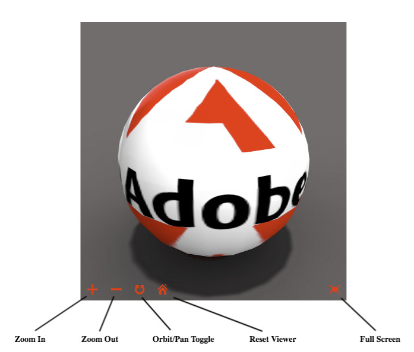

# Working with 3D assets in Dynamic Media {#working-with-three-d-assets-dm}

Dynamic Media lets you upload, manage, view, and deliver 3D assets as immersive experiences. 

* One-click publishing (using **[!UICONTROL Quick Publish]** on the toolbar) of 3D images to generate its URL.
* Optimized support for viewing 3D assets with the high-quality, interactive Dimensional viewer preset powered by Adobe Dimension. The viewer preset includes, among other things, a collection of interactive camera controls that let you orbit, zoom, and pan.
* The 3D Media WCM component lets you easily add 3D assets to your AEM Sites pages.

There is no installation or configuration of any kind to use 3D assets in Dynamic Media.

<!-- See also [Dynamic Media 3D Release Notes](/help/release-notes/aem3d-release-notes.md). -->

## Supported 3D file formats in Dynamic Media {#supported-three-d-file-formats-in-dm} 

Dynamic Media supports the following 3D file formats: 

|3D file extension |File format | MIME type |Notes |
|---|---|---|---|
| GLB |Binary GL Transmission|model/gltf-binary | Includes the textures with the asset instead of referencing them as external images.|
| OBJ |WaveFront 3D Object File|application/x-tgif ||
| STL |Stereolithography|application/vnd.ms-pki.stl ||
| USDZ |Universal Scene Description Zip archive|model/vnd.usdz+zip |Support for ingestion only; preview not available. USDZ is Apple's proprietary 3D format that can only be view by Safari or iOS.|

## Quick Start: 3D assets in Dynamic Media {#quick-start-three-d}

The following step-by-step workflow description is designed to help you get up and running quickly with 3D assets in Dynamic Media - Scene7 mode. 

>[!NOTE]
>
>3D assets are not supported in Dynamic Media - Hybrid mode.

Before you work with 3D assets in Dynamic Media, make sure that your AEM administrator has already enabled and configured Dynamic Media Cloud Services in Dynamic Media - Scene7 mode.

See [Configuring Dynamic Media Cloud Services](/help/assets/config-dms7.md#configuring-dynamic-media-cloud-services) in Configuring Dynamic Media - Scene7 mode and [Troubleshooting Dynamic Media - Scene7 mode.](/help/assets/troubleshoot-dms7.md)

1. **Upload your 3D assets into Dynamic Media** by doing the following:

    * Upload your 3D assets to folders.

        * [Upload your 3D assets for use with the Dimensional viewer](/help/assets/managing-assets-touch-ui.md#uploading-assets).
        * Learn more about [Supported 3D file formats for upload in Dynamic Media](supported-three-d-file-formats-in-dm).

1. **Manage your 3D assets in Dynamic Media** by doing any of the following:

    * Organize, browse, and search 3D assets

        * [Organizing digital assets](/help/assets/organize-assets.md#organize-digital-assets).

        * [Searching 3D assets](managing-assets-touch-ui.md#search-assets) and [Using custom predicates to filter search results](search-assets.md#custompredicates).

    * Preview 3D assets

        * [Viewing 3D assets](#viewing-three-d-assets.md).
        * [Managing Viewer Presets](managing-viewer-presets.md).
        * [Publishing assets](publishing-dynamicmedia-assets.md).

    * Work with 3D asset metadata

        * [Editing the properties of a 3D asset such as the title, description, and tags, custom metadata fields](managing-assets-touch-ui.md#editing-properties).
        * [Managing metadata for digital assets](metadata.md).
        * [Metadata schemas](metadata-schemas.md).

1. **Publish your 3D assets in Dynamic Media** by doing one of the following:

    * If you are using Adobe Experience Manager as your web content management system you can add 3D assets directly to your web pages.

        * [Adding 3D assets to your web pages](adding-dynamic-media-assets-to-pages.md).

    * If you are using a third-party web content management system, you can link or embed 3D assets to your web pages.

        * Integrate a 3D asset using URL:
          [Linking URLs to your web application](linking-urls-to-yourwebapplication.md).

        * Integrate a 3D asset using embed code on web page:
          [Embedding the video viewer on a web page](embed-code.md).

>[!NOTE]
>
>File references that are present in the primary 3D model file are currently ignored. Dynamic Media does not support references to secondary 3D model files.

# Viewing 3D assets {#viewing-three-d-assets}

This section describes both how to view 3D assets in asset details and how to view assets that are in the 3D Media component in Sites.

## Viewing 3D assets in the Asset Details page {#viewing-three-d-assets-in-the-asset-details-page}

The interactive 3D viewer is available from the asset details page in AEM. The viewer includes, among other things, a collection of interactive camera controls that let you orbit, zoom, and pan the 3D asset.

Be aware that the time it takes to open a 3D asset in the Asset Details page view depends on several factors. These factors include such things as the following:

* Bandwidth to the server.
* Latencies to the server
* Complexity of the image.

In addition, the capabilities of the client computer-such as a workstation, notebook, or mobile touch device-are also important to consider when you manipulate the camera interactively. A reasonably powerful system with good graphics capabilities can make the interactive 3D viewing experience smoother and more favorable.

**To view 3D assets in the Asset Details page**

1. Make sure you have uploaded 3D assets into AEM. 
   
   See [About the uploading and processing of 3D assets in AEM](upload-processing-3d-assets.md).

1. From AEM, on the **[!UICONTROL Navigation]** page, tap **[!UICONTROL Assets > Files]**.
1. Near the upper-right corner of the page, from the **[!UICONTROL View]** drop-down list, tap **[!UICONTROL Card View]**.
1. Navigate to a 3D asset that you want to view.
1. Tap the card of the 3D asset to open it in the asset details page.  
1. On the details view page for the 3D asset, do any of the following:

    * **Turn your camera** &ndash; Orbit your view around the 3D scene and objects.
      * _Mouse_: Left click + drag.
      * _Touch screen_: Single-finger press + drag.
    * **Pan your camera** &ndash; Pan your view left, right, up, or down.
      * _Mouse_: Right click + drag.
      * _Touch screen_: Two-finger press + drag.
    * **Zoom your camera** &ndash; Zoom your camera to move in and out of areas of the 3D scene.
      * _Mouse_: Scroll wheel.
      * _Touch screen_: Two-finger pinch.
    * **Recenter your camera** &ndash; Recenter your camera to a point on a object in the 3D scene.
      * _Mouse_: Double-click.
      * _Touch screen_: Double-tap.
    * **Reset** &ndash; Near the lower-right corner of the page, tap the Reset icon to restore the view target point to the center of the 3D asset. Reset also moves the camera closer or further away to show the asset in its entirety and at a reasonable viewing size.
    * **Full screen mode** &ndash; To enter full screen mode, in the lower-right corner of the page, tap the Fullscreen icon.

1. In the upper-right corner of the page, tap **[!UICONTROL Close]** to return to the Assets page.

## Viewing 3D assets in the Sites 3D component {#viewing-three-d-assets-in-the-sites-three-d-media-component}

>[!NOTE]
>
>This section applies only to the classic webGL viewer used for 3D asset types other than Adobe Dimension.

Depending on the type of device, you access the 3D component features in a variety of ways.

For more information, see the following:

* [Touchscreen devices](#touchscreen-devices)
* [Touchpad devices](#touchpad-devices)
* [Mouse and trackball devices](#mouse-and-trackball-devices)

See also [Previewing a web page that has a 3D component](using-the-3d-sites-component.md#previewing-a-web-page-that-has-a-d-component).

 

### Touchscreen devices {#touchscreen-devices}

To work with 3D components with touchscreen devices:

1. Use a one-finger drag or swipe to move ("orbit") the viewpoint ("camera") around the object. You can view the object from any direction.  

1. Use a two-finger pinch to move the camera closer to or farther away from the object. This action is similar to zooming in or out and lets you inspect details on the object. Alternatively, press and hold the + or - buttons to move the camera closer or farther away from the object.  

1. Use a two-finger drag to pan the camera. This action moves the camera laterally to let you look at different parts of the object while zoomed in. Alternatively, tap the **[!UICONTROL Orbit/Pan Toggle]** button to toggle to Pan mode, then use a one-finger drag to pan the camera. Tap the **[!UICONTROL Orbit/Pan Toggle]** button to revert to **[!UICONTROL Orbit]** mode.  

1. Tap **[!UICONTROL Reset Viewer]** to reset the camera. This action brings the object back into full view and, if enabled, resumes auto-spin.  

1. Tap **[!UICONTROL Full Screen]** to enter full-screen mode (if supported by the device). Tap **[!UICONTROL Full Screen]** again to restore the 3D viewer to page-embedded mode.

### Touchpad devices {#touchpad-devices}

To work with 3D components with touchpad devices:

1. Use a one-finger drag while holding the (left) touchpad button down to move ("orbit") the viewpoint ("camera") around the object. You can view the object from any direction.  

1. Use a two-finger drag down or up with touchpad buttons up to move the camera closer to or farther away from the object. This action is similar to zooming in or out and allows inspecting details on the object. Alternatively, click and hold the **[!UICONTROL Zoom In]** or **[!UICONTROL Zoom Out]** buttons to move the camera closer or farther away from the object.  

1. Use a one-finger drag while holding the **ALT/option** key and the (left) touchpad button to pan the camera. This action moves the camera laterally to let you look at different parts of the object while zoomed in. Alternatively, click the **[!UICONTROL Orbit/Pan Toggle]** button to toggle to **[!UICONTROL Pan]** mode, then use a one-finger drag while holding the (left) button to pan the camera. Click the **[!UICONTROL Orbit/Pan Toggle]** button again to revert to **[!UICONTROL Orbit]** mode.  

1. Click **[!UICONTROL Reset Viewer]** to reset the camera. This action brings the object back into full view and, if enabled, resumes auto-spin.  

1. Click **[!UICONTROL Full Screen]** to enter full-screen mode. Use the **Escape** key on your keyboard or click **[!UICONTROL Full Screen]** again to restore the 3D viewer to page-embedded mode.

### Mouse and trackball devices {#mouse-and-trackball-devices}

To work with 3D components with mouse and trackball devices:

1. Drag while holding the left mouse button down to move ("orbit") the viewpoint ("camera") around the object. You can view the object from any direction.  

1. Use the scroll wheel to move the camera closer to or farther away from the object. This is similar to zooming in or out and lets you inspect details on the object. Alternatively, click and hold the **[!UICONTROL Zoom In]** or **[!UICONTROL Zoom Out]** buttons to move the camera closer or farther away from the object.  

1. Drag while holding the **ALT/option** key and the left mouse button to pan the camera. This moves the camera laterally to allow looking at different parts of the object while zoomed in. Alternatively, click the **[!UICONTROL Orbit/Pan Toggle]** button to toggle to **[!UICONTROL Pan]** mode, then drag while holding the left mouse button to pan the camera. Click the **[!UICONTROL Orbit/Pan Toggle]** again to revert to **[!UICONTROL Orbit]** mode.
1. Click **[!UICONTROL Reset Viewer]** to reset the camera. This action brings the object back into full view and, if enabled, resumes auto-spin.
1. Click **[!UICONTROL Full Screen]** to enter full-screen mode. Use the **[!UICONTROL Escape]** key on your keyboard or click **[!UICONTROL Full Screen]** again to restore the 3D viewer to page-embedded mode.

# Working with the 3D Sites component {#working-with-the-d-sites-component}

Dynamic Media includes an AEM Sites 3D Media component that you can use to implement interactive viewing of 3D models on web pages.

After you have added your 3D component, you can [view the 3D asset in that component.](#viewing-d-assets-in-the-sites-d-component)

## Adding the 3D component to the page template {#adding-the-d-component-to-the-page-template}

You must enable the 3D component in the page before you can place it on a page. See [Editing templates](/help/sites-authoring/templates.md#editing-a-template-layout-template-author) for detailed information on enabling components in templates.

**Adding the 3D component to the page template**:

1. Navigate to **[!UICONTROL Tools > General > Templates]**.  

1. Navigate to the page template that you want to enable the 3D component in and select the template.  

1. Tap **[!UICONTROL Edit]** to open the template.
1. Near the upper-right of the page, in the drop-down menu, select **[!UICONTROL Structure]** mode, if it is not already active.

   

1. Tap in the **[!UICONTROL Layout Container]** region to select it.  

1. Tap the **[!UICONTROL Policy]** button to open the **[!UICONTROL Policy Editor]**.
1. In the **[!UICONTROL Properties]** section, select the **[!UICONTROL 3D]** checkmark, and then tap **[!UICONTROL Done]** to save the changes and close the **[!UICONTROL Policy Editor]**.

   You can now place the 3D Sites component on all pages that use this template.

## Adding the 3D viewer component to a web page {#adding-the-d-viewer-component-to-a-web-page}

>[!CAUTION]
>
>This version of AEM 3D supports only one instance of the 3D component on each web page. Multiple 3D components on the same page do not function properly.

**To add the 3D viewer component to a web page**:

1. Open AEM Sites and select the web page to which you want to add the 3D component.  

1. Tap the **[!UICONTROL Edit]** (pencil) icon to open the page into the page editor. Make sure **[!UICONTROL Edit]** mode near the top right of page is selected.

   

1. Tap the rail selector to open the side panel.  

1. Tap the plus sign icon to open the **[!UICONTROL Components]** list.  

1. Drag the **[!UICONTROL 3D Viewer]** component from the **[!UICONTROL Components]** list to the location on the page where you want the 3D viewer to appear.

## Configuring the 3D component {#configuring-the-d-component}

1. In the AEM Sites page editor, select the **[!UICONTROL 3D Viewer]** component that you previously added to the page.  

1. Tap the **[!UICONTROL Configuration]** icon (wrench) to open the component configuration dialog box.

   You can set the following component properties:

   <table> 
    <tbody> 
    <tr> 
    <td>Property</td> 
    <td>Description</td> 
    <td>Applicability</td> 
    </tr> 
    <tr> 
    <td>Height (px)</td> 
    <td>Specify the desired height of the 3D component in pixels. If left empty, the default is 600 pixels.</td> 
    <td> </td> 
    </tr> 
    <tr> 
    <td>Stage Name</td> 
    <td>
Select a 3D Stage from the list of available stages. The stage provides background and lighting.
 
See <a href="/help/assets/about-the-use-of-stages-in-aem-3d.md" target="_blank">About the use of stages in AEM 3D Sites</a>.
 </td> 
    <td>Ignored for Adobe Dimension assets.</td> 
    </tr> 
    <tr> 
    <td>Auto-spin Speed (RPM)</td> 
    <td>
The 3D viewer orbits the camera continuously after load and reset. Auto-spin terminates when the user initiates a manual orbit action.
 
You can specify the spin speed in RPM using the following values:
 
        <ul> 
        <li>Set a positive value to spin right</li> 
        <li>Set a negative value to spin left</li> 
        <li>Set a 0 value to disable auto-spin.</li> 
        </ul> 
The default is 3 RPM, equivalent to 20 seconds per full revolution.    <strong>Note:</strong> The spin speed assumes a 60/sec frame rate. This rate is typically achieved with small to moderately-sized models on more powerful graphics hardware. Larger models or slower devices auto-spin at lower rates.
 </td> 
    <td>Ignored for Adobe Dimension assets.</td> 
    </tr> 
    <tr> 
    <td>Navigation Button Color</td> 
    <td>Use the color picker to choose the primary color for the viewer's control buttons.</td> 
    <td>Ignored for Adobe Dimension asses.</td> 
    </tr> 
    <tr> 
    <td>Navigation Hover Color</td> 
    <td>Use the color picker to choose the hover/selected color for the viewer's control buttons.</td> 
    <td>Ignored for Adobe Dimension assets.</td> 
    </tr> 
    <tr> 
    <td>Show Swatches</td> 
    <td>For future use.</td> 
    <td>Ignored for Adobe Dimension assets.</td> 
    </tr> 
    <tr> 
    <td>Show GLTF Camera Presets</td> 
    <td>Show or hide the camera presets which may be present in Adobe Dimension assets.</td> 
    <td>For Adobe Dimension assets only.</td> 
    </tr> 
    <tr> 
    <td>GLTF Background Color</td> 
    <td>Default background color if the 3D model does not include a background.</td> 
    <td>For Adobe Dimension assets only.</td> 
    </tr> 
    </tbody> 
   </table>

1. Tap the check mark to save your changes.

   In addition to the settings available in the component configuration dialog, a number of global configuration settings are available which can be modified by way of the CRXDE Lite.
   See [Advanced Configuration Settings](advanced-config-3d.md) for detailed information on these global settings.

## Assigning a 3D model to the component {#assigning-a-d-model-to-the-component}

1. In the AEM Sites page editor, click the **[!UICONTROL Assets]** icon to open the Assets list in the side panel.  

1. Select the **[!UICONTROL 3D Models]** filter to hide unwanted asset types.

   

1. Search for or scroll to the 3D asset that you want to view on the page being edited.  

1. Drag the 3D asset from the **[!UICONTROL Assets]** list to the **[!UICONTROL 3D Viewer]** component previously placed on the page.

   Adobe Dimension assets are rendered using new viewer technology based on the glTF open standard, while all other 3D asset types rely on the classic AEM 3D webGL viewer. The component automatically selects the appropriate viewer based on the type of the 3D model.

## Previewing a web page that has a 3D component {#previewing-a-web-page-that-has-a-d-component}

While the web page is in **[!UICONTROL Edit]** mode, the 3D component displays the 3D model but no interaction with the model is possible.

You can preview the web page in the page editor with full access to the functionality of the 3D component.

See also [Viewing 3D assets in the Sites 3D component](viewing-3d-assets.md#viewing-d-assets-in-the-sites-d-component).

**To preview a web page that has a 3D component**:

1. Do either one of the following:

    * Near the upper-right of the page, click **[!UICONTROL Preview]** to enter preview mode.
    * Delete `/edit.html` from the page URL in the browser.

## Publishing the page and assets {#publishing-the-page-and-assets}

See [Publishing Assets](managing-assets-touch-ui.md) for information on how to publish assets. See [Publishing Pages](/help/sites-authoring/publishing-pages.md) for information on how to publish pages.

>[!NOTE]
>
>Using the **[!UICONTROL Publish Page]** menu item on the **[!UICONTROL Page Information]** menu will publish the page and all primary page dependencies. Secondary dependencies that may be referenced by the 3D model and/or the 3D stage, such as texture maps and IBL images, are not published when you publish the page in this way.
>
>Adobe recommends that you publish all 3D assets and their dependencies directly from AEM Assets, before publishing the web page that references these assets.