# Create and configure Asset Editor pages {#creating-and-configuring-asset-editor-pages}

This document describes the following:

* Why you would create customized Asset Editor pages.
* How to create and customize Asset Editor pages, which are WCM pages that let you view and edit metadata and perform actions on the asset.
* How to edit multiple assets simultaneously.

<!-- TBD: Add UICONTROL tags. Need PM review. Flatten the structure a bit. Re-write to remove Geometrixx mentions and to adhere to 6.5 default samples. -->

>[!NOTE]
>
>Asset Share is available as an open-source reference implementation. See [Asset Share Commons](https://adobe-marketing-cloud.github.io/asset-share-commons/). It is not officially supported.

## Why create and configure Asset Editor pages? {#why-create-and-configure-asset-editor-pages}

Digital Asset Management is being used in more scenarios. When moving from a small-scale solution for a small user group of professionally trained users - for example, photographers or taxonomists - to larger and more diverse user groups - for example, business users, WCM authors, and journalists - the powerful user interface of [!DNL Adobe Experience Manager Assets] can provide too much information. Stakeholders start to request specific user interfaces or applications to access the digital assets that are of relevance to them.

These asset-centric applications can be simple photo galleries in an intranet where employees can upload photos from trade show visits or a press center in a public-facing website. Asset-centric applications can also extend to complete solutions including shopping carts, checkout, and verification processes.

Creating an asset-centric application becomes a configuration process that does not require coding, only knowledge of user groups and their needs and knowledge of the metadata being used. Asset-centric applications created with [!DNL Assets] are extensible: with moderate coding effort reusable components for searching, viewing, and modifying assets can be created.

An asset-centric application in [!DNL Experience Manager] consists of an Asset Editor page, which can be used to get a detailed view of a specific asset. An Asset Editor page also allows for the editing of metadata, provided the user accessing the asset has the necessary permissions.

<!--
## Create and configure an Asset Share page {#creating-and-configuring-an-asset-share-page}

You customize the DAM Finder functionality and create pages that have all the functionality you require, which are called Asset Share pages. To create an Asset Share page, you add the page using the Geometrixx Asset Share template and then you customize the actions users can perform on that page, determine how viewers see the assets, and decide how users can build their queries.

Here are some use cases for creating a customized Asset Share page:

* Press Center for Journalists.
* Image Search Engine for internal business users.
* Image Database for website users.
* Media Tagging Interface for metadata editors.

### Create an Asset Share page {#creating-an-asset-share-page}

To create an Asset Share page, you can either create it when you are working on web sites or from the digital asset manager.

>[!NOTE]
>
>By default, when you create an Asset Share page from **New** in the digital asset manager, an Asset viewer and Asset editor are automatically created for you.

To create an new Asset Share page in the **Websites** console:

1. In the **Websites** tab, navigate to the place where you want to create an asset share page and click **New**.

1. Select the **Asset Share** page and click **Create**. The new page is created and the asset share page is listed in the **Websites** tab.

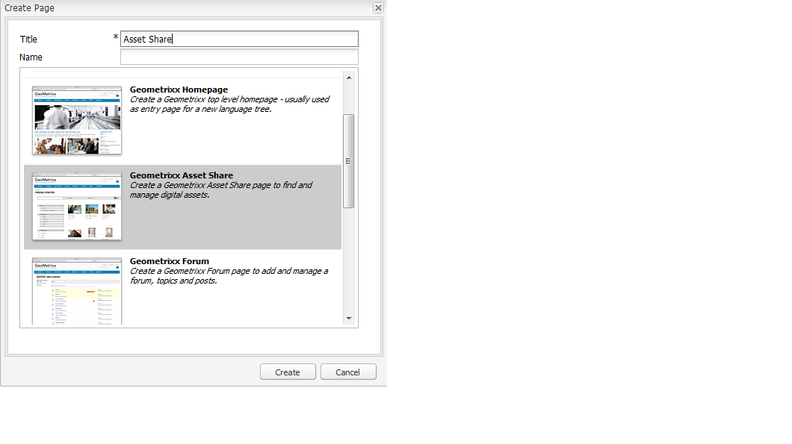

The basic page created using the Geometrixx DAM Asset Share template looks as follows:

To customize your Asset Share page, you use elements from the sidekick and you also edit query builder properties. The page **Geometrixx Press Center** is a customized version of a page based on this template:

To create an asset share page by way of the digital asset manager:

1. In the digital asset manager, in **New**, select **New Asset Share**.
1. In the **Title**, enter the name of the asset share page. If desired, enter a name for the URL.

   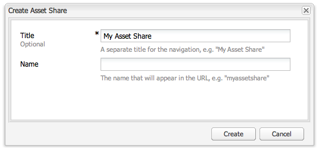

1. Double-click the asset share page to open it and configure the page.

   

   By default, when you create an Asset Share page from **New**, an Asset viewer and Asset editor are automatically created for you.

#### Customize actions {#customizing-actions}

You can determine what actions users can perform on selected digital assets from a selection of predefined actions.

To add actions to the Asset Share page:

1. In the Asset Share page that you want to customize, click **Actions** in the sidekick.

The following actions are available:

 | Action | Description |
 |---|---|
 | [!UICONTROL Delete Action] | Users can delete the selected assets. |
 | [!UICONTROL Download Action] | Lets users download selected assets to their computers. |
 | [!UICONTROL Lightbox Action] | Saves assets to a "lightbox"   where you can perform other actions on them. This comes in handy when working   with assets across multiple pages. The lightbox can also be used as a   shopping cart for assets. |
 | [!UICONTROL Move Action] | Users can move the asset to another   location |
 | [!UICONTROL Tags Action] | Lets users add tags to selected assets |
 | [!UICONTROL View Asset Action] | Opens the asset in the Asset editor for   user manipulation. |

1. Drag the appropriate action to the **Actions** area on the page. Doing so creates a button that is used to execute that action.

#### Determine how search results are presented {#determining-how-search-results-are-presented}

You determine how results are displayed from a predefined list of lenses.

To change how search results are viewed:

1. In the Asset Share page that you want to customize, click Search.

1. Drag the appropriate lens to the top center of the page. In the Press Center, the lenses are already available. Users press the appropriate lens icon to display search results as desired.

The following lenses are available:

| Lens | Description |
|---|---|
| **[!UICONTROL List Lens]** |Presents the assets in a list fashion with details. |
| **[!UICONTROL Mosaic Lens]** |Presents assets in a mosaic fashion. |

#### Mosaic Lens {#mosaic-lens}

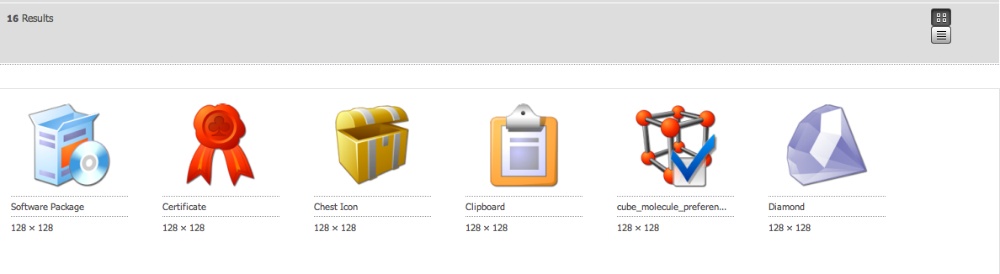

#### List Lens {#list-lens}

#### Customize the Query Builder {#customizing-the-query-builder}

The query builder lets you enter search terms and create content for the Asset Share page. When you edit the query builder, you also get to determine how many search results are displayed per page, which asset editor opens when you double-click an asset, the path the query searches, and customizes nodetypes.

To customize the query builder:

1. In the Asset Share page that you want to customize, click **Edit** in the Query Builder. By default, the **General** tab opens.
1. Select the number of results per page, the path of the asset editor (if you have a customized asset editor) and the Actions title.

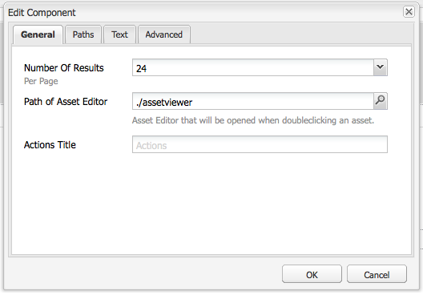

1. Click the **Paths** tab. Enter a path or multiple paths that the search will run. These paths are overwritten if the user uses the Paths predicate.

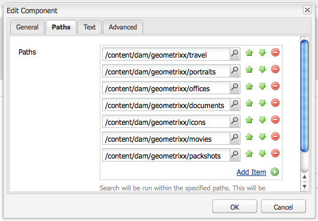

1. Enter another node type, if desired.

1. In the **Query Builder URL** field, you can override or wrap the query builder and enter the new servlet URLs with the existing query builder component. In the **Feed URL** field, you can override the Feed URL as well.

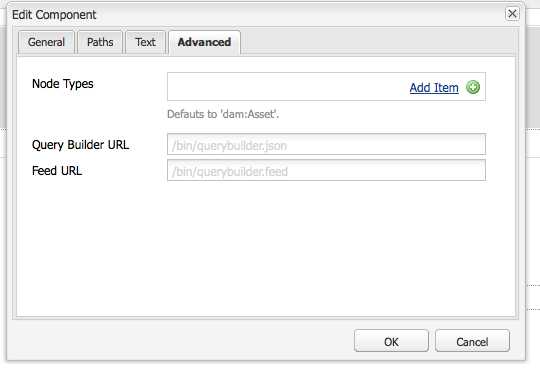

1. In the **Text** field, enter the text you want to appear for results and page numbers of results. Click **OK** when finished making changes.

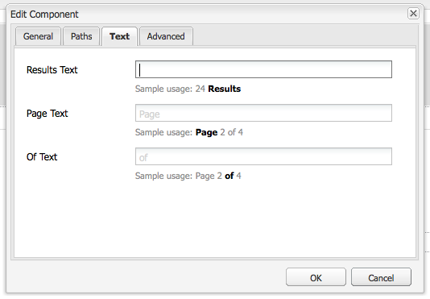

#### Add predicates {#adding-predicates}

Experience Manager Assets includes several predicates that you can add to the Asset Share page. These let your users further narrow searches. In some cases, they may override a query builder parameter (for example, the Path parameter).

To add predicates:

1. In the Asset Share page that you want to customize, click **Search**.

1. Drag the appropriate predicates to the Asset Share page underneath the query builder. Doing so creates the appropriate fields.

The following predicates are available:

| Predicate | Description |
|---|---|
| **[!UICONTROL Date Predicate]** |Lets users search for assets that were modified before and after certain dates. |
| **[!UICONTROL Options Predicate]** |The site owner can specify a property to search for (as in the property predicate, for example, cq:tags) and a content tree to populate the options from (for example, the tag tree). Doing so generates a list of options where the users can select the values (tags) that the selected property (tag property) should have. This predicate lets you build list controls like the list of tags, file types, image orientations, and so on. It is great for a fixed set of options. |
| **[!UICONTROL Path Predicate]** |Lets users define the path and subfolders, if desired. |
| **[!UICONTROL Property Predicate]** |The site owner specifies a property to search for, for example, tiff:ImageLength and the user can then enter a value, for example, 800. This returns all images that are 800 pixels high. Useful predicate if your property can have arbitrary values. |

For more information, see the [predicate Javadocs](https://helpx.adobe.com/experience-manager/6-5/sites/developing/using/reference-materials/javadoc/com/day/cq/search/eval/package-summary.html).

1. To configure the predicate further, double-click it. For example, when you open the Path Predicate, you need to assign the root path.

-->

## Create and configure an Asset Editor page {#creating-and-configuring-an-asset-editor-page}

You can customize the Asset Editor to determine how users can view and edit the digital assets. To do this, you create an Asset Editor page and then customize the views and the actions that users can perform on that page.

>[!NOTE]
>
>If you want to add custom fields to the DAM Asset Editor, add new `cq:Widget` nodes to `/apps/dam/content/asseteditors.`

### Create an Asset Editor page {#creating-the-asset-editor-page}

When creating the Asset Editor page, a good practice is to create the page directly below the Asset Share page.

To create an Asset Editor page:

1. In the **[!UICONTROL Websites]** tab, navigate to the place where you want to create an Asset Editor page and click **New**.
1. Select **Geometrixx Asset Editor** and click **Create**. The new page is created and the page is listed in the **Websites** tab.

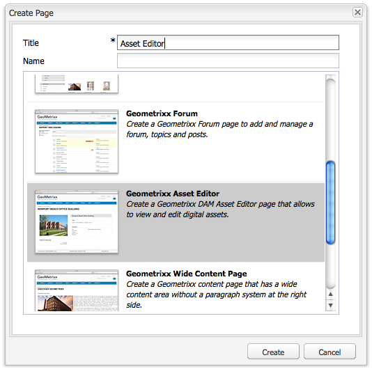

The basic page created using the Geometrixx Asset Editor template looks as follows:

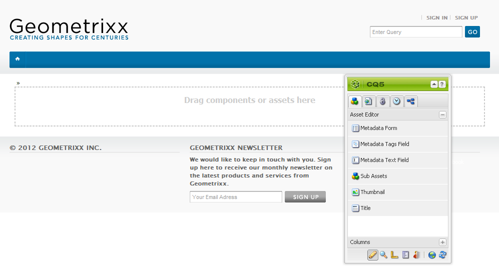

To customize your Asset Editor page, use elements from the sidekick. The Asset Editor page that is accessed from the **Geometrixx Press Center** is a customized version of a page based on this template:

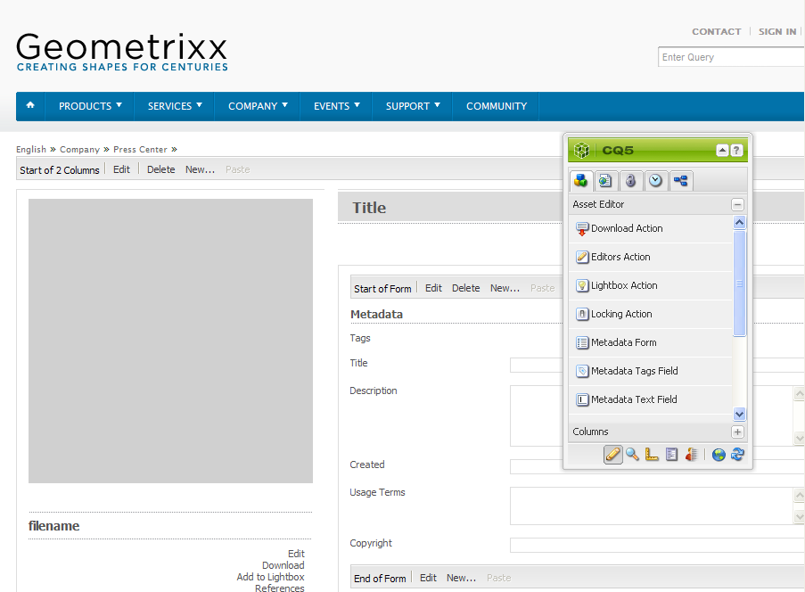

#### Set an Asset Editor to open from an Asset Share page {#setting-which-asset-editor-opens-from-an-asset-share-page}

After you have created the customized Asset Editor page, ensure that when you double-click assets that the customized Asset Share you created opens the assets in the customized Editor page.

To set the Asset Editor page:

1. In the Asset Share page, click **Edit** next to the Query Builder.

1. Click the **General** tab if it is not already selected.

1. In the **Path of Asset Editor** field, enter the path to the Asset Editor you want the Asset Share page to open assets in and click **OK**.

#### Add Asset Editor components {#adding-asset-editor-components}

You determine what functionality that an Asset Editor has by adding components to the page.

To add Asset Editor components:

1. In the Asset Editor page that you want to customize, select **Asset Editor** in the sidekick. All available Asset Editor components are displayed.

>[!NOTE]
>
>What you can customize depends on what components are available. To enable components, go to Design mode and select the components you need enabled.

1. Drag the components from the sidekick to the Asset Editor and make any edits in the component dialog boxes. The components are described in the following table and described in the detailed instructions that follow.

>[!NOTE]
>
>When designing the Asset Editor page, you create components that are either read-only or editable. Users know that a field can be edited if an image of a pencil appears in that component. By default, most components are set up as read-only.

| Component | Description |
|---|---|
| **[!UICONTROL Metadata Form] and [!UICONTROL Metadata Text Field]** | Lets you add additional metadata to an asset and perform an action, such as submitting, on that asset. |
| **[!UICONTROL Sub Assets]** | Lets you customize sub-assets. |
| **Tags** | Lets users select and add tags to an asset. |
| **[!UICONTROL Thumbnail]** | Shows a thumbnail of the asset, its filename, and lets you add an alternate text. You can add Asset Editor actions here as well. |
| **[!UICONTROL Title]** | Displays the asset title, which can be customized. |

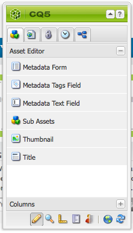

#### Metadata Form and Text Field - Configuring the View Metadata Component {#metadata-form-and-text-field-configuring-the-view-metadata-component}

The Metadata Form is a form that includes a start and end action. In between, you enter **Text** fields. See [Forms](/help/sites-authoring/default-components-foundation.md#form-component) for more information on working with forms.

1. Create a start action by clicking **Edit** in the Start area of the form. You can enter a Box title, if desired. By default, the Box title is **Metadata**. Select the Client Validation check box if you want the JavaScript client code for validation generated.

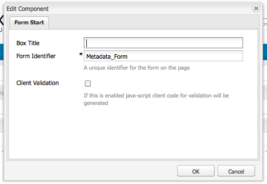

1. Create an End action by clicking **Edit** in the End area of the form. For example, you may want to create a **[!UICONTROL Submit]** option to allow users to submit their metadata changes. Optionally, you can add a **Reset** option that resets the metadata to its original state.

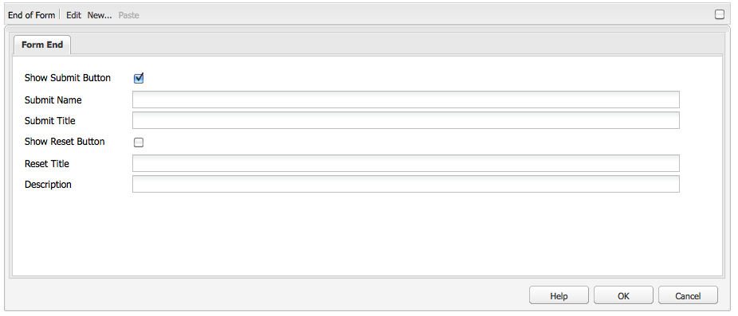

1. In between the **Form Start** and the **Form End**, drag Metadata Text Fields to the form. Users populate metadata into these text fields, which they can submit or complete another action on.

1. Double-click the field name, for example, **Title** to open the metadata field and make changes. In the **General** tab of the **Edit Component** window, you define the namespace and the field label and type, for example, `dc:title`.

See [Customizing and Extending Assets](/help/assets/extending-assets.md) for information on modifying the namespaces available in the metadata form.

1. Click the **Constraints** tab. Here you can select whether a field is required and if necessary, add any constraints.

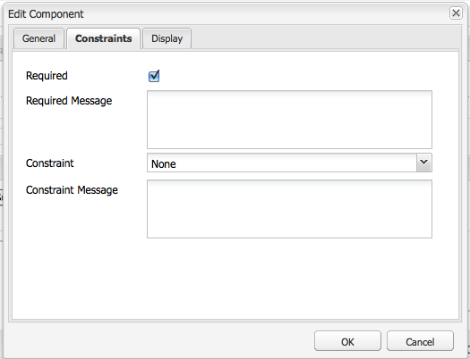

1. Click the **Display** tab. Here, you can enter a new width and number of rows for the metadata field. Select the **Field is read only** checkbox to let users edit the metadata.

The following is an example of a Metadata form with various fields:

On the Asset Editor page, users can then enter values into the metadata fields (if they are editable) and perform the end action (for example, submitting the changes).

#### Sub-assets {#sub-assets}

The Sub Assets component is where you can view and select sub-assets. You can determine what names appear under the [main asset](/help/assets/assets.md#what-are-digital-assets) and sub-assets.

Double-click the Sub Assets component so you can open the sub assets dialog box where you can change the titles for the main asset and any sub assets. The default values appear below the corresponding field.

The following is an example of a populated Sub Assets component:

For example, if you select a sub asset, note how the component displays the appropriate page and the Box title changes from Sub Assets to Siblings.

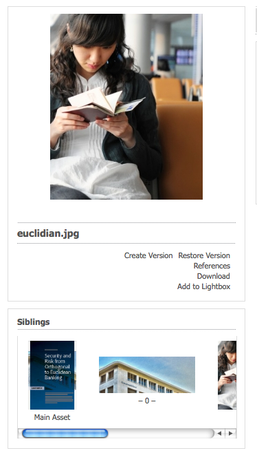

#### Tags {#tags}

The Tags component is a component where users can assign existing tags to an asset, which helps later in organization and retrieval. You can make this component read-only, so users cannot add tags, but only view them.

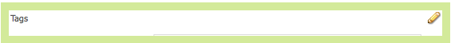

Double-click the Tags component so you can open the tags dialog box where you can change the title from Tags, if desired, and where you can select the allocated namespaces. To make this field editable, clear the **[!UICONTROL Hide Edit]** check box. By default, tags are editable.

If users can edit tags, then they can click the pencil to add tags by selecting them from the Tags drop-down menu.

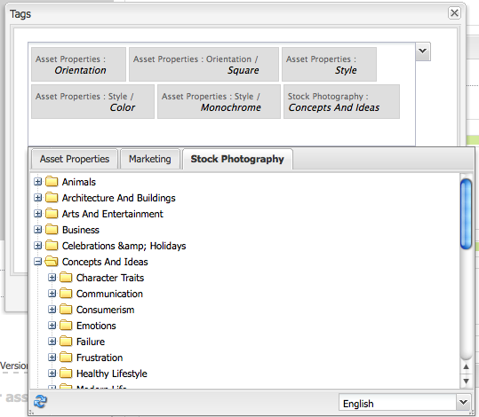

The following is a populated Tags component:

#### Thumbnail {#thumbnail}

The Thumbnail component is where the asset displays the selected thumbnail (for many of the formats the thumbnail is extracted automatically). In addition, the component displays the filename, and [actions that you can modify](/help/assets/assets-finder-editor.md#adding-asset-editor-actions).

Double-click the thumbnail component so you can open the thumbnail dialog where you can change the alt text. By default, the thumbnail alt text defaults to **Click to download** asset.

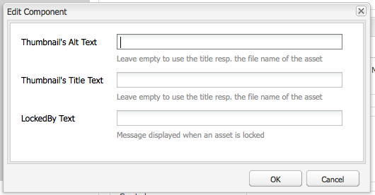

The following is an example of a populated Thumbnail component:

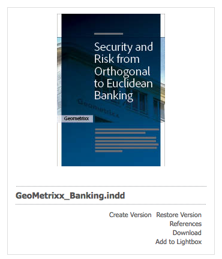

#### Title {#title}

The Title component displays the title of the asset and a description.

By default, it is in read-only mode so users cannot edit it. To make it editable, double-click the component and clear the **Hide edit button** checkbox. In addition, enter a title for multiple assets.

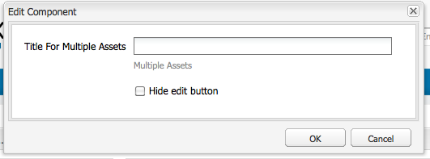

If the Title can be edited, you can add a title and description by clicking the Pencil to open the **Asset Properties** window. In addition, you can turn the asset on and off by selecting the date and time.

When editing the [!UICONTROL Title], users can change the **Title**, **Description**, and enter **On** and **Off Times** to turn the asset on and off.

The following is an example of a populated Title component:

#### Add Asset Editor actions {#adding-asset-editor-actions}

You can determine what actions users can perform on selected digital assets from a selection of predefined actions.

To add actions to the Asset Editor page:

1. In the Asset Editor page that you want to customize, click **Asset Editor** in the sidekick.

The following actions are available:

 | Action | Description |
 |---|---|
 | [!UICONTROL Download] | Lets users download selected assets to their computers. |
 | [!UICONTROL Editors] | Lets users edit an image (interactive editing) |
 | [!UICONTROL Lightbox] | Saves assets to a "lightbox" where you can perform other actions on them. This comes in handy when working with assets across multiple pages. |
 | [!UICONTROL Locking] | Lets users lock an asset. This functionality is not enabled by default and must be enabled in the list of components. |
 | [!UICONTROL References] | Click this to show on what pages the asset is being used. |
 | [!UICONTROL Versioning] | Lets you create and restore versions of an asset. |

1. Drag the appropriate action to the **Actions** area on the page. It creates an option that is used to execute the action that is dragged on the page.

## Multi-edit assets with the Asset Editor page {#multi-editing-assets-with-the-asset-editor-page}

With [!DNL Experience Manager Assets], you can change several assets at once. After having selected the assets, you can simultaneously change  tags and meta data.

To multi-edit assets with the Asset Editor page:

1. Open the Geometrixx **Press Center** page:
   `https://localhost:4502/content/geometrixx/en/company/press.html`

1. Select the assets:

    * on Windows: `Ctrl + click` each asset.
    * on Mac: `Cmd + click` each asset.

   To select a range of assets: click the first asset then `Shift + click` the last asset.

1. Click **Edit Metadata** in the **Actions** field (left part of the page).
1. The Geometrixx **Press Center Asset Editor** page opens in a new tab. The metadata of the assets are displayed as follows:

    * A tag&ndash;that does not apply to all the assets but only to a few ones&ndash;is displayed in italics.
    * A tag that applies to all the assets is displayed with a normal font.
    * Metadata other than tags: the value of the field is only displayed if it is the same for all the selected assets.

1. Click **Download** to download a ZIP file containing the assets original renditions.
1. Click edit the tags option that is next to the **Tags** field.

    * A tag that does not apply to all the assets, but only to a few ones has a gray background.
    * A tag that applies to all the assets has a white background.

   You can:

    * Click `x` to remove the tag for all the assets.
    * Click `+` to add the tag to all the assets.
    * Click the **arrow** and select a tag to add a new tag to all the assets.

   Click **OK** to write the changes to the form. The box beside the **Tags** field is automatically checked.

1. Edit the Description field. For example, set it to:

   `This is a common description`

   When a field is edited, its value overwrites the existing values of the selected assets when the form is submitted.

   Note: the box beside the field is automatically checked when the field is edited.

1. Click **Update Metadata** to submit the form and save the changes for all the assets.

   Note: only the checked metadata are modified.
