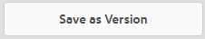
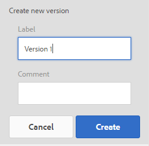
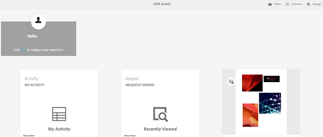

# [!DNL Adobe Experience Manager Assets] Home Page Experience {#aem-assets-home-page-experience}

Personalize the [!DNL Adobe Experience Manager Assets] home page for a rich welcome screen experience, including a snapshot of recent activities around assets.

[!DNL Assets] home page provides a rich and personalized welcome screen experience, which includes a snapshot of recent activities, such as assets that were recently viewed or uploaded.

The [!DNL Assets] home page is disabled by default. To enable it, perform the following steps:

1. Open [!DNL Experience Manager] Configuration Manager `https://[aem_server]:[port]/system/console/configMgr`.
1. Open the **[!UICONTROL Day CQ DAM Event Recorder]** service.
1. Select the **[!UICONTROL Enable this service]** to enable activity recording.

   

1. From the **[!UICONTROL Event Types]** list, select the events to be recorded and save the changes.

   >[!CAUTION]
   >
   >Enabling the Asset viewed, Projects viewed, and Collections viewed options, significantly increases the number of recorded events.

1. Open the **[!UICONTROL DAM Asset Home Page Feature Flag]** service from Configuration Manager `https://[aem_server]:[port]/system/console/configMgr`.
1. Select the `isEnabled.name` option to enable the [!DNL Assets] Home page feature. Save the changes.

   

1. Open the **[!UICONTROL User Preferences]** dialog, and select **[!UICONTROL Enable Assets Home Page]**. Save the changes.

   

After enabling the [!DNL Assets] Home page, navigate to the [!DNL Assets] user interface either from the Navigation page or access it directly from the URL `https://[aem_server]:[port]/aem/assetshome.html/content/dam`.

Click the **[!UICONTROL Click here to configure your experience link]** to add your username, background image, and profile image.

The [!DNL Assets] Home page includes the following sections:

* Welcome Section
* Widget Section

**Welcome Section**

If your profile exists, the Welcome section displays a welcome message addressed to you. In addition, it displays your profile picture and a welcome image (if configured already).

If your profile is incomplete, the Welcome section displays a generic welcome message and a placeholder for your profile picture.

**Widget Section**

This section appears below the Welcome section and displays out-of-the-box widgets under the following sections:

* Activity
* Recent
* Discover

**Activity**: Under this section, the **[!UICONTROL My Activity]** widget displays recent activities performed by the logged-in user with assets (including assets without renditions), for example, asset uploads, downloads, asset creation, edits, comments, annotations, and shares.

**Recent**: The **[!UICONTROL Recently Viewed]** widget under this section displays recently accessed entities by the logged-in user, including folders, collections, and projects.

**Discover**: The **[!UICONTROL New]** widget under this section displays the assets and renditions recently uploaded to the [!DNL Assets] deployment.

To enable purging of user activity data, enable the **[!UICONTROL DAM Event Purge Service]** from Configuration Manager. After you enable this service, activities of the logged-in user that exceed a specified number are deleted by the system.

The Welcome screen provides easy navigational aids, for example, icons on the toolbar to access folders, collections, and catalogs.

>[!NOTE]
>
>Enabling the [!UICONTROL Day CQ DAM Event Recorder] and [!UICONTROL DAM Event Purge] services increases write operations to JCR and search indexing, which significantly increases the load on the [!DNL Experience Manager] server. The additional load on the [!DNL Experience Manager] server can impact its performance.

>[!CAUTION]
>
>Capturing, filtering, and purging user activities required for [!DNL Assets] home page impose an overhead on performance. Therefore, administrators should configure Home Page effectively for target users.
>
>Adobe recommends that administrators and users who perform bulk operations avoid using the Asset Home Page feature to prevent increase in user activities. In addition, administrators can exclude recording activities for specific users by configuring [!UICONTROL Day CQ DAM Event Recorder] from [!UICONTROL Configuration Manager].
>
>If you use the feature, Adobe recommends that you schedule purge frequency based on the server load.
