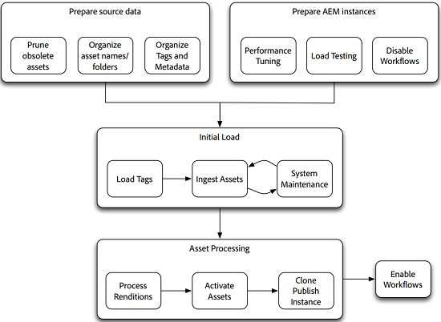

# Assets Migration Guide {#assets-migration-guide}

When migrating assets into AEM, there are several steps to consider. Extracting assets and metadata out of their current home is outside the scope of this document as it varies widely between implementations, but this document describes how to bring these assets into AEM, apply their metadata, generate renditions, and activate them to publish instances.

## Prerequisites {#prerequisites}

Before actually performing any of the steps in this methodology, please review and implement the guidance in [Assets Performance Tuning Tips](performance-tuning-guidelines.md). Many of the steps, such as configuring maximum concurrent jobs, greatly enhance the server’s stability and performance under load. Other steps, such as configuring a File Data Store, are much more difficult to perform after the system has been loaded with assets.

>[!NOTE]
>
>The following asset migration tools are not part of AEM and are not supported by Adobe Support:
>
>* ACS AEM Tools Tag Maker
>* ACS AEM Tools CSV Asset Importer
>* ACS Commons Bulk Workflow Manager
>* ACS Commons Fast Action Manager
>* Synthetic Workflow
>
>This software are open source and covered by the [Apache v2 License](https://adobe-consulting-services.github.io/pages/license.html). To ask a question or report an issue, visit the respective [GitHub Issues for ACS AEM Tools](https://github.com/Adobe-Consulting-Services/acs-aem-commons/issues) and [ACS AEM Commons](https://github.com/Adobe-Consulting-Services/acs-aem-tools/issues).

## Migrating to AEM {#migrating-to-aem}

Migrating assets to AEM requires several steps and should be viewed as a phased process. The phases of the migration are as follows:

1. Disable workflows.
1. Load tags.
1. Ingest assets.
1. Process renditions.
1. Activate assets.
1. Enable workflows.

 

### Disabling Workflows {#disabling-workflows}

Before starting your migration, disable your launchers for the DAM Update Asset workflow. It is best to ingest all of the assets into the system and then run the workflows in batches. If you are already live while the migration is taking place, you can schedule these activities to run on off-hours.

### Loading Tags {#loading-tags}

You may already have a tag taxonomy in place that you are applying to your images. While tools like the CSV Asset Importer and AEM’s support for metadata profiles can automate the process of applying tags to assets, the tags need to be loaded into the system. The [ACS AEM Tools Tag Maker](https://adobe-consulting-services.github.io/acs-aem-tools/features/tag-maker/index.html) feature lets you populate tags by using a Microsoft Excel spreadsheet that is loaded into the system.

### Ingesting Assets {#ingesting-assets}

Performance and stability are important concerns when ingesting assets into the system. Because you are loading a large amount of data into the system, you want to make sure that the system performs as well as it can to minimize the amount of time required and to avoid overloading the system, which can lead to a system crash, especially in systems that already are in production.

There are two approaches to loading the assets into the system: a push-based approach using HTTP or a pull-based approach using the JCR APIs.

#### Pushing through HTTP {#pushing-through-http}

Adobe’s Managed Services team uses a tool called Glutton to load data into customer environments. Glutton is a small Java application that loads all assets from one directory into another directory on an AEM instance. Instead of Glutton, you could also use tools such as Perl scripts to post the assets into the repository.

There are two main downsides to using the approach of pushing through https:

1. The assets need to be transmitted over HTTP to the server. This requires quite a bit of overhead and is time-consuming, thus lengthening the time that it takes to perform your migration. 
1. If you have tags and custom metadata that must be applied to the assets, this approach requires a second custom process that you need to run to apply this metadata to the assets once they have been imported.

The other approach to ingesting assets is to pull assets from the local file system. However, if you cannot get an external drive or network share mounted to the server to perform a pull-based approach, posting the assets over HTTP is the best option.

#### Pulling from the Local Filesystem {#pulling-from-the-local-filesystem}

The [ACS AEM Tools CSV Asset Importer](https://adobe-consulting-services.github.io/acs-aem-tools/features/csv-asset-importer/index.html) pulls assets from the filesystem and asset metadata from a CSV file for the asset import. The AEM Asset Manager API is used to import the assets into the system and apply the configured metadata properties. Ideally, assets are mounted on the server via a network file mount or through an external drive.

Because assets do not need to be transmitted over a network, overall performance improves dramatically and this method is generally considered to be the most efficient way to load assets into the repository. Additionally, because the tool supports metadata ingestion, you can import all assets and metadata in a single step rather than also create a second step to apply the metadata through a separate tool.

### Processing Renditions {#processing-renditions}

After you load the assets into the system, you need to process them through the DAM Update Asset workflow to extract metadata and generate renditions. Before performing this step, you need to duplicate and modify the DAM Update Asset workflow to fit your needs. The out-of-the-box workflow contains many steps that may not necessary for you, such as Scene7 PTIFF generation or InDesign server integration.

After you have configured the workflow according to your needs, you have two options for executing it:

1. The simplest approach is [ACS Commons’ Bulk Workflow Manager](https://adobe-consulting-services.github.io/acs-aem-commons/features/bulk-workflow-manager.html). This tool allows you to execute a query and to process the results of the query through a workflow. There are options for setting batch sizes as well.
1. You can use the [ACS Commons Fast Action Manager](https://adobe-consulting-services.github.io/acs-aem-commons/features/fast-action-manager.html) in concert with [Synthetic Workflows](https://adobe-consulting-services.github.io/acs-aem-commons/features/synthetic-workflow.html). While this approach is much more involved, it lets you remove the overhead of the AEM workflow engine while optimizing the use of server resources. Additionally, the Fast Action Manager further boosts performance by dynamically monitoring server resources and throttling the load placed on the system. Example scripts have been provided on the ACS Commons feature page.

### Activating Assets {#activating-assets}

For deployments that have a publish tier, you need to activate the assets out to the publish farm. While Adobe recommends running more than a single publish instance, it is most efficient to replicate all of the assets to a single publish instance and then clone that instance. When activating large numbers of assets, after triggering a tree activation, you may need to intervene. Here's why: When firing off activations, items are added to the Sling jobs/eventing queue. After the size of this queue begins to exceed approximately 40,000 items, processing slows dramatically. After the size of this queue exceeds 100,000 items, system stability starts to suffer.

To work around this issue, you can use the [Fast Action Manager](https://adobe-consulting-services.github.io/acs-aem-commons/features/fast-action-manager.html) to manage asset replication. This works without using the Sling queues, lowering overhead, while throttling the workload to prevent the server from becoming overloaded. An example of using FAM to manage replication is shown on the feature’s documentation page.

Other options for getting assets to the publish farm include using [vlt-rcp](https://jackrabbit.apache.org/filevault/rcp.html) or [oak-run](https://github.com/apache/jackrabbit-oak/tree/trunk/oak-run), which are provided as tools as part of Jackrabbit. Another option is to use an open-sourced tool for your AEM infrastructure called [Grabbit](https://github.com/TWCable/grabbit), which claims to have faster performance than vlt.

For any of these approaches, the caveat is that the assets on the author instance do not show as having been activated. To handle flagging these assets with correct activation status, you need to also run a script to mark the assets as activated.

>[!NOTE]
>
>Adobe does not maintain or support Grabbit.

### Cloning Publish {#cloning-publish}

After the assets have been activated, you can clone your publish instance to create as many copies as are necessary for the deployment. Cloning a server is fairly straightforward, but there are some important steps to remember. To clone publish:

1. Back up the source instance and the datastore.
1. Restore the backup of the instance and datastore to the target location. The following steps all refer to this new instance.
1. Perform a filesystem search under **crx-quickstart/launchpad/felix** for **sling.id**. Delete this file.
1. Under the root path of the datastore, locate and delete any **repository-XXX** files.
1. Edit **crx-quickstart/install/org.apache.jackrabbit.oak.plugins.blob.datastore.FileDataStore.config** and **crx-quickstart/launchpad/config/org/apache/jackrabbit/oak/plugins/blob/datastore/FileDataStore.config** to point to the location of the datastore on the new environment.
1. Start the environment.
1. Update the configuration of any replication agents on the author(s) to point to the correct publish instances or dispatcher flush agents on the new instance to point to the correct dispatchers for the new environment.

### Enabling Workflows {#enabling-workflows}

Once we have completed migration, the launchers for the DAM Update Asset workflows should be re-enabled to support rendition generation and metadata extraction for ongoing day-to-day system usage.

## Migrating Between AEM Instances {#migrating-between-aem-instances}

While not nearly as common, sometimes you need to migrate large amounts of data from one AEM instance to another; for example, when you perform an AEM upgrade, upgrade your hardware, or migrate to a new datacenter, such as with an AMS migration.

In this case, your assets are already populated with metadata and renditions are already generated. You can simply focus on moving assets from one instance to another. When migrating between AEM instances, you perform the following steps:

1. Disable workflows.

   Because you are migrating renditions along with our assets, you want to disable the workflow launchers for DAM Update Asset.

1. Migrate tags.

   Because you already have tags loaded in the source AEM instance, you can build them in a content package and install the package on the target instance.

1. Migrate assets.

   There are two tools that are recommended for moving assets from one AEM instance to another:

    * **Vault Remote Copy**, or vlt rcp, allows you to use vlt across a network. You can specify a source and destination directory and vlt downloads all repository data from one instance and loads it into the other. Vlt rcp is documented at [https://jackrabbit.apache.org/filevault/rcp.html](https://jackrabbit.apache.org/filevault/rcp.html)
    * **Grabbit** is an open-source content synchronization tool that was developed by Time Warner Cable for their AEM implementation. Because it uses continuous data streams, in comparison to vlt rcp, it has a lower latency and claims a speed improvement of two to ten times faster than vlt rcp. Grabbit also supports synchronization of delta content only, which allows it to sync changes after an initial migration pass has been completed.

1. Activate assets.

   Follow the instructions for [activating assets](#activating-assets) documented for the inital migration to AEM.

1. Clone publish.

   As with a new migration, loading a single publish instance and cloning it is more efficient than activating the content on both nodes. See [Cloning Publish.](#cloning-publish)

1. Enabling workflows.

   After you have completed migration, re-enable the launchers for the DAM Update Asset workflows to support rendition generation and metadata extraction for ongoing day-to-day system usage.

