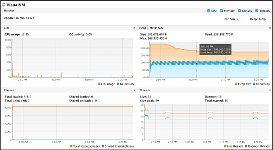
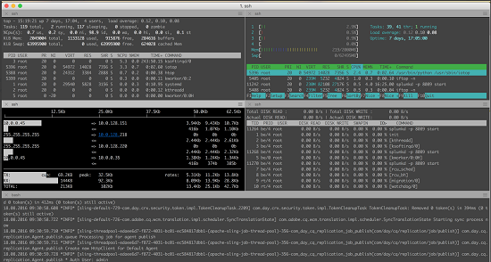

# Best practices to monitor [!DNL Adobe Experience Manager Assets] deployment {#assets-monitoring-best-practices}

From the [!DNL Experience Manager Assets] standpoint, monitoring should include observing and reporting on the following processes and technologies:

* System CPU
* System memory usage
* System disk IO and IO wait time
* System network IO
* JMX MBeans for heap utilization and asynchronous processes, such as workflows
* OSGi console health checks

Typically, [!DNL Experience Manager Assets] can be monitored in two ways, live monitoring and long term monitoring.

## Live monitoring {#live-monitoring}

You should perform live monitoring during the performance testing phase of your development or during high-load situations to understand the performance characteristics of your environment. Typically, live monitoring should be performed using a suite of tools. Here are some recommendations:

* [Visual VM](https://visualvm.github.io/): Visual VM enables you to view detailed Java VM information, including CPU usage, Java memory usage. In addition, it lets you sample and evaluate code that runs on an deployment.
* [Top](https://man7.org/linux/man-pages/man1/top.1.html): Top is a Linux command that opens up a dashboard, which displays usage statistics, including CPU, memory, and IO usage. It provides a high-level overview of what is happening on an instance.
* [Htop](https://hisham.hm/htop/): Htop is an interactive process viewer. It provides detailed CPU and memory usage in addition to what Top can provide. Htop can be installed on most Linux systems using `yum install htop` or `apt-get install htop`.

* Iotop: Iotop is a detailed dashboard for disk IO usage. It displays bars and meters that depict the processes that use disk IO and the amount they use. Iotop can be installed on most Linux systems using `yum install iotop` or `apt-get install iotop`.

* [Iftop](https://www.ex-parrot.com/pdw/iftop/): Iftop displays detailed information about ethernet/network usage. Iftop displays per communication channel statistics on the entities using ethernet and the amount of bandwidth they use. Iftop can be installed on most Linux systems using `yum install iftop` or `apt-get install iftop`.

* Java Flight Recorder (JFR): A commercial tool from Oracle that you can use freely in non-production environments. For more details, see [How to Use Java Flight Recorder to Diagnose CQ Runtime Problems](https://cq-ops.tumblr.com/post/73865704329/how-to-use-java-flight-recorder-to-diagnose-cq).
* [!DNL Experience Manager] `error.log` file: You can investigate the [!DNL Experience Manager] `error.log` file for details of errors logged in the system. Use the command `tail -F quickstart/logs/error.log` to identify errors to investigate.
* [Workflow console](/help/sites-administering/workflows.md): Leverage the workflow console to monitor workflows that lag behind or get stuck.

Typically, you use these tools together to obtain a comprehensive idea about the performance of your [!DNL Experience Manager] deployment.

>[!NOTE]
>
>These tools are standard tools and not directly supported by Adobe. They don’t require additional licenses.

*Figure: Live monitoring using Visual VM tool.*

## Long-term monitoring {#long-term-monitoring}

Long term monitoring of an [!DNL Experience Manager] deployment involves monitoring for a longer duration the same portions that are monitored live. It also includes defining alerts specific to your environment.

### Log aggregation and reporting {#log-aggregation-and-reporting}

There are several tools available to aggregate logs, for example, Splunk(TM) and Elastic Search, Logstash, and Kabana (ELK). To evaluate the uptime of your [!DNL Experience Manager] deployment, it is important for you to understand log events specific to your system and create alerts based on them. A good knowledge of your development and operations practices can help you better understand how to tune your log aggregation process to generate critical alerts.

### Environment monitoring {#environment-monitoring}

Environment monitoring includes monitoring the following:

* Network throughput
* Disk IO
* Memory
* CPU utilization
* JMX MBeans
* External websites

You require external tools, such as NewRelic(TM) and AppDynamics(TM) to monitor each item. Using these tools, you can define alerts specific to your system, for example, high system utilization, workflow back up, health check failures, or unauthenticated access to your website. Adobe does not recommend any particular tools over others. Find the tool that works for you, and use it to monitor the items discussed.

#### Internal application monitoring {#internal-application-monitoring}

Internal application monitoring includes monitoring the application components that make up the [!DNL Experience Manager] stack, including JVM, the content repository, and monitoring through custom application code built on the platform. In general, it is performed through JMX Mbeans that can be monitored directly by many popular monitoring solutions, such as SolarWinds (TM), HP OpenView(TM), Hyperic(TM), Zabbix(TM), and others. For systems that do not support a direct connection to JMX, you can write shell scripts to extract the JMX data and expose it to these systems in a format that they natively understand.

Remote access to the JMX Mbeans is not enabled by default. For more information on monitoring through JMX, see [Monitoring and Management Using JMX Technology](https://docs.oracle.com/javase/7/docs/technotes/guides/management/agent.html).

In many cases, a baseline is required to effectively monitor a statistic. To create a baseline, observe the system under normal working conditions for a predetermined period and then identify the normal metric.

**JVM monitoring**

As with any Java-based application stack, [!DNL Experience Manager] depends on the resources that are provided to it through the underlying Java Virtual Machine. You can monitor the status of many of these resources through Platform MXBeans that are exposed by JVM. For more information on MXBeans, see [Using the Platform MBean Server and Platform MXBeans](https://docs.oracle.com/javase/7/docs/technotes/guides/management/mxbeans.html).

Here are some baseline parameters that you can monitor for JVM:

Memory

* `MBean: lava.lang:type=Memory`
* URL: `/system/console/jmx/java.lang:type=Memory`
* Instances: All servers
* Alarm threshold: When the heap or non-heap memory utilization exceeds 75% of the corresponding maximum memory.
* Alarm definition: Either system memory is insufficient, or there is a memory leak in the code. Analyze a thread dump to arrive at a definition.

>[!NOTE]
>
>The information provided by this bean is expressed in bytes.

Threads

* MBean: `java.lang:type=Threading`
* URL: `/system/console/jmx/java.lang:type=Threading`
* Instances: All servers
* Alarm threshold: When the number of threads is greater than 150% of the baseline.
* Alarm definition: Either there is an active runaway process, or an inefficient operation consumes a large amount of resources. Analyze a thread dump to arrive at a definition.

**Monitor [!DNL Experience Manager]**

[!DNL Experience Manager] also exposes a set of statistics and operations through JMX. These can help assess system health and identify potential problems before they impact users. For more information, see [documentation](/help/sites-administering/jmx-console.md) on [!DNL Experience Manager] JMX MBeans.

Here are some baseline parameters that you can monitor for [!DNL Experience Manager]:

Replication agents

* MBean: `com.adobe.granite.replication:type=agent,id="<AGENT_NAME>"`
* URL: `/system/console/jmx/com.adobe.granite.replication:type=agent,id="<AGENT_NAME>"`
* Instances: One Author and all publish instances (for flush agents)
* Alarm threshold: When the value of `QueueBlocked` is `true` or the value of `QueueNumEntries` is greater than 150% of the baseline.

* Alarm definition: Presence of a blocked queue in the system indicating that the replication target is down or unreachable. Often, network or infrastructure issues cause excessive entries to be queued, which can adversely impact system performance.

>[!NOTE]
>
>For the MBean and URL parameters, replace `<AGENT_NAME>` with the name of the replication agent you want to monitor.

Session counter

* MBean: `org.apache.jackrabbit.oak:id=7,name="OakRepository Statistics",type="RepositoryStats"`
* URL: */system/console/jmx/org.apache.jackrabbit.oak:id=7,name="OakRepository Statistics",type*="RepositoryStats"
* Instances: All servers
* Alarm threshold: When open sessions exceed the baseline by more than 50%.
* Alarm definition: Sessions may be opened through a piece of code and never close. This may happen slowly over time and eventually cause memory leaks in the system. While the number of sessions should fluctuate on a system, they should not increase continuously.

Health Checks

Health checks that are available in the [operations dashboard](/help/sites-administering/operations-dashboard.md#health-reports) have corresponding JMX MBeans for monitoring. However, you can write custom health checks to expose additional system statistics.

Here are some out-of-the-box health checks that are helpful to monitor:

* System Checks
  * MBean: `org.apache.sling.healthcheck:name=systemchecks,type=HealthCheck`
  * URL: `/system/console/jmx/org.apache.sling.healthcheck:name=systemchecks,type=HealthCheck`
  * Instances: One author, all publish servers
  * Alarm threshold: When the status is not OK
  * Alarm definition: The status of one of the metrics is either WARN or CRITICAL. Check the log attribute for more information on the cause of the issue.

* Replication Queue

  * MBean: `org.apache.sling.healthcheck:name=replicationQueue,type=HealthCheck`
  * URL: `/system/console/jmx/org.apache.sling.healthcheck:name=replicationQueue,type=HealthCheck`
  * Instances: One author, all publish servers
  * Alarm threshold: When the status is not OK
  * Alarm definition: The status of one of the metrics is either WARN or CRITICAL. Check the log attribute for more information on the queue that caused the issue.

* Response Performance

  * MBean: `org.apache.sling.healthcheck:name=requestsStatus,type=HealthCheck`
  * URL: `/system/console/jmx/org.apache.sling.healthcheck:name=requestsStatus,type=HealthCheck`
  * Instances: All servers
  * Alarm duration: When the status is not OK
  * Alarm definition: The status of one of the metrics is either WARN or CRITICAL status. Check the log attribute for more information on the queue that caused the issue.

* Query Performance

  * MBean: `org.apache.sling.healthcheck:name=queriesStatus,type=HealthCheck`
  * URL: `/system/console/jmx/org.apache.sling.healthcheck:name= queriesStatus,type=HealthCheck`
  * Instances: One author, all publish servers
  * Alarm threshold: When the status is not OK
  * Alarm definition: One or more queries running slowly in the system. Check the log attribute for more information on the queries that caused the issue.

* Active Bundles

  * MBean: `org.apache.sling.healthcheck:name=inactiveBundles,type=HealthCheck`
  * URL: `/system/console/jmx/org.apache.sling.healthcheck:name=inactiveBundles,type=HealthCheck`
  * Instances: All servers
  * Alarm threshold: When the status is not OK
  * Alarm definition: Presence of inactive or unresolved OSGi bundles on the system. Check the log attribute for more information on the bundles that caused the issue.

* Log Errors

  * MBean: `org.apache.sling.healthcheck:name=logErrorHealthCheck,type=HealthCheck`
  * URL: `/system/console/jmx/org.apache.sling.healthcheck:name=logErrorHealthCheck,type=HealthCheck`
  * Instances: All servers
  * Alarm threshold: When the status is not OK
  * Alarm definition: There are errors in the log files. Check the log attribute for more information on the cause of the issue.

## Common issues and resolutions  {#common-issues-and-resolutions}

In the process of monitoring, if you encounter issues, here are some troubleshooting tasks that you can perform to resolve common issues with [!DNL Experience Manager] deployments:

* If using TarMK, run Tar compaction often. For more details, see [Maintain the repository](/help/sites-deploying/storage-elements-in-aem-6.md#maintaining-the-repository).
* Check `OutOfMemoryError` logs. For more information, see [Analyze Memory Problems](https://experienceleague.adobe.com/docs/experience-cloud-kcs/kbarticles/KA-17482.html).

* Check the logs for any references to unindexed queries, tree traversals, or index traversals. These indicate unindexed queries or inadequately indexed queries. For For best practices on optimizing query and indexing performance, see [Best practices for queries and indexing](/help/sites-deploying/best-practices-for-queries-and-indexing.md).
* Use the workflow console to verify that your workflows perform as expected. If possible, condense multiple workflows into a single workflow.
* Revisit live monitoring, and look for additional bottlenecks or high consumers of any specific resources.
* Investigate the egress points from the client network and the ingress points to the [!DNL Experience Manager] deployment network, including the dispatcher. Frequently, these are bottleneck areas. For more information, see [Assets network considerations](/help/assets/assets-network-considerations.md).
* Up-size your [!DNL Experience Manager] server. You may have an inadequately sized your [!DNL Experience Manager] deployment. Adobe Customer Support can help you identify whether your server is undersized.
* Examine the `access.log` and `error.log` files for entries around the time of something went wrong. Look for patterns that can potentially indicate custom code anomalies. Add them to the list of events you monitor.
