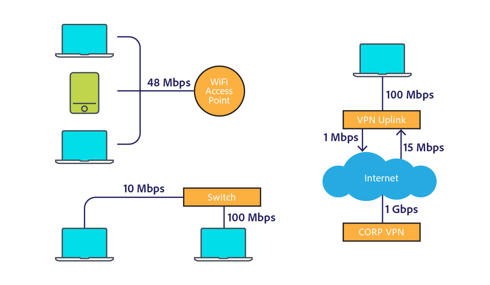
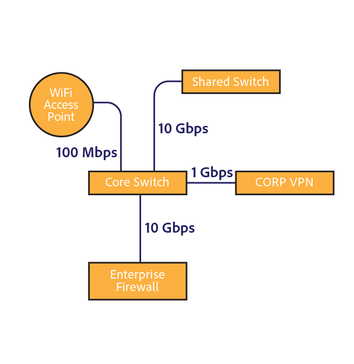
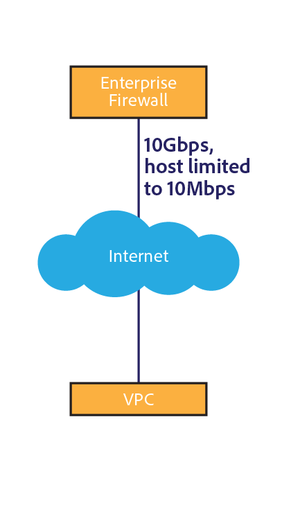
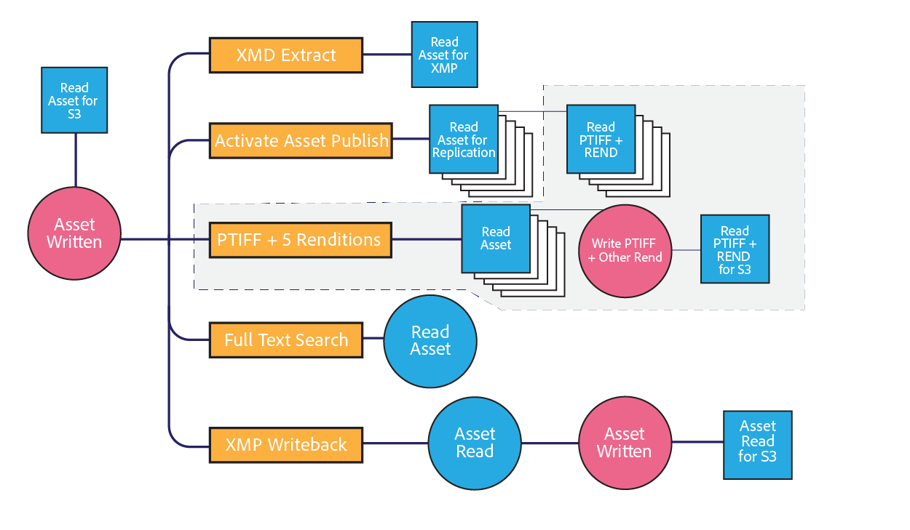

# [!DNL Assets] network considerations {#assets-network-considerations}

Understanding your network is as important as understanding [!DNL Adobe Experience Manager Assets]. The network can affect upload, download, and user experiences. Diagramming your network topology helps identify choke points and sub-optimized areas in the network that you must fix to improve network performance and user experience.

Ensure that you include the following in your network diagram:

* Connectivity from the client device (for example, computer, mobile, and tablet) to the network.
* Topology of the corporate network.
* Uplink to the internet from the corporate network and the [!DNL Experience Manager] environment.
* Topology of the [!DNL Experience Manager] environment.
* Define simultaneous consumers of the [!DNL Experience Manager] network interface.
* Defined workflows of the [!DNL Experience Manager] deployment.

## Connectivity from the client device to the corporate network {#connectivity-from-the-client-device-to-the-corporate-network}

Begin by diagramming the connectivity between the individual client devices and the corporate network. At this stage, identify shared resources, such as WiFi connections, where multiple users access the same point or ethernet switch to upload and download assets.

Client devices connect to the corporate network in various ways, such as shared WiFi, ethernet to a shared switch, and VPN. Identifying and understanding chokepoints on this network is important for [!DNL Assets] planning and to modify the network.

At the top left of the diagram, three devices are depicted as sharing a 48 Mbps WiFi access point. If all the devices upload simultaneously, the WiFi network bandwidth is shared between the devices. Compared to the system as a whole, a user may encounter a different choke-point for the three clients over this divided channel.

It is a challenge to measure the true speed of a WiFi network because a slow device can impact other clients on the access point. If you plan to use WiFi for asset interactions, perform a speed test from multiple clients simultaneously to evaluate the throughput.

The bottom left of the diagram depicts two devices connected to the corporate network through independent channels. Therefore, each device can avail a minimum speed of 10 Mbps and 100 Mbps.

The computer displayed at the right has a limited upstream to the corporate network over a VPN with a speed of 1 Mbps. The user experience for the 1Mbps connection is vastly different from the user experience over the 1Gbps connection. Depending on the size of the assets users interact with, their VPN uplink may be inadequate for the task.

## Topology of the corporate network {#topology-of-the-corporate-network}

The diagram displays higher uplink speeds within the corporate network than what is generally used. These pipes are shared resources. If the shared switch is expected to handle 50 clients, it can potentially be a choke-point. In the initial diagram, only two computers share the particular connection.

## Uplink to the internet from the corporate network and [!DNL Experience Manager] environment {#uplink-to-the-internet-from-the-corporate-network-and-aem-environment}

It is important to consider unknown factors on the Internet and the VPC connection because the bandwidth across the internet can be impaired due to peak load or large-scale provider outages. In general, internet connectivity is reliable. However, it can sometimes introduce chokepoints.

At the uplink from a corporate network to the internet, there can be other services using the bandwidth. It is important to understand how much of the bandwidth can be dedicated or prioritized for Assets. For example, if a 1 Gbps link is already at 80% utilization, you can only allocate a maximum of 20% of the bandwidth for [!DNL Experience Manager Assets].

Enterprise firewalls and proxies can also shape bandwidth in many different ways. This type of device can prioritize bandwidth using quality of service, bandwidth limitations per user, or bitrate limitations per host. These are important chokepoints to examine as they can significantly impact [!DNL Assets] user experience.

In this example, the enterprise has a 10 Gbps uplink. It should be large enough for several clients. Moreover, the firewall imposes a host rate limit of 10 Mbps. This limitation can potentially throttle traffic to a single host to 10 Mbps, even though the uplink to the internet is at 10 Gbps.

This is the smallest client-oriented choke-point. However, you can evaluate for a change or configuring an allowed list with the network operations group in charge of this firewall.

From the sample diagrams, you can conclude that six devices share a conceptual 10Mbps channel. Depending on the size of the assets used, this may be inadequate to meet user expectations.

## Topology of the [!DNL Experience Manager] environment {#topology-of-the-aem-environment}

Designing the topology of the [!DNL Experience Manager] environment requires detailed knowledge of the system configuration and how the network is connected within the user environment.

The sample scenario includes a publish farm with five servers, an S3 binary store, and Dynamic Media configured.

The dispatcher shares its 100Mbps connection with two entities, the outside world and the [!DNL Experience Manager] deployment. For simultaneous upload and download operations, you should divide this number by two. The attached external storage uses a separate connection.

The [!DNL Experience Manager] deployment shares its 1Gbps connection with multiple services. From a network topology perspective, it is equivalent to sharing a single channel with different services.

Reviewing the network from the client device to the [!DNL Experience Manager] deployment, the smallest choke-point appears to be the 10 Mbit enterprise firewall throttle. You can use these values in the sizing calculator in the [Assets Sizing Guide](assets-sizing-guide.md) to determine the user experience.

## Defined workflows of the [!DNL Experience Manager] deployment {#defined-workflows-of-the-aem-deployment}

When considering network performance, it may be important to consider the workflows and publishing that will occur in the system. Moreover, S3 or other network attached storage that you use and I/O requests consume network bandwidth. Therefore, even in a fully optimized network, performance may be limited by disk I/O.

To streamline processes around asset ingestion (especially when uploading a large number of assets), explore asset workflows and understand more about their configuration.

When evaluating the internal workflow topology, you should analyze the following:

* Procedures that write an asset
* Workflows/events that trigger when asset/metadata is modified
* Procedures that read an asset

Here are some items to consider:

* XMP metadata read/write-back
* Automatic activation and replication
* Watermarking
* Subasset ingestion/page extraction
* Overlapping workflows.

Here is a customer example for the definition of an asset workflow.

