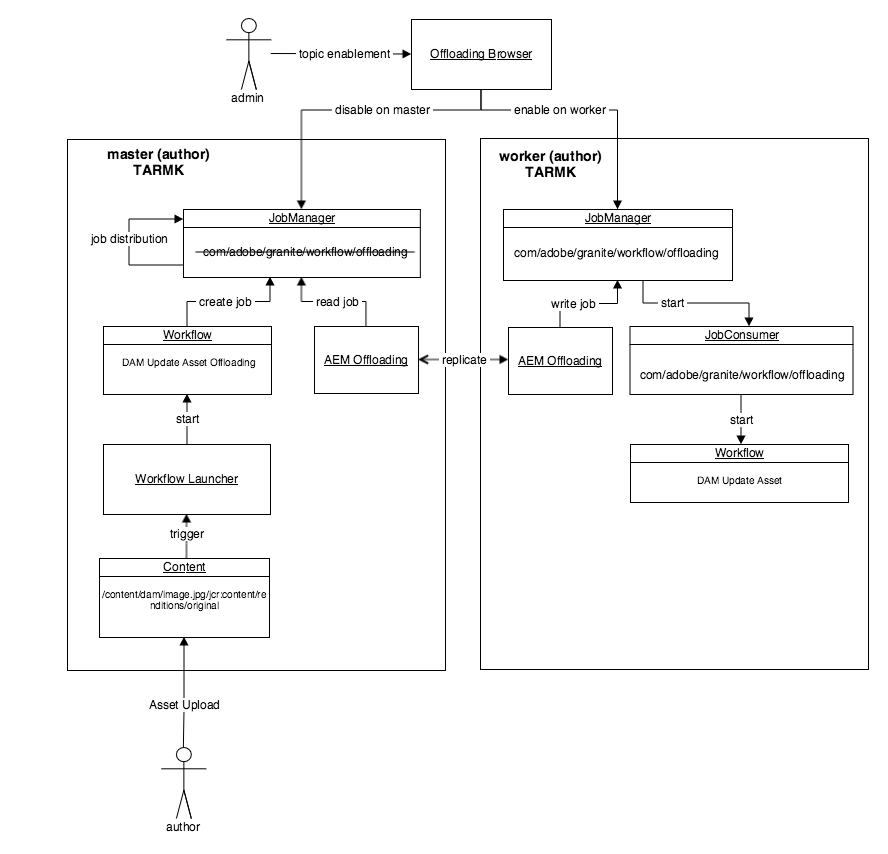

# Assets Offloading Best Practices {#assets-offloading-best-practices}

>[!WARNING]
>
>This feature is deprecated starting with AEM 6.4, and removed in 6.5. Please plan accordingly.

Handling large files and running workflows in Adobe Experience Manager (AEM) Assets can consume considerable CPU, memory, and I/O resources. In particular, the size of assets, workflows, number of users, and frequency of asset ingestion can affect the overall system performance. The most resource-intensive operations include AEM asset ingestion and replication workflows. Intensive use of these workflows on a single AEM authoring instance can adversely impact authoring efficiency.

Offloading these tasks to dedicated worker instances can reduce CPU, memory, and IO overheads. In general, the idea behind offloading is to distribute tasks that consume intensive CPU/Memory/IO resources to dedicated worker instances. The following sections include recommended use cases for Assets offloading.

## AEM Assets Offloading {#aem-assets-offloading}

AEM Assets implements a native asset-specific workflow extension for offloading. It builds on the generic workflow extension that the offloading framework provides, but includes additional assets-specific features in the implementation. The goal of Assets offloading is to efficiently run the DAM Update Asset workflow on an uploaded asset. Assets offloading enables you to gain greater control of the ingestion workflows.

## AEM Assets Offloading Components {#aem-assets-offloading-components}

The following diagram depicts the main components in Asset offloading process:

### DAM Update Asset Offloading workflow {#dam-update-asset-offloading-workflow}

The DAM Update Asset Offloading workflow runs on the master (author) where the user uploads the assets. This workflow is triggered by a regular workflow launcher. Instead of processing the uploaded asset, this offloading workflow creates a new job, using the topic *com/adobe/granite/workflow/offloading*. The offloading workflow adds the name of the target workflow -the DAM Update Asset workflow in this case, and the path of the asset to the job's payload. After creating the offloading job, the offloading workflow on the master waits until the offloading job has run.

### Job manager {#job-manager}

The job manager distributes new jobs to worker instances. When designing the distribution mechanism, it is important to take topic enablement into account. Jobs can only be assigned to instances where the job's topic is enabled. Disable the topic *com/adobe/granite/workflow/offloading* on the master, and enable it on the worker to ensure that the job is assigned to the worker.

### AEM offloading {#aem-offloading}

The offloading framework identifies workflow offloading jobs assigned to worker instances and uses replication to physically transport them, including their payload (for example, images to be ingested), to workers.

### Workflow offloading job consumer {#workflow-offloading-job-consumer}

Once a job is written on the worker, the job manager calls the job consumer responsible for the *com/adobe/granite/workflow/offloading* topic. The job consumer then runs the DAM Update Asset workflow on the asset.

## Sling Topology {#sling-topology}

The Sling topology groups AEM instances and enables them to be aware of each other, independent of the underlying persistence. This characteristic of the Sling topology lets you create topologies for non-clustered, clustered, and mixed scenarios. An instance can expose properties to the entire topology. The framework provides callbacks for listening to changes in the topology (instances and properties). Sling topology provides the foundation for Sling distributed jobs.

### Sling distributed jobs {#sling-distributed-jobs}

Sling distributed jobs facilitate the distribution of jobs among a set of instances that are members of the topology. Sling jobs are based on the idea of capabilities. A job is defined by its job topic. To run a job, an instance must provide a job consumer for a specific job topic. The job topic is the main driver for the distribution mechanism.

Jobs are only distributed to instances that provide a job consumer for the topic. By enabling/disabling job consumers on an instance, you can define the capabilities of an instance and influence the distribution mechanism. The available job consumers of an instance are broadcast to the whole topology.

In this context, the term distribution signifies assignment of a job to a specific instance that provides a job consumer. The assignment to an instance is stored in the repository. In other words, Sling distributed jobs can be assigned to any instance in the topology by default. However, other jobs can only be run by instances that share the same repository. This implies that these jobs can only be run by instances that are part of the same cluster. Jobs assigned to instances of a different cluster are not run.

### Granite offloading framework {#granite-offloading-framework}

The Granite offloading framework complements Sling job distribution to run jobs that are assigned to non-clustered instances. It does not perform any distribution (instance assignment). However, it identifies Sling jobs that were distributed to non-clustered instances, and transports them to the target instance for execution. Currently, offloading uses replication to perform this job transport. To run a job, offloading defines the input and the output, which are then combined with the job to build the job payload.

Sling distributed jobs provide the job and distribution framework. Granite offloading only takes care of the transport for the special case where jobs are distributed to non-clustered instances.

In addition to transport, the offloading framework provides an extension for the workflow engine. It allows the framework to create distributed jobs as part of a workflow and wait for their completion, before the workflow advances. It is implemented using the workflow external step API from the workflow engine. One of the extensions facilitates generic distribution of workflows. Distributing single workflow steps is not supported.

The offloading framework also comes with a user interface (UI) to visualize and control job topic enablement across the entire topology. The UI lets you conveniently configure the topic enablemenet of Sling distributed jobs. You can also set up offloading without the UI.

## General Guidance and Best Practices for Asset Offloading {#general-guidance-and-best-practices-for-asset-offloading}

Every implementation is unique and, as such, there is no one-size-fits-all offloading configuration. The following sections provide guidance and best practises around asset ingestion offloading.

Asset offloading also imposes overheads on the system, including operation overheads. If you encounter issues with the asset ingestion load, Adobe recommends that you first improve the configuration without offloading. Consider the following options before moving to asset offloading:

* Scale up hardware
* Optimize workflows
* Use transient workflows
* Limit the number of cores used for workflows

If you conclude that Assets offloading is an appropriate approach for you, Adobe provides the following guidance:

* A TarMK-based deployment is recommended
* TarMK-based Assets offloading is not designed for extensive horizontal scaling
* Ensure that network performance between the author and workers is satisfactory

### Recommended Assets offloading deployment {#recommended-assets-offloading-deployment}

With AEM and Oak, there are several deployment scenarios possible. For Assets offloading, a TarMK based deployment with a shared datastore is recommended. The following diagram outlines the recommended deployment:

For details around configuring a datastore, see [Configuring node stores and data stores in AEM](../sites-deploying/data-store-config.md).

### Turning off automatic agent management {#turning-off-automatic-agent-management}

Adobe recommends that you turn off automatic agent management because it does not support binary-less replication and can cause confusion when setting up a new offloading topology. Moreover, it does not automatically support the forward replication flow required by binary-less replication.

1. Open Configuration Manager from the URL `http://localhost:4502/system/console/configMgr`.
1. Open the configuration for `OffloadingAgentManager` (`http://localhost:4502/system/console/configMgr/com.adobe.granite.offloading.impl.transporter.OffloadingAgentManager`).
1. Disable automatic agent management.

### Using forward replication {#using-forward-replication}

By default, offloading transport uses reverse replication to pull back the offloaded assets from the worker to the master. Reverse replication agents do not support binary-less replication. You should configure offloading to use forward replication to push the offloaded assets back from worker to master.

1. If you are migrating from the default configuration using reverse replication, disable or delete all agents named " `offloading_outbox`" and " `offloading_reverse_*`" on master and worker, where &ast; represents the Sling id of the target instance.
1. On each worker, create new forward replication agent pointing to the master. The procedure is the same as creating forward agents from master to worker. See [Creating Replication Agents For Offloading](../sites-deploying/offloading.md#creating-replication-agents-for-offloading) for instructions around setting up offloading replication agents.
1. Open configuration for `OffloadingDefaultTransporter`  (`http://localhost:4502/system/console/configMgr/com.adobe.granite.offloading.impl.transporter.OffloadingDefaultTransporter`).
1. Change value of the property `default.transport.agent-to-master.prefix` from `offloading_reverse` to `offloading`.

### Using shared datastore and binary-less replication between author and workers  {#using-shared-datastore-and-binary-less-replication-between-author-and-workers}

The use of binary-less replication is recommendend to reduce the transport overhead for asset offloading. To know how to set up binary-less replication for a shared datastore, see [Configuring Node Stores and Data Stores in AEM](/help/sites-deploying/data-store-config.md). The procedure is not different for Assets offloading, except that it involves other replication agents. Because binary-less replication only works with forward replication agents, you should also use forward replication for all offloading agents.

### Turning off transport packages {#turning-off-transport-packages}

By default, offloading creates a content package that contains the offloading job and job payload (the original asset), and transports this single offloading package using a single replication request. Creating these offloading packages is counter productive when using binary-less replication, because binaries are serialized into the package again when creating the package. The use of these transport packages can be turned off, which causes the offloading job and payload be transported in multiple replication requests, one for each payload entry. This way, the benefit of binary-less replication can be utilized.

1. Open the component configuration of *OffloadingDefaultTransporter* component at [http://localhost:4502/system/console/configMgr/com.adobe.granite.offloading.impl.transporter.OffloadingDefaultTransporter](http://localhost:4502/system/console/configMgr/com.adobe.granite.offloading.impl.transporter.OffloadingDefaultTransporter)
1. Disable the property *Replication Package (default.transport.contentpackage)*.

### Disabling the transport of workflow model {#disabling-the-transport-of-workflow-model}

By default, the *DAM Update Asset Offloading* offloading workflow adds the workflow model to call on the worker to the job payload. Because this workflow follows the out-of-the-box *DAM Update Asset* model by default, this additional payload can be removed.

If the workflow model is disabled from the job payload, ensure that you distribute changes to the referenced workflow model using other tools, such as package manager.

To disable the transport of the workflow model, modify the DAM Update Asset Offloading workflow.

1. Open the workflow console from [http://localhost:4502/libs/cq/workflow/content/console.html](http://localhost:4502/libs/cq/workflow/content/console.html).
1. Open the Models tab.
1. Open the DAM Update Asset Offloading workflow model.
1. Open step properties for the DAM Workflow Offloading step.
1. Open the Arguments tab, and unselect the Add Model To Input and Add Model To Output options.
1. Save the changes to the model.

### Optimizing the polling interval {#optimizing-the-polling-interval}

Workflow offloading is implemented using an external workflow on the master, that polls for the completion of the offloaded workflow on the worker. The default polling interval for the external workflow processes is five seconds. Adobe recommends that you increase the polling interval of the Assets offloading step to at least 15 seconds to reduce the offloading overhead on the master.

1. Open the workflow console from [http://localhost:4502/libs/cq/workflow/content/console.html](http://localhost:4502/libs/cq/workflow/content/console.html).  

1. Open the Models tab.
1. Open the DAM Update Asset Offloading workflow model.
1. Open the step properties for the DAM Workflow Offloading step.
1. Open the Commons tab, and adjust the value of the Period property.
1. Save the changes to the model.

## More Resources {#more-resources}

This document focuses on Asset Offloading. Here is some additional documentation on offloading:

* [Offloading Jobs](/help/sites-deploying/offloading.md) 
* [Assets workflow offloader](/help/sites-administering/workflow-offloader.md)

