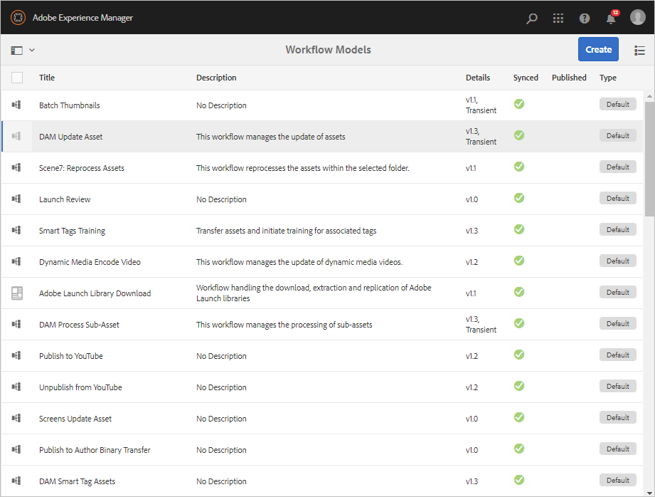
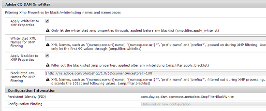

# Process digital assets {#process-assets}

[!DNL Adobe Experience Manager Assets] lets you work on your digital assets in many ways to allow for robust asset processing. You can use the default or customized processing methods to ensure end-to-end business process completion, audits and compliance, discovery and distribution, and basic sanity of your digital assets. You can do the asset management tasks while achieving the required scale and customization.

## Understand workflows {#understand-workflows}

For asset processing, [!DNL Experience Manager] uses workflows. Workflows help automate the business logic or activities. Granular steps to accomplish specific tasks are provided by default and developers can create their own custom steps. These steps can be combined in a logical order to create workflows. For example, a workflow can apply watermark on uploaded images based on a specific criteria, such as folder it is uploaded to, resolution of the image, and so on. Another example is a workflow configured to watermark and simultaneously add metadata, create renditions, add intelligent tags, and publish to a datastore.

## Default workflows available in [!DNL Experience Manager] {#default-workflows}

By default, all uploaded assets are processed using [!UICONTROL DAM Update Asset] workflow. The workflow executes for each uploaded asset and accomplishes basic asset management tasks such as rendition generation, metadata writeback, page extraction, media extraction, and transcoding.

To see the various workflow models available by default, see **[!UICONTROL Tools > Workflow > Models]** in [!DNL Experience Manager].

*Figure: Some of the default workflows available in [!DNL Experience Manager].*

## Apply workflows to process assets {#applying-workflows-to-assets}

Applying workflows to digital assets is the same as for website pages. For a complete guide on how to create and use workflows, see [start workflows](/help/sites-authoring/workflows-participating.md).

Use workflows in digital assets to activate the asset or create watermarks. Many of the workflows for assets are automatically turned on. For example, the workflow that automatically creates a rendition after an image is edited is automatically turned on.

>[!NOTE]
>
>If a workflow available in Classic UI is not available in Touch-enabled UI such as [!UICONTROL Request to Activate] and [!UICONTROL Request to Deactivate], see [make workflow models](/help/sites-developing/workflows-models.md#classic2touchui).

## Apply a workflow to an asset {#apply-a-workflow-to-an-asset}

<!-- 
TBD: Add animated GIF for these steps instead of all these screenshots.
-->
To apply a workflow to an asset, follow these steps:

1. Navigate to the location of the asset for which you want to start a workflow, and click the asset to open the asset page. Select **[!UICONTROL Timeline]** from the menu to display the timeline.

   

1. Click **[!UICONTROL Actions]** at the bottom to open the list of actions available for the asset.

1. Click **[!UICONTROL Start Workflow]** from the list.

1. In the **[!UICONTROL Start Workflow]** dialog, select a workflow model from the list.

1. (Optional) Specify a title for the workflow that can be used to refer the workflow's instance.

   

1. Click **[!UICONTROL Start]** and then click **[!UICONTROL Proceed]**. Each step of workflow is displayed in the timeline as an event.

   

## Apply a workflow to multiple assets {#applying-a-workflow-to-multiple-assets}

1. From the [!DNL Assets] console, navigate to the location of the assets for which you want to start a workflow, and select the assets. Select **[!UICONTROL Timeline]** from the menu to display the timeline.

   

1. Click **[!UICONTROL Actions]**  at the bottom.
1. Click **[!UICONTROL Start Workflow]**. In the **[!UICONTROL Start Workflow]** dialog, select a workflow model from the list.

   

1. (Optional) Specify a title for the workflow, which can be used to reference the workflow instance.
1. Click **[!UICONTROL Start]** and then click **[!UICONTROL Confirm]** in the dialog. The workflow runs on all the assets that you selected.

## Apply a workflow to multiple folders {#applying-a-workflow-to-multiple-folders}

The procedure to apply a workflow to multiple folders is similar to the procedure to apply a workflow to multiple assets. Select the folders in the [!DNL Assets] interface, and perform steps 2-7 of the procedure [apply a workflow to multiple assets](/help/assets/assets-workflow.md#applying-a-workflow-to-multiple-assets).

## Apply a workflow to a collection {#applying-a-workflow-to-a-collection}

See [apply a workflow on a collection](/help/assets/manage-collections.md#running-a-workflow-on-a-collection).

## Auto-start a workflow to process assets conditionally {#auto-execute-workflow-on-some-assets}

Administrators can configure workflow to automatically execute and process assets based on pre-defined conditions. The functionality is useful for line-of-business users and marketers, for example, to create custom workflow on specific folders. Say all assets from an agency's photoshoot can be watermarked or all assets uploaded by a freelancer can be processed to create specific renditions.

For a workflow model, users can create a workflow launcher that executes it. A workflow launcher monitors changes in the content repository and executes the workflow when the pre-defined conditions are fulfilled. Administrators can provide access to marketers to create the workflows and configure launcher. Users can modify the default [!UICONTROL DAM Update Asset] workflow to add the extra steps required to process specific assets. The workflow executes on all newly uploaded assets. Use one of the following approaches to limit the execution of the extra steps on specific assets:

* Make a copy of the [!UICONTROL DAM Update Asset] workflow and modify it to execute on a specific folder hierarchy. This approach is useful for a few folders.
* The extra processing steps can be added using an [OR split](/help/sites-developing/workflows-step-ref.md#or-split) as conditionally applicable to as many folders as required.

## Best practices and limitations {#best-practices-limitations-tips}

* Consider your needs for all types of renditions when designing workflows. If you do not foresee the need of a rendition in the future, remove its creation step from the workflow. Renditions cannot be deleted in bulk afterwards. Undesired renditions may take up h storage space after prolonged use of [!DNL Experience Manager]. For individual assets, you can remove renditions manually from the user interface. For multiple assets, you can either customize [!DNL Experience Manager] to delete specific renditions or delete the assets and upload those again.
* By default, [!UICONTROL DAM Update Asset] workflow includes some steps to create thumbnails and web renditions. If any default renditions are removed from the workflow, the user interface of [!DNL Assets] does not render properly.

>[!MORELIKETHIS]
>
>* [Apply and participate in workflows](/help/sites-authoring/workflows.md)
>* [Create workflow models and extend workflow functionality](/help/sites-developing/workflows.md)
>* [Methods to execute workflows](/help/sites-administering/workflows-starting.md)
>* [Workflow best practices](/help/sites-developing/workflows-best-practices.md)
