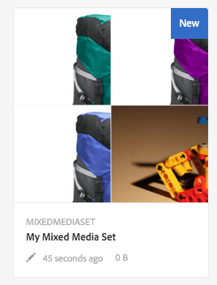

# Apply workflows to process assets {#applying-workflows-to-assets}

Applying workflows to digital assets is the same as for website pages. For a complete guide on how to create and use workflows in AEM, see [start workflows](/help/sites-authoring/workflows-participating.md).

Use workflows in digital assets to activate the asset or create watermarks. Many of the workflows for assets are automatically turned on. For example, the workflow that automatically creates a rendition after an image is edited is automatically turned on.

If a workflow available in Classic UI is not available in Touch-enabled UI, like Request to Activate and Request to Deactivate, see [make workflow models](/help/sites-developing/workflows-models.md#classic2touchui).

## Applying a workflow to an AEM asset {#applying-a-workflow-to-an-aem-asset}

For details of applying a workflow to an AEM asset, see [start a workflow on an asset](/help/assets/managing-assets-touch-ui.md#starting-a-workflow-on-an-asset).

## Applying a workflow to multiple assets {#applying-a-workflow-to-multiple-assets}

1. From the Assets console, navigate to the location of the assets for which you want to start a workflow, and select the assets.
1. Click/ tap the Experience Manager logo, and the choose **[!UICONTROL Timeline]** from the menu to display the timeline.

   

1. Click/ tap **[!UICONTROL Actions]** at the bottom.

   

1. Tap **[!UICONTROL Start Workflow]**.
1. In the **[!UICONTROL Start Workflow]** dialog, select a workflow model from the list.

   

1. (Optional) Specify a title for the workflow, which can be used to reference the workflow instance.
1. Tap **[!UICONTROL Start]** and then tap **[!UICONTROL Confirm]** in the dialog. The workflow runs on all the assets you selected.

## Applying a workflow to multiple folders {#applying-a-workflow-to-multiple-folders}

The procedure to apply a workflow to multiple folders is similar to the procedure to apply a workflow to multiple assets. Select the folders in the Assets console, and perform steps 2-7 of the procedure [apply a workflow to multiple assets](/help/assets/assets-workflow.md#applying-a-workflow-to-multiple-assets).

## Applying a workflow to a collection {#applying-a-workflow-to-a-collection}

See [apply a workflow on a collection](/help/assets/managing-collections-touch-ui.md#running-a-workflow-on-a-collection).
