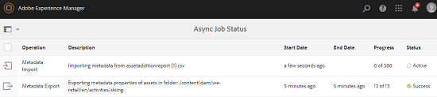
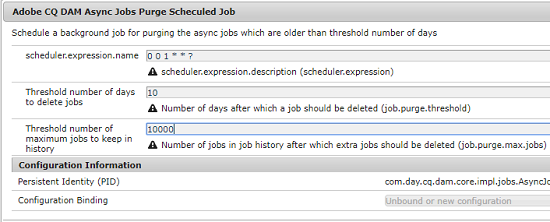

# Asynchronous operations {#asynchronous-operations}

To reduce adverse impact on performance, Adobe Experience Manger (AEM) Assets processes certain long-running and resource-intensive asset operations asynchronously. These operations include:

* Deleting many assets.
* Moving many assets or assets with many references.
* Exporting/importing asset metadata in bulk.

Asynchronous processing involves enqueuing multiple jobs and eventually running them in a serial manner subject to the availability of system resources.

You can view the status of asynchronous jobs from the **Async Job Status** page.

>[!NOTE]
>
>By default, jobs in AEM Assets run in parallel. If N is the number of CPU cores, N/2 jobs can run in parallel, by default. To use custom settings for the job queue, modify the **Async Operation Default Queue** configuration from the web console. For more information, see [Queue Configurations](https://sling.apache.org/documentation/bundles/apache-sling-eventing-and-job-handling.html#queue-configurations).

## Monitoring the status of asynchronous operations {#monitoring-the-status-of-asynchronous-operations}

Whenever AEM Assets processes an operation asynchronously, you receive a notification at your inbox and through email.

To view the status of the asynchronous operations in detail, navigate to the **Async Job Status** page.

1. Tap/click the AEM logo, and go **[!UICONTROL Assets > Jobs]**.
1. In the **[!UICONTROL Async Job Status]** page, review the details of the operations.

   

   To ascertain the progress of a particular operation, see the value in the **[!UICONTROL Status]** column. Depending upon the progress, one of the following statuses is displayed:

   **Active**: The operation is being processed

   **Success**: The operation is complete

   **Fail**: The operation could not be processed

   **Scheduled**: The operation is scheduled for processing a later time

1. To stop an active operation, select it from the list and tap/click the **[!UICONTROL Stop]** icon from the toolbar.

   

1. To view extra details, for example description and logs, select the operation and tap/click the **[!UICONTROL Open]** icon from the toolbar.

   

   The job details page is displayed.

   

1. To delete the operation from the list, select **[!UICONTROL Delete]** from the toolbar. To download the details in a CSV file, tap/click the **[!UICONTROL Download]** icon.

   >[!NOTE]
   >
   >You cannot delete a job if its status is either active or queued.

## Purging completed jobs {#purging-completed-jobs}

AEM Assets runs a purge job everyday at 1:00 AM to delete completed asynchronous jobs that are more than a day old.

You can modify the schedule for the purge job and the duration for which details of completed jobs are retained before they are deleted. You can also configure the maximum number of completed jobs for which details are retained at any point of time.

1. Tap/click the AEM logo, and go to **[!UICONTROL Tools > Operations > Web Console]**.
1. Open the **[!UICONTROL Adobe CQ DAM Async Jobs Purge Scheduled]** job.
1. Specify the threshold number of days after which completed jobs are deleted and the maximum number of jobs for which details are retained in history.

   

1. Save the changes.

## Configuring thresholds for asynchronous processing {#configuring-thresholds-for-asynchronous-processing}

You can configure the threshold number of assets or references for AEM Assets to process a particular operation asynchronously.

### Configuring thresholds for asynchronous delete operations {#configuring-thresholds-for-asynchronous-delete-operations}

If the number of assets or folders to be deleted exceed the threshold number, the delete operation is performed asynchronously.

1. Tap/click the AEM logo, and go to **[!UICONTROL Tools > Operations > Web Console]**.
1. From the web console, open the **[!UICONTROL Async Delete Operation Job Processing]** configuration.
1. In the **[!UICONTROL Threshold number of assets]** box, specify the threshold number of assets/folders for asynchronous processing of delete operations.

   

1. Save the changes.

### Configuring thresholds for asynchronous move operations {#configuring-thresholds-for-asynchronous-move-operations}

If the number of assets/folders or references to be moved exceed the threshold number, the move operation is performed asynchronously.

1. Tap/click the AEM logo, and go to **[!UICONTROL Tools > Operations > Web Console]**.
1. From the web console, open the **[!UICONTROL Async Move Operation Job Processing]** configuration.
1. In the **[!UICONTROL Threshold number of assets/references]** box, specify the threshold number of assets/folders or references for asynchronous processing of move operations.

   

1. Save the changes.

