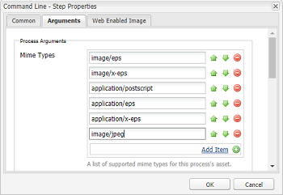
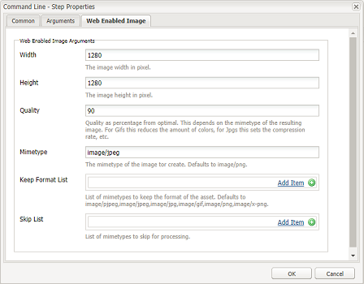
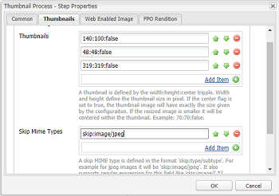

# Install and configure ImageMagick to work with AEM Assets{#install-and-configure-imagemagick-to-work-with-aem-assets}

ImageMagick is a software plug-in to create, edit, compose, or convert bitmap images. It can read and write images in various formats (over 200) including PNG, JPEG, JPEG-2000, GIF, TIFF, DPX, EXR, WebP, Postscript, PDF, and SVG. Use ImageMagick to resize, flip, mirror, rotate, distort, shear, and transform images. You can also adjust image colors, apply various special effects, or draw text, lines, polygons, ellipses, and curves using ImageMagick.

Use the Adobe Experience Manager (AEM) media handler from the command line to process images through ImageMagick. To work with various file formats using ImageMagick, see [Assets file formats best practices](/help/assets/assets-file-format-best-practices.md). To know about all supported file formats, see [Assets supported formats](/help/assets/assets-formats.md).

To process large files using ImageMagick, consider higher than usual memory requirements, potential changes required to IM policies, and the overall impact on the performance. The memory requirements are dependent on various factors like resolution, bit depth, color profile, and file format. If you intend to process very large files using ImageMagick, properly benchmark the AEM server. Some helpful resources are provided at the end.

>[!NOTE]
>
>If you are using AEM on Adobe Managed Services (AMS), reach out to Adobe Support if you plan to process lots of large PSD or PSB files.

## Installing ImageMagick {#installing-imagemagick}

Multiple versions of ImageMagic installation files are available for various operating systems. Use the appropriate version for your operating system.

1. Download the appropriate [ImageMagick installation files](https://www.imagemagick.org/script/download.php) for your operating system.
1. To install ImageMagick on the disk hosting the AEM server, launch the installation file.

1. Set the path Environment variable to the ImageMagic installation directory.
1. To check whether the installation was successful, execute the `identify -version` command.

## Set up the command line process step {#set-up-the-command-line-process-step}

You can set up the command line process step for your particular use case. Perform these steps to generate a flipped image and thumbnails (140x100, 48x48, 319x319, and 1280x1280) each time you add a JPEG image file to `/content/dam` on the AEM server:

1. On the AEM server, go to the Workflow console ( `https://[*AEM server*]:[*Port*]/workflow`) and open the **[!UICONTROL DAM Update Asset]** workflow model.
1. From the **[!UICONTROL DAM Update Asset]** workflow model, open the **[!UICONTROL EPS thumbnails (powered by ImageMagick)]** step.
1. In the **[!UICONTROL Arguments tab]**, add `image/jpeg` to the **[!UICONTROL Mime Types]** list.

   

1. In the **[!UICONTROL Commands]** box, enter the following command:

   `convert ./${filename} -flip ./${basename}.flipped.jpg`

1. Select the **[!UICONTROL Delete Generated Rendition]** and **[!UICONTROL Generate Web Rendition]** flags.

   

1. In the **[!UICONTROL Web Enabled Image]** tab, specify the details for the rendition with dimensions 1280x1280 pixels. In addition, specify i*mage/jpeg* in the **[!UICONTROL Mimetype]** box.

   

1. Tap/click **[!UICONTROL OK]** to save the changes.

   >[!NOTE]
   >
   >The `convert` command may not run with certain Windows versions (for example Windows SE), because it conflicts with the native `convert` utility that is part of Windows installation. In this case, mention the complete path for the ImageMagick utility. For example, specify,
   >
   >
   >`"C:\Program Files\ImageMagick-6.8.9-Q16\convert.exe" -define jpeg:size=319x319 ./${filename} -thumbnail 319x319 cq5dam.thumbnail.319.319.png`

1. Open the **[!UICONTROL Process Thumbnails]** step, and add the MIME type `image/jpeg` under **[!UICONTROL Skip Mime Types]**.

   

1. In the **[!UICONTROL Web Enabled Image]** tab, add the MIME type `image/jpeg` under the **[!UICONTROL Skip List]**. Tap/click **[!UICONTROL OK]** to save the changes.

   

1. Save the workflow.
1. To check whether ImageMagic is able to process images properly, upload a JPG image to AEM Assets. Verify whether a flipped image and the renditions are generated for it.

## Mitigating security vulnerabilities {#mitigating-security-vulnerabilities}

There are multiple security vulnerabilities associated with using ImageMagick to process images. For example, processing user-submitted images involves the risk of remote code execution (RCE).

In addition, various image-processing plug-ins depend on the ImageMagick library, including but not limited to PHP’s imagick, Ruby’s rmagick and paperclip, and nodejs’s imagemagick.

If you use ImageMagick or an affected library, Adobe recommends that you mitigate the known vulnerabilities by performing at least one of the following tasks (but preferably both):

1. Verify that all image files begin with the expected ["magic bytes"](https://en.wikipedia.org/wiki/List_of_file_signatures) corresponding to the image file types you support before sending them to ImageMagick for processing.
1. Use a policy file to disable the vulnerable ImageMagick coders. The global policy for ImageMagick is found at `/etc/ImageMagick`.

