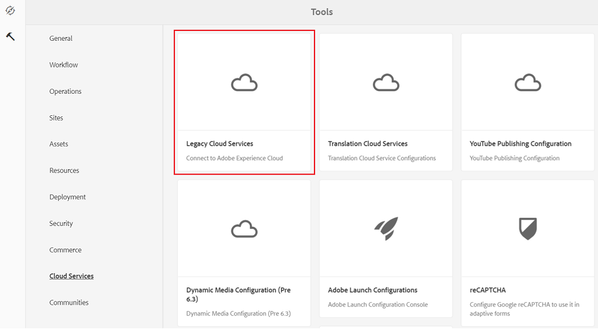
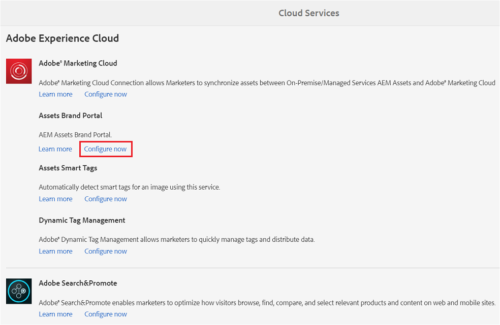
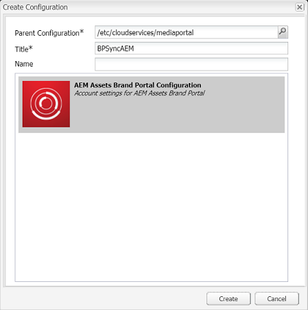
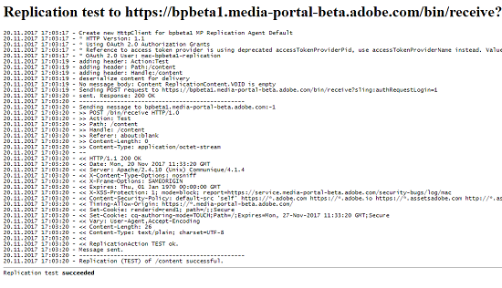
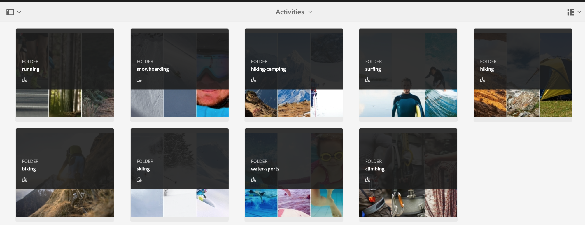

# Configure AEM Assets integration with Brand Portal {#configure-aem-assets-integration-with-brand-portal}

Learn how to integrate AEM Assets with Brand Portal for publishing assets and Collections to Brand Portal.

If you are an Adobe Experience Manager (AEM) Assets Brand Portal customer, you can integrate AEM Assets with Brand Portal to enable publishing of assets to Brand Portal. You can set up this integration through Adobe.io interface.

> [!Note]
>
>Adobe recommends upgrading to AEM 6.4.1.0 or later to ensure that AEM Assets Brand Portal is integrated with AEM Assets. A limitation in AEM 6.4 gives an error while configuring integration with Brand Portal and replication fails.

First, create an application, which includes an authentication mechanism, in the Marketing Cloud public gateway. Next, create a profile in your AEM Assets instance using the application ID that you obtain from the gateway.

Use this configuration to publish assets from AEM Assets to Brand Portal. At the backend, the AEM server authenticates your profile with the gateway and then integrates AEM Assets with Brand Portal.

>[!NOTE]
>
>The UI for configuring oAuth integrations is hosted in [https://legacy-oauth.cloud.adobe.io/](https://legacy-oauth.cloud.adobe.io/), which was earlier hosted in [https://marketing.adobe.com/developer/](https://marketing.adobe.com/developer/).

## Create JWT application {#create-jwt-application}

1. Log in to [https://legacy-oauth.cloud.adobe.io/](https://legacy-oauth.cloud.adobe.io/) with your Adobe ID. You reach [JWT  Applications] page.

   >[!NOTE]
   >
   >You can create an application ID only if you are the system administrator of your organization. Tenant is the technical name for your organization that is registered with Adobe Marketing Cloud.

2. Select **[!UICONTROL Add Application]** to create an application.
3. Specify an **[!UICONTROL Application Name]** and an optional **[!UICONTROL Description]**.
4. From the **[!UICONTROL Organization]** list, select the organization for which you want to synchronize assets.
5. From the **[!UICONTROL Scope]** list, select **[!UICONTROL dam-read]**, **[!UICONTROL dam-sync]**, **[!UICONTROL dam-write]**, and **[!UICONTROL cc-share]**.
6. Tap/ click **[!UICONTROL Add]**. A JWT Service application is created. You can edit the application and Save.
7. Copy the Application ID that is generated for the new application.

   >[!NOTE]
   >
   >Ensure that you do not inadvertently copy the application secret instead of application ID.

## Create a new cloud configuration {#create-a-new-cloud-configuration}

1. From the **[!UICONTROL Navigation]** page of your local AEM Assets instance, tap/click the **[!UICONTROL Tools]** icon on the left.

   

2. Navigate to **[!UICONTROL Cloud Services > Legacy Cloud Services]**.

   

3. In the [Cloud Services] page, locate the **[!UICONTROL Assets Brand Portal]** service under **[!UICONTROL Adobe Experience Cloud]**.

   

4. Tap/ click the **[!UICONTROL Configure now]** link below the service to display the [Create Configuration] dialog.
5. In the [Create Configuration] dialog, specify a title and name for the new configuration and tap/click **[!UICONTROL Create]**.

   

6. In the [AEM Assets Brand Portal Replication] dialog, specify the URL of your organization in the [Tenant URL] field.
7. In the [Client ID] field, paste the application ID you copied at the end of the procedure [Create an application](#create-jwt-application). Click **[!UICONTROL OK]**.

   

8. To make the assets (published from AEM) publicly available to general users of Brand Portal, enable the **[Public Folder Publish]** check box .

   >[!NOTE]
   >
   >The option to enable **[!UICONTROL Public Folder Publish]** is available in AEM 6.3.2.1 onwards.

9. From the [Brand Portal Configuration] page, tap/click **[!UICONTROL Display Public Key]** to display the public key generated for your instance.

   

   Alternatively, click **[!UICONTROL Download Public Key for OAuth Gateway]** to download the file containing the public key. Then, open the file to display the public key.

## Enable integration {#enable-integration}

1. Display the public key using one of the following methods mentioned in the last step of the procedure [Add a new configuration to Marketing Cloud](#create-a-new-cloud-configuration).

    * Click the **[!UICONTROL Display Public Key]** button to display the key.
    * Open the downloaded file containing the key.

2. Open the Marketing Cloud Developer Connection interface and click the application you created in [Create an application](#create-jwt-application).
3. Paste the public key into the **[!UICONTROL Public Key]** field of the configuration interface
4. Tap/click **[!UICONTROL Save]**. A message confirms that the application has been updated.

## Test the integration {#test-the-integration}

1. From the **[!UICONTROL Navigation]** page of your local AEM Assets instance, click the **[!UICONTROL Tools]** icon on the left.

   

2. Navigate to **[!UICONTROL Deployment > Replication]**.

   

3. In the [!UICONTROL Replication] page, tap/click **[!UICONTROL Agents on author]**.

   

4. To verify the connection between AEM Author and Brand Portal, open any of the four replication agents and click **[!UICONTROL Test Connection]**.

   >[!NOTE]
   >
   >The replication agents work in parallel and share the job distribution equally, thereby increasing the publishing speed by four times the original speed. After the cloud service is configured, additional configuration is not required to enable the replication agents that are activated by default to enable parallel publishing of multiple assets.

   >[!NOTE]
   >
   >Avoid disabling any of the replication agents, as it can cause the replication of some of the assets to fail.

   

5. Look at the bottom of the test results to verify that the replication succeeded.

   

After replication succeeds, you can publish assets, folders, and Collections to Brand Portal. For details, see:

* [Publish assets and folders to Brand Portal](brand-portal-publish-folder.md)
* [Publish Collections to Brand Portal](brand-portal-publish-collection.md)

## Publish assets to Brand Portal {#publish-assets-to-brand-portal}

After replication succeeds, you can publish assets, folders, and Collections  to  Brand Portal. To publish assets to Brand Portal, follow these steps:

>[!NOTE]
>
>Adobe recommends staggered publishing, preferably during non-peak hours, so that the AEM author does not occupy excess resources.

1. From the Assets console, hover over the desired assets and select **[!UICONTROL Publish]** option from the quick actions.

   Alternatively, select the assets you want to publish to Brand Portal.

   

2. To publish the assets to Brand Portal, following two options are available:
    * [Publish assets immediately](#publish-now)
    * [Publish assets later](#publish-later)

### Publish assets now {#publish-now}

 To publish the selected assets to Brand Portal, do either of the following:

* From the toolbar, select **[!UICONTROL Quick Publish]**. Then from the menu, select **[!UICONTROL Publish to Brand Portal]**.

* From the toolbar, select **[!UICONTROL Manage Publication]**.

    1. Then from the **[!UICONTROL Action]** select **[!UICONTROL Publish to Brand Portal]**, and from **[!UICONTROL Scheduling]** select **[!UICONTROL Now]**. Tap/ click **[!UICONTROL Next].**

    2. Within **[!UICONTROL Scope]**, confirm your selection and tap/ click **[!UICONTROL Publish to Brand Portal]**.

A message appears stating that the assets have been queued up for publishing to Brand Portal. Log in to the Brand Portal interface to see the published assets.

### Publish assets later {#publish-later}

To schedule publishing the assets to Brand Portal to a later date or time:

1. Once you have selected assets/ folders to publish, select **[!UICONTROL Manage Publication]** from the tool bar at the top.
2. On **[!UICONTROL Manage Publication]** page, select **[!UICONTROL Publish to Brand Portal]** from **[!UICONTROL Action]** and select **[!UICONTROL Later]** from **[!UICONTROL Scheduling]**.

    

3. Select an **[!UICONTROL Activation date]** and specify time. Tap/ click **[!UICONTROL Next]**.
4. Select an **[!UICONTROL Activation date]** and specify time. Tap/ click **[!UICONTROL Next]**.
5. Specify a Workflow title under **[!UICONTROL Workflows]**. Tap/ click **[!UICONTROL Publish Later]**.

    

Now, log in to Brand Portal to see whether the published assets are available on Brand  Portal interface.

   
