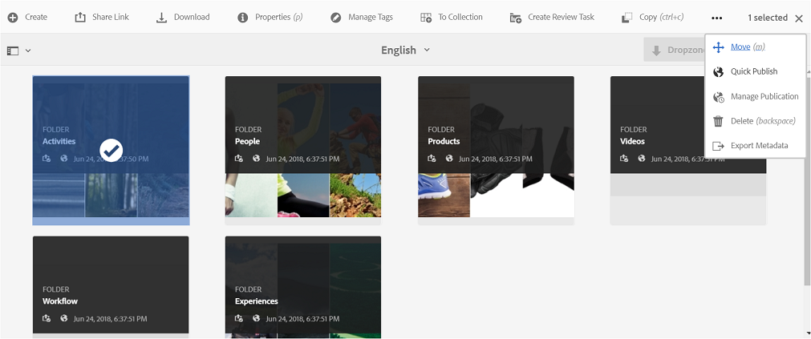
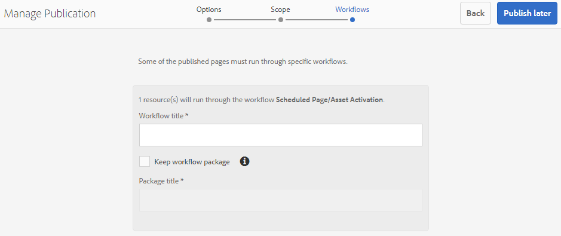
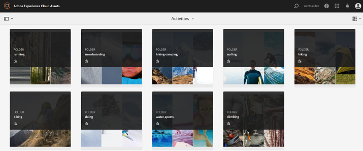

# Publish assets to Brand Portal {#publish-assets-to-brand-portal}

| Version | Article link |
| -------- | ---------------------------- |
| AEM as a Cloud Service  |    [Click here](https://experienceleague.adobe.com/docs/experience-manager-cloud-service/content/assets/brand-portal/publish-to-brand-portal.html?lang=en)                  |
| AEM 6.5     | This article         |

As an Adobe Experience Manager (AEM) Assets administrator, you can publish assets and folders to the AEM Assets Brand Portal instance (or schedule the publish workflow to a later date/time) for your organization. However, you must first configure AEM Assets with Brand Portal. For details, see [Configure AEM Assets with Brand Portal](/help/assets/configure-aem-assets-with-brand-portal.md).

After replication succeeds, you can publish assets, folders, and Collections  to  Brand Portal. To publish assets to Brand Portal, follow these steps:

>[!NOTE]
>
>Adobe recommends staggered publishing, preferably during non-peak hours, so that the AEM author does not occupy excess resources.

1. From the Assets console, select the assets/folder that you want to publish and click **[!UICONTROL Quick Publish]** option from the toolbar.

   Alternatively, select the assets you want to publish to Brand Portal.

   

1. To publish the assets to Brand Portal, following two options are available:
    * [Publish assets immediately](#publish-to-bp-now)
    * [Publish assets later](#publish-to-bp-now)

## Publish assets now {#publish-to-bp-now}

To publish the selected assets to Brand Portal, do either of the following:

* From the toolbar, select **[!UICONTROL Quick Publish]**. Then from the menu, select **[!UICONTROL Publish to Brand Portal]**.

* From the toolbar, select **[!UICONTROL Manage Publication]**.

  1. Then from the **[!UICONTROL Action]** select **[!UICONTROL Publish to Brand Portal]**, and from **[!UICONTROL Scheduling]** select **[!UICONTROL Now]**. Click **[!UICONTROL Next]**.

  2. Within **[!UICONTROL Scope]**, confirm your selection and click **[!UICONTROL Publish to Brand Portal]**.

A message appears stating that the assets have been queued up for publishing to Brand Portal. Login to the Brand Portal interface to see the published assets.

## Publish assets later {#publish-to-bp-later}

To schedule publishing the assets to Brand Portal to a later date or time:

1. Once you have selected assets/ folders to publish, select **[!UICONTROL Manage Publication]** from the tool bar at the top.
  
1. On **[!UICONTROL Manage Publication]** page, select **[!UICONTROL Publish to Brand Portal]** from **[!UICONTROL Action]** and select **[!UICONTROL Later]** from **[!UICONTROL Scheduling]**.

    

1. Select an **[!UICONTROL Activation date]** and specify time. Click **[!UICONTROL Next]**.

1. Select an **Activation date** and specify time. Click **Next**.

1. Specify a **[!UICONTROL Workflow title]** in **[!UICONTROL Workflows]**. Click **[!UICONTROL Publish Later]**.

    

Now, login to Brand Portal to see whether the published assets are available on  Brand  Portal interface.

   
