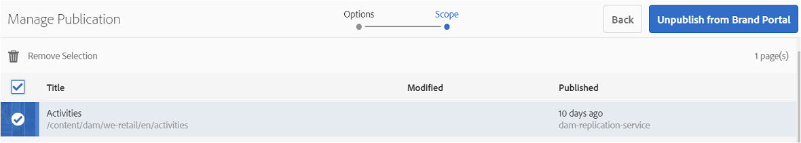
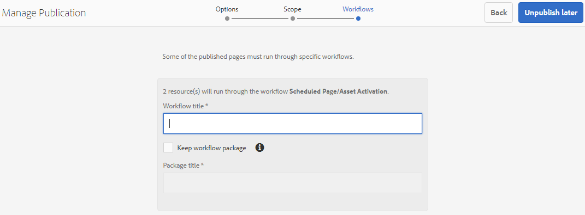

# Publish folders to Brand Portal{#publish-folders-to-brand-portal}

As an Adobe Experience Manager (AEM) Assets administrator, you can publish assets and folders to the AEM Assets Brand Portal instance (or schedule the publish workflow to a later date/time) for your organization. However, you must first integrate AEM Assets with Brand Portal. For details, see [Configure AEM Assets with Brand Portal](/help/assets/configure-aem-assets-with-brand-portal.md).

After you publish an asset or folder, it is available to users in Brand Portal.

If you make subsequent modifications to the original asset or folder in AEM Assets, the changes are not reflected in Brand Portal until you republish the asset or folder. This feature ensures that work-in-progress changes are not available in Brand Portal. Only approved changes that are published by an administrator are available in Brand Portal.

## Publish folders to Brand Portal {#publish-folders-to-brand-portal-1}

1. From the AEM Assets interface, hover over the desired folder and select **Publish** option from the quick actions.

   Alternatively, select the desired folder and follow the further steps.

   

1. **Publish folders now**

   To publish the selected folders to Brand Portal, do either of the following:

    * From the toolbar, select **Quick Publish**. Then from the menu, select **Publish to Brand Portal**.

    * From the toolbar, select **Manage Publication**.

    1. From **Action** select **Publish to Brand Portal**, from **Scheduling** select **Now**, and click **Next.**
    1. Confirm your selection in **Scope** and click **Publish to Brand Portal**.

   A message appears stating that the folder has been queued up for publishing to Brand Portal. Log in to the Brand Portal interface to see the published folder.

   **Publish folders later**

   To schedule the publish to Brand Portal workflow of asset folders to a later date or time:

    1. Once you have selected assets/ folders to publish, select **Manage Publication** from the tool bar at the top.
    1. From **Action** select **Publish to Brand Portal**, from **Scheduling** select **Later**.

       

    1. Select an **Activation date** and specify time. Click **Next**.
    1. Confirm your selection in **Scope**. Click **Next**.
    1. Specify a Workflow title under **Workflows**. Click **Publish Later**.

       

## Unpublish folders from Brand Portal {#unpublish-folders-from-brand-portal}

You can remove any asset folder published to Brand Portal by unpublishing it from AEM Author instance. After you unpublish the original folder, its copy is no longer available to Brand Portal users.

You have the option to unpublish folders from Brand Portal quickly or schedule it for a later date and time. To unpublish asset folders from Brand Portal:

1. From the AEM Assets interface in AEM Author instance, select the folder you want to unpublish.

   

1. From the toolbar, Click **Manage Publication**.

1. **Unpublish from Brand Portal now**

   To quickly unpublish the desired folder from Brand Portal:

    1. From the toolbar, select **Manage Publication**.
    1. From **Action** select **Unpublish from Brand Portal**, from **Scheduling** select **Now**, and click **Next.**
    1. Confirm your selection in **Scope** and click **Unpublish from Brand Portal**.

   

   **Unpublish from Brand Portal later**

   To schedule the publishing of a folder from Brand Portal to a later date and time:

    1. From the toolbar, select **Manage Publication**.
    1. From **Action** select **Unpublish from Brand Portal**, and from **Scheduling** select **Later**.
    1. Select an **Activation date** and specify the time. Click **Next**.
    1. Confirm your selection in **Scope** and click **Next**.
    1. Specify a **Workflow title** in **Workflows**. Click **Unpublish Later.**

       

>[!NOTE]
>
>The procedure to publish/unpublish an asset to/from Brand Portal is similar to the corresponsing procedure for a folder.
