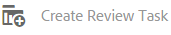
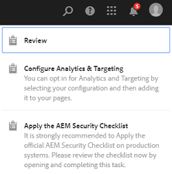

# Review folder assets and collections {#review-folder-assets-and-collections}

Set up review workflows for assets within a folder or a collection and share it with reviewers or creative partners to seek feedback.

Adobe Experience Manager (AEM) Assets lets you set up an ad-hoc review workflow for assets within a folder or collection, and share it with reviewers or creative partners to seek feedback.

You can either associate the review workflow with a project or create an independent review task.

After you share the assets, reviewers can approve or reject them. Notifications are sent at various stages of the workflow to notify intended recipients regarding the completion of various tasks. For example, when you share a folder or collection, the reviewer receives a notification that a folder/collection has been shared for review.

After the reviewer completes the review (approves or rejects assets), you receive a review completion notification.

## Creating a review task for folders {#creating-a-review-task-for-folders}

1. From the Assets user interface, select the folder for which you want to create a review task.
1. From the toolbar, tap/click the **[!UICONTROL Create Review Task]** icon to open the **[!UICONTROL Review Task]** page. If you cannot see the icon in the toolbar, tap/click **[!UICONTROL More]** and then select the icon.

   

1. (Optional) From the **[!UICONTROL Project]** list, select the project to which you want to associate the review task. By default, the **[!UICONTROL None]** option is selected. If you do not want to associate any project with the review task, retain this selection.

   >[!NOTE]
   >
   >Only the projects for which you have Editor-level permissions (or higher) are visible in the **[!UICONTROL Projects]** list.

1. Enter a name for the review task, and select an approver from the **[!UICONTROL Assign To]** list.

   >[!NOTE]
   >
   >The members/groups of the selected project are available as approvers in the **[!UICONTROL Assign To]** list.

1. Enter a description, the task priority, and the due date for the review task.

   

1. In the Advanced tab, enter a label to be used to create the URI. 

   

1. Tap/click **[!UICONTROL Submit]**, and then tap/click **[!UICONTROL Done]** to close the confirmation message. A notification for the new task is sent to the approver.
1. Log in to AEM Assets as an Approver and navigate to the Assets UI. To approve assets, click/tap the **[!UICONTROL Notifications]** icon and then select the review task from the list.

   

1. In the **[!UICONTROL Review Task]** page, examine the details of the review task, and then tap/click **[!UICONTROL Review]**.
1. In the **[!UICONTROL Review Task]** page, select assets, and tap/click the **[!UICONTROL Approve/Reject]** icon to approve or reject, as appropriate.

   

1. Tap/click the **[!UICONTROL Complete]** icon from the toolbar. In the dialog, enter a comment and tap/click  **[!UICONTROL Complete]** to confirm.
1. Navigate to the Assets UI, and open the folder. The approval status icons for the assets appear in both the Card and List views.

   **Card view**

   

   **List view**

   

## Creating a review task for collections {#creating-a-review-task-for-collections}

1. From the Collections page, select the collection for which you want to create a review task.
1. From the toolbar, tap/click the **[!UICONTROL Create Review Task]** icon to open the **[!UICONTROL Review Task]** page. If you cannot see the icon in the toolbar, tap/click **[!UICONTROL More]** and then select the icon.

   

1. (Optional) From the **[!UICONTROL Project]** list, select the project to which you want to associate the review task. By default, the **[!UICONTROL None]** option is selected. If you do not want to associate any project with the review task, retain this selection.

   >[!NOTE]
   >
   >Only the projects for which you have Editor-level permissions (or higher) are visible in the **[!UICONTROL Projects]** list.

1. Enter a name for the review task, and select an approver from the **[!UICONTROL Assign To]** list.

   >[!NOTE]
   >
   >The members/groups of the selected project are available as approvers in the **[!UICONTROL Assign To]** list.

1. Enter a description, the task priority, and the due date for the review task.

   

1. Tap/click **[!UICONTROL Submit]**, and then tap/click **[!UICONTROL Done]** to close the confirmation message. A notification for the new task is sent to the approver.
1. Log in to AEM Assets as an Approver and navigate to the Assets console. To approve assets, tap/click the **[!UICONTROL Notifications]** icon and then select the review task from the list.
1. In the **[!UICONTROL Review Task]** page, examine the details of the review task, and then tap/click **[!UICONTROL Review]**.
1. All the assets in the collection are visible on the review page. Select the assets and tap/click the **[!UICONTROL Approve/Reject]** icon to approve or reject assets, as appropriate.

   

1. Tap/click the **[!UICONTROL Complete]** icon from the toolbar. In the dialog, enter a comment and tap/click **[!UICONTROL Complete]** to confirm.
1. Navigate to the Collections console and open the collection. The approval status icons for the assets appear in both the Card and List views.

   **Card view**

   

   **List view**

   

