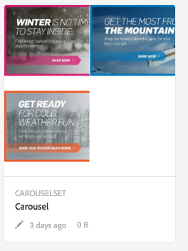
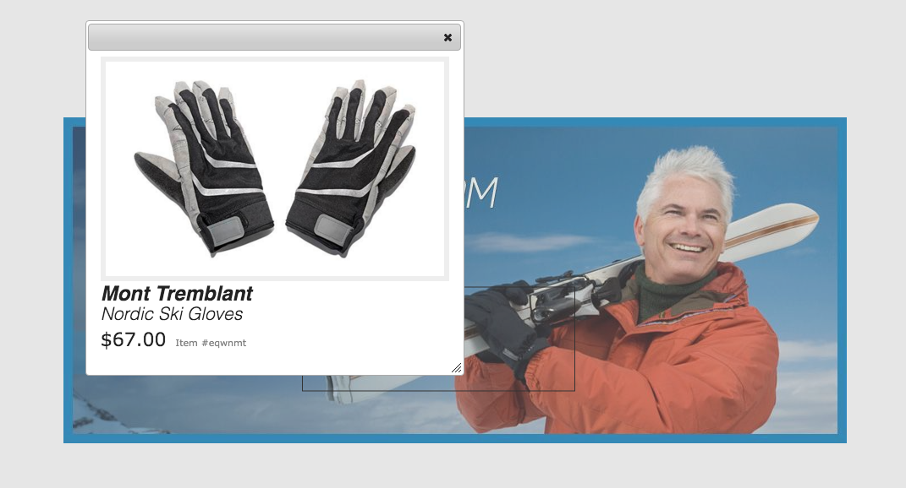
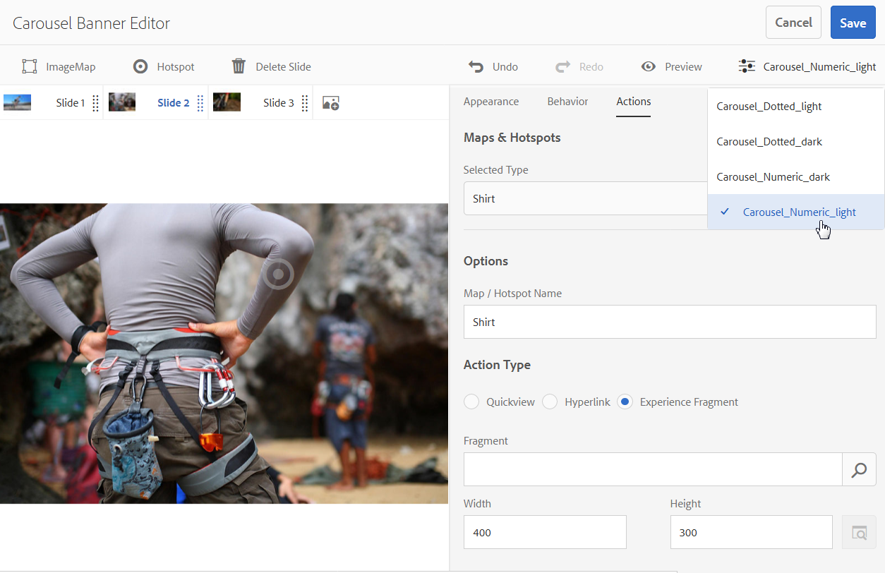

# Carousel Banners {#carousel-banners}

Carousel banners enable marketers to drive conversion by easily creating interactive rotating promotional content and delivering it to any screen.

Creating and modifying content featured in promotional banners can be time-consuming, limiting your ability to quickly publish new content or make it more targeted. Carousel Banners enable you to quickly create or modify rotating banners, add interactivity such as hotspots linking to product detail or related resources, and deliver them to any screen &ndash; letting you bring new promotional content to market faster.

Carousel Banners are designated by a banner with the word **CAROUSELSET**:

On your website, a carousel banner can look as follows:

Here you can navigate through the images (by clicking on the numbers). In addition, the slides automatically rotate based on a time interval you can customize. Images that you add in the carousel banner support both hotspots and image maps, where users can either tap or to go to a hyperlink or access a quick view window.

In this example, a user has tapped or clicked an image map and accessed the quick view window for gloves:

 

## Watch how carousel banners are created {#watch-how-carousel-banners-are-created}

Watch a 10 minute and 33 second walkthrough on [how carousel banners are created](https://s7d5.scene7.com/s7viewers/html5/VideoViewer.html?videoserverurl=https://s7d5.scene7.com/is/content/&emailurl=https://s7d5.scene7.com/s7/emailFriend&serverUrl=https://s7d5.scene7.com/is/image/&config=Scene7SharedAssets/Universal_HTML5_Video_social&contenturl=https://s7d5.scene7.com/skins/&asset=S7tutorials/InteractiveCarouselBanner). You will also learn how to preview, edit, and deliver carousel banners.

>[!NOTE]
>
>Non-administrative users must be added to the **dam-users** group in order to be able to create or edit carousel banners. If you are having trouble creating or editing, please see your system administrator who can add you to the **dam-users** group.

## Quick Start: Carousel Banners {#quick-start-carousel-banners}

To get you up and running quickly:

1. [Identify hotspot and image map variables](#identifying-hotspot-and-image-map-variables) (only for customers using AEM Assets + Dynamic Media)

   Start by identifying dynamic variables used by the existing quick view implementation so that you can enter hotspots and image map data properly during the carousel banner creation process in AEM Assets.

   >[!NOTE]
   >
   >If you are an AEM Sites or Ecommerce customer, you can use the built-in feature to navigate to product pages and lookup the existing skus in the product catalog. You do not need to manually enter hotspot or image map variables. See information on [setting up eCommerce](/help/sites-administering/generic.md).
   >
   >If you are an AEM Assets and Dynamic Media customer, you will manually enter data for hotspots and image maps, and then integrate the published URL or Embed code with your third-party content management system.

1. Optional: [Create a Carousel Set viewer preset](managing-viewer-presets.md), as needed.

   If you are an administrator, you can customize the behavior and appearance of the carousel by creating your own Carousel viewer preset. The main benefit is that you can re-use this custom viewer preset for multiple carousels. However, users also have the option to customize the behavior and appearance of the carousel directly while authoring the carousel. This is the preferred approach when you want a very specific design for a given carousel.

1. [Upload an image banner](#uploading-image-banners).

   Upload image banners that you want to make interactive.

1. [Create a Carousel Set](#creating-carousel-sets).

   In Carousels Sets, users navigate through banner images and tap hotspots or image maps to access relevant content.

   To create a Carousel Set in Assets, tap **[!UICONTROL Create]**, then select **[!UICONTROL Carousel Sets]**. Add assets to slides and tap **[!UICONTROL Save]**. You can also edit the appearance and behavior of the carousel directly within the editor.

1. [Add hotspots or image maps to an image banner.](#adding-hotspots-or-image-maps-to-an-image-banner)

   Add one or more hotspots or image maps to an image banner and associate each one with an action such as a link, a Quickview, or an Experience Fragment. After you add hotspots or image maps, you finish this task by publishing the carousel set. Publishing creates the embed code that you can use to copy and apply to your website landing page.

   See [(Optional) Previewing Carousel Banners](#optional-previewing-carousel-banners) - Optional. If desired, you can view a representation of your carousel set and test its interactivity.

1. [Publish Carousel Banners.](#publishing-carousel-banners)

   You publish a Carousel Set as you would any asset. In Assets, navigate to the Carousel Set and select it and tap or tap **[!UICONTROL Publish]**. Publishing a Carousel Set activates the URL and Embed string.

1. Do one of the following:

    * [Add a carousel banner to your website page](#adding-a-carousel-banner-to-your-website-page) You can add the carousel banner URL or embed code you have copied onto the website page.

        * [Integrate the carousel banner with an existing Quickview](#integrating-the-carousel-banner-with-an-existing-quickview). If you are using a third party web content management system, you will need to integrate the new carousel banner with the existing Quickview implementation on your website.

    * [Add a carousel banner to your website in AEM](adding-dynamic-media-assets-to-pages.md) If you are an AEM Sites customer you can add the carousel set directly to the page in AEM, using the Interactive Media component.

If you need to edit Carousel Sets, see [editing Carousel Sets](#editing-carousel-sets). In addition, you can view and edit [Carousel Set properties](/help/assets/managing-assets-touch-ui.md#editing-properties).

## Identifying Hotspot and Image Map Variables {#identifying-hotspot-and-image-map-variables}

Start by identifying dynamic variables used by the existing quick view implementation so that you can enter hotspots or image map data properly during the carousel set creation process in AEM Assets.

When you add hotspots or image maps to a banner image in AEM Assets you need to assign a SKU and optional additional variables to each hotspot or image map. Such variables are used later to match hotspots or image maps with quick view content.

>[!NOTE]
>
>If you are an AEM Sites and/or AEM Ecommerce customer, skip this step. You do not need to manually identify hotspot or image map variables; you can use the integration with Ecommerce for product integration. See information on [setting up eCommerce](/help/sites-administering/generic.md). In addition, you can use the Interactive component and add it to your web page.
>
>If you are an AEM Assets or Media customer, you publish the URL or Embed code and then integrate with your third-party content management system and identify hotspots and image maps manually.

It is important to properly identify the number and type of variables to associate with hotspot or image map data. Each hotspot or image map added to a banner image must carry enough information to unambiguously identify the product in the existing backend system. At the same time, each hotspot or image map should not include more data than is necessary. The reason is because that would make the data entry process overly complex and on-going hotspot or image map management more error-prone.

There are different ways to identify a set of variables to use for hotspot or image map data.

Sometimes it may be enough to consult with IT specialists responsible for the existing quick view implementation, as they are likely to know what is the minimum set of data needed to identify quick view in the system. However, in most cases it is also possible to simply analyze the existing behavior of the front-end code.

The majority of quick view implementations use the following paradigm:

* User activates a user interface element on the website. For example, clicking a **[!UICONTROL Quick View]** button.
* The website sends an Ajax request to the backend to load the quick view data or content, if needed.
* The quick view data is translated into the content in preparation for rendering on the web page.
* Finally, the front-end code visually renders such content on the screen.

The approach then is to visit different areas of the existing website where the quick view feature is implemented, trigger the quick view and capture the Ajax URL sent by web page for loading the quick view data or content.

Normally there is no need for you to use any specialized debugging tools. Modern web browsers feature web inspectors that do an adequate job. The following are a few examples of web browsers that include web inspectors:

* To see all outgoing HTTP requests in Google Chrome, press F12 (Windows) or Command-Option-I (Mac) to open the Developer Tools panel, and then tap the **[!UICONTROL Network]** tab.
* In Firefox, you can either activate the Firebug plug-in by pressing F12 (Windows) or Command-Option-I (Mac) and use its Net tab, or you can use the built-in Inspector tool and its Network tab.

When network monitoring is turned on in the browser, trigger the quick view on the page.

Now find the quick view Ajax URL in the network log and copy the recorded URL for future analysis. In most cases when you trigger the quick view there are numerous requests that are sent out to the server. Typically, the quick view Ajax URL is one of the first in the list. It has either a complex query string portion or path, and its response MIME type is either `text/html`, `text/xml`, or `text/javascript`.

During this process it is important to visit different areas of your website, with different product categories and types. The reason is that quick view URLs may have parts that are common for a given website category, but change only if you visit a different area of the website.

In the simplest case, the only variable part in the quick view URL is the product SKU. In this case, the SKU value is the only data piece that you need for adding hotspots or image maps to the banner image.

However, in complex cases, the quick view URL has different varying elements in addition to the SKU, such as category ID, color code, size code, and so forth. In such cases, every element is a separate variable in your hotspot or image map data definition in the carousel banner feature.

Consider the following examples of quick view URLs and their resulting hotspot or image map variables:

<table> 
 <tbody> 
  <tr> 
   <td>Single SKU, found in the query string.</td> 
   <td>
The recorded quick view URLs include the following:
 
    <ul> 
     <li>
<code>https://server/json?productId=866558&amp;source=100</code>
 </li> 
     <li>
<code>https://server/json?productId=1196184&amp;source=100</code>
 </li> 
     <li>
<code>https://server/json?productId=1081492&amp;source=100</code>
 </li> 
     <li>
<code>https://server/json?productId=1898294&amp;source=100</code>
 </li> 
    </ul> 
The only variable part in the URL is the value of the <code>productId=</code> query string parameter, and it is clearly a SKU value. Therefore, our hotspots or image maps only need SKU fields populated with values like <code>866558,</code> <code>1196184,</code> <code>1081492,</code> <code>1898294.</code>
 </td> 
  </tr> 
  <tr> 
   <td>Single SKU, found in the URL path.</td> 
   <td>
The recorded quick view URLs include the following:
 
    <ul> 
     <li>
<code>https://server/product/6422350843</code>
 </li> 
     <li>
<code>https://server/product/1607745002</code>
 </li> 
     <li>
<code>https://server/product/0086724882</code>
 </li> 
    </ul> 
The variable part is in the last portion of the path, and it becomes the SKU value of the hotspots/image maps:<strong><code>6422350843</code>, <code>1607745002,</code> </strong><code>0086724882.</code>
 </td> 
  </tr> 
  <tr> 
   <td>SKU and category ID in the query string.</td> 
   <td>
The recorded quick view URLs include the following:
 
    <ul> 
     <li>
<code>https://server/quickView/product/?category=1100004&amp;prodId=305466</code>
 </li> 
     <li>
<code>https://server/quickView/product/?category=1100004&amp;prodId=310181</code>
 </li> 
     <li>
<code>https://server/quickView/product/?category=1740148&amp;prodId=308706</code>
 </li> 
    </ul> 
In this case, there are two varying parts in the URL. The SKU is stored in the <code>prodId</code> parameter and the category ID is stored in the <code>category=</code>parameter.
 
As such, the hotspot/image map definitions are pairs. That is, a SKU value and an additional variable called <code>categoryId</code>. The resulting pairs are the following:
 
    <ul> 
     <li>
SKU is <strong><code>305466</code></strong> and <code>categoryId</code> is <code>1100004</code>.
 </li> 
     <li>
SKU is <strong><code>310181</code></strong> and <code>categoryId</code> is <strong><code>1100004</code></strong>.
 </li> 
     <li>
SKU is <strong><code>308706</code></strong> and <code>categoryId</code> is <strong><code>1740148</code></strong>.
 </li> 
    </ul> </td> 
  </tr> 
 </tbody> 
</table>

## Uploading Image Banners {#uploading-image-banners}

If you have already uploaded the images that you want to use, advance to the next step, [Creating Carousel Sets](#creating-carousel-sets). Please note the images used in the carousel must be uploaded after Dynamic Media has been enabled.

To upload image banners, see [Uploading assets](managing-assets-touch-ui.md).

## Creating Carousel Sets {#creating-carousel-sets}

>[!NOTE]
>
>Non-administrative users must be added to the **[!UICONTROL dam-users]** group to be able to create or edit carousel banners. If you are having trouble creating or editing, please see your system administrator who can add you to the **dam-users** group.

**To create a Carousel Set**:

1. In Assets, navigate to the folder where you want to create the Carousel Set and tap **[!UICONTROL Create > Carousel Set]**.
1. On the **[!UICONTROL Carousel Banner Editor]** page, tap **[!UICONTROL Tap to open Asset Selector]** to select the image for your first slide.

   On the **[!UICONTROL Carousel Banner Editor]** page, do either one of the following:

    * Near the upper-left corner of the page, tap **[!UICONTROL Add Slide]** icon.
    * Near the middle of the page, tap **[!UICONTROL Tap to open Asset Selector]**.

   Tap to select assets that you want to include in your Carousel Set. Selected assets have a checkmark icon over them. When you are finished, near the upper-right corner of the page, tap **[!UICONTROL Select]**.

   With the Asset Selector, you can search for assets by typing in a keyword and tapping **[!UICONTROL Return]**. You can also apply filters to refine your search results. You can filter by path, collection, file type, and tag. Select the filter and then tap the **[!UICONTROL Filter]** icon on the toolbar. Change the view by tapping the **[!UICONTROL View]** icon and selecting **[!UICONTROL Column View]**, **[!UICONTROL Card View]**, or **[!UICONTROL List View]**.

   See [Working with Selectors](working-with-selectors.md) for more information.

1. Continue to add slides until you have added all the images that you want to rotate through in the Carousel Set.
1. (Optional) Do any of the following:

    * If necessary, drag slide's to re-order images in the the set list.
    * To delete an image, select the image, then tap **[!UICONTROL Delete Slide]** on the toolbar.
    * To apply a preset, near the upper-right corner of the page, tap the preset drop-down list, then select a preset to apply to the set at once.

   To delete a slide, tap the slide, and tap **[!UICONTROL Delete Slide]** in the toolbar. To move a slide, tap the reoreder icon and hold and move to the desired location.

1. After you have added the images in slides, you can add a hotspot, image map, or both to your image. See [adding hotspots or image maps](#adding-hotspots-or-image-maps-to-an-image-banner).
1. You can change the visual design and behavior of carousel sets by tapping or clicking the Behavior and Appearance tabs and making adjustments to how your carousel banner looks or how specific components behave. See [managing viewer presets](viewer-presets.md) for more information on how to use the viewer editor.

   >[!NOTE]
   >
   >For carousel banners, the following may be things you want to adjust:
   >* Duration that an image displays. By default, each image displays for 9 seconds.
   >* Animation. By default, each slide transition is a fade. You can change that to a slide transition.
   >* Style of the buttons. Users can rotate through the banners by tapping each dot or number. You can change where the set indicator buttons appear (and if they are numeric or a dotted style) and how large they are.
   >* Change the highlight style of an image map or the icon used for hotspots.
   >* Before you edit a viewer preset, choose the style you want to base the preset off of. If you do not do this, when you start to edit the viewer preset, you will lose all of your changes if you decide change to a different preset.

   You can also preview what the carousel banner will look like. See [(Optional) Previewing Carousel Banners](#optional-previewing-carousel-banners).

1. Tap **[!UICONTROL Save]** when finished.

## Adding hotspots or image maps to an Image Banner {#adding-hotspots-or-image-maps-to-an-image-banner}

You can add hotspots or image maps to a banner using the Carousel Set editor.

When you add hotspots or image maps, you can define them as a Quickview pop-up display, as a hyperlink, or an Experience Fragment.

See [Experience Fragments](/help/sites-authoring/experience-fragments.md).

  >[!NOTE]
  >
  >Be aware that the social media sharing tools in Carousel Banner are not supported when you embed the viewer in an Experience Fragment. To work around this, you can use or create viewer presets that do not have social media sharing tools. Such viewer presets let you successfully embed it in Experience Fragments.

As you add hotspots or image maps to an image, remember to save your work. **[!UICONTROL Undo]** and **[!UICONTROL Redo]** options, near the upper-right corner of the page, are supported during your current creation/editing session.

When you finish creating your carousel banner, you can optionally use **[!UICONTROL Preview]** to see a representation of how your carousel banner will appear to customers.

See [(Optional) Previewing Carousel Banners](#optional-previewing-carousel-banners).

>[!NOTE]
>
>When you add hotspots to an image in an [Interactive Image](interactive-images.md) or a Carousel Banner, the hotspot information is stored in the same metadata location - relative to the image's location--regardless of whether it is an Interactive Image or a Carousel Banner. This functionality means that you can easily re-use the same image - along with its defined hotspot data - in either viewer.  
  
>Be aware, however, that Carousel Banners support image maps on images that can also contain hotspots; an Interactive Image does not. Keep this in mind if you intend to create an Interactive Image or Carousel Banner that uses the same image. You may want to create Interactive Images and Carousel Banners using separate copies of the same image instead.

>[!NOTE]
>
>If you are editing interactive images with hotspots and crop the image, your hotspots are removed.

**To add hotspots to an image banner**:

1. From Assets, navigate to the carousel set you want to make interactive.
1. Select the carousel set and tap **[!UICONTROL Edit]**.
1. In the Carousel Viewer Editor, select the slide you want to make interactive.
1. Near the upper-left corner of the page, tap **[!UICONTROL Hotspot]** or **[!UICONTROL Image Map]**.
1. Do either of the following:

    * For hotspots: On the image, tap a location where you want the hotspot to appear.
    * For image maps: On the image, tap, then drag from the top left to the bottom right to create the image map area. You can adjust the size of the image map by dragging the corners.

   If necessary, drag the hotspot or the image map to a new location. Add additional hotspots or image maps as necessary.

   To delete a hotspot or image map, tap the **[!UICONTROL Actions]** tab. Under the **[!UICONTROL Maps & Hotspots]** heading, from the **[!UICONTROL Selected Type]** drop-down menu, select the name of the hotspot or image map you want to remove. Tap the **[!UICONTROL Trash]** icon next to the menu, then tap **[!UICONTROL Delete]**.

1. In the Name text field, type the name of the hotspot or the image map. This name also appears in the **[!UICONTROL Maps & Hotspot]** drop-down list. Providing a name makes it easy to identify the hotspot or image map if you decide to make changes to it in the future.
1. Do one of the following in the **[!UICONTROL Actions]** tab:

    * Tap **[!UICONTROL Quickview]**.

        * If you are an AEM Sites and Ecommerce customer, tap the **[!UICONTROL Product Picker]** icon (magnifying glass) to open the **[!UICONTROL Select Product]** page. Tap the product you want to use, then tap the check mark in the upper-right corner of the page to return to the **[!UICONTROL Carousel Banner Editor]**.
        * If you are not an AEM Sites or Ecommerce customer

            * See [Identifying hotspot variables](#identifying-hotspot-and-image-map-variables) as you may want to define these variables. 
            * Then, manually enter the SKU value. In the **[!UICONTROL SKU Value]** text field, type the product's SKU (Stock Keeping Unit), which is a unique identifier for each distinct product or service that you offer. The entered SKU value automatically populates the variable portion of the quick view template so that the system knows to associate the tapped hotspot with a particular SKU's quick view.
            * (Optional) If there are other variables within the quick view that you need to use to further identify a product, tap **[!UICONTROL Add Generic Variable]**. In the text field, specify an additional variable. For example, `category=Mens` is an added variable.
            * See [Working with Selectors](working-with-selectors.md) for more information.

    * Tap **[!UICONTROL Hyperlink]**.

        * If you are an AEM Sites customer, tap the **[!UICONTROL Site Selector]** icon (folder) to navigate to a URL.  

          >[!NOTE]
          >The URL-based method of linking is not possible if your interactive content has links with relative URLs, particularly links to AEM Sites pages.
  
        * If you are a standalone customer, in the **[!UICONTROL HREF]** text field, specify the full URL path to a linked web page.

          Be sure you specify whether to open the link in a new browser tab (recommended default) or the same tab.

          See [Working with Selectors](working-with-selectors.md) for more information.

    * Tap **[!UICONTROL Experience Fragment]**.

        * If you are an AEM Sites customer, tap the **[!UICONTROL Search]** icon (magnifying glass) to open the Experience Fragment page. Tap the Experience Fragment you want to use, then tap **[!UICONTROL Select]** in the upper-right corner of the page to return to the Hotspot management page.
  
          See [Experience Fragments](/help/sites-authoring/experience-fragments.md).

          **Note**: Be aware that the social media sharing tools in Carousel Banner are not supported when you embed the viewer in an Experience Fragment. To work around this, you can use or create viewer presets that do not have social media sharing tools. Such viewer presets let you successfully embed it in Experience Fragments.

        * Specify the width and height of the Experience Fragment as it will appear on the banner.
  
   

   You can also preview what the carousel banner will look like. See [(Optional) Previewing Carousel Banners](#optional-previewing-carousel-banners).

1. Tap **[!UICONTROL Save]**.
1. Publish the carousel set. Publishing creates the embed code or URL that you can use on your website page. If you are an AEM Sites customer, you may add the carousel set directly to your webpage.

   See [Publishing assets](publishing-dynamicmedia-assets.md).

   See [Adding a carousel set to your website landing page](#adding-a-carousel-banner-to-your-website-page)

## Editing Carousel Sets {#editing-carousel-sets}

>[!NOTE]
>
>Non-administrative users must be added to the **[!UICONTROL dam-users]** group in order to be able to create or edit carousel banners. If you are having trouble creating or editing, please see your system administrator who can add you to the **[!UICONTROL dam-users]** group.

You can perform a variety of editing tasks on Carousel Sets such as the following:

* Add slides to a Carousel Set. See also [Working with Selectors](working-with-selectors.md).
* Re-order slides in the Carousel Set.
* Delete assets in the Carousel Set.
* Apply a viewer preset.  
* Delete the Carousel Set.
* Add or edit hotspots and image maps. See also [Working with Selectors](working-with-selectors.md).

Be aware that if you are editing interactive images with hotspots and crop the image, your hotspots are removed.

**To edit a Carousel Set**:

1. Do any one of the following:

    * Hover over an Carousel Set asset, then tap **[!UICONTROL Edit]** (pencil icon).
    * Hover over an Carousel Set asset, tap **[!UICONTROL Select]** (checkmark icon), then tap **[!UICONTROL Edit]** on the toolbar.
    * Tap on a Carousel Set asset, then in the upper-left corner of the page tap **[!UICONTROL Edit]** (pencil icon).

1. To edit the Carousel Set, do any of the following:

    * To add a slide, tap the **[!UICONTROL Add Slide]** icon then navigate to the asset you want to add to that slide and tap the checkmark.
    * To reorder slides, drag an slide to a new location (select the reorder icon to move items).
    * To add a hotspot or image map, tap the hotspot or image map icons and see [adding hotspots and image maps](#adding-hotspots-or-image-maps-to-an-image-banner).
    * To edit the appearance or behavior of the carousel set, tap the **[!UICONTROL Appearance]** tab or **[!UICONTROL Behavior]** tab, then set the options you want.
    * To edit hotspots or image maps, on the appropriate slide, select a hotspot or image map and make changes as necessary under the **[!UICONTROL Actions]** tab.
    * To delete an slide, select it, then tap **[!UICONTROL Delete Slide]** on the toolbar.
    * To apply a preset, near the upper-right corner of the page, tap the preset drop-down list, then select a viewer preset.
    * To delete an entire Carousel Set, navigate to the Carousel Set, select it, then tap **[!UICONTROL Delete]**.

## (Optional) Previewing Carousel Banners {#optional-previewing-carousel-banners}

You can use **[!UICONTROL Preview]** to see what your carousel banner will look like to customers and to test the carousel banners hotspots and image maps to ensure they are behaving as expected.

When you are satisfied with the carousel banner, you can publish it.

* See [Embedding the Video or Image Viewer on a Web Page](embed-code.md).  
* See [Linking URLs to your web application](linking-urls-to-yourwebapplication.md). Note that the URL-based method of linking is not possible if your interactive content has links with relative URLs, particularly links to AEM Sites pages.  
* See [Adding Dynamic Media Assets to pages.](adding-dynamic-media-assets-to-pages.md)

You can preview carousel banners from the Carousel Editor (preferred method) or from the **[!UICONTROL Viewers]** list.

**To preview carousel banners**:

1. In **[!UICONTROL Assets]**, navigate to an existing carousel banner that you have created and tap to open it.
1. Tap **[!UICONTROL Edit]**.
1. In the viewer presets list in the right-hand corner of the toolbar, select a viewer to preview the carousel banner.

   

1. Tap **[!UICONTROL Preview]**.
1. Tap the hotspots or image maps on the image to test their associated actions.

**To preview carousel banners from the Viewers list**:

1. In **[!UICONTROL Assets]**, navigate to an existing carousel banner that you have created and tap to open it.
1. Near the upper-left corner of the **[!UICONTROL Preview]** page, tap the **[!UICONTROL Content]** icon.
1. In the **[!UICONTROL Viewers]** list in the panel on the left side of the page, tap the name of the carousel banner viewer preset you want to use.
1. Tap the hotspots or image maps on the image to test their associated actions.

## Publishing Carousel Banners {#publishing-carousel-banners}

You need to publish the carousel in order to use it. Publishing a Carousel Set activates the URL and Embed Code. It also publishes the carousel to the Dynamic Media cloud which is integrated with a CDN for scalable and performant delivery.

If you use an existing interactive image with hotspots for your carousel banner, you must publish the interactive image separately after you publish the carousel banner. 

Also, if you modify a pre-existing published interactive image that you are using in a carousel banner, you must publish the interactive image before those changes are reflected in the carousel banner.

See [Publishing Dynamic Media Assets](publishing-dynamicmedia-assets.md) for info on how to publish carousel banners.

## Adding a Carousel Banner to Your Website Page {#adding-a-carousel-banner-to-your-website-page}

After you have uploaded banner images to create a carousel, added hotspots and/or image maps to the banner, and published the carousel set, you are now ready to add it to your existing website page.

If you are an AEM Sites customer, you can add the carousel banner directly to your page by dragging the Interactive Media component to your page. See [Adding Dynamic Media Assets to Pages.](adding-dynamic-media-assets-to-pages.md)

However, if you are a stand-alone AEM assets customer you can manually add the carousel banner to your website landing page as described in this section.

1. Copy the published carousel set's embed code.

   See [Embedding the Video or Image Viewer on a Web Page](embed-code.md).

1. Add the embed code that you copied from AEM Assets to your webpage.  

   The copied embed code is responsive so it should automatically fit the embedding area of the page.

## Integrating the Carousel Banner with an existing Quickview {#integrating-the-carousel-banner-with-an-existing-quickview}

This task applies only if you are a standalone AEM Assets customer.

The last step in this process is integrating the carousel banner with an existing quick view implementation on your website. Every Quickview implementation is unique and a specific approach is needed that most likely involves the assistance of a front-end IT person.

The existing quick view implementation normally represents a chain of inter-related actions that happen on the web page in the following order:

1. A user triggers an element in the user interface of your website.
1. The front-end code obtains a quick view URL based on the user interface element that was triggered in step 1.
1. The front-end code sends an Ajax request using the URL obtained in step 2.
1. The backend logic returns the corresponding quick view data or content back to the front-end code.
1. The front-end code loads the quick view data or content.
1. Optionally, the front-end code converts the loaded quick view data into an HTML representation.
1. The front-end code displays a modal dialog box or panel and renders the HTML content on the screen for the end user.

These calls may not represent independent public API calls which can be called by the web page logic from an arbitrary step. Instead, it is a chained call where every next step is hidden in the last phase (callback) of the previous step.

At the same time that the carousel banner is replacing step 1, and partially step 2, when a user clicks a hotspot or image map inside the carousel banner, such user interaction is handled by the viewer. The viewer returns an event to the web page that contains all the hotspot or image map data previously added.

In such an event handler, the front-end code does the following:

* Listens to an event emitted by the carousel banner.
* Constructs a quick view URL based on the hotspot or image map data.
* Triggers the process of loading the quick view from the backend and rendering it on the screen for display.

The embed code returned by AEM Assets already has a ready-to-use event handler in place that is commented out.

So, it is only necessary to uncomment the code and replace the dummy handler body with the code that is specific to the particular web page.

The process of constructing the quick view URL is basically opposite of the process used for identifying hotspot and image map variables covered earlier.

See [Identifying hotspot and image map variables](#identifying-hotspot-and-image-map-variables).

The last step to trigger the quick view URL and activate the quick view panel most likely requires the assistance of a front-end IT person from your IT department. They have the knowledge to know best how to accurately trigger the quick view implementation from the proper step, having a ready-to-use quick view URL.

## Using Quickviews to create custom pop-ups {#using-quickviews-to-create-custom-pop-ups}

See [Using Quickviews to create custom pop-ups](custom-pop-ups.md).
