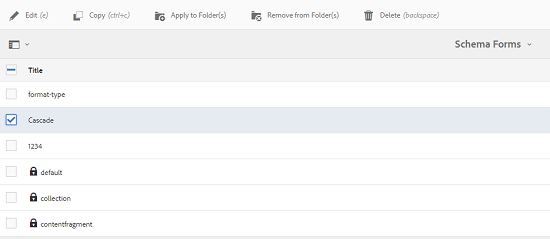
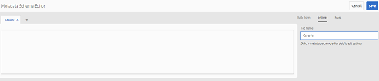
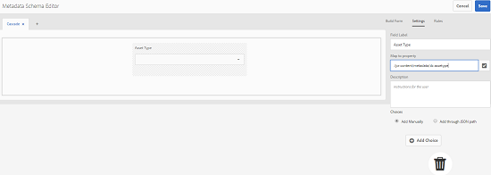
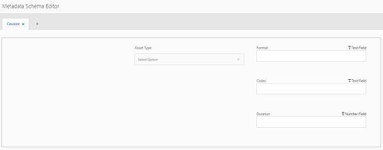
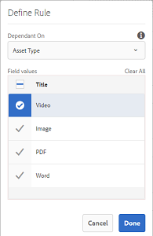

# Cascading Metadata {#cascading-metadata}

This article describes how to define cascading metadata for assets.

When capturing the metadata information of an asset, users provide information in the various available fields. You can display specific metadata fields or field values that are dependent on the options selected in the other fields. Such conditional display of metadata is called cascading metadata. In other words, you can create a dependency between a particular metadata field/value and one or more fields and/or their values.

Use metadata schemas to define rules for displaying cascading metadata. For example, if your metadata schema includes an asset type field, you can define a pertinent set of fields to be displayed based on the type of asset a user selects.

Here are some use cases for which you can define cascading metadata:

* Where user location is required, display relevant city names based on the user's choice of country and state.
* Load pertinent brand names in a list based on the user's choice of product category.
* Toggle the visibility of a particular field based on the value specified in another field. For example, display separate shipping address fields if the user wants the shipment delivered at a different address.
* Designate a field as mandatory based on the value specified in another field.
* Change options displayed for a particular field based on the value specified in another field.
* Set the default metadata value in a particular field based on the value specified in another field.

## Configure cascading metadata in AEM {#configure-cascading-metadata-in-aem}

Consider a scenario where you want to display cascading metadata based on the type of asset that is selected. Some examples

* For a video, display applicable fields such as format, codec, duration, and so on.
* For a Word or PDF document, display fields, such as page count, author, and so on.

Irrespective of the asset type chosen, display the copyright information as a required field.

1. Tap/click the AEM logo, and go to **[!UICONTROL Tools]** > **[!UICONTROL Assets]** > **[!UICONTROL Metadata Schemas]**.
1. In the **[!UICONTROL Schema Forms]** page, select a schema form and then tap/click **[!UICONTROL Edit]** from the toolbar to edit the schema.

   

1. (Optional) In the metadata schema editor, create a new field to conditionalize. Specify a name and property path in the **[!UICONTROL Settings]** tab.

   To create a new tab, tap/click **[!UICONTROL +]** to add a tab and then add a metadata field.

   

1. Add a Dropdown field for asset type. Specify a name and property path in the **[!UICONTROL Settings]** tab. Add an optional description.

   

1. Key-values pairs are the options provided to a form-user. You can provide the key-value pairs either manually or from a JSON file.

    * To specify the values manually, select **[!UICONTROL Add Manually]**, and tap/click **[!UICONTROL Add Choice]** and specify the option text and value. For example, specify Video, PDF, Word, and Image asset types.
    * To fetch the values from a JSON file dynamically, select **[!UICONTROL Add Through JSON Path]** and provide the path of the JSON file. AEM fetches the key-value pairs in the real time when the form is presented to the user.

   Both options are mutually exclusive. You cannot import the options from a JSON file and edit manually.

   

   >[!NOTE]
   >
   >When you add a JSON file, the key-value pairs are not displayed in the metadata schema editor but are available in the published form.

   >[!NOTE]
   >
   >When adding choices, if you click the Dropdown field, the interface is distorted and the delete icon for the choices stops working. When adding the choices to the dropdown, do not click back on the dropdown till you save the changes. If you face this issue, save the schema and open it again to continue editing.

1. (Optional) Add the other required fields. For example, format, codec, and duration for the asset type video.

   Similarly, add dependent fields for other asset types. For example, add fields page count and author for document assets, such as PDF and Word files.

   

1. To create a dependency between the asset type field and other fields, choose the dependent field and open the **[!UICONTROL Rules]** tab.

   

1. Under **[!UICONTROL Requirement]**, choose the **[!UICONTROL Required, based on new rule]** option.
1. Tap/click **[!UICONTROL Add Rule]** and choose the **[!UICONTROL Asset Type]** field to create a dependency. Also choose the field value upon which to create the dependency. In this case, choose **[!UICONTROL Video]**. Tap/click **[!UICONTROL Done]** to save the changes.

   

   >[!NOTE]
   >
   >Dropdown with manually predefined values can be used with rules. Dropdown menus with configured JSON path can't be used with rules that use predefined values to apply conditions. If the values are loaded from JSON at runtime, it is not possible to apply a predefined rule.

1. Under **[!UICONTROL Visibility]**, choose the **[!UICONTROL Visible, based on new rule]** option.  

1. Tap/click **[!UICONTROL Add Rule]** and choose the **[!UICONTROL Asset Type]** field to create a dependency. Also choose the field value upon which to create the dependency. In this case, choose **[!UICONTROL Video]**. Tap/click **[!UICONTROL Done]** to save the changes.

   

   >[!NOTE]
   >
   >Tapping/clicking on whitespaces (or anyplace other than values) will reset the values. In this case, you must select them again.

   >[!NOTE]
   >
   >You can apply **[!UICONTROL Requirement]** condition and **[!UICONTROL Visibility]** condition independent of each other.

1. Similary, create a dependency between the value Video in the Asset Type field and other fields, such as Codec and Duration.
1. Repeat the steps to create dependency between document assets (PDF and Word) in the **[!UICONTROL Asset Type]** field and fields such as Page Count and Author.
1. Click **[!UICONTROL Save]**. Apply the Metadata Schema to a folder.   

1. Navigate to the folder to which you applied the Metadata Schema and open the properties page of an asset. Depending upon your choice in the Asset Type field, pertinent cascading metadata fields are displayed.

   

   **Figure:** *Cascading metadata for Video asset*

   

   **Figure:** *Cascading metadata for document asset*

