# Configure Dynamic Media - Scene7 mode{#configuring-dynamic-media-scene-mode}

If you use Adobe Experience Manager set up for different environments, such as development, staging, and production, configure Dynamic Media Cloud Services for each one of those environments.

## Architecture diagram of Dynamic Media - Scene7 mode {#architecture-diagram-of-dynamic-media-scene-mode}

The following architecture diagram describes how Dynamic Media - Scene7 mode works.

With the new architecture, Experience Manager is responsible for primary source assets and synchs with Dynamic Media for asset processing and publishing:

1. When the primary source asset is uploaded to Experience Manager, it is replicated to Dynamic Media. At that point, Dynamic Media handles all asset processing and rendition generation, such as video encoding and dynamic variants of an image. 
(In Dynamic Media - Scene7 mode, the default upload file size is 2 GB or less. To enable upload file sizes of 2 GB up to 15 GB, see [(Optional) Configure Dynamic Media - Scene7 mode for upload of assets larger than 2 GB](#optional-config-dms7-assets-larger-than-2gb).)
1. After the renditions are generated, Experience Manager can securely access and preview the remote Dynamic Media renditions (no binaries are sent back to the Experience Manager instance).
1. After content is ready to be published and approved, it triggers the Dynamic Media service to push content out to delivery servers and cache content at the CDN (Content Delivery Network).

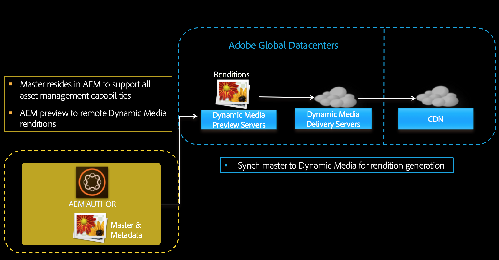

>[!IMPORTANT]
>
>The following list of features requires that you use the out-of-the-box CDN that is bundled with Adobe Experience Manager - Dynamic Media. Any other custom CDN is not supported with these features.
>
>* [Smart Imaging](/help/assets/imaging-faq.md)
>* [Cache invalidation](/help/assets/invalidate-cdn-cache-dynamic-media.md)
>* [Hotlink protection](/help/assets/hotlink-protection.md)
>* [HTTP/2 delivery of content](/help/assets/http2.md)
>* URL redirect at the CDN level
>* Akamai ChinaCDN (for optimal delivery in China)

## Enable Dynamic Media in Scene7 mode {#enabling-dynamic-media-in-scene-mode}

[Dynamic Media](https://business.adobe.com/products/experience-manager/assets/dynamic-media.html) is disabled by default. To take advantage of Dynamic Media features, you must enable it.

>[!WARNING]
>
>Dynamic Media - Scene7 mode is for the *Experience Manager Author instance only*. As such, you must configure `runmode=dynamicmedia_scene7` on the Experience Manager Author instance, *not* the Experience Manager Publish instance.

To enable Dynamic Media, start up Experience Manager using `dynamicmedia_scene7` run mode from the command line by entering the following in a terminal window (example port used is 4502):

```shell {.line-numbers}
java -Xms4096m -Xmx4096m -Doak.queryLimitInMemory=500000 -Doak.queryLimitReads=500000 -jar cq-quickstart-6.5.0.jar -gui -r author,dynamicmedia_scene7 -p 4502
```

## (Optional) Migrate Dynamic Media presets and configurations from 6.3 to 6.5 Zero Downtime {#optional-migrating-dynamic-media-presets-and-configurations-from-to-zero-downtime}

Upgrading Experience Manager Dynamic Media from 6.3 to 6.4 or 6.5 now includes the ability for zero downtime deployments. To migrate all your presets and configurations from `/etc` to `/conf` in CRXDE Lite, be sure you run the following curl command.

>[!NOTE]
>
>If you run your Experience Manager instance in compatibility mode &ndash; that is, you have the compatibility packaged installed &ndash; you do not need to run these commands.

For all upgrades, either with or without the compatibility package, you can copy the default, out-of-the-box viewer presets that originally came with Dynamic Media by running the following Linux&reg; curl command:

`curl -u admin:admin -X POST https://<server_address>:<server_port>/libs/settings/dam/dm/presets/viewer.pushviewerpresets.json`

To migrate any custom viewer presets and configurations that you have created from `/etc` to `/conf`, run the following Linux&reg; curl command:

`curl -u admin:admin -X POST https://<server_address>:<server_port>/libs/settings/dam/dm/presets.migratedmcontent.json`

## Install feature pack 18912 for bulk asset migration {#installing-feature-pack-for-bulk-asset-migration}

The installation of feature pack 18912 is *optional*.

Feature pack 18912 lets you either bulk ingest assets by way of FTP, or migrate assets from either Dynamic Media - Hybrid mode or Dynamic Media Classic into Dynamic Media - Scene7 mode on Experience Manager. It is available from [Adobe Professional Services](https://business.adobe.com/customers/consulting-services/main.html).

See [Install feature pack 18912 for bulk asset migration](/help/assets/bulk-ingest-migrate.md) for more information.

## Create a Dynamic Media Configuration in Cloud Services {#configuring-dynamic-media-cloud-services}

<!-- **Before you configure Dynamic Media** - After you receive your provisioning email with Dynamic Media credentials, you must open the [Dynamic Media Classic desktop application](https://experienceleague.adobe.com/docs/dynamic-media-classic/using/getting-started/signing-out.html#getting-started), then sign in to your account to change your password. The password provided in the provisioning email is system-generated and intended to be a temporary password only. It is important that you update the password so that Dynamic Media Cloud Service is set up with the correct credentials.

   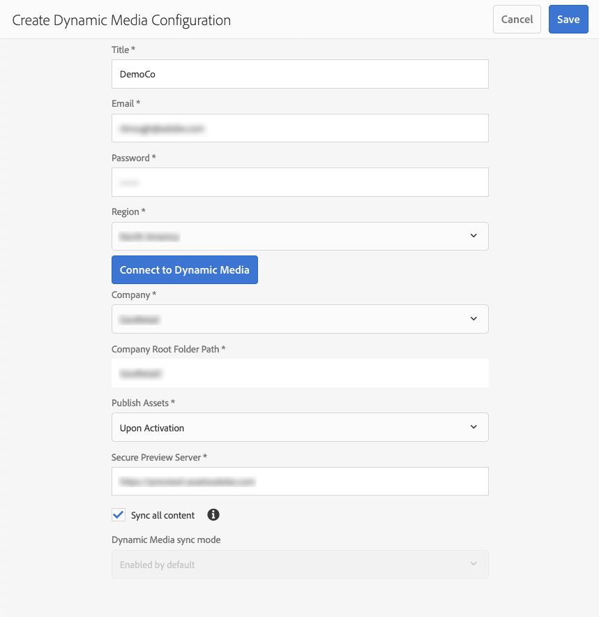

**To create a Dynamic Media Configuration in Cloud Services:** -->

1. In Experience Manager Author mode, select the Experience Manager logo to access the global navigation console and select the Tools icon, then go to **[!UICONTROL Cloud Services]** > **[!UICONTROL Dynamic Media Configuration]**.
1. On the Dynamic Media Configuration Browser page, in the left pane, select **[!UICONTROL global]** (do not select the folder icon to the left of **[!UICONTROL global]**), then select **[!UICONTROL Create]**.
1. On the **[!UICONTROL Create Dynamic Media Configuration]** page, enter a title, the Dynamic Media account email address, password, then select your region. This information is provided to you by Adobe in the provisioning email. Contact Adobe Customer Support if you did not receive the email.

   Select **[!UICONTROL Connect to Dynamic Media]**.

1. In the **[!UICONTROL Change Password]** dialog box, in the **[!UICONTROL New Password]** field, enter a new password that consists of 8-25 characters. The password must contain at least one of each of the following:

      * Uppercase letter
      * Lowercase letter
      * Number
      * Special character: `# $ & . - _ : { }`

      The **[!UICONTROL Current Password]** field is intentionally pre-filled and hidden from interaction.

      If necessary, you can check the spelling of a password you have typed or retyped by selecting the password eye icon to reveal the password. Select the icon again to hide the password.

1. In the **[!UICONTROL Repeat Password]** field, retype the new password, then select **[!UICONTROL Done]**.

   The new password is saved when you select **[!UICONTROL Save]** in the upper-right corner of the **[!UICONTROL Create Dynamic Media Configuration]** page.

   If you selected **[!UICONTROL Cancel]** in the **[!UICONTROL Change Password]** dialog box, you must still enter a new password when you save the newly created Dynamic Media configuration.
  
   See also [Change the password to Dynamic Media](#change-dm-password).

1. When the connection is successful, set the following. Headings with an asterisk (*) are required:

    * **[!UICONTROL Company]** - the name of the Dynamic Media account.
      >[!IMPORTANT]
      >
      >Only one Dynamic Media Configuration in Cloud Services is supported on an instance of Experience Manager; do not add more than one configuration. Multiple Dynamic Media Configurations on an Experience Manager instance is _not_ supported or recommended by Adobe.
    
      <!-- CQDOC-19579 and CQDOC-19612 -->
  
      See also [Configure Dynamic Media company alias account](/help/assets/dm-alias-account.md).

    * **[!UICONTROL Company Root Folder Path]**

    * **[!UICONTROL Publishing Assets]** - You can choose from the following three options:
      * **[!UICONTROL Immediately]** means that when assets are uploaded, the system ingests the assets and provides the URL/Embed instantly. There is no user intervention necessary to publish assets. 
      * **[!UICONTROL Upon Activation]** means that you must explicitly publish the asset first before a URL/Embed link is provided.<br><!-- CQDOC-17478, Added March 9, 2021-->From Experience Manager 6.5.8 onwards, Experience Manager Publish instance reflects accurate Dynamic Media metadata values, such as `dam:scene7Domain` and `dam:scene7FileStatus` in **[!UICONTROL Upon Activation]** publish mode only. To enable this functionality, install Service Pack 8, then restart Experience Manager. Go to the Sling Config Manager. Find the configuration for `Scene7ActivationJobConsumer Component` or create new one). Select the checkbox **[!UICONTROL Replicate Metadata after Dynamic Media publishing]**, then select **[!UICONTROL Save]**.

         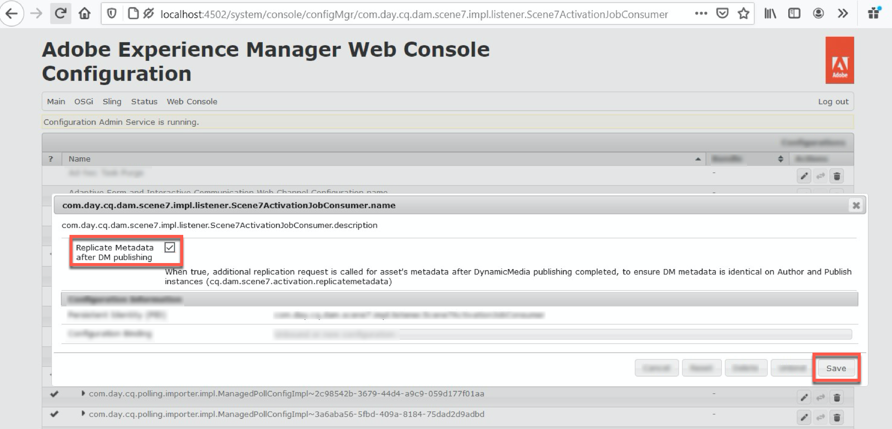

      * **[!UICONTROL Selective Publish]** This option lets you control which folders are published in Dynamic Media. It lets you use features such as Smart Crop or dynamic renditions, or determine which folders are published exclusively in Experience Manager for previewing. Those same assets are *not* published in Dynamic Media for delivery in the public domain.<br>You can set this option here in the **[!UICONTROL Dynamic Media Cloud Configuration]** or, if you prefer, you can choose to set this option at the folder level, in a folder's **[!UICONTROL Properties]**.<br>See [Work with Selective Publish in Dynamic Media](/help/assets/selective-publishing.md).<br>If you later change this configuration, or you later change it at the folder level, those changes affect only new assets that you upload from that point forward. The publish state of existing assets in the folder remain as-is until you manually change them from either **[!UICONTROL Quick Publish]** or the **[!UICONTROL Manage Publication]** dialog box.

    * **[!UICONTROL Secure Preview Server]** - lets you specify the URL path to your secure renditions preview server. That is, after renditions are generated, Experience Manager can securely access and preview the remote Dynamic Media renditions (no binaries are sent back to the Experience Manager instance).
      Unless you have a special arrangement to use your own company's server or a special server, Adobe recommends that you leave this setting as specified.

    * **[!UICONTROL Sync all content]** - <!-- NEW OPTION, CQDOC-15371, Added March 4, 2020-->Selected by default. Deselect this option if you want to selectively include or exclude assets from the sync to Dynamic Media. Deselecting this option lets you can choose from the following two Dynamic Media sync modes:

    * **[!UICONTROL Dynamic Media sync mode]**
        * **[!UICONTROL Enabled by default]** - The configuration is applied to all folders by default unless you mark a folder specifically for exclusion. <!-- you can then deselect the folders that you do not want the configuration applied to.-->
        * **[!UICONTROL Disabled by default]** - The configuration is not applied to any folder until you explicitly mark a selected folder for sync to Dynamic Media.
        To mark a selected folder for sync to Dynamic Media, select an asset folder, then on the toolbar, select **[!UICONTROL Properties]**. On the **[!UICONTROL Details]** tab, in the **[!UICONTROL Dynamic Media sync mode]** drop-down list, choose from the following three options. When you are done, select **[!UICONTROL Save]**. *Remember: these three options are not available if you selected **[!UICONTROL Sync all content]** earlier.* See also [Work with Selective Publish at the folder level in Dynamic Media](/help/assets/selective-publishing.md).
            * **[!UICONTROL Inherited]** - No explicit sync value on the folder; instead, the folder inherits the sync value from one of its ancestor folders or the default mode in the cloud configuration. The detailed status for inherited shows by way of a tooltip.
            * **[!UICONTROL Enable for subfolders]** -  Include everything in this subtree for sync to Dynamic Media. The folder-specific settings override the default mode in the cloud configuration.
            * **[!UICONTROL Disabled for subfolders]** - Exclude everything in this subtree from syncing to Dynamic Media.

   >[!NOTE]
   >
   >There is no support for versioning in Dynamic Media - Scene7 mode. Also, delayed activation applies only if **[!UICONTROL Publish Assets]** in the Edit Dynamic Media Configuration page is set to **[!UICONTROL Upon Activation]**, and then only until the first time the asset is activated.
   >
   >After an asset is activated, any updates are immediately published live to S7 Delivery.

1. Select **[!UICONTROL Save]**.
1. To securely preview Dynamic Media content before it gets published, Experience Manager Author uses token-based validation and hence Experience Manager Author previews Dynamic Media content by default. However, you can "allowlist" more IPs to provide users access to securely preview content. To set up this action in Experience Manager, see [Configure Dynamic Media Publish Setup for Image Server - Security tab](/help/assets/dm-publish-settings.md#security-tab).

If you want to further customize your configuration, such as enabling ACL (Access Control List) permissions, you can optionally complete any of the tasks under [(Optional) Configure Advanced Settings in Dynamic Media - Scene7 mode](#optional-configuring-advanced-settings-in-dynamic-media-scene-mode).

<!-- 1. To securely preview Dynamic Media content before it gets published, Experience Manager uses token-based validation and hence Experience Manager Author previews Dynamic Media content by default. However, you can *allowlist* more IPs to provide users access to securely preview content. To set up this action in Experience Manager, see [Configure Dynamic Media Publish Setup for Image Server - Security tab](/help/assets/dm-publish-settings.md#security-tab).     * In Experience Manager Author mode, select the Experience Manager logo to access the global navigation console.
    * In the left rail, select the **[!UICONTROL Tools]** icon, then go to **[!UICONTROL Assets]** > **[!UICONTROL Dynamic Media Publish Setup]**.
    * On the Dynamic Media Image Server page, in the **[!UICONTROL Publish Context]** drop-down list, select **[!UICONTROL Test Image Serving]**.
    * Select the **[!UICONTROL Security]** tab.
    * For the **[!UICONTROL Client address]**, select **[!UICONTROL Add]**.
    * Enter the IP address of the Experience Manager Author instance (not Dispatcher IP).
    * In the upper-right corner of the page, select **[!UICONTROL Save]**. -->

You are now finished with the basic configuration; you are ready to use Dynamic Media - Scene7 mode.

### Change the password to Dynamic Media {#change-dm-password}

Password expiration in Dynamic Media is set to 100 years from the current system date.

The password must contain at least one of each of the following:

* Uppercase letter
* Lowercase letter
* Number
* Special character: `# $ & . - _ : { }`

If necessary, you can check the spelling of a password you have typed or retyped by selecting the password eye icon to reveal the password. Select the icon again to hide the password.

The changed password is saved when you select **[!UICONTROL Save]** in the upper-right corner of the **[!UICONTROL Edit Dynamic Media Configuration]** page.

**To change the password to Dynamic Media:**

1. In Experience Manager Author mode, select the Experience Manager logo to access the global navigation console.
1. On the left of the console, select the Tools icon, then go to **[!UICONTROL Cloud Services] > [!UICONTROL Dynamic Media Configuration]**.
1. On the Dynamic Media Configuration Browser page, in the left pane, select **[!UICONTROL global]**. Do not select the folder icon to the left of **[!UICONTROL global]**. Then, select **[!UICONTROL Edit]**.
1. On the **[!UICONTROL Edit Dynamic Media Configuration]** page, directly below the **[!UICONTROL Password]** field, select **[!UICONTROL Change Password]**.
1. In the **[!UICONTROL Change Password]** dialog box, do the following:

   * In the **[!UICONTROL New Password]** field, enter a new password.

      The **[!UICONTROL Current Password]** field is intentionally pre-filled and hidden from interaction.

   * In the **[!UICONTROL Repeat Password]** field, retype the new password, then select **[!UICONTROL Done]**.

1. In the upper-right corner of the **[!UICONTROL Edit Dynamic Media Configuration]** page, select **[!UICONTROL Save]**, then select **[!UICONTROL OK]**.

## (Optional) Configure Advanced Settings in Dynamic Media - Scene7 mode {#optional-configuring-advanced-settings-in-dynamic-media-scene-mode}

If you want to further customize the configuration and setup of Dynamic Media - Scene7 mode, or optimize its performance, you can complete one or more of the following *optional* tasks:

* [(Optional) Enable ACL permissions in Dynamic Media - Scene7 mode](#optional-enable-acl)

* [(Optional) Configure Dynamic Media - Scene7 mode for upload of assets larger than 2 GB](#optional-config-dms7-assets-larger-than-2gb)

* [(Optional) Setup and configuration of Dynamic Media - Scene7 mode settings](#optional-setup-and-configuration-of-dynamic-media-scene7-mode-settings)

* [(Optional) Tune the performance of Dynamic Media - Scene7 mode](#optional-tuning-the-performance-of-dynamic-media-scene-mode)

* [(Optional) Filter assets for replication](#optional-filtering-assets-for-replication)

### (Optional) Enable Access Control List permissions in Dynamic Media - Scene7 mode {#optional-enable-acl}

When you run Dynamic Media - Scene7 mode on AEM, it currently forwards `/is/image` requests to Secure Preview Image Serving without checking ACL (Access Control List) permissions on the PlatformServerServlet. You can, however, *enable* ACL permissions. Doing so forwards the authorized `/is/image` requests. If a user is not authorized to access the asset, a "403 - Forbidden" error is displayed.

**To enable ACL permissions in Dynamic Media - Scene7 mode:**

1. From Experience Manager, navigate to **[!UICONTROL Tools]** > **[!UICONTROL Operations]** > **[!UICONTROL Web Console]**.

   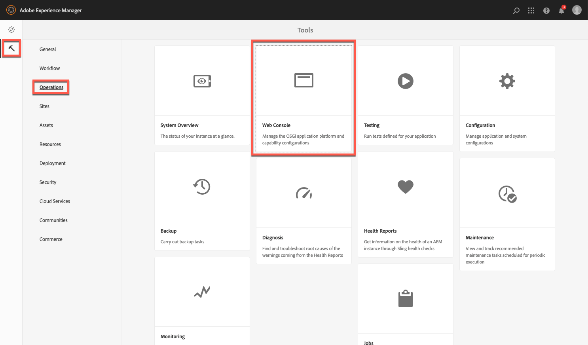

1. A new browser tab opens to the **[!UICONTROL Adobe Experience Manager Web Console Configuration]** page.

   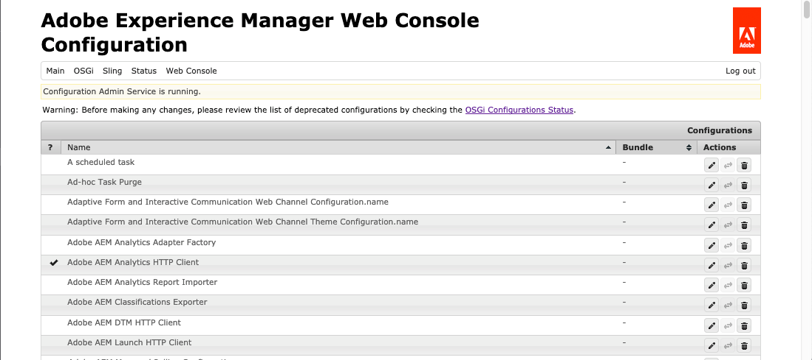

1. On the page, scroll to the name *Adobe CQ Scene7 PlatformServer*.

1. To the right of the name, select the pencil icon (**[!UICONTROL Edit the configuration values]**).

1. On the **com.adobe.cq.dam.s7imaging.impl.ps.PlatformServerServlet.name** page, select the check box for the following two settings:

   * `com.adobe.cq.dam.s7imaging.impl.ps.PlatformServerServlet.cache.enable.name` &ndash; When enabled, this setting caches permission results for 120 seconds (two minutes) (default) to save.
   * `com.adobe.cq.dam.s7imaging.impl.ps.PlatformServerServlet.validate.userAccess.name` &ndash; When enabled, this setting validates a user's access while they preview assets by way of Dynamic Media Image Server.

   

1. Near the lower-right corner of the page, select **[!UICONTROL Save]**.

### (Optional) Configure Dynamic Media - Scene7 mode for upload of assets larger than 2 GB {#optional-config-dms7-assets-larger-than-2gb}

In Dynamic Media - Scene7 mode, the default asset upload file size is 2 GB or less. However, you can optionally configure upload of assets larger than 2 GB and up to 15 GB.

If you intend to use this feature, be aware of the following prerequisites and points:

* You must be running Experience Manager 6.5 with Service Pack 6.5.4.0 or later in Dynamic Media - Scene7 mode.
* This large upload feature is only supported for [*Managed Services*](https://business.adobe.com/products/experience-manager/managed-services.html) customers.
* Be sure that your Experience Manager instance is configured with Amazon S3 or Microsoft&reg; Azure Blob storage.

   >[!NOTE]
   >
   >Configure the Azure Blob storage with an access key and secret key because this large upload feature is not supported with AzureSas in the Blob storage configuration.

* Oak's [Direct Binary Access download](https://jackrabbit.apache.org/oak/docs/features/direct-binary-access.html) is enabled (Oak's *Direct Binary Access upload* is not required).

    To enable Direct Binary Access download, set property `presignedHttpDownloadURIExpirySeconds > 0` in the datastore configuration. The value should be long enough to download larger binaries and possibly retry.

* Assets larger than 15 GB do not get uploaded. (The size limit is set in step 8 below.)
* When the **[!UICONTROL Dynamic Media Reprocess]** assets workflow is triggered on a folder, it reprocesses any large assets that are already in sync with the Dynamic Media company. However, if any large assets are not yet synced in the folder, it does not upload the asset. Therefore, to sync existing large assets in Dynamic Media, you can run **[!UICONTROL Dynamic Media Reprocess]** assets workflow on individual assets.

**To configure Dynamic Media - Scene7 mode for upload of assets larger than 2 GB:**

1. In Experience Manager, select the Experience Manager logo to access the global navigation console, then navigate to **[!UICONTROL Tools]** > **[!UICONTROL General]** > **[!UICONTROL CRXDE Lite]**.

1. In CRXDE Lite window, do either one of the following:

   * In the left rail, navigate to the following path:

      `/libs/dam/gui/content/assets/jcr:content/actions/secondary/create/items/fileupload`

   * Copy and paste the path above into the CRXDE Lite path field below the toolbar, then press `Enter`.

1. In the left rail, right-click `fileupload`, then from the pop-up menu, select **[!UICONTROL Overlay Node]**.

   

1. On the Overlay Node dialog box, select the **[!UICONTROL Match Node Types]** check box to enable (turn on) the option, then select **[!UICONTROL OK]**.

   

1. From the CRXDE Lite window, do either one of the following:

   * In the left rail, navigate to the following overlay node path:

      `/apps/dam/gui/content/assets/jcr:content/actions/secondary/create/items/fileupload`

   * Copy and paste the path above into the CRXDE Lite path field below the toolbar, then press `Enter`.

1. In the **[!UICONTROL Properties]** tab, under the **[!UICONTROL Name]** column, locate `sizeLimit`.
1. To the right of the `sizeLimit` name, under the **[!UICONTROL Value]** column, double-click the value field.
1. Enter the appropriate value in bytes so you can increase the size limit to the maximum desired upload size. For example, to increase the upload asset size limit to 10 GB, enter `10737418240` in the value field.
You can enter a value up to 15 GB (`2013265920` bytes). In this case, uploaded assets that are larger than 15 GB do not get uploaded.

   

1. Near the upper-left corner of the CRXDE Lite window, select **[!UICONTROL Save All]**.

   *Now set the timeout for the Adobe Granite Workflow External Process Job Handler by doing the following:*

1. In Experience Manager, select the Experience Manager logo to access the global navigation console.
1. Do either one of the following:

   * Navigate to the following URL path:

      `localhost:4502/system/console/configMgr/com.adobe.granite.workflow.core.job.ExternalProcessJobHandler`

   * Copy and paste the path above into the URL field of your browser. Be sure you replace `localhost:4502` with your own Experience Manager instance.

1. In the **[!UICONTROL Adobe Granite Workflow External Process Job Handler]** dialog box, in the **[!UICONTROL Max Timeout]** field, set the value to `18000` seconds (five hours). Default is 10800 seconds (three hours).

   

1. In the lower-right corner of the dialog box, select **[!UICONTROL Save]**.

   *Now set the timeout for the Scene7 Direct Binary Upload process step by doing the following:*

1. In Experience Manager, select the Experience Manager logo to access the global navigation console.
1. Navigate to **[!UICONTROL Tools]** > **[!UICONTROL Workflow]** > **[!UICONTROL Models]**.
1. On the Workflow Models page, select **[!UICONTROL Dynamic Media Encode Video]**.
1. On the toolbar, select **[!UICONTROL Edit]**.
1. On the workflow page, double-click the **[!UICONTROL Scene7 Direct Binary Upload]** process step.
1. In the **[!UICONTROL Step Properties]** dialog box, under the **[!UICONTROL Common]** tab, under the **[!UICONTROL Advanced Settings]** heading, in the **[!UICONTROL Timeout]** field, enter a value of `18000` seconds (five hours). The default is `3600` seconds (one hour).
1. Select **[!UICONTROL OK]**.
1. Select **[!UICONTROL Sync]**.
1. Repeat steps 14-21 for the **[!UICONTROL DAM Update Asset]** workflow model and the **[!UICONTROL Dynamic Media Reprocess]** workflow model.

### (Optional) Setup and configuration of Dynamic Media - Scene7 mode settings {#optional-setup-and-configuration-of-dynamic-media-scene7-mode-settings}

<!-- When you are in run mode `dynamicmedia_scene7`, use the Dynamic Media Classic user interface to change your Dynamic Media settings. -->

* [Configure Dynamic Media Publish Setup for Image Server](/help/assets/dm-publish-settings.md)
* [Configure Dynamic Media General Settings](/help/assets/dm-general-settings.md)
* [Configure color management](#configuring-color-management)
* [Edit MIME types for supported formats](#editing-mime-types-for-supported-formats)
* [Add MIME types for unsupported formats](#adding-mime-types-for-unsupported-formats)
* [Create batch set presets to auto-generate Image Sets and Spin Sets](#creating-batch-set-presets-to-auto-generate-image-sets-and-spin-sets) (done in the Dynamic Media Classic user interface)

#### Configure Dynamic Media Publish Setup for Image Server {#publishing-setup-for-image-server} 

The Dynamic Media Publish Setup page establishes default settings that determine how assets are delivered from Adobe Dynamic Media servers to web sites or applications.

See [Configure Dynamic Media Publish Setup for Image Server](/help/assets/dm-publish-settings.md).

#### Configure Dynamic Media General Settings {#configuring-application-general-settings}

Configure the Dynamic Media **[!UICONTROL Publish Server Name]** URL and the **[!UICONTROL Origin Server Name]** URL. You can also specify **[!UICONTROL Upload to Application]** settings and **[!UICONTROL Default Upload Options]** all based on your particular use case.

See [Configure Dynamic Media General Settings](/help/assets/dm-general-settings.md).

#### Configure color management {#configuring-color-management}

Dynamic Media color management lets you color correct assets. With color correction, ingested assets retain their color space (RGB, CMYK, Gray) and embedded color profile. When you request a dynamic rendition, the image color is corrected into the target color space using CMYK, RGB, or Gray output.

See [Configure Image Presets](/help/assets/managing-image-presets.md).

>[!NOTE]
>
>By default, the system shows 15 renditions when you select **[!UICONTROL Renditions]** and 15 viewer presets when you select **[!UICONTROL Viewers]** in the asset's Detail view. You can increase this limit. See [Increase the number of image presets that display](/help/assets/managing-image-presets.md#increasing-or-decreasing-the-number-of-image-presets-that-display) or [Increase the number of viewer presets that display](/help/assets/managing-viewer-presets.md#increasing-the-number-of-viewer-presets-that-display).

#### Edit MIME types for supported formats {#editing-mime-types-for-supported-formats}

You can define which asset types are processed by Dynamic Media and customize advanced asset processing parameters. For example, you can specify asset processing parameters to do the following:

* Convert an Adobe PDF to an eCatalog asset.
* Convert an Adobe Photoshop Document (.PSD) to a banner template asset for personalization.
* Rasterize an Adobe Illustrator file (.AI) or an Adobe Photoshop Encapsulated PostScript&reg; file (.EPS).
* [Video profiles](/help/assets/video-profiles.md) and [Imaging profiles](/help/assets/image-profiles.md) can be used to define processing of videos and images, respectively.

See [Uploading Assets](/help/assets/manage-assets.md#uploading-assets).

**To edit MIME types for supported formats:**

1. In Experience Manager, select the Experience Manager logo to access the global navigation console, then navigate to **[!UICONTROL Tools]** > **[!UICONTROL General]** > **[!UICONTROL CRXDE Lite]**.
1. In the left rail, navigate to the following:

   `/conf/global/settings/cloudconfigs/dmscene7/jcr:content/mimeTypes`

   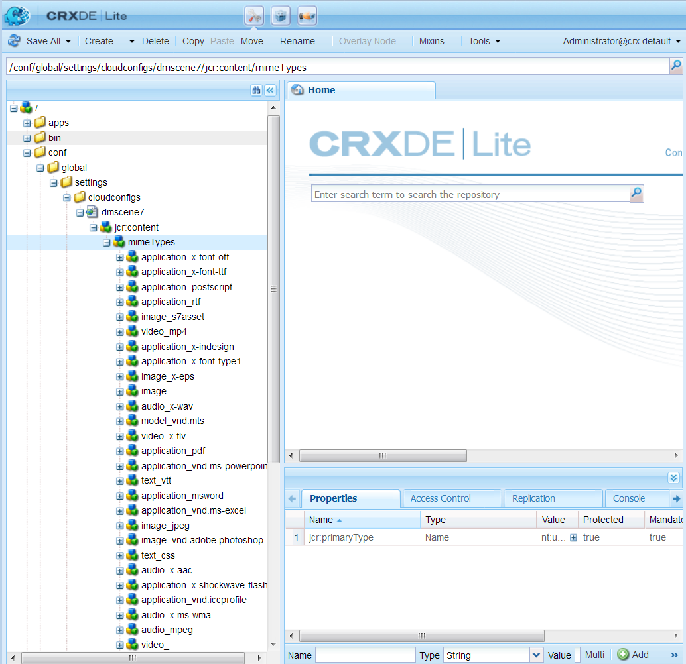

1. Under the mimeTypes folder, select a mime type.
1. On the right side of the CRXDE Lite page, in the lower portion:

    * Double-click the **[!UICONTROL enabled]** field. By default all asset mime types are enabled (set to **[!UICONTROL true]**), which means the assets are synched to Dynamic Media for processing. If you wish to exclude this asset mime type from being processed, change this setting to **[!UICONTROL false]**.

    * Double-select **[!UICONTROL jobParam]** to open its associated text field. See [Supported Mime Types](/help/assets/assets-formats.md#supported-mime-types) for a list of permitted processing parameter values that you can use for a given mime type.

1. Do one of the following:

    * Repeat steps 3-4 to edit more MIME types.
    * On the menu bar of the CRXDE Lite page, select **[!UICONTROL Save All]**.

1. In the upper-left corner of the page, select **[!UICONTROL CRXDE Lite]** to return to Experience Manager.

#### Adding MIME types for unsupported formats {#adding-mime-types-for-unsupported-formats}

You can add custom MIME types for unsupported formats in Experience Manager Assets. Ensure any new node that you add in CRXDE Lite is not deleted by Experience Manager by moving the MIME type before `image_`. Also, be sure that its enabled value is set to **[!UICONTROL false]**.

**To add MIME types for unsupported formats:**

1. From Experience Manager, navigate to **[!UICONTROL Tools]** > **[!UICONTROL Operations]** > **[!UICONTROL Web Console]**.

   

1. A new browser tab opens to the **[!UICONTROL Adobe Experience Manager Web Console Configuration]** page.

   

1. On the page, scroll down to the name *Adobe CQ Scene7 Asset MIME type Service* as seen the following screenshot. To the right of the name, select the **[!UICONTROL Edit the configuration values]** (pencil icon).

   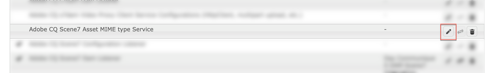

1. On the **Adobe CQ Scene7 Asset MIME type Service** page, select any plus sign icon &lt;+&gt;. The location in the table where you select the plus sign to add the new mime type is trivial.

   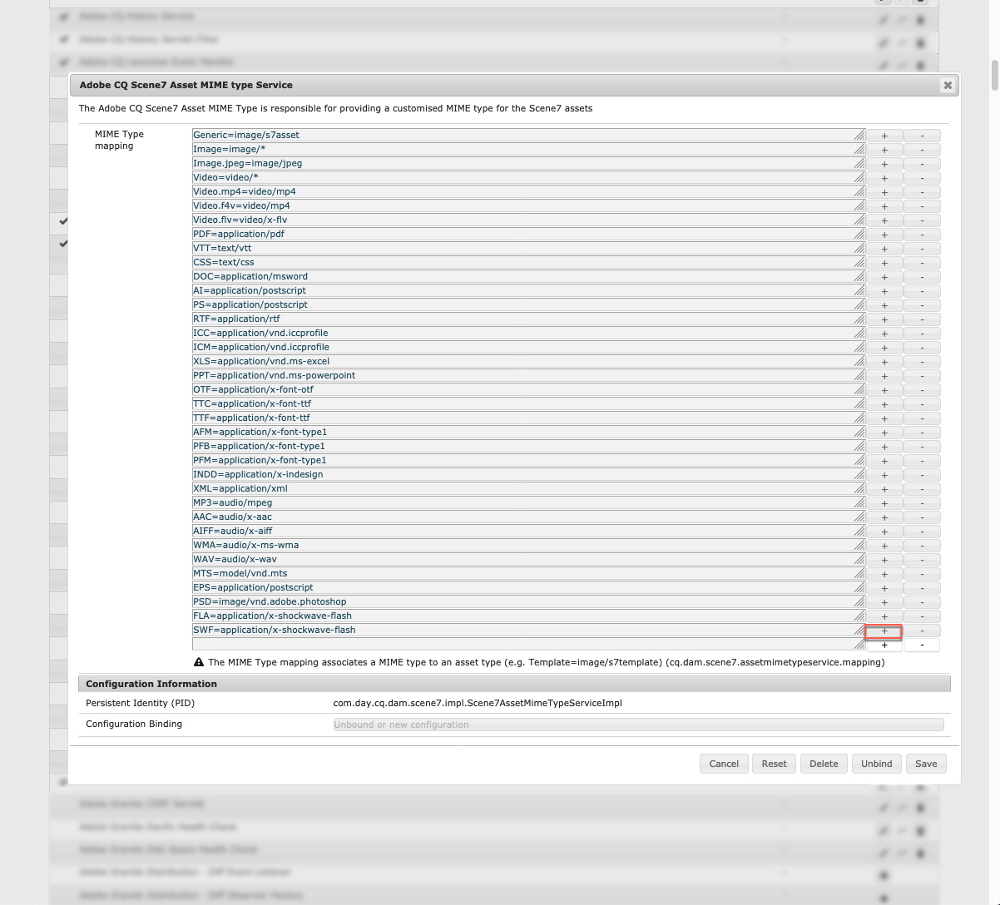

1. Type `DWG=image/vnd.dwg` in the empty text field that you just added.

   The example `DWG=image/vnd.dwg` is for demonstration purposes only. The MIME type that you add here can be any other unsupported format.

   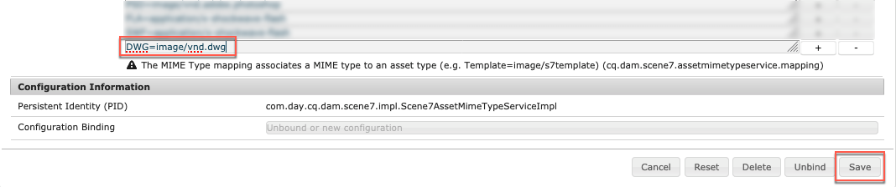

1. In the lower-right corner of the page, select **[!UICONTROL Save]**.

   At this point, you can close the browser tab that has the open Adobe Experience Manager Web Console Configuration page.

1. Return to the browser tab that has your open Experience Manager console.
1. From Experience Manager, navigate to **[!UICONTROL Tools]** > **[!UICONTROL General]** > **[!UICONTROL CRXDE Lite]**.

   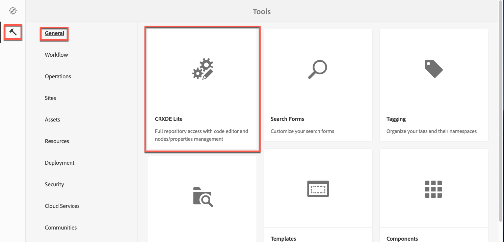

1. In the left rail, navigate to the following:

   `conf/global/settings/cloudconfigs/dmscene7/jcr:content/mimeTypes`

1. Drag the mime type `image_vnd.dwg` and drop it directly above `image_` in the tree as seen in the following screenshot.

   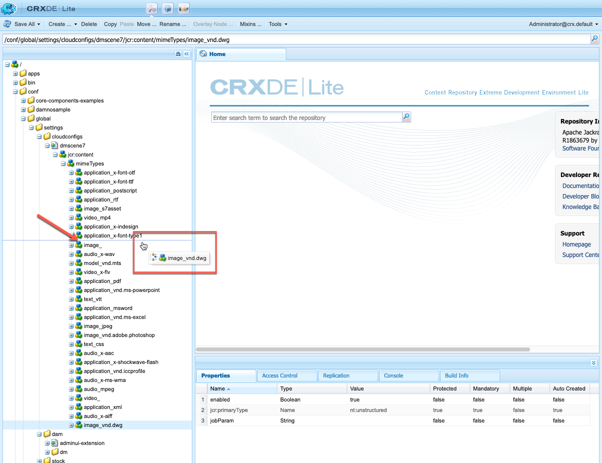

1. With the mime type `image_vnd.dwg` still selected, from the **[!UICONTROL Properties]** tab, in the **[!UICONTROL enabled]** row, under the **[!UICONTROL Value]** column header, double-select the value to open the **[!UICONTROL Value]** drop-down list.
1. Type `false` in the field (or select **[!UICONTROL false]** from the drop-down list).

   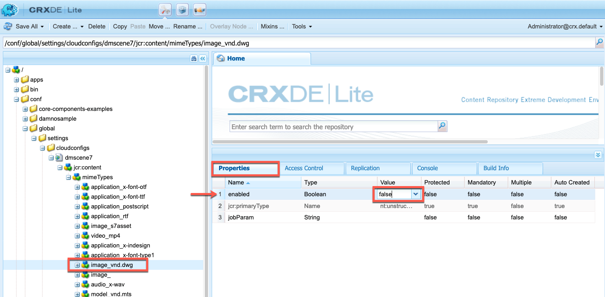

1. Near the upper-left corner of the CRXDE Lite page, select **[!UICONTROL Save All]**.

#### Create batch set presets to auto-generate Image Sets and Spin Sets {#creating-batch-set-presets-to-auto-generate-image-sets-and-spin-sets}

Use batch set presets to automate the creation of image sets or spin sets while assets are uploaded to Dynamic Media.

First, define the naming convention for how assets are grouped in a set. Then create a batch set preset that is a uniquely named, self-contained set of instructions. It must define how to construct the set using images that match the defined naming conventions in the preset recipe.

When you upload files, Dynamic Media automatically creates a set with all files that match the defined naming convention in the active presets.

##### Configure default naming

Create a default naming convention that is used in any batch set preset recipe. The default naming convention selected in the batch set preset definition is likely all that is needed by your company to batch-generate sets. A batch set preset is created to use the default naming convention that you define. You are able to create as many Batch Set presets with alternate, custom naming conventions needed for a particular set of content in cases where there is an exception to the company-defined default naming.

While setting up a default naming convention is not required to use batch set preset functionality, best practice recommends that you use the default naming convention. It lets you define as many elements of your naming convention that you want grouped in a set so you can streamline batch set creation.

As an alternative, you can use **[!UICONTROL View Code]** with no form fields available. In this view, you create your naming convention definitions entirely using regular expressions.

Two elements are available for definition, Match and Base Name. These fields let you define all elements of a naming convention and identify the part of the convention used to name the set in which they are contained. A company's individual naming convention often uses one or more lines of definition for each of these elements. You can use as many lines for your unique definition and group them into distinct elements, such as for Main Image, Color element, Alternate View element, and Swatch element.

**To configure default naming:**

1. Open the [Dynamic Media Classic desktop application](https://experienceleague.adobe.com/docs/dynamic-media-classic/using/getting-started/signing-out.html#getting-started), then sign in to your account.

   Your credentials and sign-in details were provided by Adobe at the time of provisioning. If you do not have this information, contact Adobe Customer Support.

1. On the navigation bar near the top of the page, navigate to **[!UICONTROL Setup]** > **[!UICONTROL Application Setup]** > **[!UICONTROL Batch Set Presets]** > **[!UICONTROL Default Naming]**.
1. Select **[!UICONTROL View Form]** or **[!UICONTROL View Code]** to specify how you want to view and enter information about each element.

   You can select the **[!UICONTROL View Code]** check box to view the regular expression value building alongside your form selections. You are able to enter or alter these values to help define the elements of the naming convention, if the form view limits you for any reason. If your values are unable to be parsed in the form view, the form fields become inactive.

   >[!NOTE]
   >
   >De-activated form fields perform no validation that your regular expressions are correct. You see results of the regular expression that you are building for each element after the Result line. The complete regular expression is visible at the bottom of the page.

1. Expand each element as necessary and enter the naming conventions you want to use.
1. As necessary, do any of the following:

    * Select **[!UICONTROL Add]** to add another naming convention for an element.
    * Select **[!UICONTROL Remove]** to delete a naming convention for an element.

1. Do one of the following:

    * Select **[!UICONTROL Save As]** and type a name for the preset.
    * Select **[!UICONTROL Save]** if you are editing an existing preset.

##### Create a Batch Set Preset

Dynamic Media uses batch set presets to organize assets into sets of images (alternate images, color options, 360 spin) for display in viewers. The batch set presets automatically run alongside the asset upload processes in Dynamic Media.

You can create, edit, and manage your batch set presets. There are two forms of batch set preset definitions: one for a default naming convention that you can set up, and one for custom-naming conventions that you create on the fly.

You can use either the form field method to define a batch set preset or the code method, which lets you use regular expressions. As in Default Naming, you can choose View Code at the same time you are defining in the Form View and use regular expressions to build your definitions. Alternately, you can uncheck either view to use one or the other exclusively.

**To create a Batch Set Preset:**

1. Open the [Dynamic Media Classic desktop application](https://experienceleague.adobe.com/docs/dynamic-media-classic/using/getting-started/signing-out.html#getting-started), then sign in to your account.

   Your credentials and sign-in details were provided by Adobe at the time of provisioning. If you do not have this information, contact Adobe Customer Support.

1. On the navigation bar near the top of the page, navigate to **[!UICONTROL Setup]** > **[!UICONTROL Application Setup]** > **[!UICONTROL Batch Set Presets]** > **[!UICONTROL Batch Set Preset]**.

   **[!UICONTROL View Form]**, as set in the upper-right corner of the Details page, is the default view.

1. In the Preset List panel, select **[!UICONTROL Add]** to activate the definition fields in the Details panel on the right-hand side of the screen.
1. In the Details panel, in the Preset Name field, type a name for the preset.
1. In the Batch Set Type drop-down menu, select a preset type.
1. Do one of the following:

    * If you are using a default naming convention that you previously set up under **[!UICONTROL Application Setup]** > **[!UICONTROL Batch Set Presets]** > **[!UICONTROL Default Naming]**, expand **[!UICONTROL Asset Naming Conventions]**, and then in the File Naming drop-down list, select **[!UICONTROL Default]**.

    * To define a new naming convention as you set up the preset, expand **[!UICONTROL Asset Naming Conventions]**, and then in the File Naming drop-down list, select **[!UICONTROL Custom]**.

1. For Sequence order, define the order in which images are displayed after the set is grouped in Dynamic Media.

   By default, your assets are ordered alphanumerically. However, you can use a comma-separated list of regular expressions to define the order.

1. For Set Naming and Creation Convention, specify the suffix or prefix to the base name you defined in the Asset Naming Convention. Also, define where the set is created within the Dynamic Media folder structure.

   If you define large numbers of sets, keep the sets separate from the folders that contain the assets themselves. For example, create an Image Sets folder and put generated sets here.

1. In the Details panel, select **[!UICONTROL Save]**.
1. Select **[!UICONTROL Active]** next to the new preset name.

   Activating the preset ensures that when you upload assets to Dynamic Media, the batch set preset is applied to generate the set.

##### Create a Batch Set Preset for the auto-generation of a 2D Spin Set

You can use the Batch Set Type **[!UICONTROL Multi-Axis Spin Set]** to create a recipe that automates the generation of 2D Spin Sets. The grouping of images uses Row and Column regular expressions so that the image assets are properly aligned in the corresponding location in the multi-dimensional array. There is no minimum or maximum number of rows or columns that you must have in a multi-axis spin set.

As an example, suppose you want to create a multi-axis spin set named `spin-2dspin`. You have a set of spin set images that contain three rows, with 12 images per row. The images are named as follows:

```xml {.line-numbers}
spin-01-01
 spin-01-02
 …
 spin-01-12
 spin-02-01
 …
 spin-03-12
```

With this information, your Batch Set Type recipe can be created as follows:

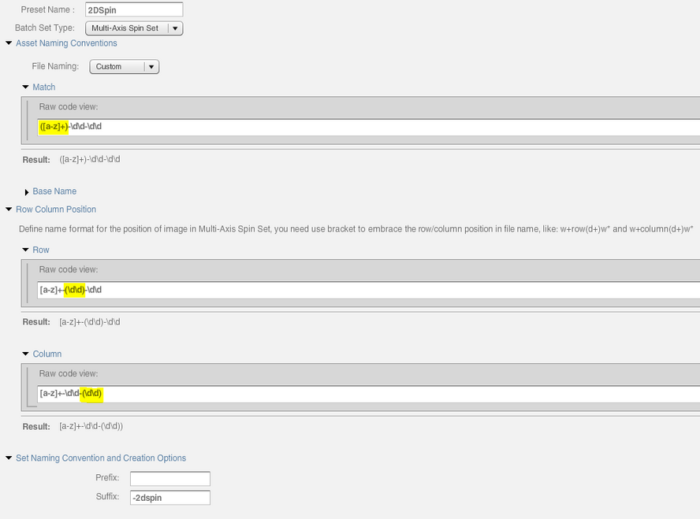

Grouping for the shared asset name part of the spin set is added to the **[!UICONTROL Match]** field (as highlighted). The variable part of the asset name containing the row and column is added to the **[!UICONTROL Row]** and **[!UICONTROL Column]** fields, respectively.

When the Spin Set is uploaded and published, you would activate the name of the 2D Spin Set recipe that is listed under **[!UICONTROL Batch Set Presets]** in the **[!UICONTROL Upload Job Options]** dialog box.

**To create a Batch Set Preset for the auto-generation of a 2D Spin Set:**

1. Open the [Dynamic Media Classic desktop application](https://experienceleague.adobe.com/docs/dynamic-media-classic/using/getting-started/signing-out.html#getting-started), then sign in to your account.

   Your credentials and sign-in details were provided by Adobe at the time of provisioning. If you do not have this information, contact Adobe Customer Support.

1. On the navigation bar near the top of the page, navigate to **[!UICONTROL Setup]** > **[!UICONTROL Application Setup]** > **[!UICONTROL Batch Set Presets]** > **[!UICONTROL Batch Set Preset]**.

   **[!UICONTROL View Form]**, as set in the upper-right corner of the Details page, is the default view.

1. In the Preset List panel, select **[!UICONTROL Add]** to activate the definition fields in the Details panel on the right-hand side of the screen.
1. In the Details panel, in the Preset Name field, type a name for the preset.
1. In the Batch Set Type drop-down menu, select **[!UICONTROL Asset Set]**.
1. In the Sub Type drop-down list, select **[!UICONTROL Multi-Axis Spin Set]**.
1. Expand **[!UICONTROL Asset Naming Conventions]**, and then in the File Naming drop-down list, select **[!UICONTROL Custom]**.
1. Use the **[!UICONTROL Match]** and, optionally, **[!UICONTROL Base Name]** attributes to define a regular expression for the naming of image assets that make up the grouping.

   For example, your literal Match regular expression can look like the following:

   `(w+)-w+-w+`

1. Expand **[!UICONTROL Row Column Position]**, and then define the name format for the position of the image asset within the 2D Spin Set array.

   Use the parenthesis to embrace the row or column position in the file name.

   For example, for your row regular expression, it can look like the following:

   `\w+-R([0-9]+)-\w+`

   or

   `\w+-(\d+)-\w+`

   For your column regular expression, it can look like the following:

   `\w+-\w+-C([0-9]+)`

   or

   `\w+-\w+-C(\d+)`

   The samples above are for demonstration purposes only. You can create your regular expression however you want to suit your needs.

   >[!NOTE]
   >
   >If the combination of row and column regular expressions is unable to determine the position of the asset within the multi-dimensional spin set array, the asset is not added to the set. An error is also logged.

1. For Set Naming and Creation Convention, specify the suffix or prefix to the base name you defined in the Asset Naming Convention.

   Also, define where the spin set is created within the Dynamic Media Classic folder structure.

   If you define large numbers of sets, keep the sets separate from the folders that contain the assets themselves. For example, create a Spin Sets folder to put generated sets here.

1. In the Details panel, select **[!UICONTROL Save]**.
1. Select **[!UICONTROL Active]** next to the new preset name.

   Activating the preset ensures that when you upload assets to Dynamic Media, the batch set preset is applied to generate the set.

### (Optional) Tune the performance of Dynamic Media - Scene7 mode {#optional-tuning-the-performance-of-dynamic-media-scene-mode}

To keep Dynamic Media - Scene7 mode running smoothly, Adobe recommends the following synchronization performance/scalability fine-tuning tips:

* Updating the predefined Job parameters for processing of different file formats.
* Updating the predefined Granite workflow (video assets) queue worker threads.
* Updating the predefined Granite transient workflow (images and non-video assets) queue worker threads.
* Updating the maximum upload connections to the Dynamic Media Classic server.

#### Update the predefined Job parameters for processing of different file formats

You can tune job parameters for faster processing when you upload files. For example, if you upload PSD files, but do not want to process them as templates, you can set layer extraction to false (off). In such case, the tuned job parameter appears as follows: `process=None&createTemplate=false`.

In case you do want to turn on template creation, use the following parameters: `process=MaintainLayers&layerNaming=AppendName&createTemplate=true`.

<!-- THIS PARAGRAPH WAS REPLACED WITH THE TWO PARAGRAPHS DIRECTLY ABOVE BASED ON CQDOC-17657 You can tune job parameters for faster processing when you upload files. For example, if you are uploading PSD files, but do not want to process them as templates, you can set layer extraction to false (off). In such case, the tuned job parameter would appear as `process=None&createTemplate=false`. -->

Adobe recommends using the following "tuned" job parameters for PDF, PostScript&reg;, and PSD files:

<!-- OLD PDF JOB PARAMETERS `pdfprocess=Rasterize&resolution=150&colorspace=Auto&pdfbrochure=false&keywords=false&links=false` -->

<!-- OLD POSTSCRIPT JOB PARAMETERS `psprocess=Rasterize&psresolution=150&pscolorspace=Auto&psalpha=false&psextractsearchwords=false&aiprocess=Rasterize&airesolution=150&aicolorspace=Auto&aialpha=false` -->

| File type | Recommended job parameters |
| ---| ---|
| PDF | `pdfprocess=Thumbnail&resolution=150&colorspace=Auto&pdfbrochure=false&keywords=false&links=false` |
| PostScript&reg; | `psprocess=Rasterize&psresolution=150&pscolorspace=Auto&psalpha=false&psextractsearchwords=false&aiprocess=Thumbnail&airesolution=150&aicolorspace=Auto&aialpha=false` |
| PSD | `process=None&layerNaming=AppendName&anchor=Center&createTemplate=false&extractText=false&extendLayers=false` |

<!-- CQDOC-17657 for PSD entry in table above -->

To update any of these parameters, follow the steps in [Enabling MIME type-based Assets/Dynamic Media Classic upload job parameter support](/help/sites-administering/scene7.md#enabling-mime-type-based-assets-scene-upload-job-parameter-support).

#### Update the Granite transient workflow queue {#updating-the-granite-transient-workflow-queue}

The Granite Transit Workflow queue is used for the **[!UICONTROL DAM Update Asset]** workflow. In Dynamic Media, it is used for image ingestion and processing.

**To update the Granite transient workflow queue:**

1. Navigate to [https://localhost:4502/system/console/configMgr](https://localhost:4502/system/console/configMgr) and search for **Queue: Granite Transient Workflow Queue**.

   >[!NOTE]
   >
   >A text search is necessary instead of a direct URL because the OSGi PID is dynamically generated.

1. In the **[!UICONTROL Maximum Parallel Jobs]** field, change the number to the desired value.

   You can increase **[!UICONTROL Maximum Parallel Jobs]** to adequately support heavy upload of files to Dynamic Media. The exact value depends on hardware capacity. In certain scenarios &ndash; that is, an initial migration or a one-time bulk upload &ndash; you can use a large value. Be aware, however, that using a large value (such as two times the number of cores) can have negative effects on other concurrent activities. As such, test and adjust the value based on your particular use case.

<!--    By default, the maximum number of parallel jobs depends on the number of available CPU cores. For example, on a 4-core server, it assigns 2 worker threads. (A value between 0.0&ndash;1.0 is ratio based, or any numbers greater than 1 will assign the number of worker threads.)

   Adobe recommends that 32 **[!UICONTROL Maximum Parallel Jobs]** be configured to adequately support heavy upload of files to Dynamic Media Classic (Scene7). -->

   

1. Select **[!UICONTROL Save]**.

#### Update the Granite workflow queue {#updating-the-granite-workflow-queue}

The Granite Workflow queue is used for non-transient workflows. In Dynamic Media, it used to process video with the **[!UICONTROL Dynamic Media Encode Video]** workflow.

**To update the Granite workflow queue:**

1. Navigate to `https://<server>/system/console/configMgr` and search for **Queue: Granite Workflow Queue**.

   >[!NOTE]
   >
   >A text search is necessary instead of a direct URL because the OSGi PID is dynamically generated.

1. In the **[!UICONTROL Maximum Parallel Jobs]** field, change the number to the desired value.

   You can increase Maximum Parallel Jobs to adequately support heavy upload of files to Dynamic Media. The exact value depends on hardware capacity. In certain scenarios &ndash; that is, an initial migration or a one-time bulk upload &ndash; you can use a large value. Be aware, however, that using a large value (such as two times the number of cores) can have negative effects on other concurrent activities. As such, test and adjust the value based on your particular use case.

   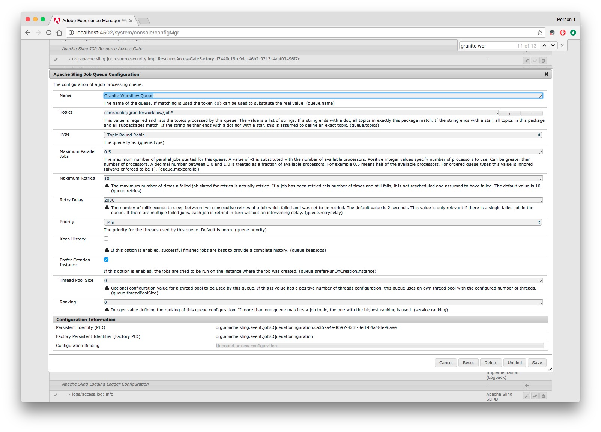

1. Select **[!UICONTROL Save]**.

#### Update the Dynamic Media Classic upload connection {#updating-the-scene-upload-connection}

The Scene7 Upload Connection setting synchronizes Experience Manager assets to Dynamic Media Classic servers.

**To update the Dynamic Media Classic upload connection:**

1. Navigate to `https://<server>/system/console/configMgr/com.day.cq.dam.scene7.impl.Scene7UploadServiceImpl`
1. In the **[!UICONTROL Number of connections]** field and/or the **[!UICONTROL Active job timeout]** field, change the number as desired.

   The **[!UICONTROL Number of connections]** setting controls the maximum number of HTTP connections allowed for Experience Manager to Dynamic Media upload; typically, the predefined value of ten connections is sufficient.

   The **[!UICONTROL Active job timeout]** setting determines the wait time for uploaded Dynamic Media assets to be published in delivery server. This value is 2100 seconds (35 minutes) by default.

   For most use cases, the setting of 2100 is sufficient.

   

1. Select **[!UICONTROL Save]**.

### (Optional) Filter assets for replication {#optional-filtering-assets-for-replication}

In non-Dynamic Media deployments, you replicate *all* assets (both images and video) from your Experience Manager author environment to the Experience Manager Publish node. This workflow is necessary because the Experience Manager Publish servers also deliver the assets.

However, in Dynamic Media deployments, because assets are delivered by way of the Cloud Service, there is no need to replicate those same assets to Experience Manager publish nodes. Such a "hybrid publishing" workflow avoids extra storage costs and longer processing times to replicate assets. Other content, such as Site pages, continue to be served from the Experience Manager publish nodes.

The filters provide a way for you to *exclude* assets from being replicated to the Experience Manager publish node.

#### Use default asset filters for replication {#using-default-asset-filters-for-replication}

If you use Dynamic Media for imaging, or video, or both, you can use the default filters that Adobe provides as-is. The following filters are active by default:

|   | Filter | Mime type | Renditions |
| --- | --- | --- | --- |
| Dynamic Media Image Delivery | filter-image<br>filter-sets | Starts with **image/**<br>Contains **applications/** and end with **set**. | The out-of-the-box "filter-images" (applies to single images assets, including interactive images) and "filter-sets" (applies to Spin Sets, Image Sets, Mixed Media Sets, and Carousel Sets) will:<br>&bull; Exclude from replication the original image and static image renditions. |
|Dynamic Media Video Delivery | filter-video | Starts with **video/** | The out-of-the-box "filter video" will:<br>&bull; Exclude from replication the original video and static thumbnail renditions. |

>[!NOTE]
>
>Filters apply to MIME types and cannot be path-specific.

#### Customize asset filters for replication {#customizing-asset-filters-for-replication}

1. In Experience Manager, select the Experience Manager logo to access the global navigation console and navigate to **[!UICONTROL Tools]** > **[!UICONTROL General]** > **[!UICONTROL CRXDE Lite]**.
1. In the left folder tree, navigate to `/etc/replication/agents.author/publish/jcr:content/damRenditionFilters` to review the filters.

   

1. To define the Mime Type for the filter, you can locate the Mime Type as follows:

   In the left rail, expand `content > dam > <locate_your_asset> > jcr:content > metadata`, and then in the table, locate `dc:format`.

   The following graphic is an example of an asset's path to `dc:format`.

   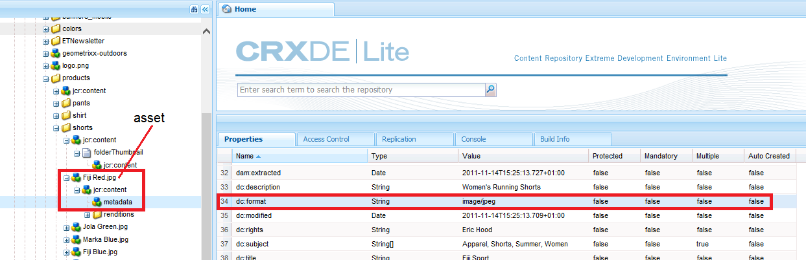

   Notice that the `dc:format` for the asset `Fiji Red.jpg` is `image/jpeg`.

   To have this filter apply to all images, regardless of their format, set the value to `image/*` where `*` is a regular expression that is applied to all images of any format.

   To have the filter apply only to images of the type JPEG, enter a value of `image/jpeg`.

1. Define what renditions you want to include or exclude from replication.

   Characters that you can use to filter for replication include the following:

   | Character to use  | How it filters assets for replication |
   | --- | --- |
   | * | Wildcard character |
   | + | Includes assets for replication |
   | - | Excludes assets from replication |

   Navigate to `content/dam/<locate your asset>/jcr:content/renditions`.

   The following graphic is an example of an asset's renditions.

   

   If you only wanted to replicate the original, then you would enter `+original`.
