# Configure Dynamic Media - Hybrid mode {#configuring-dynamic-media-hybrid-mode}

## Dynamic Media - Hybrid add-on package (AEM 6.5.23 and later)

Starting with AEM 6.5 Service Pack 23, a new add-on package is available for Dynamic Media - Hybrid mode. This package includes the `cq-scene7-imaging` bundle specifically compatible with the Dynamic Media - Hybrid run mode.

**Key fix included**

Fixed an issue in Dynamic Media - Hybrid deployments where updates to the `catalog.expiration` parameter under `/conf/global/settings/dam/dm/imageserver` were not reflected on the server or author URLs, despite replication succeeding without errors. The update ensures consistent expiration values between CRX/DE, the server response, and public delivery URLs. In turn, it improves the cache behavior and reliability of image transformations. (ASSETS-44837)

**Important considerations**

* The `cq-scene7-imaging` bundle in the base AEM 6.5.23 (and later) installation is *not compatible* with Dynamic Media - Hybrid run mode.
* Installing Service Pack 23 (and later) alone does *not automatically update* existing `cq-scene7-imaging` bundle on AEM instances configured for Dynamic Media - Hybrid (`-r dynamicmedia` run mode).

**When to install the Hybrid add-on package**

* When upgrading directly to AEM 6.5.23 (and later) from AEM 6.5.19 or earlier.
* When needing fixes specific to the Dynamic Media - Hybrid functionality.
* When deploying a new Dynamic Media - Hybrid instance directly from AEM 6.5 GA (General Availability) to Service Pack 23 (and later).

**Download Hybrid add-on package**

The Hybrid add-on package is publicly available on Adobe Software Distribution starting Thursday, May 22, 2025, with the official release of AEM 6.5.23. Users can find it by searching for **AEM 6.5 Dynamic Media Hybrid Add-on Package** in Software Distribution.


## End of support for SSL 2.0 and 3.0 and TLS 1.0 and 1.1.

End of support for Secure Socket Layer 2.0 and 3.0 and Transport Layer Security 1.0 and 1.1.

Effective April 30, 2024, Adobe Dynamic Media ended support for the following:

* SSL (Secure Socket Layer) 2.0
* SSL 3.0 
* TLS (Transport Layer Security) 1.0 and 1.1
* The following weak ciphers in TLS 1.2:
 `TLS_ECDHE_RSA_WITH_AES_256_CBC_SHA384`
 `TLS_ECDHE_RSA_WITH_AES_256_CBC_SHA`
 `TLS_RSA_WITH_AES_256_GCM_SHA384`
 `TLS_RSA_WITH_AES_256_CBC_SHA256`
 `TLS_RSA_WITH_AES_256_CBC_SHA`
 `TLS_ECDHE_RSA_WITH_AES_128_CBC_SHA256`
 `TLS_ECDHE_RSA_WITH_AES_128_CBC_SHA`
 `TLS_RSA_WITH_AES_128_GCM_SHA256`
 `TLS_RSA_WITH_AES_128_CBC_SHA256`
 `TLS_RSA_WITH_AES_128_CBC_SHA`
 `TLS_RSA_WITH_CAMELLIA_256_CBC_SHA`
 `TLS_RSA_WITH_CAMELLIA_128_CBC_SHA`
 `TLS_ECDHE_RSA_WITH_3DES_EDE_CBC_SHA`
 `TLS_RSA_WITH_SDES_EDE_CBC_SHA`

See also [Dynamic Media Limitations](/help/assets/limitations.md).

<!-- FOR ABOVE - CQDOC-19433 (original ticket)
and CQDOC-19792 (removed as per this ticket December 5, 2022) -->


Dynamic Media-Hybrid must be enabled and configured for use. Depending on your use case, Dynamic Media has several [supported configurations](#supported-dynamic-media-configurations).

>[!NOTE]
>
>If you intend to configure and run Dynamic Media in Scene7 run mode, see [Configure Dynamic Media - Scene7 mode](/help/assets/config-dms7.md).
>
>If you intend to configure and run Dynamic Media in hybrid run mode, follow the instructions on this page.

Learn more about working with [video](/help/assets/video.md) in Dynamic Media.

>[!NOTE]
>
>If you use Adobe Experience Manager set up for different environments, such as one for development, staging, and live production, configure Dynamic Media Cloud Services for each environment.

>[!NOTE]
>
>If you have issues with your Dynamic Media configuration, look in the log files that are specific to Dynamic Media. These files are installed automatically when you enable Dynamic Media:
>
>* `s7access.log`
>* `ImageServing.log`
>
>They are documented in [Monitor and maintain your Experience Manager instance](/help/sites-deploying/monitoring-and-maintaining.md).

Hybrid publishing and delivery is a core feature of the Dynamic Media addition to Adobe Experience Manager. Hybrid publishing lets you deliver Dynamic Media assets, such as images, sets, and video, from the cloud instead of from the Experience Manager publish nodes.

Other content, such as Dynamic Media viewers, Site pages, and static content continue to be served from the Experience Manager publish nodes.

If you are a customer of Dynamic Media, you are required to use hybrid delivery as the delivery mechanism for all Dynamic Media content.

## Hybrid publishing architecture for videos {#hybrid-publishing-architecture-for-videos}


## Hybrid publishing architecture for images {#hybrid-publishing-architecture-for-images}

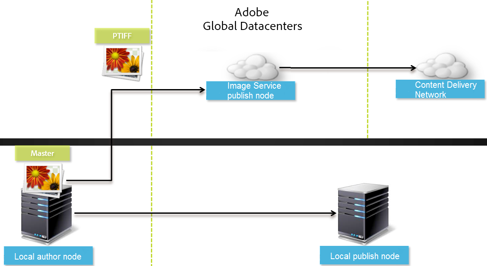

## Supported Dynamic Media Configurations {#supported-dynamic-media-configurations}

The configuration tasks that follow reference the following terms:

| **Term** | **Dynamic Media Enabled** | **Description** |
|---|---|---|
| Experience Manager Author node |White check mark in a green circle |The author node that you deploy to On-Premise or through Managed Services. |
| Experience Manager Publish node |White "X" in a red square. |The publish node that you deploy to On-Premise or through Managed Services. |
| Image Service Publish node |White check mark in a green circle. |The publish node that you run on Data Centers that are managed by Adobe. Refers to the image service URL. |

You can choose to implement Dynamic Media only for imaging, only for video, or for both imaging and video. To determine the steps for configuring Dynamic Media for your specific scenario, see the following table.

<table>
 <tbody>
  <tr>
   <td><strong>Scenario</strong></td>
   <td ><strong>How it Works</strong></td>
   <td><strong>Configuration Steps</strong></td>
  </tr>
  <tr>
   <td>Deliver ONLY images in production</td>
   <td>Images are delivered through servers in Adobe's worldwide data centers and then cached by a CDN for scalable performance and global reach.</td>
   <td>
    <ol>
     <li>On the Experience Manager <strong>author</strong> node, <a href="#enabling-dynamic-media">enable Dynamic Media</a>.</li>
     <li>Configure imaging in <a href="#configuring-dynamic-media-cloud-services">Dynamic Media Cloud Services</a>.</li>
     <li><a href="#configuring-image-replication">Configure image replication</a>.</li>
     <li><a href="#replicating-catalog-settings">Replicate catalog settings</a>.</li>
     <li><a href="#replicating-viewer-presets">Replicate viewer presets</a>.</li>
     <li><a href="#using-default-asset-filters-for-replication">Use default asset filters for replication</a>.</li>
     <li><a href="#configuring-dynamic-media-image-server-settings">Configure Dynamic Media Image Server settings</a>.</li>
     <li><a href="#delivering-assets">Deliver assets</a>.</li>
    </ol> </td>
  </tr>
  <tr>
   <td>Deliver ONLY images in pre-production (Dev, QE, Stage, and so on.)</td>
   <td>Images are delivered through the Experience Manager publish node. In this scenario, because traffic is minimal, there is no need to deliver images to Adobe's data center. And it allows for secure preview of content before production launch.</td>
   <td>
    <ol>
     <li>On the Experience Manager <strong>author</strong> node, <a href="#enabling-dynamic-media">enable Dynamic Media</a>.</li>
     <li>On Experience Manager <strong>publish</strong> node, <a href="#enabling-dynamic-media">enable Dynamic Media</a>.</li>
     <li><a href="#replicating-viewer-presets">Replicate viewer presets</a>.</li>
     <li>Set up <a href="#setting-up-asset-filters-for-imaging-in-non-production-deployments">asset filter for non-production images</a>.</li>
     <li><a href="#configuring-dynamic-media-image-server-settings">Configure Dynamic Media Image Server settings.</a></li>
     <li><a href="#delivering-assets">Deliver assets.</a></li>
    </ol> </td>
  </tr>
  <tr>
   <td>Deliver ONLY video in any environment (Production, Dev, QE, Stage, and so on)</td>
   <td>Videos are delivered and cached by a CDN for scalable performance and global reach. The video poster image (thumbnail of video which shows before playback initiates) is delivered by the Experience Manager publish instance.</td>
   <td>
    <ol>
     <li>On the Experience Manager <strong>author</strong> node, <a href="#enabling-dynamic-media">enable Dynamic Media</a>.</li>
     <li>On the Experience Manager <strong>publish</strong> node, <a href="#enabling-dynamic-media">enable Dynamic Media</a> (the publish instance serves the video poster image and provides metadata for video playback).</li>
     <li>Configure video in <a href="#configuring-dynamic-media-cloud-services">Dynamic Media Cloud Services.</a></li>
     <li><a href="#replicating-viewer-presets">Replicate viewer presets</a>.</li>
     <li>Set up <a href="#setting-up-asset-filters-for-video-only-deployments">asset filter for video-only</a>.</li>
     <li><a href="#delivering-assets">Deliver assets.</a></li>
    </ol> </td>
  </tr>
  <tr>
   <td>Deliver BOTH images and video in production</td>
   <td><p>Videos are delivered and cached by a CDN for scalable performance and global reach. Images and video poster images are delivered through servers in Adobe's worldwide data centers and then cached by a CDN for scalable performance and global reach.</p> <p>Refer to previous sections to setup image or video in pre-production. </p> </td>
   <td>
    <ol>
     <li>On the Experience Manager <strong>author</strong> node, <a href="#enabling-dynamic-media">enable Dynamic Media</a>.</li>
     <li>Configure video in <a href="#configuring-dynamic-media-cloud-services">Dynamic Media Cloud Services.</a></li>
     <li>Configure imaging in <a href="#configuring-dynamic-media-cloud-services">Dynamic Media Cloud Services.</a></li>
     <li><a href="#configuring-image-replication">Configure image replication</a>.</li>
     <li><a href="#replicating-catalog-settings">Replicate catalog settings</a>.</li>
     <li><a href="#replicating-viewer-presets">Replicate viewer presets</a>.</li>
     <li><a href="#using-default-asset-filters-for-replication">Use default asset filters for replication.</a></li>
     <li><a href="#configuring-dynamic-media-image-server-settings">Configure Dynamic Media Image Server settings.</a></li>
     <li><a href="#delivering-assets">Deliver assets.</a></li>
    </ol> </td>
  </tr>
 </tbody>
</table>

## Enable Dynamic Media {#enabling-dynamic-media}

[Dynamic Media](https://business.adobe.com/products/experience-manager/assets/dynamic-media.html) is disabled by default. To take advantage of Dynamic Media features, you must enable Dynamic Media by using the `dynamicmedia` run mode as you would, for example, `publish` run mode. Before enabling, make sure to review the [technical requirements](/help/sites-deploying/technical-requirements.md#requirements-for-aem-dynamic-media-add-on).

>[!NOTE]
>
>Enabling Dynamic Media via the run mode replaces the functionality in Experience Manager 6.1 and Experience Manager 6.0 where you enabled Dynamic Media by setting the `dynamicMediaEnabled` flag to **[!UICONTROL true]**. This flag has no functionality in Experience Manager 6.2 and later. In addition, you do not need to restart the quickstart to enable Dynamic Media.

By enabling Dynamic Media, the Dynamic Media features are available in the UI and every uploaded image asset receives a *cqdam.pyramid.tiff* rendition that is used for fast delivery of dynamic image renditions. Those PTIFFs have significant advantages such as the following:

* The ability to manage only a single primary source image and generate infinite renditions on-the-fly without any additional storage.
* The ability to use interactive visualization such as zoom, pan, and spin.

If you want to use Dynamic Media Classic in Experience Manager, do not enable Dynamic Media unless you are using a [specific scenario](/help/sites-administering/scene7.md#aem-scene-integration-versus-dynamic-media). Dynamic Media is disabled unless you enable Dynamic Media by way of the run mode.

To enable Dynamic Media, you must enable the Dynamic Media run mode either from the command line or from the quickstart file name.

**To enable Dynamic Media:**

1. On the command line, when launching the quickstart, do the following:

    * Add `-r dynamicmedia` to the end of the command line when starting the jar file.

   ```shellsession {.line-numbers}
   java -Xmx4096m -Doak.queryLimitInMemory=500000 -Doak.queryLimitReads=500000 -jar cq-quickstart-6.5.0.jar -r dynamicmedia

   ```

   If you are publishing to s7delivery, you must also include the following trustStore arguments:

   ``` shellsession {.line-numbers}
   -Djavax.net.ssl.trustStore=<absoluteFilePath>/customerTrustStoreFileName>

    -Djavax.net.ssl.trustStorePassword=<passwordForTrustStoreFile>
   ```

1. Request `https://localhost:4502/is/image` and make sure that Image Server is now running.

   >[!NOTE]
   >
   >To troubleshoot issues with Dynamic Media, see the following logs in the `crx-quickstart/logs/` directory:
   >
   >* ImageServer-&lt;PortId&gt;-&lt;yyyy&gt;&lt;mm&gt;&lt;dd&gt;.log - The ImageServer log provides statistics and analytical information used for analyzing the behavior of the internal ImageServer process.
   >
   >Example of an Image Server log file name: `ImageServer-57346-2020-07-25.log`
   >
   >* s7access-&lt;yyyy&gt;&lt;mm&gt;&lt;dd&gt;.log - The s7access log records each request made to Dynamic Media through `/is/image` and `/is/content`.
   >
   >These logs are only used when Dynamic Media is enabled. They are not included in the **Download Full** package that is generated from the `system/console/status-Bundlelist` page; when calling Customer Support if you have a Dynamic Media issue, append both these logs to the issue.

### If you installed Experience Manager to a different port or context path ... {#if-you-installed-aem-to-a-different-port-or-context-path}

If you are deploying [Experience Manager to an application server](/help/sites-deploying/application-server-install.md) and have Dynamic Media enabled, you must configure the **self-domain** in the Externalizer. Otherwise, thumbnail generation for assets does not work properly for Dynamic Media assets.

In addition, if you run quickstart on a different port or context path, you also have to change the **self-domain**.

When Dynamic Media is enabled, the static thumbnail renditions for image assets are generated using Dynamic Media. For thumbnail generation to work properly for Dynamic Media, Experience Manager must perform a URL request to itself and must know both the port number and the context path.

In Experience Manager:

* The **self-domain** in the [Externalizer](/help/sites-developing/externalizer.md) is used to retrieve both the port number and context path.
* If no **self-domain** is configured, the port number and context path are retrieved from the Jetty HTTP service.

In an Experience Manager QuickStart WAR deployment, the port number and context path cannot be derived, therefore you must configure a **self-domain**. See [Externalizer documentation](/help/sites-developing/externalizer.md) on how to configure the **self-domain**.

>[!NOTE]
>
>In an [Experience Manager Quickstart stand-alone deployment](/help/sites-deploying/deploy.md), a **self-domain** generally does not need to be configured because the port number and context path can be auto-configured. However, if all network interfaces are turned off, you must configure the **self-domain**.

## Disable Dynamic Media  {#disabling-dynamic-media}

Dynamic Media is not enabled by default. However, if you have previously enabled Dynamic Media, you can turn it off later.

To disable Dynamic Media after you have enabled it, you remove the `-r dynamicmedia` run mode flag.

**To disable Dynamic Media:**

1. On the command line, when launching the quickstart, you can do either of the following:

    * Do not add `-r dynamicmedia` to the command line when starting the jar file.

   ```shellsession {.line-numbers}
   java -Xmx4096m -Doak.queryLimitInMemory=500000 -Doak.queryLimitReads=500000 -jar cq-quickstart-6.5.0.jar

   ```

1. Request `https://localhost:4502/is/image`. You receive a message that Dynamic Media is disabled.

   >[!NOTE]
   >
   >After the Dynamic Media run mode is disabled, the workflow step that generates the `cqdam.pyramid.tiff` rendition is skipped automatically. It also disables dynamic rendition support and other Dynamic Media features.
   >
   >Also note that when Dynamic Media run mode is disabled after configuring the Experience Manager server, all assets that were uploaded under that run mode are now invalid.

## (Optional) Migrate Dynamic Media presets and configurations from 6.3 to 6.5 Zero Downtime {#optional-migrating-dynamic-media-presets-and-configurations-from-to-zero-downtime}

If you are upgrading Experience Manager - Dynamic Media from 6.3 to 6.5 (which now includes the ability for zero downtime deployments), you must run the following curl command. The command migrates all your presets and configurations from `/etc` to `/conf` in CRXDE Lite.

>[!NOTE]
>
>If you run your Experience Manager instance in compatibility mode &ndash; that is, you have the compatibility package installed &ndash; you do not need to run these commands.

For all upgrades, either with or without the compatibility package, you can copy the default, out-of-the-box viewer presets that originally came with Dynamic Media by running the following Linux&reg; curl command:

`curl -u admin:admin -X POST https://<server_address>:<server_port>/libs/settings/dam/dm/presets/viewer.pushviewerpresets.json`

To migrate any custom viewer presets and configurations that you have created from `/etc` to `/conf`, run the following Linux&reg; curl command:

`curl -u admin:admin -X POST https://<server_address>:<server_port>/libs/settings/dam/dm/presets.migratedmcontent.json`

## Configure image replication {#configuring-image-replication}

Dynamic Media image delivery works by publishing image assets, including video thumbnails, from Experience Manager Author and replicating them to Adobe's on-demand replication service (the Replication Service URL). Assets are then delivered by way of the on-demand image delivery service (the Image Service URL).

Do the following:

1. [Set up authentication](#setting-up-authentication).
1. [Configure the replication agent](#configuring-the-replication-agent).

The Replication Agent publishes Dynamic Media assets such as images, video metadata, and sets to the Adobe-hosted Image Service. The Replication Agent is not enabled by default.

After you have configured the replication agent, you must [validate and test that it has been successfully set up](#validating-the-replication-agent-for-dynamic-media). This section describes these procedures.

>[!NOTE]
>
>The default memory limit for PTIFF creation is 3 GB across all workflows. For example, you can process one image that requires 3 GB of memory while other workflows are paused, or you can process 10 images in parallel that require 300 MB of memory each.
>
>The memory limit is configurable and fits the system resource availability and the type of image content being processed. If you have many large assets and have enough memory on the system, you can increase this limit to ensure that the images are processed in parallel.
>
>An image that requires more than the maximum memory limit is rejected.
>
>To change the memory limit for PTIFF creation, navigate to **[!UICONTROL Tools]** > **[!UICONTROL Operations]** > **[!UICONTROL Web Console]** > **[!UICONTROL Adobe CQ Scene7 PTiffManager]** and change the **[!UICONTROL maxMemory]** value.

### Set up authentication {#setting-up-authentication}

Set up replication authentication on author so you can replicate images to the Dynamic Media image delivery service. You first obtain a KeyStore and then save it under the **[!UICONTROL dynamic-media-replication]** user and configure it. Your company administrator received a welcome email with the KeyStore file and necessary credentials during the provisioning process. If you did not receive this information, contact Adobe Customer Support.

**To set up authentication:**

1. Contact Adobe Customer Support for your KeyStore file and password if you do not already have the file and password. This information is a necessary part of provisioning. It associates the keys to your account.

1. In Experience Manager, select the Experience Manager logo to access the global navigation console, then navigate to **[!UICONTROL Tools]** > **[!UICONTROL Security]** > **[!UICONTROL Users]**.

1. On the User Management page, navigate to the **[!UICONTROL dynamic-media-replication]** user, then select to open.

   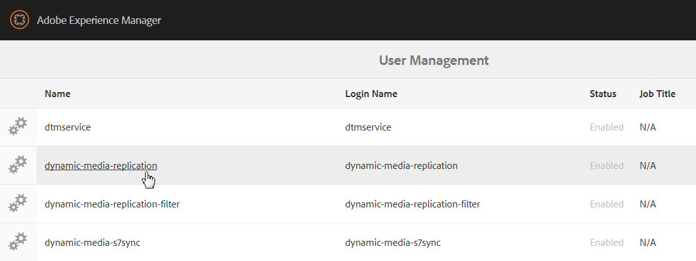

1. In the Edit User Settings For dynamic-media-replication page, select the **[!UICONTROL Keystore]** tab, then select **[!UICONTROL Create KeyStore]**.

   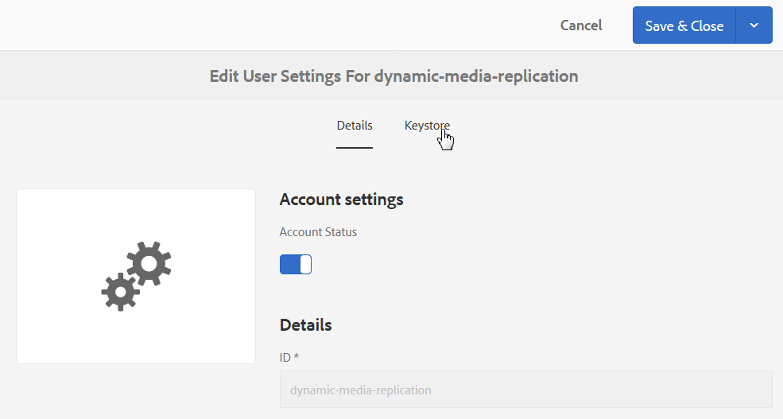

1. Enter a password and confirm the password in the **[!UICONTROL Set KeyStore Access Password]** dialog box.

   >[!NOTE]
   >
   >Remember the password because you must enter it again when you configure the Replication Agent later.

   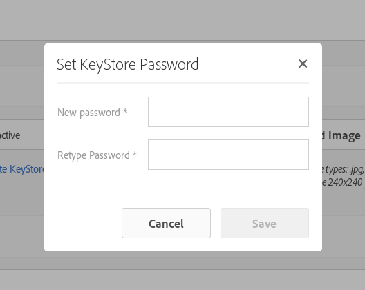

1. On the **[!UICONTROL Edit User Settings For dynamic-media-replication]** page, expand the **Add Private Key from KeyStore file** area and add the following (see the images that follow):

    * In the **[!UICONTROL New Alias]** field, enter the name of an alias that you want to use later in the replication configuration. For example, you could use `replication` as an alias.
    * Select **[!UICONTROL KeyStore File]**. Navigate to the KeyStore file provided to you by Adobe, select it, then select **[!UICONTROL Open]**.
    * In the **[!UICONTROL KeyStore File Password]** field, enter the KeyStore File password. This password is **not** the KeyStore password that you created in Step 5 but is the KeyStore File password Adobe provides in the Welcome email sent to you during provisioning. Contact Adobe Customer Support if you did not receive a KeyStore File password.
    * In the **[!UICONTROL Private Key Password]** field, enter the private key password (can be the same private key password provided in the previous step). Adobe provides the private key password in the Welcome email sent to you during provisioning. Contact Adobe Customer Support if you did not receive a private key password.
    * In the **[!UICONTROL Private Key Alias]** field, enter the private key alias. For example, `*companyname*-alias`. Adobe provides the private key alias in the Welcome email sent to you during provisioning. Contact Adobe Customer Support if you did not receive a private key alias.

   

1. Select **[!UICONTROL Save & Close]** to save your changes to this user.

   Next, you must [configure the replication agent](#configuring-the-replication-agent).

### Configure the replication agent {#configuring-the-replication-agent}

1. In Experience Manager, select the Experience Manager logo to access the global navigation console, then navigate to **[!UICONTROL Tools]** > **[!UICONTROL Deployment]** > **[!UICONTROL Replication]** > **[!UICONTROL Agents on author]**.
1. On the Agents on author page, select **[!UICONTROL Dynamic Media Hybrid Image Replication (s7delivery)]**.
1. Select **[!UICONTROL Edit]**.
1. Select the **[!UICONTROL Settings]** tab, then enter the following:

    * **[!UICONTROL Enabled]** - Select this check box to enable the replication agent.
    * **[!UICONTROL Region]** - Set to the appropriate region: North America, Europe, or Asia
    * **[!UICONTROL Tenant ID]** - This value is the name of your company/tenant that is publishing to the Replication Service. This value is the Tenant ID that Adobe provides in the Welcome email sent to you during provisioning. If you did not receive this information, contact Adobe Customer Support.
    * **[!UICONTROL Key Store Alias]** - This value is the same as the **New Alias** value set when generating the key in [Setting Up Authentication](#setting-up-authentication); for example, `replication`. (See step 7 in [Setting Up Authentication](#setting-up-authentication).)
    * **[!UICONTROL Key Store Password]** - The KeyStore password that was created when you tapped **[!UICONTROL Create KeyStore]**. Adobe does not provide this password. See step 5 of [Setting up Authentication](#setting-up-authentication).

   The following image shows the replication agent with sample data:

   

1. Select **[!UICONTROL OK]**.

### Validate the replication agent for Dynamic Media {#validating-the-replication-agent-for-dynamic-media}

To validate the replication agent for Dynamic Media, do the following:

Select **[!UICONTROL Test Connection]**. Example output is as follows:

```shell
11.03.2016 10:57:55 - Transferring content for ReplicationAction{type=TEST, path[0]='/content/dam', time=1457722675402, userId='admin', revision='null'}
11.03.2016 10:57:55 - * Auth User: replication-receiver
11.03.2016 10:57:55 - * HTTP Version: 1.1
11.03.2016 10:57:55 - * Using OAuth 2.0 Authorization Grants
11.03.2016 10:57:55 - * OAuth 2.0 User: dynamic-media-replication
11.03.2016 10:57:55 - * OAuth 2.0 Token: '*****' initialized
11.03.2016 10:57:55 - Publishing: POST[https://replicate-na.assetsadobe.com:8580/is-publish/publish-receiver?Cmd=Test&RootId=xfpuu-6613]
11.03.2016 10:57:55 - Publish response: OK[]
11.03.2016 10:57:55 - Transfer succeeded in 141 ms for ReplicationAction{type=TEST, path[0]='/content/dam', time=1457722675402, userId='admin', revision='null'}
-------------------------------------------------------------------------------------------------------------------------------
Replication test succeeded
```

>[!NOTE]
>
>You can also check by doing one of the following:
>
>* Check the replication logs to make sure that the asset is replicated.
>* Publish an image. Select the image and select **[!UICONTROL Viewers]** in drop-down menu, then select a viewer preset. Select **[!UICONTROL URL]**. To verify that you can see the image, copy and paste the URL path in the browser.
>

### Troubleshoot authentication {#troubleshooting-authentication}

When setting up authentication, here are some issues you can run into with their solutions. Before checking for these issues, make sure you have set up replication.

#### Problem: HTTP Status Code 401 with Message - Authorization Required {#problem-http-status-code-with-message-authorization-required}

This issue can be caused by a failure to set up the KeyStore for `dynamic-media-replication` user.

```shell
Replication test to s7delivery:https://s7bern.macromedia.com:8580/is-publish/
17.06.2016 18:54:43 - Transferring content for ReplicationAction{type=TEST, path[0]='/content/dam', time=1466214883309, userId='admin', revision='null'}
17.06.2016 18:54:43 - * Auth User: replication-receiver
17.06.2016 18:54:43 - * HTTP Version: 1.1
17.06.2016 18:54:43 - * Using OAuth 2.0 Authorization Grants
17.06.2016 18:54:43 - * OAuth 2.0 User: dynamic-media-replication
17.06.2016 18:54:43 - No OAuth token available. OAuth not initialized
17.06.2016 18:54:43 - * Using Client Auth SSL alias - replication-alias *
17.06.2016 18:54:43 - Publishing: POST[https://<localhost>:8580/is-publish//publish-receiver?Cmd=Test&RootId=brough]
17.06.2016 18:54:43 - Transfer failed for ReplicationAction{type=TEST, path[0]='/content/dam', time=1466214883309, userId='admin', revision='null'}. java.io.IOException: Failed to execute request
'https://<localhost>:8580/is-publish//publish-receiver?Cmd=Test&RootId=brough':
 Server returned status code 401 with message: Authorization required.
17.06.2016 18:54:43 - Error while replicating: com.day.cq.replication.ReplicationException: Transfer failed for ReplicationAction{type=TEST, path[0]='/content/dam', time=1466214883309,
 userId='admin', revision='null'}. java.io.IOException: Failed to execute request
'https://<localhost>:8580/is-publish//publish-receiver?Cmd=Test&RootId=brough':
 Server returned status code 401 with message: Authorization required.
```

**Solution:**
Check that the `KeyStore` is saved to **dynamic-media-replication** user and is provided with the correct password.

#### Problem: Could Not Decrypt Key - Could Not Decrypt Data {#problem-could-not-decrypt-key-could-not-decrypt-data}

```xml
Replication test to s7delivery:https://<localhost>:8580/is-publish/
17.06.2016 19:00:16 - Transferring content for ReplicationAction{type=TEST, path[0]='/content/dam', time=1466215216662, userId='admin', revision='null'}
17.06.2016 19:00:16 - * Auth User: replication-receiver
17.06.2016 19:00:16 - * HTTP Version: 1.1
17.06.2016 19:00:16 - * Using OAuth 2.0 Authorization Grants
17.06.2016 19:00:16 - * OAuth 2.0 User: dynamic-media-replication
17.06.2016 19:00:16 - No OAuth token available. OAuth not initialized
17.06.2016 19:00:16 - * Using Client Auth SSL alias - replication-alias *
17.06.2016 19:00:16 - Transfer failed for ReplicationAction{type=TEST, path[0]='/content/dam', time=1466215216662, userId='admin', revision='null'}. java.lang.SecurityException: java.security.UnrecoverableKeyException: Could not decrypt key: Could not decrypt data.
```

**Solution:**
Check the password. The password saved in the replication agent is not the same password that was used to create keystore.

#### Problem: InvalidAlgorithmParameterException {#problem-invalidalgorithmparameterexception}

This issue is caused by a configuration error in your Experience Manager Author instance. The Java&trade; process on the Author is not getting the correct `javax.net.ssl.trustStore`. You see this error in the replication log:

```shell
14.04.2016 09:37:43 - Transfer failed for ReplicationAction{type=TEST, path[0]='/content/dam', time=1460651862089, userId='admin', revision='null'}. java.io.IOException: Failed to execute request 'https://<localhost>:8580/is-publish/publish-receiver?Cmd=Test&RootId=rbrough-osx2': java.lang.RuntimeException: Unexpected error: java.security.InvalidAlgorithmParameterException: the trustAnchors parameter must be non-empty
14.04.2016 09:37:43 - Error while replicating: com.day.cq.replication.ReplicationException: Transfer failed for ReplicationAction{type=TEST, path[0]='/content/dam', time=1460651862089, userId='admin', revision='null'}. java.io.IOException: Failed to execute request 'https://<localhost>:8580/is-publish/publish-receiver?Cmd=Test&RootId=rbrough-osx2': java.lang.RuntimeException: Unexpected error: java.security.InvalidAlgorithmParameterException: the trustAnchors parameter must be non-empty
```

Or the error log:

```shell
07.25.2019 12:00:59.893 *ERROR* [sling-threadpool-db2763bb-bc50-4bb5-bb64-10a09f432712-(apache-sling-job-thread-pool)-90-com_day_cq_replication_job_s7delivery(com/day/cq/replication/job/s7delivery)] com.day.cq.replication.Agent.s7delivery.queue Error during processing of replication.

java.io.IOException: Failed to execute request 'https://replicate-na.assetsadobe.com:8580/is-publish/publish-receiver?Cmd=Test&RootId=rbrough-osx': java.lang.RuntimeException: Unexpected error: java.security.InvalidAlgorithmParameterException: the trustAnchors parameter must be non-empty
        at com.scene7.is.catalog.service.publish.atomic.PublishingServiceHttp.executePost(PublishingServiceHttp.scala:195)
```

**Solution:**
Make sure that the Java&trade; process on the Experience Manager Author has the system property `-Djavax.net.ssl.trustStore=` set to a valid truststore.

#### Problem: KeyStore is either not set up or it is not initialized {#problem-keystore-is-either-not-set-up-or-it-is-not-initialized}

This issue is likely caused by a hot fix, or a feature pack overwriting the dynamic-media-user or keystore node.

Replication log example:

```shell
Replication test to s7delivery:https://replicate-na.assetsadobe.com/is-publish
02.08.2016 14:37:44 - Transferring content for ReplicationAction{type=TEST, path[0]='/content/dam', time=1470173864834, userId='admin', revision='null'}
02.08.2016 14:37:44 - * Auth User: replication-receiver
02.08.2016 14:37:44 - * HTTP Version: 1.1
02.08.2016 14:37:44 - * Using OAuth 2.0 Authorization Grants
02.08.2016 14:37:44 - * OAuth 2.0 User: dynamic-media-replication
02.08.2016 14:37:44 - Transfer failed for ReplicationAction{type=TEST, path[0]='/content/dam', time=1470173864834, userId='admin', revision='null'}. com.adobe.granite.keystore.KeyStoreNotInitialisedException: Uninitialised key store for user dynamic-media-replication

```

**Solution:**

1. Navigate to the User Management page:
   `localhost:4502/libs/granite/security/content/useradmin.html`
1. On the User Management page, navigate to the `dynamic-media-replication` user, then select to open.
1. Select the **[!UICONTROL KeyStore]** tab. If the **[!UICONTROL Create KeyStore]** button appears, then you must redo the steps under [Setting up Authentication](#setting-up-authentication) earlier.
1. If you had to redo the KeyStore setup, you must do [Configuring the Replication Agent](/help/assets/config-dynamic.md#configuring-the-replication-agent) again, as well.

   Reconfigure the s7delivery Replication Agent.
   `localhost:4502/etc/replication/agents.author/s7delivery.html`

1. Select **[!UICONTROL Test Connection]** so you can verify that the configuration is valid.

#### Problem: Publish Agent is using SSL instead of OAuth {#problem-publish-agent-is-using-ssl-instead-of-oauth}

This issue is likely caused by a hot fix or a feature pack that did not install correctly or overwrote the settings.

Replicate log example:

```shell
01.08.2016 18:42:59 - Transferring content for ReplicationAction{type=TEST, path[0]='/content/dam', time=1470073379634, userId='admin', revision='null'}
01.08.2016 18:42:59 - * Auth User: replication-receiver
01.08.2016 18:42:59 - * HTTP Version: 1.1
01.08.2016 18:42:59 - * Using Client Auth SSL alias - replication-receiver *
01.08.2016 18:42:59 - Publishing: POST[https://replicate-eu.assetsadobe2.com:443/is-publish/publish-receiver?Cmd=Test&RootId=altayerstaging]
01.08.2016 18:42:59 - Transfer failed for ReplicationAction{type=TEST, path[0]='/content/dam', time=1470073379634, userId='admin', revision='null'}. java.io.IOException: Failed to execute request 'https://replicate-eu.assetsadobe2.com:443/is-publish/publish-receiver?Cmd=Test&RootId=rbroughstaging': Server returned status code 401 with message: Authorization required.
01.08.2016 18:42:59 - Error while replicating: com.day.cq.replication.ReplicationException: Transfer failed for ReplicationAction{type=TEST, path[0]='/content/dam', time=1470073379634, userId='admin', revision='null'}. java.io.IOException: Failed to execute request 'https://replicate-eu.assetsadobe2.com:443/is-publish/publish-receiver?Cmd=Test&RootId=rbroughstaging': Server returned status code 401 with message: Authorization required.

```

**Solution:**

1. In Experience Manager, navigate to **[!UICONTROL Tools]** > **[!UICONTROL General]** > **[!UICONTROL CRXDE Lite]**.

   `localhost:4502/crx/de/index.jsp`

1. Navigate to the s7delivery Replication Agent node.
   `localhost:4502/crx/de/index.jsp#/etc/replication/agents.author/s7delivery/jcr:content`

1. Add this setting to the replication agent (Boolean with value set to **[!UICONTROL True]**):

   `enableOauth=true`

1. Near the upper-left corner of the page, select **[!UICONTROL Save All]**.

### Test your configuration {#testing-your-configuration}

Adobe recommends that you perform an end-to-end test of the configuration.

Be sure you have already done the following before beginning this test:

* Added Image Presets.
* Configure **[!UICONTROL Dynamic Media Configuration (Pre 6.3)]** under Cloud Services. The Image Service URL is required for this test

**To test your configuration:**

1. Upload an image asset. (In Assets, navigate to **[!UICONTROL Create]** > **[!UICONTROL Files]** and select the file.)
1. Wait for the workflow to finish.
1. Publish the image asset. (Select the asset and select **[!UICONTROL Quick Publish]**.)
1. Navigate to the renditions for that image by opening the image, and tapping **[!UICONTROL Renditions]**.

   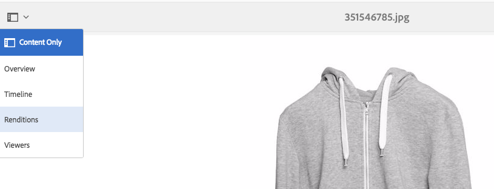

1. Select any dynamic rendition.
1. To obtain the URL for this asset, select **[!UICONTROL URL]**.
1. Navigate to the selected URL and check whether the image behaves as expected.

Another way to test that your assets were delivered is to append req=exists to your URL.

## Configure Dynamic Media Cloud Services {#configuring-dynamic-media-cloud-services}

The Dynamic Media Cloud Service supports hybrid publishing and delivery of images and video, video analytics, and video encoding, among other things.

As part of the configuration, you must enter a registration ID, video service URL, image service URL, replication service URL and set up authentication. This information was emailed to you as part of the account provisioning process. If you did not receive this information, contact your Adobe Experience Manager Administrator or Adobe Customer Support to obtain the information.

>[!NOTE]
>
>Before setting up Dynamic Media Cloud Services, be sure to have your publish instance set up. You must also have replication set up before configuring Dynamic Media Cloud Services.

**To configure Dynamic Media Cloud Services:**

1. In Experience Manager, select the Experience Manager logo to access the global navigation console, then navigate to **[!UICONTROL Tools]** > **[!UICONTROL Cloud Services]** > **[!UICONTROL Dynamic Media Configuration (Pre-6.3)]**.
1. On the Dynamic Media Configuration Browser page, in the left pane, select **[!UICONTROL global]**, then select **[!UICONTROL Create]**.
1. In the **[!UICONTROL Create Dynamic Media Configuration]** dialog box, in the Title field, type a title.
1. If you are configuring Dynamic Media for video,

    * In the **[!UICONTROL Registration ID]** field, type your registration ID.
    * In the **[!UICONTROL Video Service URL]** field, enter the video service URL for the Dynamic Media Gateway.

1. If you are configuring Dynamic Media for imaging, in the **[!UICONTROL Image Service URL]** field, enter the image service URL for the Dynamic Media Gateway.
1. Select **[!UICONTROL Save]** to return to the Dynamic Media Configuration Browser page.
1. To access the global navigation console, select the Experience Manager logo.

## Configure video reporting {#configuring-video-reporting}

You can configure video reporting across multiple installations of Experience Manager using Dynamic Media Hybrid.

**When to use:** At the time you configure Dynamic Media Configuration (Pre 6.3), numerous features are started including video reporting. The configuration creates a report suite in a regional Analytics company. If you configure multiple Author nodes, you create a separate report suite for each one. As a result, reporting data is inconsistent among installations. Furthermore, if each Author node refers to the same Hybrid Publish server, the last Author installation changes the destination report suite for all video reporting. This issue overloads the Analytics system with too many report suites.

**Get started:** Configure video reporting by completing the following three tasks.

1. Create a Video Analytics preset package after you configure Dynamic Media Configuration (Pre 6.3) on the first Author node. This initial task is important because it allows a new configuration to continue using the same report suite.
1. Install the Video Analytics preset package to any ***new*** Author node ***before*** you configure Dynamic Media Configuration (Pre 6.3).
1. Verify and debug the package installation.

### Create a Video Analytics preset package after configuring the first Author node {#creating-a-video-analytics-preset-package-after-configuring-the-first-author-node}

When you have finished this task, you have a package file that contains the Video Analytics presets. These presets contain a report suite, the tracking server, the tracking namespace, and the Experience Cloud Organization ID, if available.

1. If you have not already done so, configure Dynamic Media Configuration (Pre 6.3).
1. (Optional) View and copy the Report Suite ID (you must have access to the JCR). While having the Report Suite ID is not required, it makes validation easier.
1. Create a package using Package Manager.
1. Edit the package to include a filter.

   In Experience Manager: `/conf/global/settings/dam/dm/presets/analytics/jcr:content/userdata`

1. Build the package.
1. Download or share the Video Analytics preset package so that it can be shared with subsequent new Author nodes.

### Install the Video Analytics preset package before you configure more Author nodes {#installing-the-video-analytics-preset-package-before-you-configure-additional-author-nodes}

Be sure that you complete this task ***before*** you configure Dynamic Media Configuration (Pre 6.3). Failure to do so results in the creation of another unused report suite. In addition, even though video reporting continues to work correctly, the gathering of data is not optimized.

Make sure that the Video Analytics preset package from the first Author node is accessible on the new Author node.

1. Upload the Video Analytics preset package that you created earlier to Package Manager.
1. Install the Video Analytics preset package.
1. Configure Dynamic Media Configuration (Pre 6.3).

### Verify and debug the package installation {#verifying-and-debugging-the-package-installation}

1. Do any one of the following to verify and, if necessary, debug the package installation:

    * **Check the Video Analytics preset by way of the JCR**
      To check the Video Analytics preset by way of the JCR, you must have access to CRXDE Lite.

      Experience Manager - In CRXDE Lite, navigate to `/conf/global/settings/dam/dm/presets/analytics/jcr:content/userdata`

      As in `https://localhost:4502/crx/de/index.jsp#/conf/global/settings/dam/dm/presets/analytics/jcr%3Acontent/userdata`

      If you do not have access to CRXDE Lite on the Author node, you can check the preset through the Publish server.

    * **Check the Video Analytics preset through the Image Server**

      You can validate the Video Analytics preset directly by making an Image Server req=userdata request.
      For example, to see the Analytics preset on the Author node, you can make the following request:

      `https://localhost:4502/is/image/conf/global/settings/dam/dm/presets/analytics?req=userdata`

      To validate the preset on Publish servers, you can make a similar direct request to the Publish server. The responses are the same on Author and Publish nodes. The response looks similar to the following:

      ```
      marketingCloudOrgId=0FC4E86B573F99CC7F000101
       reportSuite=aemaem6397618-2018-05-23
       trackingNamespace=aemvideodal
       trackingServer=aemvideodal.d2.sc.omtrdc.net
      ```

    * **Check the Video Analytics preset through the Video Reporting tool in Experience Manager**
      Navigate to **[!UICONTROL Tools]** > **[!UICONTROL Assets]** > **[!UICONTROL Video Reporting]**

      `https://localhost:4502/mnt/overlay/dam/gui/content/s7dam/videoreports/videoreport.html`

      If you see the following error message, the report suite is available, but unpopulated. This error is correct--and desired--in a new installation before the system collects any data.

   

   To generate reporting data, upload and publish one video. Use **[!UICONTROL Copy URL]** and run the video at least one time.

   It can take up to 12 hours before the reporting data is populated from Video Viewer usage.

   If there is an error and the report suite is not set correctly, the following alert is displayed.

   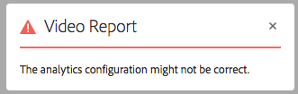

   This error is also displayed if Video Reporting is run before you configure Dynamic Media Configuration (Pre 6.3) services.

### Troubleshoot the video reporting configuration {#troubleshooting-the-video-reporting-configuration}

* During installation, sometimes connections to the Analytics API server times out. The installation retries the connection 20 times, but it still fails. When this situation occurs, the log file records multiple errors. Search for `SiteCatalystReportService`.
* Not installing the Analytics Preset package first can cause the creation of a new report suite.
* Upgrading from Experience Manager 6.3 to Experience Manager 6.4 or Experience Manager 6.4.1, then configuring Dynamic Media Configuration (Pre 6.3), still creates a report suite. This issue is known and slated to be fixed for Experience Manager 6.4.2.

### About the Video Analytics preset {#about-the-video-analytics-preset}

The Video Analytics preset—sometimes known simply as analytics preset--is stored next to the Viewer presets in Dynamic Media. It is basically the same as a Viewer preset but with information used to configure AppMeasurement and Video Heartbeat reporting.

The preset's properties are the following:

* `reportSuite`
* `trackingServer`
* `trackingNamespace`
* `marketingCloudOrgId` (not present in older Experience Manager versions)

Experience Manager 6.4 and newer versions save this preset at `/conf/global/settings/dam/dm/presets/analytics/jcr:content/userdata`

## Replicate catalog settings {#replicating-catalog-settings}

Publish your own default catalog settings as part of the setup process through the JCR. To replicate catalog settings:

1. In a Terminal window, run the following:

   `curl -u admin:admin localhost:4502/libs/settings/dam/dm/presets/viewer.pushviewerpresets`

1. In Experience Manager, navigate to the following location in CRXDE Lite (requires admin privileges):

   `https://<*server*>:<*port*>/crx/de/index.jsp#/conf/global/settings/dam/dm/imageserver/`

1. Select the **[!UICONTROL Replication]** tab.
1. Select **[!UICONTROL Replicate]**.

## Replicate viewer presets {#replicating-viewer-presets}

To deliver *an asset with a viewer preset, you must replicate/publish* the viewer preset. (All viewer presets must be activated *and* replicated to obtain the URL or embed code for an asset.
See [Publish viewer presets](/help/assets/managing-viewer-presets.md#publishing-viewer-presets) for more information.

>[!NOTE]
>
>By default, the system shows various renditions when you select **[!UICONTROL Renditions]** and various viewer presets when you select **[!UICONTROL Viewers]** in the asset's detail view. You can increase or decrease the number seen. See [Increase the number of image presets that are displayed](/help/assets/managing-image-presets.md#increasing-or-decreasing-the-number-of-image-presets-that-display) or [Increase the number of viewer presets that are displayed](/help/assets/managing-viewer-presets.md#increasing-the-number-of-viewer-presets-that-display).

## Filter assets for replication {#filtering-assets-for-replication}

In non-Dynamic Media deployments, you replicate *all* assets (both images and video) from your Experience Manager author environment to the Experience Manager publish node. This workflow is necessary because the Experience Manager Publish servers also deliver the assets.

However, in Dynamic Media deployments, because assets are delivered by way of the cloud, there is no need to replicate those same assets to Experience Manager publish nodes. Such a "hybrid publishing" workflow avoids extra storage costs and longer processing times to replicate assets. Other content, such as Dynamic Media viewers, Site pages, and static content continue to be served from the Experience Manager publish nodes.

Besides replicating the assets, the following non-assets are also replicated:

* Dynamic Media Delivery configuration: `/conf/global/settings/dam/dm/imageserver/jcr:content`
* Image Presets: `/conf/global/settings/dam/dm/presets/macros`
* Viewer Presets: `/conf/global/settings/dam/dm/presets/viewer`

The filters provide a way for you to *exclude* assets from being replicated to the Experience Manager publish node.

### Use default asset filters for replication {#using-default-asset-filters-for-replication}

If you use Dynamic Media for (1) imaging in production *or* (2) imaging and video, then you can use the default filters that Adobe provides as-is. The following filters are active by default:

<table>
 <tbody>
  <tr>
   <td> </td>
   <td><strong>Filter</strong></td>
   <td><strong>Mime type</strong></td>
   <td><strong>Renditions</strong></td>
  </tr>
  <tr>
   <td>Dynamic Media Image Delivery</td>
   <td><p>filter-images</p> <p>filter-sets</p> <p> </p> </td>
   <td><p>Starts with <strong>image/</strong></p> <p>Contains <strong>application/</strong> and ends with <strong>set</strong>.</p> </td>
   <td>The out-of-the-box "filter-images" (applies to single images assets, including interactive images) and "filter-sets" (applies to Spin Sets, Image Sets, Mixed Media Sets, and Carousel Sets) will:
    <ul>
     <li>Include PTIFF images and Metadata for replication (Any rendition starting with <strong>cqdam</strong>).</li>
     <li>Exclude from replication the original image and static image renditions.</li>
    </ul> </td>
  </tr>
  <tr>
   <td>Dynamic Media Video Delivery</td>
   <td>filter-video</td>
   <td>Starts with <strong>video/</strong></td>
   <td>The out-of-the-box "filter-video" will:
    <ul>
     <li>Include proxy video renditions, video thumbnail/poster image, metadata (both at parent video and video renditions) for replication (Any rendition starting with <strong>cqdam</strong>).</li>
     <li>Exclude from replication the original video and static thumbnail renditions.<br /> <br /> <strong>Note:</strong> The proxy video renditions do not contain binaries, but instead are just node properties. Hence, there is no impact on publisher repository size.</li>
    </ul> </td>
  </tr>
  <tr>
   <td>Dynamic Media Classic (Scene7) integration</td>
   <td><p>filter-images</p> <p>filter-sets</p> <p>filter-video</p> </td>
   <td><p>Starts with <strong>image/</strong></p> <p>Contains <strong>application/</strong> and ends with <strong>set</strong>.</p> <p>Starts with <strong>video/</strong></p> </td>
   <td><p>You configure the Transport URI to point to your Experience Manager publish server instead of the Adobe Dynamic Media Cloud Replication Service URL. Setting up this filter allows Dynamic Media Classic to deliver assets instead of the Experience Manager publish instance.</p> <p>The out-of-the-box "filter-images," "filter-sets," and "filter-video" will:</p>
    <ul>
     <li>Include PTIFF image, proxy video renditions, and metadata for replication. However, because they do not exist in the JCR-for those running Experience Manager - Dynamic Media Classic integration-it effectively does nothing.</li>
     <li>Exclude from replication the original image, static image renditions, original video, and static thumbnail renditions. Instead, Dynamic Media Classic delivers image and video assets.</li>
    </ul> </td>
  </tr>
 </tbody>
</table>

>[!NOTE]
>
>Filters apply to MIME types and cannot be path-specific.

### Set up asset filters for video-only deployments {#setting-up-asset-filters-for-video-only-deployments}

If you are using Dynamic Media for video-only, follow these steps to set up asset filters for replication:

1. In Experience Manager, select the Experience Manager logo to access the global navigation console, then navigate to **[!UICONTROL Tools]** > **[!UICONTROL Deployment]** > **[!UICONTROL Replication]** > **[!UICONTROL Agents on author]**.
1. On the Agents on author page, select **[!UICONTROL Default Agent (publish)]**.
1. Select **[!UICONTROL Edit]**.
1. In the **[!UICONTROL Agent Settings]** dialog box, in the **[!UICONTROL Settings]** tab, check **[!UICONTROL Enabled]** to turn on the agent.
1. Select **[!UICONTROL OK]**.
1. In Experience Manager, navigate to **[!UICONTROL Tools]** > **[!UICONTROL General]** > **[!UICONTROL CRXDE Lite]**.
1. In the left folder tree, navigate to `/etc/replication/agents.author/dynamic_media_replication/jcr:content/damRenditionFilters`
1. Locate **[!UICONTROL filter-video]**, right-click it, then select **[!UICONTROL Copy]**.
1. In the left folder tree, navigate to `/etc/replication/agents.author/publish`
1. Locate `jcr:content`, right-click it, then select **[!UICONTROL Paste]**.

These steps set up the Experience Manager publish instance to deliver the video poster image and the video metadata required for playback, while the video itself is delivered by the Dynamic Media Cloud Service. The filter also excludes from replication the original video and static thumbnail renditions, which are not needed on the publish instance.

### Set up asset filters for imaging in non-production deployments {#setting-up-asset-filters-for-imaging-in-non-production-deployments}

If you are using Dynamic Media for imaging in non-production deployments, follow these steps to set up asset filters for replication:

1. In Experience Manager, select the Experience Manager logo to access the global navigation console, then navigate to **[!UICONTROL Tools]** > **[!UICONTROL Deployment]** > **[!UICONTROL Replication]** > **[!UICONTROL Agents on author]**.
1. On the Agents on author page, select **[!UICONTROL Default Agent (publish)]**.
1. Select **[!UICONTROL Edit]**.
1. In the **[!UICONTROL Agent Settings]** dialog box, in the **[!UICONTROL Settings]** tab, check **[!UICONTROL Enabled]** to turn on the agent.
1. Select **[!UICONTROL OK]**.
1. In Experience Manager, navigate to **[!UICONTROL Tools]** > **[!UICONTROL General]** > **[!UICONTROL CRXDE Lite]**.
1. In the left folder tree, navigate to `/etc/replication/agents.author/dynamic_media_replication/jcr:content/damRenditionFilters`

   

1. Locate **[!UICONTROL filter-images]**, right-click it, then select **[!UICONTROL Copy]**.
1. In the left folder tree, navigate to `/etc/replication/agents.author/publish`
1. Locate `jcr:content`, right-click it, then go to **[!UICONTROL Create]** > **[!UICONTROL Create Node]**. Enter the name `damRenditionFilters` of type `nt:unstructured`.
1. Locate `damRenditionFilters`, right-click it, then select **[!UICONTROL Paste]**.

These steps set up the Experience Manager publish instance to deliver the images to your non-production environment. The filter also excludes from replication the original image and static renditions, which are not needed on the publish instance.

>[!NOTE]
>
>If there are many different filters in an author, each agent needs a different user assigned to it. The granite code enforces one-filter-per-user model. Always have a different user for each filter setup.
>
>Are you using more than one filter on a server? For example, one filter for replication to publish and a second filter for s7delivery. If so, then you must ensure that these two filters have a different **userId** assigned to them in the `jcr:content` node. See the image that follows:


### Customize asset filters for replication (optional) {#customizing-asset-filters-for-replication}

1. In Experience Manager, select the Experience Manager logo to access the global navigation console, then navigate to **[!UICONTROL Tools]** > **[!UICONTROL General]** > **[!UICONTROL CRXDE Lite]**.
1. In the left folder tree, navigate to `/etc/replication/agents.author/dynamic_media_replication/jcr:content/damRenditionFilters` to review the filters.

   

1. To define the Mime Type for the filter, you can locate the Mime Type as follows:

   In the left rail, expand `content > dam > <locate_your_asset> >  jcr:content > metadata` and then in the table, locate `dc:format`.

   The following graphic is an example of an asset's path to `dc:format`.

   

   Notice that the `dc:format` for the asset `Fiji Red.jpg` is `image/jpeg`.

   To have this filter apply to all images, regardless of their format, set the value to `image/*` where `*` is a regular expression that is applied to all images of any format.

   To have the filter apply only to images of the type JPEG, enter a value of `image/jpeg`.

1. Define what renditions you want to include or exclude from replication.

   Characters that you can use to filter for replication include the following:

   | Character to use | How it filters assets for replication |
   | --- | --- |
   | `*` | Wildcard character |
   | `+` | Includes assets for replication |
   | `-` | Excludes assets from replication |

   Navigate to `content/dam/<locate your asset>/jcr:content/renditions`.

   The following graphic is an example of an asset's renditions.

   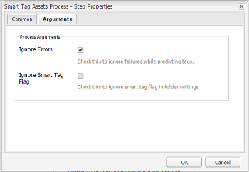

   Using the example above, if you only wanted to replicate the PTIFF (Pyramid TIFF), then you would enter `+cqdam,*` which includes all the renditions that start with `cqdam`. In the example, that rendition is `cqdam.pyramid.tiff`.

   If you only wanted to replicate the original, then you would enter `+original`.

## Configuring Dynamic Media Image Server settings {#configuring-dynamic-media-image-server-settings}

Configuring the Dynamic Media Image Server involves editing the Adobe CQ Scene7 ImageServer bundle and the Adobe CQ Scene7 PlatformServer bundle.

>[!NOTE]
>
>Dynamic Media works out-of-the-box [after it is enabled](#enabling-dynamic-media). However, you can optionally choose to fine-tune your installation by configuring Dynamic Media Image Server to meet certain specifications or requirements.

**Prerequisite** - *Before* you configure Dynamic Media Image Server, ensure that your VM of Windows&reg; includes an installation of the Microsoft&reg; Visual C++ Libraries. The libraries are necessary to run Dynamic Media Image Server. You can [download the Microsoft&reg; Visual C++ 2010 Redistributable Package (x64) here](https://www.microsoft.com/en-us/download/details.aspx?id=26999).

To configure Dynamic Media Image Server settings:

1. In the upper-left corner of Experience Manager, select **[!UICONTROL Adobe Experience Manager]** to access the global navigation console, then navigate to **[!UICONTROL Tools]** > **[!UICONTROL Operations]** > **[!UICONTROL Web Console]**.
1. On the Adobe Experience Manager Web Console Configuration page, go to **[!UICONTROL OSGi]** > **[!UICONTROL Configuration]** to list all the bundles that are currently running within Experience Manager.

   The Dynamic Media Delivery Servers are found under the following names in the list:

    * `Adobe CQ Scene7 ImageServer`
    * `Adobe CQ Scene7 PlatformServer`

1. In the list of bundles, to the right of Adobe CQ Scene7 ImageServer, select the **[!UICONTROL Edit]** icon.
1. In the Adobe CQ Scene7 ImageServer dialog box, set the following configuration values:

   >[!NOTE]
   >
   >Usually, there is no need to change the default values. However, if you do change the default values, you must restart the bundle for the changes to take effect.

   | Property | Default value | Description |
   | --- | --- | --- |
   | `TcpPort.name` | *`empty`* | Port number to use for communication with the ImageServer process. By default free port is automatically detected. |
   | `AllowRemoteAccess.name` | *`empty`* | Allow or disallow remote access to ImageServer process. If false, the image server listens only on localhost.<br> Default Externalizer settings that point to the localhost must specify the actual domain or IP address of the specific VM instance. The reason is because the localhost points to the parent system of the VM.<br>Domains or IP addresses for the VM must have a host file entry so that it can resolve itself. |
   | `MaxRenderRgnPixels` | 16 MP | Maximum size in megapixels that is rendered. |
   | `MaxMessageSize` | 16 MB | Maximum message size in megabytes that is delivered. |
   | `RandomAccessUrlTimeout` | 20 | Time out value for how long in seconds the Image Server waits for the JCR to respond to a ranged tile request. |
   | `WorkerThreads` | 10 | Number of worker threads. |

1. Select **[!UICONTROL Save]**.
1. In the list of bundles, to the right of Adobe CQ Scene7 PlatformServer, select the **[!UICONTROL Edit]** icon.
1. In the Adobe CQ Scene7 PlatformServer dialog box, set the following default value options:

   >[!NOTE]
   >
   >Dynamic Media Image Server uses its own disk cache to cache responses. The Experience Manager HTTP cache and the Dispatcher cannot be used to cache responses from Dynamic Media Image Server.

   | Property | Default value | Description |
   |---|---|---|
   | Cache enabled |Checked |Whether the response cache is enabled |
   | Cache roots |cache |One or more paths to the response cache folders. Relative paths are resolved against the internal s7imaging bundle folder. |
   | Cache Max Size |200000000 |Maximum size of response cache in bytes. |
   | Cache Max Entries |100000 |Maximum number of entries allowed in the cache. |

### Default Manifest settings {#default-manifest-settings}

The default manifest lets you configure the defaults that are used to generate the Dynamic Media Delivery responses. You can fine-tune quality (JPEG quality, resolution, resampling mode), caching (expiration), and prevent the rendering of images that are too large (defaultpix, defaultthumbpix, maxpix).

The location of the default manifest configuration is taken from the **[!UICONTROL Catalog root]** default value of the **[!UICONTROL Adobe CQ Scene7 PlatformServer]** bundle. By default this value is at the following path within **[!UICONTROL Tools]** > **[!UICONTROL General]** > **[!UICONTROL CRXDE Lite]**

`/conf/global/settings/dam/dm/imageserver/`

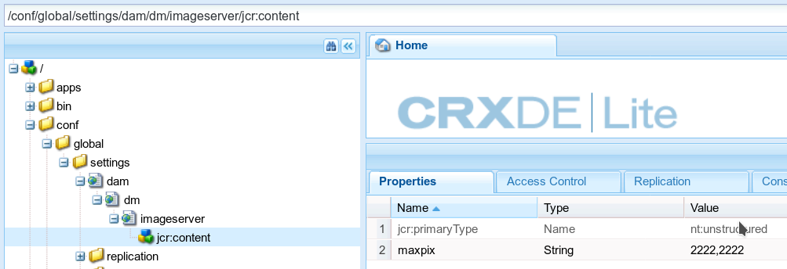

You can change the values of the properties, as described in the table below, by entering new values.

When you are finished changing the default manifest, in the upper-left corner of the page, select **[!UICONTROL Save All]**.

Be sure you select the **[!UICONTROL Access Control]** tab (to the right of the Properties tab), then set the access control privileges to `jcr:read` for the everyone and dynamic-media-replication users.

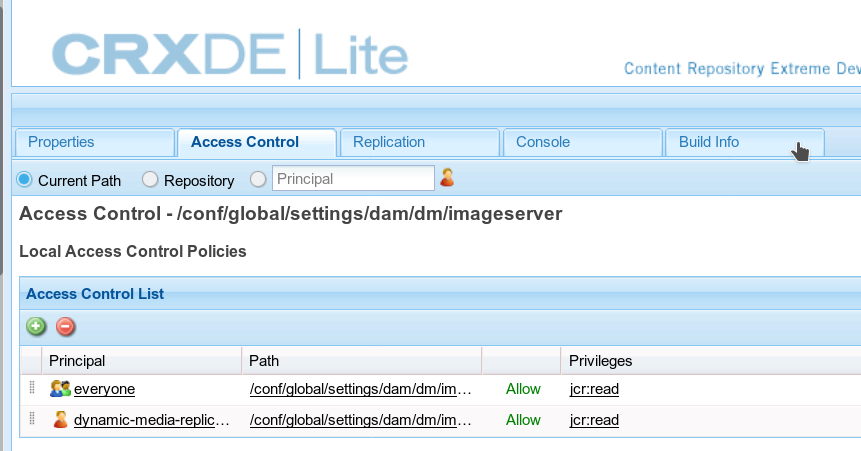

Table of Manifest settings and their default values:

   | Property | Default value | Description |
   | --- | --- | --- |
   | `bkgcolor` | `FFFFFF` | Default background color. RGB value used to fill in any area of a reply image which does not contain actual image data. See also [BkgColor](https://experienceleague.adobe.com/docs/dynamic-media-developer-resources/image-serving-api/image-serving-api/attributes/r-bkgcolor.html#image-serving-api) in the Image Serving API. |
   | `defaultpix` | `300,300` | Default view size. The server constrains reply images to be no larger than this width and height, if the request does not specify the view size explicitly using wid=, hei=, or scl=.<br>Specified as two integer numbers, 0 or larger, separated by a comma. Width and height in pixels. Either or both values can be set to 0 to keep them unconstrained. Does not apply to nested/embedded requests.<br>See also [DefaultPix](https://experienceleague.adobe.com/docs/dynamic-media-developer-resources/image-serving-api/image-serving-api/attributes/r-defaultpix.html#image-serving-api) in the Image Serving API.<br>Usually, however, you are using a viewer preset or image preset to deliver the asset. Defaultpix only applies to an asset that is not using a viewer preset or image preset. |
   | `defaultthumbpix` | `100,100` | Default thumbnail size. Used instead of attribute::DefaultPix for thumbnail requests (`req=tmb`).<br>The server constrains reply images to be no larger than this width and height. This action is true if a thumbnail request (`req=tmb`) does not specify the size explicitly and does not specify the view size explicitly using `wid=`, `hei=`, or `scl=`.<br>Specified as two integer numbers, 0 or larger, separated by a comma. Width and height in pixels. Either or both values can be set to 0 to keep them unconstrained.<br>Does not apply to nested/embedded requests.<br>See also [DefaultThumbPix](https://experienceleague.adobe.com/docs/dynamic-media-developer-resources/image-serving-api/image-serving-api/attributes/r-defaultthumbpix.html#image-serving-api) in the Image Serving API. |
   | `expiration` | `36000000` | Default client cache time to live. Provides a default expiration interval in case a particular catalog record does not contain a valid catalog::Expiration value.<br>Real number, 0 or greater. Number of milliseconds until expiration since the reply data was generated. Set to 0 to always expire the reply image immediately, which effectively disables client caching. By default, this value is set to 10 hours, which means that if a new image is published, it takes 10 hours for the old image to leave the user's cache. Contact Customer Support if you need the cache cleared sooner.<br>See also [Expiration](https://experienceleague.adobe.com/docs/dynamic-media-developer-resources/image-serving-api/image-serving-api/attributes/r-expiration.html) in the Image Serving API. |
   | `jpegquality` | `80` | Default JPEG encoding attributes. Specifies the default attributes for JPEG reply images.<br>Integer number and flag, separated by a comma. The first value is in the range 1..100 and defines the quality. The second value can be 0 for normal behavior, or 1 to disable the RGB chromaticity down-sampling employed by JPEG encoders.<br>See also [JpegQuality](https://experienceleague.adobe.com/docs/dynamic-media-developer-resources/image-serving-api/image-serving-api/attributes/r-jpegquality.html#image-serving-api) in the Image Serving API. |
   | `maxpix` | `2000,2000` | Reply image size limit. Maximum reply image width and height that is returned to the client.<br>The server returns an error if a request causes a reply image whose width or height is larger than attribute::MaxPix.<br>See also [MaxPix](https://experienceleague.adobe.com/docs/dynamic-media-developer-resources/image-serving-api/image-serving-api/attributes/r-maxpix.html#image-serving-api) in the Image Serving API. |
   | `resmode` | `SHARP2` | Default resampling mode. Specifies the default resampling and interpolation attributes to be used for scaling image data.<br>Used when `resMode=` is not specified in a request.<br>Allowed values include `BILIN`, `BICUB`, or `SHARP2`.<br>Enum. Set to 2 for `bilin`, 3 for `bicub`, or 4 for `sharp2` interpolation mode. Use `sharp2` for best results.<br>See also [ResMode](https://experienceleague.adobe.com/docs/dynamic-media-developer-resources/image-serving-api/image-serving-api/attributes/r-is-cat-resmode.html#image-serving-api) in the Image Serving API.  |
   | `resolution` | `72` | Default object resolution. Provides a default object resolution in case a particular catalog record does not contain a valid catalog::Resolution value.<br>Real number, larger than 0. Typically expressed as pixels per inch, but can also be in other units, such as pixels per meter.<br>See also [Resolution](https://experienceleague.adobe.com/docs/dynamic-media-developer-resources/image-serving-api/image-serving-api/attributes/r-resolution.html#image-serving-api) in the Image Serving API. |
   | `thumbnailtime` | `1%,11%,21%,31%,41%,51%,61%,71%,81%,91%` | These values represent a snapshot of video playtime and are passed to [encoding.com](https://www.encoding.com/). See [About video thumbnail](/help/assets/video.md#about-video-thumbnails-in-dynamic-media-hybrid-mode) for more information. |

## Configuring Dynamic Media Color Management {#configuring-dynamic-media-color-management}

Dynamic Media color management lets you color correct assets for previewing.

With color correction, ingested assets retain their color space (RGB, CMYK, Gray) and embedded color profile in the generated pyramid TIFF rendition. When you request a dynamic rendition, the image color is corrected into the target color space. You configure the output color profile in the Dynamic Media publish settings in the JCR.

Adobe's color management uses ICC (International Color Consortium) profiles, a format defined by the  ICC.

You can configure Dynamic Media color management and configure image presets using CMYK, RGB, or Gray output. See [Configuring Image Presets](/help/assets/managing-image-presets.md).

Advanced use cases could use a manual configure `icc=` modifier to explicitly select an output color profile:

* `icc` &ndash; [https://experienceleague.adobe.com/docs/dynamic-media-developer-resources/image-serving-api/image-serving-api/http-protocol-reference/command-reference/r-icc.html](https://experienceleague.adobe.com/docs/dynamic-media-developer-resources/image-serving-api/image-serving-api/http-protocol-reference/command-reference/r-icc.html)

* `iccEmbed` &ndash; [https://experienceleague.adobe.com/docs/dynamic-media-developer-resources/image-serving-api/image-serving-api/http-protocol-reference/command-reference/r-iccembed.html](https://experienceleague.adobe.com/docs/dynamic-media-developer-resources/image-serving-api/image-serving-api/http-protocol-reference/command-reference/r-iccembed.html)

>[!NOTE]
>
>The standard set of Adobe's color profiles is only available if you have [Feature Pack 12445 from Software Distribution](https://experience.adobe.com/#/downloads/content/software-distribution/en/aem.html?package=/content/software-distribution/en/details.html/content/dam/aem/public/adobe/packages/cq630/featurepack/cq-6.3.0-featurepack-12445) installed. All feature packs and service packs are available at [Software Distribution](https://experience.adobe.com/#/downloads/content/software-distribution/en/aem.html). Feature Pack 12445 provides Adobe's color profiles.


### Installing Feature Pack 12445 {#installing-feature-pack}

To use the Dynamic Media color management capabilities, install feature pack 12445.

**To install feature pack 12445:**

1. Navigate to [Software Distribution](https://experience.adobe.com/#/downloads/content/software-distribution/en/aem.html) and download either `cq-6.3.0-featurepack-12445`.

   See [How to work with packages](/help/sites-administering/package-manager.md) for more information on using packages in [!DNL Adobe Experience Manager].

1. Install the feature pack.

### Configuring the default color profiles {#configuring-the-default-color-profiles}

After you install the feature pack, configure the appropriate default color profiles to enable color correction when requesting RGB or CMYK image data.

**To configure the default color profiles:**

1. In **[!UICONTROL Tools]** > **[!UICONTROL General]** > **[!UICONTROL CRXDE Lite]**, navigate to `/conf/global/settings/dam/dm/imageserver/jcr:content` which contains the default Adobe Color Profiles.

   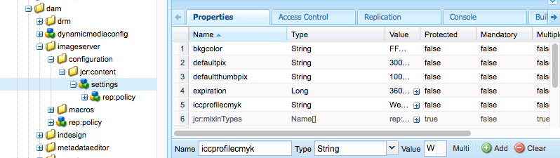

1. Add a color correction property by scrolling to the bottom of the **[!UICONTROL Properties]** tab. Manually enter the property name, type, and value, which is described in the following tables. After you enter the values, select **[!UICONTROL Add]** and then **[!UICONTROL Save All]** to save your values.

   Color correction properties are described in the **Color Corrections Properties** table. Values that you can assign to color correction properties are in the **Color Profile** table.

   For example, in **[!UICONTROL Name]**, add `iccprofilecmyk`, select **[!UICONTROL Type]** `String`, and add `WebCoated` as a **[!UICONTROL Value]**. Then select **[!UICONTROL Add]** and then **[!UICONTROL Save All]** to save your values.

   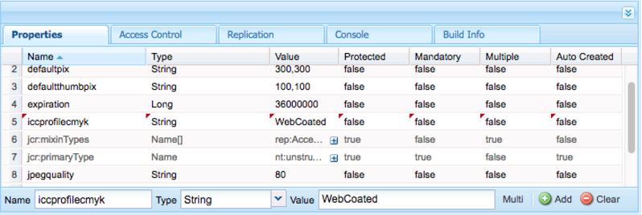

   **Color Correction Properties Table**

<table>
 <tbody>
  <tr>
   <td><strong>Property</strong></td>
   <td><strong>Type</strong></td>
   <td><strong>Default</strong></td>
   <td><strong>Description</strong></td>
  </tr>
  <tr>
   <td><a href="https://experienceleague.adobe.com/docs/dynamic-media-developer-resources/image-serving-api/image-serving-api/attributes/r-iccprofilergb.html">iccprofilergb</a></td>
   <td>String</td>
   <td>&lt;empty&gt;</td>
   <td>Name of the default RGB color profile.</td>
  </tr>
  <tr>
   <td><a href="https://experienceleague.adobe.com/docs/dynamic-media-developer-resources/image-serving-api/image-serving-api/attributes/r-iccprofilecmyk.html">iccprofilecmyk</a></td>
   <td>String</td>
   <td>&lt;empty&gt;</td>
   <td>Name of the default CMYK color profile.</td>
  </tr>
  <tr>
   <td><a href="https://experienceleague.adobe.com/docs/dynamic-media-developer-resources/image-serving-api/image-serving-api/attributes/r-iccprofilegray.html">iccprofilegray</a></td>
   <td>String</td>
   <td>&lt;empty&gt;</td>
   <td>Name of the default Gray color profile.</td>
  </tr>
  <tr>
   <td><a href="https://experienceleague.adobe.com/docs/dynamic-media-developer-resources/image-serving-api/image-serving-api/attributes/r-iccprofilesrcrgb.html">iccprofilesrcrgb</a></td>
   <td>String</td>
   <td>&lt;empty&gt;</td>
   <td>Name of the default RGB color profile used for RGB images that do not have an embedded color profile</td>
  </tr>
  <tr>
   <td><a href="https://experienceleague.adobe.com/docs/dynamic-media-developer-resources/image-serving-api/image-serving-api/attributes/r-iccprofilesrccmyk.html">iccprofilesrccmyk</a></td>
   <td>String</td>
   <td>&lt;empty&gt;</td>
   <td>Name of the default CMYK color profile used for CMYK images that do not have an embedded color profile.</td>
  </tr>
  <tr>
   <td><a href="https://experienceleague.adobe.com/docs/dynamic-media-developer-resources/image-serving-api/image-serving-api/attributes/r-iccprofilesrcgray.html">iccprofilesrcgray</a></td>
   <td>String</td>
   <td>&lt;empty&gt;</td>
   <td>Name of the default Gray color profile used for CMYK images that do not have an embedded color profile.</td>
  </tr>
  <tr>
   <td><a href="https://experienceleague.adobe.com/docs/dynamic-media-developer-resources/image-serving-api/image-serving-api/attributes/r-iccblackpointcompensation.html">iccblackpointcompensation</a></td>
   <td>Boolean</td>
   <td>True</td>
   <td>Specifies whether black point compensation is done during color correction. Adobe recommends  that this setting is on.</td>
  </tr>
  <tr>
   <td><a href="https://experienceleague.adobe.com/docs/dynamic-media-developer-resources/image-serving-api/image-serving-api/attributes/r-iccdither.html">iccdither</a></td>
   <td>Boolean</td>
   <td>False</td>
   <td>Specifies whether dithering is done during color correction.</td>
  </tr>
  <tr>
   <td><a href="https://experienceleague.adobe.com/docs/dynamic-media-developer-resources/image-serving-api/image-serving-api/attributes/r-iccrenderintent.html">iccrenderintent</a></td>
   <td>String</td>
   <td>relative</td>
   <td><p>Specifies the render intent. Acceptable values are: <strong>perceptual, relative, saturation, absolute. </strong><i></i>Adobe recommends <strong>relative </strong><i></i>as the default.</p> </td>
  </tr>
 </tbody>
</table>

   >[!NOTE]
   >
   >Property names are case-sensitive and must be all lowercase.

   **Color Profile Table**

   The following color profiles are installed:

<table>
 <tbody>
  <tr>
   <th><p>Name</p> </th>
   <th><p>Colors pace</p> </th>
   <th><p>Description</p> </th>
  </tr>
  <tr>
   <td>Adobe RGB</td>
   <td>RGB</td>
   <td>Adobe RGB (1998)</td>
  </tr>
  <tr>
   <td>AppleRGB</td>
   <td>RGB</td>
   <td>Apple RGB</td>
  </tr>
  <tr>
   <td>CIERGB</td>
   <td>RGB</td>
   <td>CIE RGB</td>
  </tr>
  <tr>
   <td>CoatedFogra27</td>
   <td>CMYK</td>
   <td>Coated FOGRA27 (ISO 12647-2:2004)</td>
  </tr>
  <tr>
   <td>CoatedFogra39</td>
   <td>CMYK</td>
   <td>Coated FOGRA39 (ISO 12647-2:2004)</td>
  </tr>
  <tr>
   <td>CoatedGraCol</td>
   <td>CMYK</td>
   <td>Coated GRACoL 2006 (ISO 12647-2:2004)</td>
  </tr>
  <tr>
   <td>ColorMatchRGB</td>
   <td>RGB</td>
   <td>ColorMatch RGB</td>
  </tr>
  <tr>
   <td>EuropeISOCoated</td>
   <td>CMYK</td>
   <td>Europe ISO Coated FOGRA27</td>
  </tr>
  <tr>
   <td>EuroscaleCoated</td>
   <td>CMYK</td>
   <td>Euro scale Coated v2</td>
  </tr>
  <tr>
   <td>EuroscaleUncoated</td>
   <td>CMYK</td>
   <td>Euro scale Uncoated v2</td>
  </tr>
  <tr>
   <td>JapanColorCoated</td>
   <td>CMYK</td>
   <td>Japan Color 2001 Coated</td>
  </tr>
  <tr>
   <td>JapanColorNewspaper</td>
   <td>CMYK</td>
   <td>Japan Color 2002 Newspaper</td>
  </tr>
  <tr>
   <td>JapanColorUncoated</td>
   <td>CMYK</td>
   <td>Japan Color 2001 Uncoated</td>
  </tr>
  <tr>
   <td>JapanColorWebCoated</td>
   <td>CMYK</td>
   <td>Japan Color 2003 Web Coated</td>
  </tr>
  <tr>
   <td>JapanWebCoated</td>
   <td>CMYK</td>
   <td>Japan Web Coated (Ad)</td>
  </tr>
  <tr>
   <td>NewsprintSNAP2007</td>
   <td>CMYK</td>
   <td>US Newsprint (SNAP 2007)</td>
  </tr>
  <tr>
   <td>NTSC</td>
   <td>RGB</td>
   <td>NTSC (1953)</td>
  </tr>
  <tr>
   <td>PAL</td>
   <td>RGB</td>
   <td>PAL/SECAM</td>
  </tr>
  <tr>
   <td>ProPhoto</td>
   <td>RGB</td>
   <td>ProPhoto RGB</td>
  </tr>
  <tr>
   <td>PS4Default</td>
   <td>CMYK</td>
   <td>Photoshop 4 Default CMYK</td>
  </tr>
  <tr>
   <td>PS5Default</td>
   <td>CMYK</td>
   <td>Photoshop 5 Default CMYK</td>
  </tr>
  <tr>
   <td>SheetfedCoated</td>
   <td>CMYK</td>
   <td>U.S. Sheetfed Coated v2</td>
  </tr>
  <tr>
   <td>SheetfedUncoated</td>
   <td>CMYK</td>
   <td>U.S. Sheetfed Uncoated v2</td>
  </tr>
  <tr>
   <td>SMPTE</td>
   <td>RGB</td>
   <td>SMPTE-C</td>
  </tr>
  <tr>
   <td>sRGB</td>
   <td>RGB</td>
   <td>sRGB IEC61966-2.1</td>
  </tr>
  <tr>
   <td>UncoatedFogra29</td>
   <td>CMYK</td>
   <td>Uncoated FOGRA29 (ISO 12647-2:2004)</td>
  </tr>
  <tr>
   <td>WebCoated</td>
   <td>CMYK</td>
   <td>U.S. Web Coated (SWOP) v2</td>
  </tr>
  <tr>
   <td>WebCoatedFogra28</td>
   <td>CMYK</td>
   <td>Web Coated FOGRA28 (ISO 12647-2:2004)</td>
  </tr>
  <tr>
   <td>WebCoatedGrade3</td>
   <td>CMYK</td>
   <td>Web Coated SWOP 2006 Grade 3 Paper</td>
  </tr>
  <tr>
   <td>WebCoatedGrade5</td>
   <td>CMYK</td>
   <td>Web Coated SWOP 2006 Grade 5 Paper</td>
  </tr>
  <tr>
   <td>WebUncoated</td>
   <td>CMYK</td>
   <td>U.S. Web Uncoated v2</td>
  </tr>
  <tr>
   <td>WideGamutRGB</td>
   <td>RGB</td>
   <td>Wide Gamut RGB</td>
  </tr>
 </tbody>
</table>

1. Select **[!UICONTROL Save All]**.

For example, you could set the **[!UICONTROL iccprofilergb]** to `sRGB`, and **[!UICONTROL iccprofilecmyk]** to **[!UICONTROL WebCoated]**.

Doing so would do the following:

* Enables color correction for RGB and CMYK images.
* RGB images that do not have a color profile are assumed to be in the *sRGB* color space.
* CMYK images that do not have a color profile are assumed to be in *WebCoated* color space.
* Dynamic renditions that return RGB output, return it in the *sRGB *color space.
* Dynamic renditions that return CMYK output, return it in the *WebCoated* color space.

## Delivering Assets {#delivering-assets}

After you complete all the tasks above, activated Dynamic Media assets are served from the Image or Video Service. In Experience Manager, this ability shows up in a **[!UICONTROL Copy Image URL]**, **[!UICONTROL Copy Viewer URL]**, **[!UICONTROL Embed Viewer Code]**, and in the WCM.

See [Delivering Dynamic Media Assets](/help/assets/delivering-dynamic-media-assets.md).

<table>
 <tbody>
  <tr>
   <td><strong>When you...</strong></td>
   <td><strong>Result</strong></td>
  </tr>
  <tr>
   <td>Copy an image URL</td>
   <td><p>The Copy URL dialog box displays a URL similar to following (URL is for demonstration purposes only):</p> <p><code>https://IMAGESERVICEPUBLISHNODE/is/image/content/dam/path/to/Image.jpg?$preset$</code></p> <p>Where <code>IMAGESERVICEPUBLISHNODE</code> refers to the Image Service URL.</p> <p>See also <a href="/help/assets/delivering-dynamic-media-assets.md">Delivering Dynamic Media Assets</a>.</p> </td>
  </tr>
  <tr>
   <td>Copy a viewer URL</td>
   <td><p>The Copy URL dialog box displays a URL similar to the following (URL is for demonstration purposes only):</p> <p><code>https://PUBLISHNODE/etc/dam/viewers/s7viewers/html5/BasicZoomViewer.html?asset=/content/dam/path/to/Image.jpg&amp;config=/conf/global/settings/dam/dm/presets/viewer/Zoom_dark&amp;serverUrl=https://IMAGESERVICEPUBLISHNODE/is/image/&amp;contentRoot=%2F</code></p> <p>Where <code>PUBLISHNODE</code> refers to the regular Experience Manager publish node and <code>IMAGESERVICEPUBLISHNODE</code> refers to the Image Service URL.</p> <p>See also <a href="/help/assets/delivering-dynamic-media-assets.md">Delivering Dynamic Media Assets</a>.</p> </td>
  </tr>
  <tr>
   <td>Copy a viewer's embed code</td>
   <td><p>The Copy Embed Code dialog box displays a code snippet similar to the following (code sample is for demonstration purposes only):</p> <p><code class="code">&lt;style type="text/css"&gt;
       #s7basiczoom_div.s7basiczoomviewer{
       width:100%;
       height:auto;
       }
       &lt;/style&gt;
       &lt;script
       type="text/javascript" src="https://PUBLISHNODE/etc/dam/viewers/s7viewers/html5/js/BasicZoomViewer.js"&gt;&lt;/script&gt;
       &lt;div id="s7basiczoom_div"&gt;&lt;/div&gt;
       &lt;script type="text/javascript"&gt;
       var s7basiczoomviewer = new s7viewers.BasicZoomViewer({
       "containerId" : "s7basiczoom_div",
       "params" : {
       "serverurl" : "https://IMAGESERVICEPUBLISHNODE/is/image/",
       "contenturl" : "https://PUBLISHNODE/",
       "config" : "/conf/global/settings/dam/dm/presets/viewer/Zoom_dark",
       "asset" : "/content/dam/path/to/Image.jpg" }
       }).init();
       &lt;/script&gt;</code></p> <p>Where <code>PUBLISHNODE</code> refers to the regular Experience Manager publish node and <code>IMAGESERVICEPUBLISHNODE</code> refers to the Image Service URL.</p> <p>See also <a href="/help/assets/delivering-dynamic-media-assets.md">Delivering Dynamic Media Assets</a>.</p> </td>
  </tr>
 </tbody>
</table>

### WCM Dynamic Media and Interactive Media Components {#wcm-dynamic-media-and-interactive-media-components}

WCM pages that reference Dynamic Media and Interactive Media components reference the delivery service.
