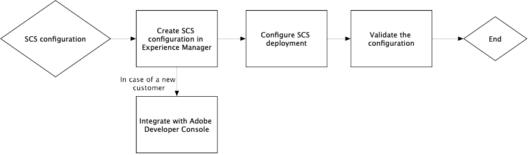

# Troubleshooting smart tags for OAuth credentials {#oauth-config}

An open authorization configuration is required to adopt the consent to the [!DNL Adobe Experience Manager] application to interact with Smart Content Services in a secured manner.

>[!NOTE]
>
> You cannot create new JWT credentials from June 2024 onwards. Henceforth, only OAuth Server-to-Server credentials are created.
> JWT integration continues working till January 2025 only for the existing AMS and on-premise users.

## OAuth configuration for the new AMS users {#oauth-config-existing-ams-users}

Refer to [configuration of smart content services](#integrate-adobe-io) for the configuration of OAuth services for a new user. Once done, follow these [steps](#prereqs-config-oauth-onprem).

>[!NOTE]
>
>If required, you can submit a support ticket following the [support process](https://experienceleague.adobe.com/?lang=en&support-tab=home#support).

## OAuth configuration for the existing AMS users {#oauth-config-new-ams-users}

Before performing any of the steps in this methodology, you are required to implement the following:

### Prerequisites {#prereqs-config-oauth-onprem}

An OAuth configuration requires the following prerequisites:

* Create a new OAuth integration in the [Developer Console](https://developer.adobe.com/console/user/servicesandapis). Use the `ClientID`, `ClientSecret`, `OrgID`, and other properties in the steps below:
* The following files can be found at this path `/apps/system/config in crx/de`:
   * `com.adobe.granite.auth.oauth.accesstoken.provider.<randomnumbers>.config`
   * `com.adobe.granite.auth.ims.impl.IMSAccessTokenRequestCustomizerImpl.<randomnumber>.config`

### OAuth configuration for the existing AMS and On prem users {#steps-config-oauth-onprem}

The below steps can be performed by the system admin in **CRXDE**. AMS customer may reach out to the Adobe representative or submit a support ticket following the [support process](https://experienceleague.adobe.com/?lang=en&support-tab=home#support).

1. Add or update the below properties in `com.adobe.granite.auth.oauth.accesstoken.provider.<randomnumbers>.config`:

   * `auth.token.provider.authorization.grants="client_credentials"`
   * `auth.token.provider.orgId="<OrgID>"`
   * `auth.token.provider.default.claims=("\"iss\"\ :\ \"<OrgID>\"")`
   * `auth.token.provider.scope="read_pc.dma_smart_content,\ openid,\ AdobeID,\ additional_info.projectedProductContext"`
     `auth.token.validator.type="adobe-ims-similaritysearch"`
   * Update the `auth.token.provider.client.id` with the Client ID of the new OAuth configuration.
   * Update `auth.access.token.request` to `"https://ims-na1.adobelogin.com/ims/token/v3"`
1. Rename the file to `com.adobe.granite.auth.oauth.accesstoken.provider-<randomnumber>.config`.

   >[!IMPORTANT]
   >
   >Replace dot (.) with hyphen (-) as a prefix to `<randomnumber>`.

1. Perform the steps below in `com.adobe.granite.auth.ims.impl.IMSAccessTokenRequestCustomizerImpl.<randomnumber>.config`:
   * Update the property auth.ims.client.secret with the Client Secret from the new OAuth integration.
   * Rename the file to `com.adobe.granite.auth.ims.impl.IMSAccessTokenRequestCustomizerImpl-<randomnumber>.config`
1. Save all the changes in the content repository development console, for example, CRXDE.
<!--
1. Navigate to `/system/console/configMgr` and replace the OSGi configuration from `.<randomnumber>` to `-<randomnumber>`.
1. Delete the old OSGi configuration for `"Access Token provider name: adobe-ims-similaritysearch"` in `/system/console/configMgr`.
-->
1. In `System/console/configMgr`, the older and new configuration files gets create. Delete the older configurations for `com.adobe.granite.auth.ims.impl.IMSAccessTokenRequestCustomizerImpl` and Access Token provider name `adobe-ims-similaritysearch`. Ensure that the updated configuration only is in place, rather than the older configurations.
1. Restart the console.

## Validate the configuration {#validate-the-configuration}

After you have completed the configuration, you can use a JMX MBean to validate the configuration. To validate, follow these steps.

1. Access your [!DNL Experience Manager] server at `https://[aem_server]:[port]`.

1. Go to **[!UICONTROL Tools]** > **[!UICONTROL Operations]** > **[!UICONTROL Web Console]** to open the OSGi console. Click **[!UICONTROL Main] > [!UICONTROL JMX]**.

1. Click `com.day.cq.dam.similaritysearch.internal.impl`. It opens **[!UICONTROL SimilaritySearch Miscellaneous Tasks]**.

1. Click `validateConfigs()`. In the **[!UICONTROL Validate Configurations]** dialog, click **[!UICONTROL Invoke]**.

The validation results are displayed in the same dialog.

>[!NOTE]
>
>If `unsupported_grant_type` error occurs, then try installing the Granite hotfix. Refer to [migration from Service Account (JWT) to OAuth Server-to-Server credentials](https://experienceleague.adobe.com/en/docs/experience-cloud-kcs/kbarticles/ka-24660).

## Integrate with Adobe Developer Console {#integrate-adobe-io}

As a new user, when you integrate with Adobe Developer Console, the [!DNL Experience Manager] server authenticates your service credentials with the Adobe Developer Console gateway before forwarding your request to the Smart Content Service. To integrate, you need an Adobe ID account that has administrator privileges for the organization and a Smart Content Service license purchased and enabled for your organization.

To configure the Smart Content Service, follow these top-level steps:

1. To generate a public key, [create a Smart Content Service](#oauth-config) configuration in [!DNL Experience Manager]. [Download a public certificate](#oauth-config) for OAuth integration.

1. *[Not applicable if you are an existing user]* [create an integration in Adobe Developer Console](#create-adobe-i-o-integration).

1. [Configure your deployment](#configure-smart-content-service) using the API key and other credentials from Adobe Developer Console.

1. [Test the configuration](#validate-the-configuration).

## Download a public certificate by creating Smart Content Service configuration {#download-public-certificate}

A public certificate lets you authenticate your profile on the Adobe Developer Console.

1. In the [!DNL Experience Manager] user interface, access **[!UICONTROL Tools]** > **[!UICONTROL Cloud Services]** > **[!UICONTROL Legacy Cloud Services]**.

1. In the Cloud Services page, click **[!UICONTROL Configure Now]** under **[!UICONTROL Assets Smart Tags]**.

1. In the **[!UICONTROL Create Configuration]** dialog, specify a title and name for the Smart Tags configuration. Click **[!UICONTROL Create]**.

1. In the **[!UICONTROL AEM Smart Content Service]** dialog, use the following values:

   **[!UICONTROL Service URL]**: `https://smartcontent.adobe.io/<region where your Experience Manager author instance is hosted>`

   For example, `https://smartcontent.adobe.io/apac`. You can specify `na`, `emea`, or, `apac` as the regions where your Experience Manager author instance is hosted. 

   >[!NOTE]
   >
   >If the Experience Manager Managed Service is provisioned before September 01, 2022, use the following Service URL:
   >`https://mc.adobe.io/marketingcloud/smartcontent`

   **[!UICONTROL Authorization Server]**: `https://ims-na1.adobelogin.com`

   Leave the other fields blank for now (to be provided later). Click **[!UICONTROL OK]**.

   

   *Figure: Smart Content Service dialog to provide content service URL*

   >[!NOTE]
   >
   >The URL provided as [!UICONTROL Service URL] is not accessible via the browser and generates a 404 error. The configuration works OK with the same value of the [!UICONTROL Service URL] parameter. For the overall service status and maintenance schedule, see [https://status.adobe.com](https://status.adobe.com).

1. Click **[!UICONTROL Download Public Certificate for OAuth Integration]**, and download the public certificate file `AEM-SmartTags.crt`. Moreover, you are no longer required to upload this certificate in Adobe developer console. 

   

   *Figure: Settings for smart tagging service.*

## Create Adobe Developer Console integration {#create-adobe-i-o-integration}

To use Smart Content Service APIs, create an integration in Adobe Developer Console to obtain [!UICONTROL API Key] (generated in [!UICONTROL CLIENT ID] field of Adobe Developer Console integration), [!UICONTROL TECHNICAL ACCOUNT ID], [!UICONTROL ORGANIZATION ID], and [!UICONTROL CLIENT SECRET] for [!UICONTROL Assets Smart Tagging Service Settings] of cloud configuration in [!DNL Experience Manager].

1. Access [https://developer.adobe.com/console/](https://developer.adobe.com/console/) in a browser. Select the appropriate account and verify that the associated organization role is system administrator.

1. Create a project with any desired name. Click **[!UICONTROL Add API]**.

1. On the **[!UICONTROL Add an API]** page, select **[!UICONTROL Experience Cloud]** and select **[!UICONTROL Smart Content]**. Click **[!UICONTROL Next]**.

1. Choose the **[!UICONTROL OAuth Server-to-Server]** authentication method.

1. Add/modify the **[!UICONTROL Credential Name]** as required. Click **[!UICONTROL Next]**.

1. Select the product profile **[!UICONTROL Smart Content Services]**. Click **[!UICONTROL Save Configured API]**. The OAuth API gets added under the connected credentials for the further use. You can copy the [!UICONTROL API key (Client ID)] or [!UICONTROL Generate access token] from it.
<!--
1. On the **[!UICONTROL Select product profiles]** page, select **[!UICONTROL Smart Content Services]**. Click **[!UICONTROL Save configured API]**.

   A page displays more information about the configuration. Keep this page open to copy and add these values in [!UICONTROL Assets Smart Tagging Service Settings] of cloud configuration in [!DNL Experience Manager] to configure smart tags.

   

   *Figure: Details of integration in Adobe Developer Console*
-->

*Figure: Configured OAuth Server-to-Server in Adobe Developer Console*

## Configure Smart Content Service {#configure-smart-content-service}

To configure the integration, use the values of [!UICONTROL TECHNICAL ACCOUNT ID], [!UICONTROL ORGANIZATION ID], [!UICONTROL CLIENT SECRET], and [!UICONTROL CLIENT ID] fields from the Adobe Developer Console integration. Creating a Smart Tags cloud configuration allows authentication of API requests from the [!DNL Experience Manager] deployment.

1. In [!DNL Experience Manager], navigate to **[!UICONTROL Tools]** > **[!UICONTROL Cloud Service]** > **[!UICONTROL Legacy Cloud Services]** to open the [!UICONTROL Cloud Services] console.

1. Under the **[!UICONTROL Assets Smart Tags]**, open the configuration created above. On the service settings page, click **[!UICONTROL Edit]**.

1. In the **[!UICONTROL AEM Smart Content Service]** dialog, use the pre-populated values for the **[!UICONTROL Service URL]** and **[!UICONTROL Authorization Server]** fields.

1. For the fields [!UICONTROL Api Key], [!UICONTROL Technical Account ID], [!UICONTROL Organization ID], and [!UICONTROL Client Secret], copy and use the following values generated in [Adobe Developer Console integration](#create-adobe-i-o-integration).

   | [!UICONTROL Assets Smart Tagging Service Settings] | [!DNL Adobe Developer Console] integration fields |
   |--- |--- |
   | [!UICONTROL Api Key] | [!UICONTROL CLIENT ID] |
   | [!UICONTROL Technical Account ID] | [!UICONTROL TECHNICAL ACCOUNT ID] |
   | [!UICONTROL Organization ID] | [!UICONTROL ORGANIZATION ID] |
   | [!UICONTROL Client Secret] | [!UICONTROL CLIENT SECRET] |

>[!MORELIKETHIS]
>
>* [Overview and how to train Smart Tags](enhanced-smart-tags.md)
>* [Configure smart tagging](config-smart-tagging.md)
>* [Video tutorial about smart tags](https://experienceleague.adobe.com/docs/experience-manager-learn/assets/metadata/image-smart-tags.html)
