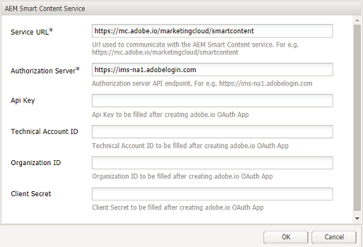
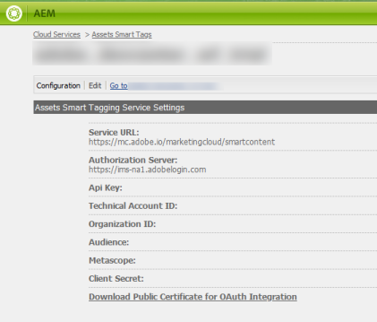
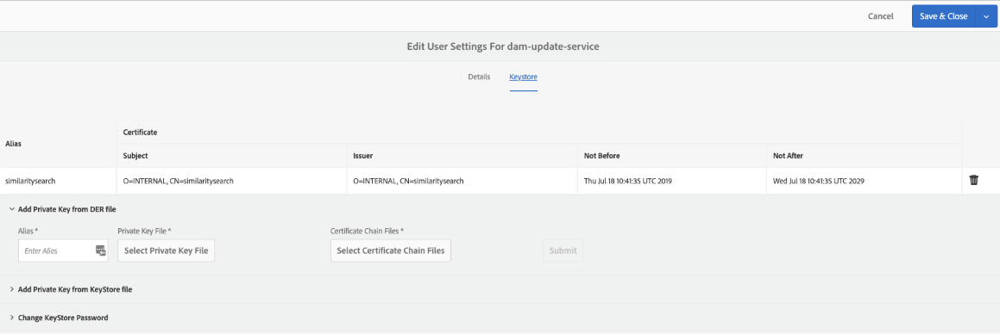
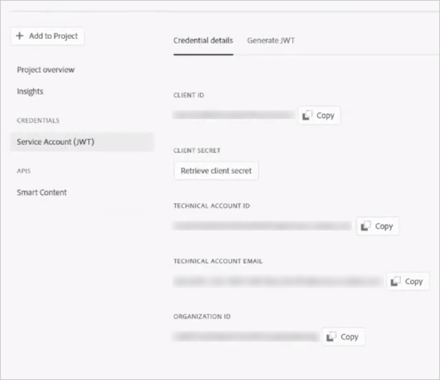
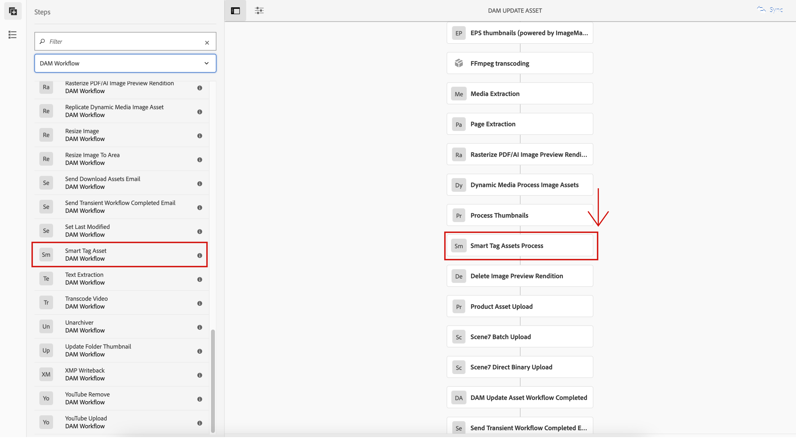
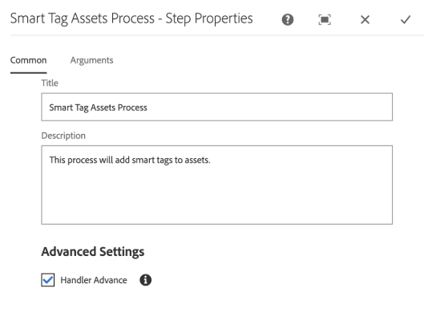
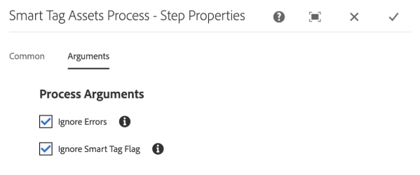
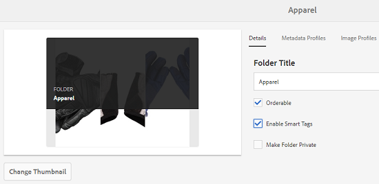
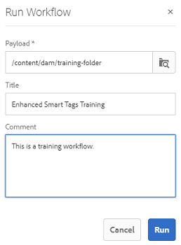

# Prepare [!DNL Assets] for smart tagging {#configure-asset-tagging-using-the-smart-content-service}

Before you can start tagging your assets using Smart Content Services, integrate [!DNL Experience Manager Assets] with Adobe Developer Console to leverage smart service of [!DNL Adobe Sensei]. Once configured train the service using a few images and a tag.

>[!NOTE]
>
>* Smart Content Services is no longer available to new [!DNL Experience Manager Assets] On-Premise customers. Existing On-Premise customers, who already have this capability enabled, can continue using Smart Content Services.
>* Smart Content Services is available for existing [!DNL Experience Manager Assets] Managed Services customers, who already have this capability enabled.
>* New [!DNL Experience Manager Assets] Managed Services customers can follow the instructions mentioned in this article to set up Smart Content Services.

Before you use the Smart Content Service, ensure the following:

* [Integrate with Adobe Developer Console](#integrate-adobe-io).
* [Train the Smart Content Service](#training-the-smart-content-service).

* Install the latest [[!DNL Experience Manager] Service Pack](https://experienceleague.adobe.com/docs/experience-manager-release-information/aem-release-updates/aem-releases-updates.html).

## Integrate with Adobe Developer Console {#integrate-adobe-io}

When you integrate with Adobe Developer Console, the [!DNL Experience Manager] server authenticates your service credentials with the Adobe Developer Console gateway before forwarding your request to the Smart Content Service. To integrate, you need an Adobe ID account that has administrator privileges for the organization and Smart Content Service license purchased and enabled for your organization.

To configure the Smart Content Service, follow these top-level steps:

1. To generate a public key, [Create a Smart Content Service](#obtain-public-certificate) configuration in [!DNL Experience Manager]. [Obtain public certificate](#obtain-public-certificate) for OAuth integration.

1. [Create an integration in Adobe Developer Console](#create-adobe-i-o-integration) and upload the generated public key.

1. [Configure your deployment](#configure-smart-content-service) using the API key and other credentials from Adobe Developer Console.

1. [Test the configuration](#validate-the-configuration).

1. Optionally, [enable auto-tagging on asset upload](#enable-smart-tagging-in-the-update-asset-workflow-optional).

### Obtain public certificate by creating Smart Content Service configuration {#obtain-public-certificate}

A public certificate allows you to authenticate your profile on Adobe Developer Console.

1. In the [!DNL Experience Manager] user interface, access **[!UICONTROL Tools]** > **[!UICONTROL Cloud Services]** > **[!UICONTROL Legacy Cloud Services]**.

1. In the Cloud Services page, click **[!UICONTROL Configure Now]** under **[!UICONTROL Assets Smart Tags]**.

1. In the **[!UICONTROL Create Configuration]** dialog, specify a title and name for the Smart Tags configuration. Click **[!UICONTROL Create]**.

1. In the **[!UICONTROL AEM Smart Content Service]** dialog, use the following values:

   **[!UICONTROL Service URL]**: `https://smartcontent.adobe.io/<region where your Experience Manager author instance is hosted>`

   For example, `https://smartcontent.adobe.io/apac`. You can specify `na`, `emea`, or, `apac` as the regions where your Experience Manager author instance is hosted. 

   >[!NOTE]
   >
   >If the Experience Manager Managed Service is provisioned before September 01, 2022, use the following Service URL:
   >`https://mc.adobe.io/marketingcloud/smartcontent`

   **[!UICONTROL Authorization Server]**: `https://ims-na1.adobelogin.com`

   Leave the other fields blank for now (to be provided later). Click **[!UICONTROL OK]**.

   

   *Figure: Smart Content Service dialog to provide content service URL*

   >[!NOTE]
   >
   >The URL provided as [!UICONTROL Service URL] is not accessible via browser and generates a 404 error. The configuration works OK with the same value of the [!UICONTROL Service URL] parameter. For the overall service status and maintenance schedule, see [https://status.adobe.com](https://status.adobe.com).

1. Click **[!UICONTROL Download Public Certificate for OAuth Integration]**, and download the public certificate file `AEM-SmartTags.crt`.

   

   *Figure: Settings for smart tagging service.*

#### Reconfigure when a certificate expires {#certrenew}

After a certificate expires, it is no longer trusted. You cannot renew an expired certificate. To add a certificate, follow these steps.

1. Log in your [!DNL Experience Manager] deployment as an administrator. Click **[!UICONTROL Tools]** > **[!UICONTROL Security]** > **[!UICONTROL Users]**.

1. Locate and click **[!UICONTROL dam-update-service]** user. Click **[!UICONTROL Keystore]** tab.

1. Delete the existing **[!UICONTROL similaritysearch]** keystore with the expired certificate. Click **[!UICONTROL Save & Close]**.

   

   *Figure: Delete the existing `similaritysearch` entry in Keystore to add a security certificate.*

1. Navigate to **[!UICONTROL Tools]** > **[!UICONTROL Cloud Services]** > **[!UICONTROL Legacy Cloud Services]**. Click **[!UICONTROL Asset Smart Tags]** > **[!UICONTROL Show Configuration]** > **[!UICONTROL Available Configurations]**. Click the required configuration.  

1. To download a public certificate, click **[!UICONTROL Download Public Certificate for OAuth Integration]**.

1. Access [https://console.adobe.io](https://console.adobe.io) and navigate to the existing Smart Content Services on the **[!UICONTROL Integrations]** page. Upload the new certificate. For more information, see the instructions in [Create Adobe Developer Console integration](#create-adobe-i-o-integration).

### Create Adobe Developer Console integration {#create-adobe-i-o-integration}

To use Smart Content Service APIs, create an integration in Adobe Developer Console to obtain [!UICONTROL API Key] (generated in [!UICONTROL CLIENT ID] field of Adobe Developer Console integration), [!UICONTROL TECHNICAL ACCOUNT ID], [!UICONTROL ORGANIZATION ID], and [!UICONTROL CLIENT SECRET] for [!UICONTROL Assets Smart Tagging Service Settings] of cloud configuration in [!DNL Experience Manager].

1. Access [https://console.adobe.io](https://console.adobe.io/) in a browser. Select the appropriate account and verify that the associated organization role is system administrator.

1. Create a project with any desired name. Click **[!UICONTROL Add API]**.

1. On the **[!UICONTROL Add an API]** page, select **[!UICONTROL Experience Cloud]** and select **[!UICONTROL Smart Content]**. Click **[!UICONTROL Next]**.

1. Select **[!UICONTROL Upload your public key]**. Provide the certificate file downloaded from [!DNL Experience Manager]. A message [!UICONTROL Public key(s) uploaded successfully] is displayed. Click **[!UICONTROL Next]**.

   [!UICONTROL Create a new Service Account (JWT) credential] page displays the public key for the service account.

1. Click **[!UICONTROL Next]**.

1. On the **[!UICONTROL Select product profiles]** page, select **[!UICONTROL Smart Content Services]**. Click **[!UICONTROL Save configured API]**.

   A page displays more information about the configuration. Keep this page open to copy and add these values in [!UICONTROL Assets Smart Tagging Service Settings] of cloud configuration in [!DNL Experience Manager] to configure smart tags.

   

   *Figure: Details of integration in Adobe Developer Console*

### Configure Smart Content Service {#configure-smart-content-service}

To configure the integration, use the values of [!UICONTROL TECHNICAL ACCOUNT ID], [!UICONTROL ORGANIZATION ID], [!UICONTROL CLIENT SECRET], and [!UICONTROL CLIENT ID] fields from the Adobe Developer Console integration. Creating a Smart Tags cloud configuration allows authentication of API requests from the [!DNL Experience Manager] deployment.

1. In [!DNL Experience Manager], navigate to **[!UICONTROL Tools]** > **[!UICONTROL Cloud Service]** > **[!UICONTROL Legacy Cloud Services]** to open the [!UICONTROL Cloud Services] console.

1. Under the **[!UICONTROL Assets Smart Tags]**, open the configuration created above. On the service settings page, click **[!UICONTROL Edit]**.

1. In the **[!UICONTROL AEM Smart Content Service]** dialog, use the pre-populated values for the **[!UICONTROL Service URL]** and **[!UICONTROL Authorization Server]** fields.

1. For the fields [!UICONTROL Api Key], [!UICONTROL Technical Account ID], [!UICONTROL Organization ID], and [!UICONTROL Client Secret], copy and use the following values generated in [Adobe Developer Console integration](#create-adobe-i-o-integration).

   | [!UICONTROL Assets Smart Tagging Service Settings] | [!DNL Adobe Developer Console] integration fields |
   |--- |--- |
   | [!UICONTROL Api Key] | [!UICONTROL CLIENT ID] |
   | [!UICONTROL Technical Account ID] | [!UICONTROL TECHNICAL ACCOUNT ID] |
   | [!UICONTROL Organization ID] | [!UICONTROL ORGANIZATION ID] |
   | [!UICONTROL Client Secret] | [!UICONTROL CLIENT SECRET] |

### Validate the configuration {#validate-the-configuration}

After you have completed the configuration, you can use a JMX MBean to validate the configuration. To validate, follow these steps.

1. Access your [!DNL Experience Manager] server at `https://[aem_server]:[port]`.

1. Go to **[!UICONTROL Tools]** > **[!UICONTROL Operations]** > **[!UICONTROL Web Console]** to open the OSGi console. Click **[!UICONTROL Main] > [!UICONTROL JMX]**.

1. Click `com.day.cq.dam.similaritysearch.internal.impl`. It opens **[!UICONTROL SimilaritySearch Miscellaneous Tasks]**.

1. Click `validateConfigs()`. In the **[!UICONTROL Validate Configurations]** dialog, click **[!UICONTROL Invoke]**.

The validation results are displayed in the same dialog.

### Enable smart tagging in the [!UICONTROL DAM Update Asset] workflow (Optional) {#enable-smart-tagging-in-the-update-asset-workflow-optional}

1. In [!DNL Experience Manager], go to **[!UICONTROL Tools]** > **[!UICONTROL Workflow]** > **[!UICONTROL Models]**.

1. On **[!UICONTROL Workflow Models]** page, select the **[!UICONTROL DAM Update Asset]** workflow model.

1. Click **[!UICONTROL Edit]** from the toolbar.

1. Expand the Side Panel to display the steps. Drag **[!UICONTROL Smart Tag Asset]** step that is available in the DAM Workflow section and place it after the **[!UICONTROL Process Thumbnails]** step.

   

   *Figure: Add smart tag asset step after the process thumbnail step in the [!UICONTROL DAM Update Asset] workflow.*

1. Open the step in edit mode. Under **[!UICONTROL Advanced Settings]**, ensure that the **[!UICONTROL Handler Advance]** option is selected.

   

   *Figure: Configure DAM Update Asset workflow and add smart tag step*

1. In the **[!UICONTROL Arguments]** tab, select **[!UICONTROL Ignore Errors]** if you want the workflow to complete even if the automatic tagging step fails.

   

   *Figure: Configure DAM Update Asset workflow to add smart tag step and select handler advance*

   To tag assets when they are uploaded irrespective of whether smart tagging is enabled on folders, select **[!UICONTROL Ignore Smart Tag Flag]**.

   

   *Figure: Configure DAM Update Asset workflow to add smart tag step and select ignore Smart Tag flag.*

1. Click **[!UICONTROL OK]** to close the process step, and then save the workflow.

## Train the Smart Content Service {#training-the-smart-content-service}

For the Smart Content Service to recognize your business taxonomy, run it on a set of assets that already include tags that are relevant to your business. To effectively tag your brand images, the Smart Content Service requires that the training images conform to certain guidelines. After training, the service can apply the same taxonomy on a similar set of assets.

You can train the service multiple times to improve its ability to apply relevant tags. After each training cycle, run a tagging workflow and check whether your assets are tagged appropriately.

You can train the Smart Content Service periodically or on requirement basis.

>[!NOTE]
>
>The training workflow runs on folders only.

### Guidelines for training {#guidelines-for-training}

For best results, images in your training set conform to the following guidelines:

**Quantity and size:** Minimum 30 images per tag. Minimum of 500 pixels on the longer side.

**Coherence**: Images used for a specific tag are visually similar.

For example, it is not a good idea to tag all of these images as `my-party` (for training) because they are not visually similar.

**Coverage**: Use sufficient variety in the images in the training. The idea is to supply a few but reasonably diverse examples so that Experience Manager learns to focus on the right things. If you're applying the same tag on visually dissimilar images, include at least five examples of each kind.

For example, for the tag *model-down-pose*, include more training images similar to the highlighted image below for the service to identify similar images more accurately during tagging.

**Distraction/obstruction**: The service trains better on images that have less distraction (prominent backgrounds, unrelated accompaniments, such as objects/persons with the main subject).

For example, for the tag *casual-shoe*, the second image is not a good training candidate.

**Completeness:** If an image qualifies for more than one tag, add all applicable tags before including the image for training. For example, for tags, such as `raincoat` and `model-side-view`, add both the tags on the eligible asset before including it for training.

>[!NOTE]
>
>The ability of the Smart Content Service to train on your tags and apply them on other images depends on the quality of images you use for training. For best results, Adobe recommends that you use visually similar images to train the service for each tag.

### Periodic training {#periodic-training}

You can enable the Smart Content Service to train periodically on the assets and associated tags within a folder. Open the [!UICONTROL Properties] page of your asset folder, select **[!UICONTROL Enable Smart Tags]** under the **[!UICONTROL Details]** tab, and save the changes.

Once this option is selected for a folder, [!DNL Experience Manager] runs a training workflow automatically to train the Smart Content Service on the folder assets and their tags. By default, the training workflow runs on a weekly basis at 12:30 AM on Saturdays.

### On-demand training {#on-demand-training}

You can train the Smart Content Service whenever required from the Workflow console.

1. In [!DNL Experience Manager] interface, go to **[!UICONTROL Tools]** > **[!UICONTROL Workflow]** > **[!UICONTROL Models]**.
1. From the **[!UICONTROL Workflow Models]** page, select the **[!UICONTROL Smart Tags Training]** workflow and then click **[!UICONTROL Start Workflow]** from the toolbar.
1. In the **[!UICONTROL Run Workflow]** dialog, browse to the payload folder that includes the tagged assets for training the service.
1. Specify a title for the workflow and add a comment. Then, click **[!UICONTROL Run]**. The assets and tags are submitted for training.

   

>[!NOTE]
>
>Once the assets in a folder are processed for training, only the modified assets are processed in subsequent training cycles.

### View training reports {#viewing-training-reports}

To check whether the Smart Content Service is trained on your tags in the training set of assets, review the training workflow report from the Reports console.

1. In [!DNL Experience Manager] interface, go to **[!UICONTROL Tools]** > **[!UICONTROL Assets]** > **[!UICONTROL Reports]**.
1. In the **[!UICONTROL Asset Reports]** page, click **[!UICONTROL Create]**.
1. Select the **[!UICONTROL Smart Tags Training]** report, and then click **[!UICONTROL Next]** from the toolbar.
1. Specify a title and description for the report. Under **[!UICONTROL Schedule Report]**, leave the **[!UICONTROL Now]** option selected. If you want to schedule the report for later, select **[!UICONTROL Later]** and specify a date and time. Then, click **[!UICONTROL Create]** from the toolbar.
1. In the **[!UICONTROL Asset Reports]** page, select the report you generated. To view the report, click **[!UICONTROL View]** from the toolbar.
1. Review the details of the report.

   The report displays the training status for the tags you trained. The green color in the **[!UICONTROL Training Status]** column indicates that the Smart Content Service is trained for the tag. Yellow color indicates that the service is not completely trained for a particular tag. In this case, add more images with the particular tag and run the training workflow to train the service completely on the tag.

   If you do not see your tags in this report, run the training workflow again for these tags.

1. To download the report, select it from the list, and click **[!UICONTROL Download]** from the toolbar. The report downloads as a Microsoft Excel spreadsheet.

## Limitations {#limitations}

* Enhanced smart tags are based on learning models of images and their tags. These models are not always perfect at identifying tags. The current version of the Smart Content Service has the following limitations:

  * Inability to recognize subtle differences in images. For example, slim versus regular fitted shirts.
  * Inability to identify tags based on tiny patterns/parts of an image. For example, logos on T-shirts.
  * Tagging is supported in the locales that [!DNL Experience Manager] is supported in.

* To search for assets with smart tags (regular or enhanced), use the [!DNL Assets] Omnisearch (full-text search). There is no separate search predicate for smart tags.

>[!MORELIKETHIS]
>
>* [Overview of and how to train Smart Tags](enhanced-smart-tags.md)
>* [Video tutorial about smart tags](https://experienceleague.adobe.com/docs/experience-manager-learn/assets/metadata/image-smart-tags.html)
