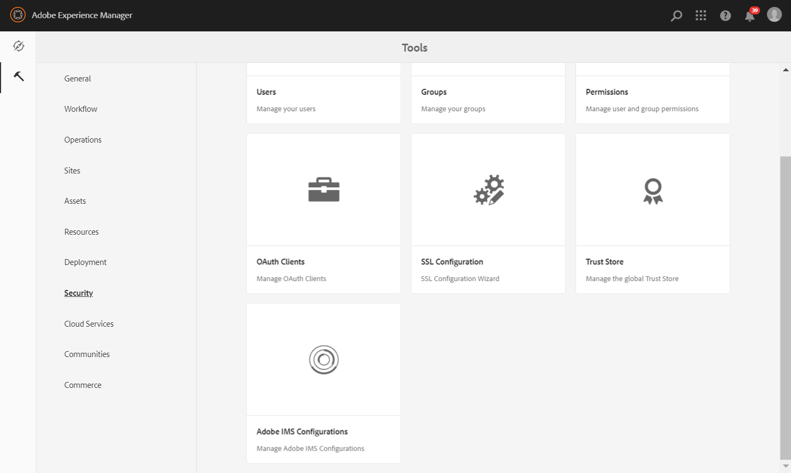
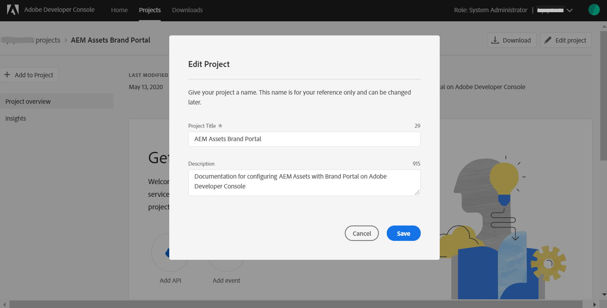

# Configure AEM Assets with Brand Portal {#configure-integration-65}

Adobe Experience Manager (AEM) Assets is configured with Brand Portal via Adobe Developer Console, which procures an IMS token for authorization of your Brand Portal tenant.

>[!NOTE]
 >
 >Configuring AEM Assets with Brand Portal via Adobe Developer Console is supported on AEM 6.5.4.0 and above.
 >
 >Earlier, Brand Portal was configured in Classic UI via Legacy OAuth Gateway, which uses the JWT token exchange to obtain an IMS Access token for authorization. 
 >
 >Configuration via Legacy OAuth is no longer supported from April 6, 2020, and is changed to configuring via Adobe Developer Console.
 >

>[!TIP]
 >
 >***For existing customers only*** 
 >
 >It is recommended to continue using existing legacy OAuth Gateway configuration. In case, you encounter problems with legacy OAuth Gateway configuration,  delete the existing configuration and create new configuration via Adobe Developer Console.
 >

This help describes the following two use-cases: 
* [New configuration](#configure-new-integration-65): If you are a new Brand Portal user and want to configure your AEM Assets author instance with Brand Portal, you can create new configuration on Adobe Developer Console. 
* [Upgrade configuration](#upgrade-integration-65): If you are an existing Brand Portal user with your AEM Assets author instance configured with Brand Portal on legacy OAuth Gateway, it is recommended to delete the existing configurations and create new configuration on Adobe Developer Console.

The information provided is based on the assumption that anyone reading this Help is familiar with the following technologies:

* Installing, configuring, and administering Adobe Experience Manager and AEM packages.

* Using Linux and Microsoft Windows operating systems.

## Prerequisites {#prerequisites}

You require the following to configure AEM Assets with Brand Portal:

* An up and running AEM Assets author instance with latest Service Pack.
* Brand Portal tenant URL.
* A user with system administrator privileges on the IMS organization of the Brand Portal tenant. 

[Download and install AEM 6.5](#aemquickstart)

[Download and install latest AEM Service Pack](#servicepack)

### Download and install AEM 6.5 {#aemquickstart}

It is recommended to have AEM 6.5 to set up an AEM author instance. If you do not have AEM up and running, download it from the following locations:

* If you are an existing AEM customer, download AEM 6.5 from [Adobe Licensing website](http://licensing.adobe.com).

* If you are an Adobe partner, use [Adobe Partner Training Program](https://adobe.allegiancetech.com/cgi-bin/qwebcorporate.dll?idx=82357Q) to request AEM 6.5.

After you download AEM, for instructions to set up an AEM author instance, see [deploying and maintaining](https://docs.adobe.com/content/help/en/experience-manager-65/deploying/deploying/deploy.html#default-local-install).

### Download and install AEM latest Service Pack {#servicepack}

For detailed instructions see, 

* [AEM 6.5 Service Pack Release Notes](https://docs.adobe.com/content/help/en/experience-manager-65/release-notes/service-pack/sp-release-notes.html) 

**Contact Customer Care** if you are unable to find the latest AEM package or Service Pack.

## Create configuration {#configure-new-integration-65}

Configuring AEM Assets with Brand Portal requires configurations in both, AEM Assets author instance as well as in Adobe Developer Console.

1. In AEM Assets author instance, create an IMS account and generate a public certificate (public key).

1. In Adobe Developer Console, create a project for your Brand Portal tenant (organization).

1. Under the project, configure an API using the public key to create a service account (JWT) connection.

1. Get the service account credentials and JWT payload information.

1. In AEM Assets author instance, configure the IMS account using the service account credentials and JWT payload.

1. In AEM Assets author instance, configure the Brand Portal cloud service using the IMS account and Brand Portal endpoint (organization URL).

1. Test the configuration by publishing an asset from AEM Assets author instance to Brand Portal.

>[!NOTE]
 >
 >A Brand Portal tenant shall only be configured with one AEM Assets author instance.
 >
 >Do not configure a Brand Portal tenant with multiple AEM Assets author instances.
 >

Perform the following steps in the listed sequence if you are configuring AEM Assets with Brand Portal for the first-time: 
1. [Obtain public certificate](#public-certificate)
1. [Create service account (JWT) connection](#createnewintegration) 
1. [Configure IMS account](#create-ims-account-configuration)
1. [Configure cloud service](#configure-the-cloud-service)
1. [Test configuration](#test-integration)

### Create IMS configuration {#create-ims-configuration}

IMS configuration authenticates your Brand Portal tenant with AEM Assets author instance. 

IMS configuration includes two steps:

* [Obtain public certificate](#public-certificate) 
* [Configure IMS account](#create-ims-account-configuration)

### Obtain public certificate {#public-certificate}

Public certificate allows you to authenticate your profile on Adobe Developer Console.

1. Log in to your AEM Assets author instance. The default URL is 
   `http:// localhost:4502/aem/start.html`
1. From the **Tools**  panel, navigate to **[!UICONTROL Security]** > **[!UICONTROL Adobe IMS Configurations]**.

   

1. In Adobe IMS Configurations page, click **[!UICONTROL Create]**. 
   
1. You are redirected to the **[!UICONTROL Adobe IMS Technical Account Configuration]** page. By default, the **Certificate** tab opens.

   Select the cloud solution **[!UICONTROL Adobe Brand Portal]**.  

1. Mark the checkbox **[!UICONTROL Create new certificate]** and specify an **alias** for the certificate. The alias serves as name of the dialog. 

1. Click **[!UICONTROL Create certificate]**. Then, click **[!UICONTROL OK]** in the dialog box to generate the public certificate.

   

1. Click **[!UICONTROL Download Public Key]** and save the certificate (.crt) file on your machine. 

   The certificate file will be used in further steps to configure API for your Brand Portal tenant and generate service account credentials in Adobe Developer Console. 

   

1.  Click **[!UICONTROL Next]**. 

    In the **Account** tab, you create the Adobe IMS account but for that you will need the service account credentials that are generated in Adobe Developer Console. Keep this page open for now.

    Open a new tab and [create a service account (JWT) connection in Adobe Developer Console](#createnewintegration) to get the credentials and JWT payload for configuring the IMS account. 

### Create service account (JWT) connection {#createnewintegration}

In Adobe Developer Console, projects and APIs are configured at organization (Brand Portal tenant) level. Configuring an API creates a service account (JWT) connection in Adobe Developer Console. There are two methods to configure API, by generating a key pair (private and public keys) or by uploading a public key. To configure AEM Assets author instance with Brand Portal, you must generate a public certificate (public key) in AEM Assets author instance and create credentials in Adobe Developer Console by uploading the public key. This public key is used to configure API for the selected Brand Portal organization and generates the credentials and JWT payload for the service account. These credentials are further used to configure the IMS account in AEM Assets author instance. Once the IMS account is configured, you can configure the Brand Portal cloud service in AEM Assets author instance.

Perform the following steps to generate the service account credentials and JWT payload:

1. Log in to Adobe Developer Console with system administrator privileges on the IMS organization (Brand Portal tenant). The default URL is 

   [https://www.adobe.com/go/devs_console_ui](https://www.adobe.com/go/devs_console_ui)

   >[!NOTE]
    >
    >Ensure that you have selected the correct IMS organization (Brand Portal tenant) from the dropdown (organization list) located at the upper-right corner.
    >

1. Click **[!UICONTROL Create new project]**. A blank project is created for your organization. 

   Click **[!UICONTROL Edit project]** to update the **[!UICONTROL Project Title]** and **[!UICONTROL Description]**, and click **[!UICONTROL Save]**.

   
   
1. In the Project overview tab, click **[!UICONTROL Add API]**.

   

1. In the Add an API window, select **[!UICONTROL AEM Brand Portal]** and click **[!UICONTROL Next]**. 

   Ensure that you have access to the AEM Brand Portal service.

1. In the Configure API window, click **[!UICONTROL Upload your public key]**. Then, click **[!UICONTROL Select a File]** and upload the public certificate (.crt file) that you have downloaded in the [obtain public certificate](#public-certificate) section. 

   Click **[!UICONTROL Next]**.

   

1. Verify the public certificate and click **[!UICONTROL Next]**.

1. Select the default product profile **[!UICONTROL Assets Brand Portal]** and click **[!UICONTROL Save configuration]**. 

   

1. With the API configured, you are redirected to the API overview. From the left navigation under **[!UICONTROL Credentials]**, click **[!UICONTROL Service Account (JWT)]**.

   >[!NOTE]
    >
    >You can view the credentials and perform other actions (generate JWT tokens, copy credential details, retrieve client secret, and so on) as needed.
    >

1. From the **[!UICONTROL Client Credentials]** tab, copy the **[!UICONTROL client ID]**. 

   Click **[!UICONTROL Retrieve Client Secret]** and copy the **[!UICONTROL client secret]**.

   

1. Navigate to the **[!UICONTROL Generate JWT]** tab and copy the **[!UICONTROL JWT Payload]**. 

You can now use the client ID (API key), client secret, and JWT payload to [configure the IMS account](#create-ims-account-configuration) in AEM Assets cloud instance.

<!--
### Create Adobe I/O integration {#createnewintegration}

Adobe I/O integration generates API Key, Client Secret, and Payload (JWT) which is required in setting up the IMS Account configurations.

1. Login to Adobe I/O Console with system administrator privileges on the IMS organization of the Brand Portal tenant.

   Default URL: [https://console.adobe.io/](https://console.adobe.io/) 

1. Click **[!UICONTROL Create Integration]**.

1. Select **[!UICONTROL Access an API]**, and click **[!UICONTROL Continue]**.

   

1. Create a new integration page opens. 
   
   Select your organization from the drop-down list.

   In **[!UICONTROL Experience Cloud]**, Select **[!UICONTROL AEM Brand Portal]** and click **[!UICONTROL Continue]**. 

   If the Brand Portal option is disabled for you, ensure that you have selected correct organization from the drop-down box above the **[!UICONTROL Adobe Services]** option. If you do not know your organization, contact your administrator.

   

1. Specify a name and description for the integration. Click **[!UICONTROL Select a File from your computer]** and upload the `AEM-Adobe-IMS.crt` file downloaded in the [obtain public certificates](#public-certificate) section.

1. Select the profile of your organization. 

   Or, select the default profile **[!UICONTROL Assets Brand Portal]** and click **[!UICONTROL Create Integration]**. The integration is created.

1. Click **[!UICONTROL Continue to integration details]** to view the integration information. 

   Copy the **[!UICONTROL API Key]** 
   
   Click **[!UICONTROL Retrieve Client Secret]** and copy the Client Secret key.

   

1. Navigate to **[!UICONTROL JWT]** tab, and copy the **[!UICONTROL JWT payload]**.

   The API Key, Client Secret key, and JWT payload information will be used to create IMS account configuration.
-->

### Create IMS Account configuration {#create-ims-account-configuration}

Ensure that you have performed the following steps:

* [Obtain public certificate](#public-certificate)
* [Create service account (JWT) connection](#createnewintegration)

Perform the following steps to configure the IMS account that you have created in [obtain public certificate](#public-certificate).

1. Open the IMS Configuration and navigate to the **[!UICONTROL Accounts]** tab. You kept the page open while [obtaining public certificate](#public-certificate).

1. Specify a **[!UICONTROL Title]** for the IMS account.

   In **[!UICONTROL Authorization Server]**, enter the URL: [https://ims-na1.adobelogin.com/](https://ims-na1.adobelogin.com/)  

   Paste the client ID in API key, client secret, and JWT payload that you have copied while [creating the service account (JWT) connection](#createnewintegration).

   Click **[!UICONTROL Create]**.

   The IMS account is configured.

   

   
1. Select the IMS configuration and click **[!UICONTROL Check Health]**.  

   Click **[!UICONTROL Check]** in the dialog box. On successful configuration, a message appears that the *Token is retrieved successfully*.

   

>[!CAUTION]
 >
 >You must have only one IMS configuration. Do not create multiple IMS configurations.
 >
 >Ensure that the IMS configuration passes the health check. If the configuration does not pass the health check, it is invalid. You must delete it and create a new, valid configuration.
 >

### Configure cloud service {#configure-the-cloud-service}

Perform the following steps to create Brand Portal cloud service:

1. Log in to your AEM Assets author instance.

1. From the **Tools**  panel, navigate to **[!UICONTROL Cloud Services]** > **[!UICONTROL AEM Brand Portal]**.

1. In the Brand Portal Configurations page, click **[!UICONTROL Create]**.

1. Specify a **[!UICONTROL Title]** for the configuration. 

   Select the IMS configuration that you have created while [configuring the IMS account](#create-ims-account-configuration).
   
   In the **[!UICONTROL Service URL]**, enter your Brand Portal tenant (organization) URL.   
   
    

1. Click **[!UICONTROL Save and Close]**. The cloud configuration is created. Your AEM Assets author instance is now configured with the Brand Portal tenant. 

### Test configuration {#test-integration}

Perform the following steps to validate the configuration:

1. Log in to your AEM Assets cloud instance.

1. From the **Tools**  panel, navigate to **[!UICONTROL Deployment]** > **[!UICONTROL Replication]**.

    

1. In the Replication page, click **[!UICONTROL Agents on author]**.

   

1. Four replication agents are created for each tenant. 

   Locate the replication agents of your Brand Portal tenant. 
   
   Click the replication agent URL. 

   

   >[!NOTE]
    >
    >The replication agents work in parallel and share the job distribution equally, thereby increasing the publishing speed by four times the original speed. After the cloud service is configured, additional configuration is not required to enable the replication agents that are activated by default to enable parallel publishing of multiple assets.
    >

1. To verify the connection between AEM Assets and Brand Portal, click **[!UICONTROL Test Connection]**.

   

   A message appears at the bottom of page that your test package is successfully delivered.

   

1. Verify the test results on all four replication agents one-by-one.

   >[!NOTE]
    >
    >Avoid disabling any of the replication agents. It may cause the replication of some of the assets to fail.
    >

Your AEM Assets author instance is successfully configured with Brand Portal, you can now:

* [Publish assets from AEM Assets to Brand Portal](../assets/brand-portal-publish-assets.md)
* [Publish folders from AEM Assets to Brand Portal](../assets/brand-portal-publish-folder.md)
* [Publish collections from AEM Assets to Brand Portal](../assets/brand-portal-publish-collection.md) 
* [Configure Asset Sourcing](https://docs.adobe.com/content/help/en/experience-manager-brand-portal/using/asset-sourcing-in-brand-portal/brand-portal-asset-sourcing.html) enabling the Brand Portal users to contribute and publish assets to AEM Assets. 

## Upgrade configuration {#upgrade-integration-65}

Perform the following steps in the listed sequence to upgrade existing configurations: 
1. [Verify running jobs](#verify-jobs)
1. [Delete existing configurations](#delete-existing-configuration)
1. [Create configuration](#configure-new-integration-65)

### Verify running jobs {#verify-jobs}

Ensure that no publishing job is running on your AEM Assets author instance before you make any modifications. For that, you can verify all four replication agents and ensure that the queues are empty.  

1. Log in to your AEM Assets author instance.

1. From the **Tools**  panel, navigate to **[!UICONTROL Deployment]** > **[!UICONTROL Deployment Replication]**.

1. In the Replication page, click **[!UICONTROL Agents on author]**.

   

1. Locate the replication agents of your Brand Portal tenant. 
   
   Ensure that the **Queue is Idle** for all the replication agents, no publishing job is active. 

   

### Delete existing configurations {#delete-existing-configuration}

You must run the following check-list while deleting the existing configurations.
* Delete all four replication agents
* Delete cloud service
* Delete MAC user 

1. Log in to your AEM Assets author instance and open CRX Lite as an administrator. The default URL is 

   `http:// localhost:4502/crx/de/index.jsp`

1. Navigate to `/etc/replications/agents.author` and delete all the four replication agents of your Brand Portal tenant.

   

1. Navigate to `/etc/cloudservices/mediaportal` and delete the **Cloud Service configuration**.

   

1. Navigate to `/home/users/mac` and delete the **MAC user** of your Brand Portal tenant.

   

You can now [create configuration](#configure-new-integration-65) via Adobe Developer Console on your AEM 6.5 author instance. 

<!--
   Comment Type: draft

   <li> </li>
   -->

   <!--
   Comment Type: draft

   <li>Step text</li>
   -->

