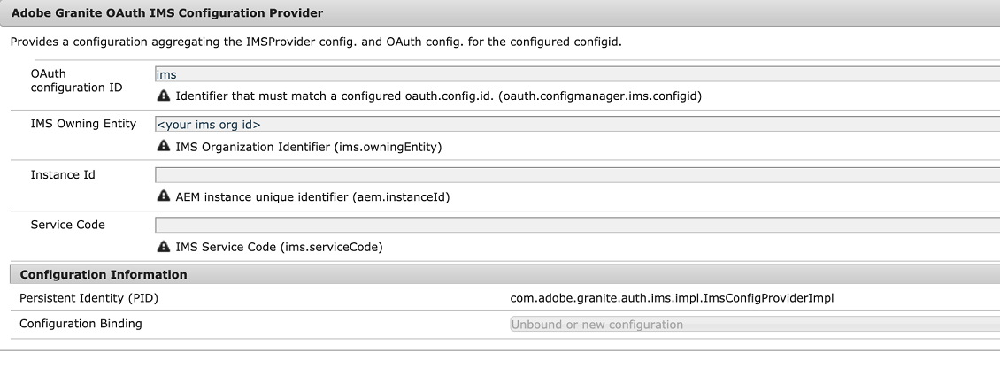
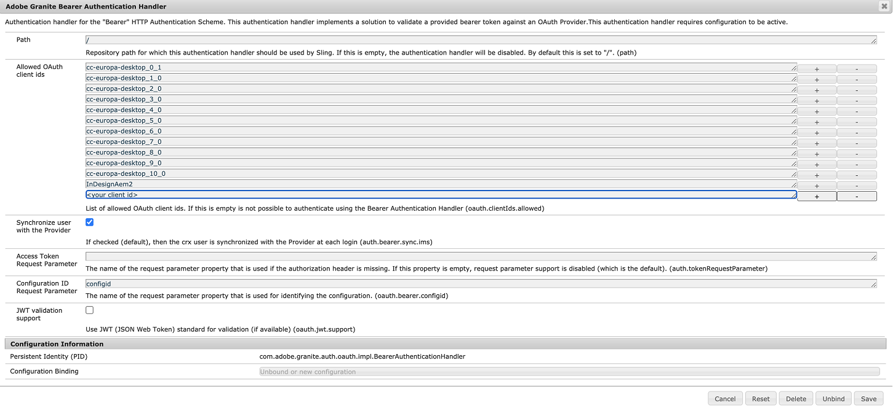
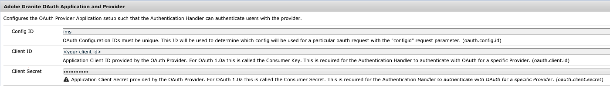
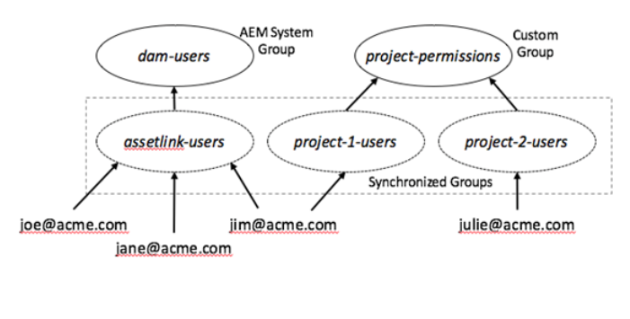

# Configure Experience Manager Assets for Adobe Asset Link {#adobe-asset-link}

[Adobe Asset Link (AAL)](https://www.adobe.com/creativecloud/business/enterprise/adobe-asset-link.html) streamlines collaboration between creatives and marketers in the content creation process. It connects Adobe Experience Manager Assets with Creative Cloud desktop apps Adobe InDesign, Adobe Photoshop, and Adobe Illustrator. The Adobe Asset Link panel allows creatives to access and modify content stored in AEM Assets without leaving the creative apps they are most familiar with. 

To configure Experience Manager Assets to be used with Asset Link, implement the following tasks. Use Experience Manager administrator account to do the configuration:

1. Install the packages as required. Details are in [prerequisites](#prerequisites).

1. Configure Experience Manager either [manually](#manual-configuration) or using a [package](#configure-using-package).

1. To map Creative Cloud licensed users with Experience Manager users, manage [user access control](#user-access).

1. Create [custom query index](#create-custom-index), configure [FPO renditions](/help/assets/configure-fpo-renditions.md) for InDesign, configure [Adobe Stock integration](/help/assets/aem-assets-adobe-stock.md), and configure [visual or similarity search](https://experienceleague.adobe.com/docs/experience-manager-65/assets/using/search-assets.html#configvisualsearch). 

## Prerequisites and support for various functionalities {#prerequisites}

Ensure that you install the appropriate service pack and package as necessary. See the following requirements for each Experience Manager version and for specific capabilities.

| Assets capability | Experience Manager version and requirements for support |
|--- |--- |
| Asset Link works by default  | Experience Manager 6.5 and 6.5.2 or later.   Experience Manager 6.4.4 and 6.4.6 or later.   Adobe recommends installing the latest [Experience Manager service pack (SP)](https://experienceleague.adobe.com/docs/experience-manager-release-information/aem-release-updates/aem-releases-updates.html) before using AAL. |
| Asset Link works after installing a package | For Experience Manager 6.4.0 - 6.4.3, install [adobe-asset-link-support](https://experience.adobe.com/#/downloads/content/software-distribution/en/aem.html?package=/content/software-distribution/en/details.html/content/dam/aem/public/adobe/packages/cq640/featurepack/adobe-asset-link-support) package. |
| Adobe Stock integration | Experience Manager 6.4.2 or later |
| Visual or Similarity search | Experience Manager 6.5.0 or later |

## Configure Experience Manager using the configuration package {#configure-using-package}

Adobe recommends that you install [adobe-asset-link-config](https://experience.adobe.com/#/downloads/content/software-distribution/en/aem.html?package=/content/software-distribution/en/details.html/content/dam/aem/public/adobe/packages/cq640/product/assets/adobe-asset-link-config) configuration package to automate most of the configuration tasks, followed by a few manual tasks. Alternatively, you can [configure manually](#manual-configuration).

>[!CAUTION]
>
>If your Experience Manager instance is configured for user login with Adobe IMS accounts, do not use the configuration package. Instead, [manually configure](#manual-configuration) your Experience Manager instance.

1. To open Package Manager, in Experience Manager web interface, access **[!UICONTROL Tools]** > **[!UICONTROL Deployment]** > **[!UICONTROL Package Share]**. Install `adobe-asset-link-config` package.

1. Access **[!UICONTROL Tools]** > **[!UICONTROL Operations]** > **[!UICONTROL Web Console]**. Locate **[!UICONTROL Adobe Granite OAuth IMS Provider]** configuration, and click to edit it. 

   Set the following properties and save the changes.

   * [!UICONTROL Group Mappings]: Leave empty unless desired. For details, see [Group Mapping](#group-mapping).
   * [!UICONTROL Organization]: Enter the organization ID you are using in the Adobe Admin Console. For more information about organization IDs, see [Create user group](https://helpx.adobe.com/enterprise/using/create-aal-user-group.html).

1. Locate **[!UICONTROL Adobe Granite Bearer Authentication Handler]** configuration, and click to edit it. 
   
   Add **[!UICONTROL InDesignAem2]** Client IDs to the **[!UICONTROL Allowed OAuth client ids]** configuration property. 

## Manually configure Experience Manager {#manual-configuration}

Manually configure Experience Manager if you choose not to use a configuration package or if your Experience Manager deployment is configured to support user login with Adobe IMS accounts. 

To manually configure Experience Manager:

1. To access the configuration manager, access **[!UICONTROL Tools]** > **[!UICONTROL Operations]** > **[!UICONTROL Web Console]**. Select **[!UICONTROL OSGi]** > **[!UICONTROL Configuration]** from the menu at the top. 

1. Locate the **[!UICONTROL Adobe Granite OAuth IMS Provider]** configuration and click to edit it. 

   Set the following configuration and click **[!UICONTROL Save]**. 

   * [!UICONTROL Authorization Endpoint]: ` https://ims-na1.adobelogin.com/ims/authorize/v1`
   * [!UICONTROL Token Endpoint]: ` https://ims-na1.adobelogin.com/ims/token/v1`
   * [!UICONTROL Profile Endpoint]: ` https://ims-na1.adobelogin.com/ims/profile/v1`
   * [!UICONTROL Validation URL]: ` https://ims-na1.adobelogin.com/ims/validate_token/v1`
   * [!UICONTROL Organization]: Set to the organization ID in the [Adobe Admin Console](https://adminconsole.adobe.com/).
   * [!UICONTROL Group Mappings]: Leave empty unless you have a special case. For details, see [Group Mapping](#group-mapping).

1. Locate **[!UICONTROL Adobe Granite Bearer Authentication Handler]** configuration, and click to edit it.

   Add the following Client IDs to the **[!UICONTROL Allowed OAuth client ids]** configuration property: `InDesignAem2, cc-europa-desktop_0_1, cc-europa-desktop_1_0, cc-europa-desktop_2_0, cc-europa-desktop_3_0, cc-europa-desktop_4_0, cc-europa-desktop_5_0, cc-europa-desktop_6_0, cc-europa-desktop_7_0, cc-europa-desktop_8_0, cc-europa-desktop_9_0, and cc-europa-desktop_10_0`.

   To add each `Client ID`, click `+`. Click **[!UICONTROL Save]** after adding all IDs.

1. In **[!UICONTROL Adobe Granite OAuth Application and Provider]** configuration, inspect the existing **[!UICONTROL Adobe Granite OAuth Application and Provider]** instances. If you locate an instance with the `Config ID` value of `ims`, use it for the instructions in this procedure. Otherwise, click `+` to create a configuration instance. Set the following property values and click **[!UICONTROL Save]**. 
  
   * [!UICONTROL Client ID]: Do not change
   * [!UICONTROL Client Secret]: Do not change
   * [!UICONTROL Config ID]: ` ims`
   * [!UICONTROL Scope]: `AdobeID, OpenID, read_organizations` (other values may also be in the configuration)
   * [!UICONTROL Provider ID]: ` ims`
   * [!UICONTROL Create users]: ` Checked`
   * [!UICONTROL User ID Property]: `Email` for newly created configuration. Otherwise, do not change.

1. Locate the **[!UICONTROL Apache Jackrabbit Oak Default Sync Handler]** configuration with the **[!UICONTROL Sync Handler Name]** `ims` and click to edit it.

   Set the following configuration properties, and click **[!UICONTROL Save]**.

   * [!UICONTROL User Expiration Time and User Membership Expiration]: Time in minutes following by 'm' without space. For example, `15m` for 15 minutes. For details, see [Group Mapping](#group-mapping).
   * [!UICONTROL User auto membership]: Do not change
   * [!UICONTROL User Dynamic Membership]: ` Deslect`

1. Locate the **[!UICONTROL Adobe Granite OAuth Authentication Handler]** configuration and click  to edit it. Without making any changes, click **[!UICONTROL Save]**.

1. To adjust the relative priority of the bearer authentication handler, in CRXDE, navigate to `/apps/system/config`. Locate `com.adobe.granite.auth.oauth.impl.BearerAuthenticationHandler.config` and open its configuration. At the end, add `service.ranking=I"-10"`. Save the changes.

   >[!NOTE]
   >
   >Each request authenticated with a bearer token incurs the overhead of three calls to Adobe IMS, user syncing, and the creation of a login-token in Experience Manager. To overcome this overhead, Adobe Asset Link captures the login-token returned in the response from Experience Manager and sends it with subsequent requests. For this process to work, the relative priority of the bearer authentication handler must be adjusted.

1. (Optional) If the Experience Manager users have uppercase or mixed case domain names in their email IDs, select **[!UICONTROL Change Locking User to Lower Case]** in **[!UICONTROL Adobe Granite ACP Platform Configs]** in Experience Manager Web Console. 

## Additional configuration after migration to Business Profiles {#configure-migration-activity}

Adobe Asset Link users are able to connect to Experience Manager to allow IMS login from the main Creative Cloud for Enterprise (CCE) org. Experience Manager uses the client IDs to identify the permitted IMS organization. After migration to Business Profiles, it is required to configure the Client ID and Secret Key for the IMS org in  Experience Manager for the Bearer Authentication Handler. For more information on Business Profiles, see [introducing Adobe Profiles](https://helpx.adobe.com/enterprise/kb/introducing-adobe-profiles.html).

Additional configuration is required only if you are using different Adobe IMS organizations for Experience Manager and Creative Cloud for Enterprise (CCE), and a domain trust relationship is established between these two organizations.

>[!NOTE]
>
>* The fix for Business Profiles is provided in Experience Manager 6.5.11.0.
>* The existing configuration continues to work if you are using the same Adobe  IMS orgganization with Experience Manager and CCE.

**Prerequisites**

1. An up and running Experience Manager instance with Bearer Authentication configured for AAL.
1. Install the following package (Service Pack 11) on your Experience Manager 6.5 instance.

   [Download Experience Manager 6.5.11.0](https://experience.adobe.com/#/downloads/content/software-distribution/en/aem.html?package=/content/software-distribution/en/details.html/content/dam/aem/public/adobe/packages/cq650/servicepack/aem-service-pkg-6.5.11.zip)

1. Contact [!UICONTROL Customer Support] to get the Client ID and Secret Key for Bearer Authentication of your IMS org.

Following are the additional configurations that are required after migration to Business Profiles:

1. In **[!UICONTROL Adobe Granite OAuth IMS Configuration Provider]** (`com.adobe.granite.auth.ims.impl.ImsConfigProviderImpl`), set:

   * OAuth Configuration ID (`oauth.configmanager.ims.configid`): `ims` (Verify once, you may have it already configured)

   * IMS Owning Entity (`ims.owningEntity`): Your IMS org id
   
   

1. Open **[!UICONTROL Bearer Authentication Handler]** configuration and add the Client ID obtained from [!UICONTROL Customer Support] to the list of **[!UICONTROL Allowed OAuth client ids]**.

   

1. Open **[!UICONTROL Adobe Granite OAuth Application and Provider]** configuration and add the **[!UICONTROL Client ID]** and **[!UICONTROL Client Secret]** (Secret Key) obtained from Customer Support. 

   Ensure that the **[!UICONTROL Config ID]** field (`oauth.config.id`) contains the same value as provided in **[!UICONTROL OAuth configuration ID]** field (`oauth.configmanager.ims.configid`) above.

   

1. Open **[!UICONTROL Adobe Granite IMS Cluster Exchange Token Preprocessor]** configuration and set it to `enable`.

## Manage user access control {#user-access}

This section describes how to manage users and their access to the Experience Manager repository.

### Group Mapping {#group-mapping}

Group mapping determines how groups in Experience Manager correspond to groups in Adobe IMS. It plays an important role in how Adobe Asset Link users are granted permission to access Experience Manager Assets.

When used with Adobe Asset Link, Experience Manager delegates user management functions to Adobe IMS. It automatically creates users and groups that correspond to users and groups in Adobe IMS. In addition, it synchronizes users, groups, and group membership in Experience Manager to match the ones in Adobe IMS.

For example, consider a scenario where Adobe Asset Link users are members of the Adobe IMS group assetlink-users. In this case, a synchronized group named assetlink-users is created in Experience Manager when a user from that Adobe IMS group connects to Adobe Asset Link for the first time. Each new user in the Adobe IMS group is added to that corresponding group in Experience Manager when they connect to Experience Manager through Adobe Asset Link for the first time.

Groups in Experience Manager that correspond to and are synchronized with groups in Adobe IMS can be granted access directly or by making them a member of another group. Here is an example of how permissions can be managed.

The following rules apply to group mappings in Experience Manager:

* Ensure that the **[!UICONTROL Group Mappings]** property in **[!UICONTROL Adobe Granite OAuth IMS Provider]** configuration is blank.
* Adobe Asset Link user group membership is evaluated when the user authenticates and the time period in **[!UICONTROL User Expiration Time]** property in **[!UICONTROL Apache Jackrabbit Oak Default Sync Handler]** configuration has elapsed. Currently, users can be added to and removed from groups in Experience Manager to synchronize with what is found in Adobe IMS.
* Avoid group name conflicts. Ensure that the names used for groups created in Adobe IMS (to manage users) are different from all Experience Manager system group names.

  For example, make sure that they are different from the `dam-users` group and the groups created by the Experience Manager administrator.
  
  An Adobe IMS group whose name conflicts with the name of an Experience Manager system group or manually created group are not used to control user permissions.
* If an Adobe IMS user connects to an Experience Manager instance, on which the user's name conflicts with a previously created Experience Manager user, the Adobe IMS user is given another name with numbers added to make it unique.

**Setup first-time access control**

Users who connect through Adobe Asset Link can only view and interact with assets after they are granted the required permission. The [Group Mapping](#group-mapping) section above discusses how are user groups created in Experience Manager, which correspond to and are synchronized with user groups in your organization within Adobe IMS. It is recommended that the Experience Manager administrators use these groups to manage access control for Adobe Asset Link users.

For each Experience Manager group that is synchronized with an Adobe IMS group (which is used to manage user access control):

1. Ensure that the group has a member that can be used for an initial connection from Adobe Asset Link.
1. Use that user to log in to Adobe Asset Link, and connect to Experience Manager. This connection is expected to fail.
1. In Experience Manager, locate the group that corresponds to the group in Adobe IMS, and grant it the desired access control. For example, the new group is made a member of the dam-users group.
1. Close Adobe Asset Link and restart the Creative Cloud application.
1. To verify that the user has the expected access, reopen Adobe Asset Link.

Once these steps are performed, other users in the same group can connect to Experience Manager with Adobe Asset Link in their first attempt. They automatically have the same permissions as the other users in the group.

## Manage Experience Manager users for Adobe Asset Link {#manage-users}

Adobe Asset Link users are able to connect with Experience Manager when they are signed in to their Creative Cloud application. This authentication uses Adobe IMS technology and creates user information in Experience Manager, if it does not exist. It is common for Experience Manager enterprise customers to manage their users with an external identity provider that is integrated with Experience Manager. Identity providers include Adobe IMS and other products that use the SAML and LDAP protocols. Alternatively, users can be created and managed locally in Experience Manager.

Users who connect to Experience Manager from Adobe Asset Link have no conflict with existing user information stored in Experience Manager from previous direct sign-in, if:

* All user names used for direct sign-in to Experience Manager are different from user names used in Adobe IMS for Creative Cloud sign-in.
* Adobe IMS is used as the identity provider for direct Experience Manager sign-in.
* Users connect to Experience Manager from Adobe Asset Link before direct Experience Manager sign-in with the same account.

On the other hand, the user information created as a result of direct Experience Manager sign-in must be updated to work with Adobe Asset Link, in the following scenarios:

* The same user name, such as the user’s Email address, is used for both - the account in Creative Cloud, which uses Adobe IMS, and the account in an external identity provider other than Adobe IMS.
* The same user name is used for both—the account in Creative Cloud and a local Experience Manager account.
* The Creative Cloud accounts in Adobe IMS are Federated IDs, which are served by the same external identity provider that is integrated with Experience Manager for direct sign-in.

The users created through these scenarios do not have a property that is required for users, which are synchronized with Adobe IMS. 

To update such users in Experience Manager to work with Adobe Asset Link:

1. In the Experience Manager web console, locate **[!UICONTROL Apache Jackrabbit Oak External PrincipalConfiguration]** configuration and click to edit it. Deselect the **[!UICONTROL External Identity Protection]** check box, and click **[!UICONTROL Save]**.
1. To access User Management interface in Experience Manager, navigate to **[!UICONTROL Tools]** > **[!UICONTROL Security]** > **[!UICONTROL Users]**. Select the user you want to update, then make a note of the end of your browser’s URL path for that user, starting with `/home/users`. Alternatively, you can search for the user name in CRXDE. A sample user path: `/home/users/x/xTac082TDh-guJzzG7WM`.
1. In CRXDE, navigate to the user path, select the user node, and view the properties of the node by selecting the **[!UICONTROL Properties]** tab in the lower-middle area. This node has a `jcr:primaryType` property value of `rep:User`.
1. At the bottom of the **[!UICONTROL Properties]** tab area, enter a `Name` value of `rep:externalId`, `Type` value of `String`, and a `Value` value of `rep:authorizableId`;`ims`, where `rep:authorizableId` is the value of the `rep:authorizableId` property of the node. (A semicolon is used with no spaces to separate the `rep:authorizableId` value from `ims`.)
1. Click the **[!UICONTROL Add]** button to the right of your new entry, and then click **[!UICONTROL Save All]**.
1. Repeat steps 2 through 5 for any other users you want to upgrade to work with Adobe Asset Link.
1. In the Experience Manager web console, locate **[!UICONTROL Apache Jackrabbit Oak External PrincipalConfiguration]** configuration and click to edit it. Deselect the **[!UICONTROL External Identity Protection]** check box, and click **[!UICONTROL Save]**.
 
>[!NOTE]
>
>If the services are not restored in a few minutes, restart Experience Manager to allow successful authentications.

After this change, an updated Experience Manager user can connect with Adobe Asset Link and continue to use the method of direct sign-in to Experience Manager that was used before the update. On successful authentication with Adobe IMS, the Experience Manager user profile information is synchronized with the user profile in Adobe IMS.

There is a method by which a bulk migration of multiple Experience Manager users can be performed to enable them to work with Adobe Asset Link. Contact Adobe Care for more information and assistance with enabling this option.

As an alternative to the steps, in certain circumstances, an Adobe Asset Link user may be provided quick access to Experience Manager. In such cases, the pre-existing user information is found and deleted with Experience Manager User Management or Experience Manager CRXDE prior to their connection with Adobe Asset Link. New user information is created in Experience Manager following the connection. Use this approach only if you are certain that there is no important data that is added as a child of the user node. Such extra data is any node that is the child of the user node other than `tokens`, `preferences`, `profile`, `profiles`, `profiles/public`, and `rep:policy/*` nodes.

## Auto-start workflow to process assets conditionally {#auto-start-workflow}

In Experience Manager 6.4 and Experience Manager 6.5, the administrators can configure workflows to automatically execute and process assets based on pre-defined conditions.

The configuration is useful for line-of-business users and marketers, for example, to create a custom workflow on a few specific folders. Say all assets from an agency's photoshoot can be watermarked or all assets uploaded by a freelancer can be processed to create specific renditions.

For more information and for Experience Manager configuration, see [auto-execute workflow on assets](https://experienceleague.adobe.com/docs/experience-manager-65/assets/using/assets-workflow.html#auto-execute-workflow-on-some-assets).

## Create a custom index in Experience Manager 6.4.x versions {#create-custom-index}

Experience Manager contains indexes that are used for querying. Create the following custom index for specified version. Experience Manager 6.5.0 contains this index by default. Adobe Asset Link requires this index to determine which assets a user has checked out. 

1. In CRXDE, locate `/oak:index` node. Create a node named `cqDrivelock` and set its `Type` to `oak:QueryIndexDefinition`.

1. Add the following properties to the new node and save the changes:

   * `Name: type; Type: string; Value: property`

   * `Name: propertyNames; Type: Name[] (click the "Multi" button); Value: cq:drivelock`

## Configure visual or similarity search {#configure-visual-similarity-search}

Visual Search capability lets you search for visually similar assets in the AEM Assets repository, using the Adobe Asset Link panel. The functionality is available in 6.5.0 or later versions and only the indexed assets are searched. For more information, see [how to configure visual search](https://experienceleague.adobe.com/docs/experience-manager-65/assets/using/search-assets.html#configvisualsearch).

## Generate For Placement Only renditions for Adobe InDesign {#fpo-renditions}

Experience Manager provides renditions that are used for placement only (FPO). These FPO renditions have a small file size but are of the same aspect ratio. If an FPO rendition is not available for an asset, Adobe InDesign uses the original asset instead. This fallback mechanism ensures that the creative workflow proceeds without any breaks. For more information, see [generate FPO renditions](/help/assets/configure-fpo-renditions.md).

## Integrate with Adobe Stock {#adobe-stock-integration}

Organizations integrate their Adobe Stock accounts with Experience Manager Assets. It helps marketers to make licensed high-quality, royalty-free photos, vectors, illustrations, videos, templates, and 3D assets available for their creative and marketing projects. Creative professionals can use these assets using the Asset Link panel.

To Integrate with Adobe Stock, see [Adobe Stock assets in Experience Manager Assets](/help/assets/aem-assets-adobe-stock.md). Experience Manager 6.4.2 or later is required for integration with Adobe Stock.

## Troubleshoot Experience Manager related issues {#troubleshoot}

If you face issues when configuring or using Adobe Asset Link, try the following:

* Ensure that your deployment meets the prerequisites. Specifically, ensure that the appropriate feature packs or packages are installed.
* Contact your organization's partner or system integrator.
* If your Creative Cloud users are unable to verify in the checked out assets, then check for casing of the domain names in the email IDs. To fix, see [manual configuration](#manual-configuration).
* For more info, see [troubleshoot Asset Link](https://helpx.adobe.com/enterprise/kb/asset-link-troubleshooting.html).

>[!MORELIKETHIS]
>
>* [About Adobe Asset Link](https://helpx.adobe.com/enterprise/using/adobe-asset-link.html)
>* [Use Asset Link in Creative Cloud desktop app and manage assets](https://helpx.adobe.com/enterprise/using/manage-assets-using-adobe-asset-link.html)
>* [Configure Adobe Experience Manager Assets as a Cloud Service](https://helpx.adobe.com/enterprise/using/configure-aem-assets-for-asset-link.html).
