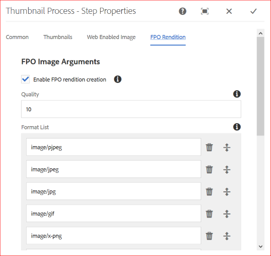
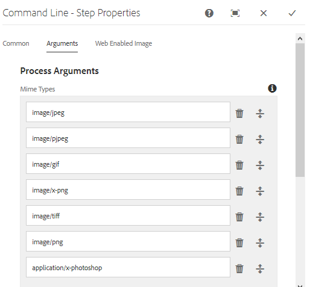
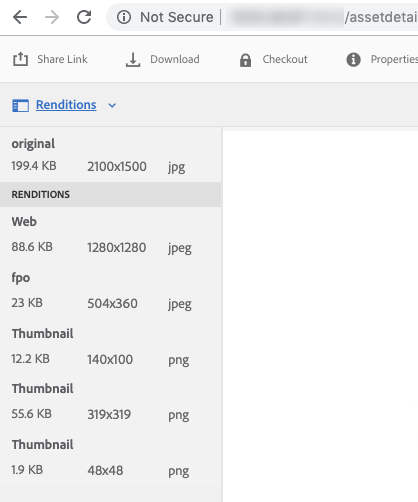

# Generate For Placement Only renditions for Adobe InDesign {#fpo-renditions}

| Version | Article link |
| -------- | ---------------------------- |
| AEM as a Cloud Service  |    [Click here](https://experienceleague.adobe.com/docs/experience-manager-cloud-service/content/assets/admin/configure-fpo-renditions.html?lang=en)                  |
| AEM 6.5     | This article         |

When placing large-sized assets from Experience Manager into Adobe InDesign documents, a creative professional must wait for a substantial time after they [place an asset](https://helpx.adobe.com/indesign/using/placing-graphics.html). Meanwhile, the user is blocked from using InDesign. This interrupts creative flow and negatively impacts the user experience. Adobe enables temporarily placing small-sized renditions in InDesign documents to begin with. When the final output is required, say for print and publishing workflows, the original, full-resolution assets replace the temporary rendition in background. This asynchronous update in the background speeds up the design process to enhance productivity and doesn't hinder the creative process.

Adobe Experience Manager (AEM) provides renditions that are used for placement only (FPO). These FPO renditions have a small file size but are of the same aspect ratio. If an FPO rendition is not available for an asset, Adobe InDesign uses the original asset instead. This fallback mechanism ensures that the creative workflow proceeds without any breaks.

## Approach to generate FPO renditions {#approach-to-generate-fpo-renditions}

Experience Manager allows many methods to process images that can be used to generate the FPO renditions. The two most common methods are to use in-built Experience Manager workflows and to use ImageMagick. Using these two methods, you configure rendition generation of newly uploaded assets and of the assets that exist in Experience Manager. 

You can use ImageMagick to process images, including to generate FPO renditions. Such renditions are downsampled, that is, the pixel dimensions of the rendition are proportionally reduced if the original image has PPI larger than 72. See [install and configure ImageMagick to work with Experience Manager Assets](best-practices-for-imagemagick.md). 

|  | Using Experience Manager's in-built workflow | Using ImageMagick workflow | Remarks |
|--- |--- |---|--- |
| For new assets | Enable FPO rendition ([help](#generate-renditions-of-new-assets-using-aem-workflow)) | Add ImageMagick command-line in Experience Manager workflow ([help](#generate-renditions-of-new-assets-using-imagemagick)) | Experience Manager executes the DAM Update Assets workflow for every upload. |
| For existing assets | Enable FPO rendition in a new, dedicated Experience Manager workflow ([help](#generate-renditions-of-existing-assets-using-aem-workflow)) | Add ImageMagick command-line in a new, dedicated Experience Manager workflow ([help](#generate-renditions-of-existing-assets-using-imagemagick)) | FPO renditions of the existing assets can be created on-demand or in bulk. |

>[!CAUTION]
>
>Create the workflows to generate renditions by modifying a copy of the default workflows. It prevents your changes from being overwritten when Experience Manager is updated, say by installing a new service pack.

## Generate renditions of new assets using Experience Manager workflow {#generate-renditions-of-new-assets-using-aem-workflow}

Following are the steps to configure DAM Update Asset workflow model to enable rendition generation:

1. Click **[!UICONTROL Tools]** > **[!UICONTROL Workflow]** > **[!UICONTROL Models]**. Select **[!UICONTROL DAM Update Asset]** model and click **[!UICONTROL Edit]**.

1. Select **[!UICONTROL Process Thumbnails]** step and click **[!UICONTROL Configure]**.

1. Click **[!UICONTROL FPO Rendition]** tab. Select **[!UICONTROL Enable FPO rendition creation]**.

   

1. Adjust the **[!UICONTROL Quality]** and add or modify **[!UICONTROL Format List]** values as required. By default, the list of MIME types to generate the FPO rendition is pjpeg, jpeg, jpg, gif, png, x-png, and tiff. Click **[!UICONTROL Done]**.

   >[!NOTE]
   >
   >Rendition generation is supported for file types JPEG, GIF, PNG, TIFF, PSD, and BMP.

1. To activate the changes, click **[!UICONTROL Sync]**.

>[!NOTE]
>
>Images larger than 1280 pixels on one side do not retain the pixel dimensions in the FPO rendition.

## Generate renditions of new assets using ImageMagick {#generate-renditions-of-new-assets-using-imagemagick}

In Experience Manager, DAM Update Asset workflow executes when a new asset is uploaded. To use ImageMagick to process renditions of newly uploaded assets, add a new command to the workflow model.

1. Click **[!UICONTROL Tools]** > **[!UICONTROL Workflow]** > **[!UICONTROL Models]**. 

1. Select **[!UICONTROL DAM Update Asset]** model and click **[!UICONTROL Edit]**.

1. Click **[!UICONTROL Toggle Side Panel]** in the upper left corner and search for command line step.

1. Drag the **[!UICONTROL Command Line]** step and add it before the **[!UICONTROL Process Thumbnails]** step.

1. Select **[!UICONTROL Command Line]** step and click **[!UICONTROL Configure]**.

1. Add the desired information as custom **[!UICONTROL Title]** and **[!UICONTROL Description]**. For example, FPO rendition (powered by ImageMagick).

1. In the **[!UICONTROL Arguments]** tab, add relevant **[!UICONTROL Mime Types]** to provide a list of file formats on which the command applies.

   

1. In the **[!UICONTROL Arguments]** tab, in the **[!UICONTROL Commands]** section, add a relevant ImageMagick command to generate FPO renditions.

   Below is an example command that generates FPO renditions in JPEG format, downsampled to 72 PPI, at 10% quality setting, and handles multi-layered Adobe Photoshop files by flattening the output:

   `convert -quality 10% -units PixelsPerInch ${filename} -resample 72 -flatten cq5dam.fpo.jpeg`

1. To activate the changes, click **[!UICONTROL Sync]**.

For detailed information on ImageMagick command line capabilities, see [https://imagemagick.org](https://imagemagick.org).

## Generate renditions of existing assets using Experience Manager workflow {#generate-renditions-of-existing-assets-using-aem-workflow}

To use Experience Manager workflow to generate FPO rendition of the existing assets, create a dedicated workflow model that uses the in-built FPO rendition option.

1. Click **[!UICONTROL Tools]** > **[!UICONTROL Workflow]** > **[!UICONTROL Models]**. 

1. To create a model, click **[!UICONTROL Create]** > **[!UICONTROL Create Model]**. 

1. Add a meaningful **[!UICONTROL Title]** and **[!UICONTROL Name]**.

1. Select the model and click **[!UICONTROL Edit]**. Click **[!UICONTROL Page Information]** > **[!UICONTROL Open Properties]**, and then select **[!UICONTROL Transient Workflow]**. This improves scalability and performance. 

1. Click **[!UICONTROL Save]** and **[!UICONTROL Close]**.

1. Click **[!UICONTROL Toggle Side Panel]** in the upper left corner and search for process thumbnail step. 

1. Select **[!UICONTROL Process Thumbnails]** and click **[!UICONTROL Configure]**. Follow the [configuration to generate rendition of new assets using Experience Manager workflow](#generate-renditions-of-new-assets-using-aem-workflow). 

1. To activate the changes, click **[!UICONTROL Sync]**.

## Generate renditions of existing assets using ImageMagick {#generate-renditions-of-existing-assets-using-imagemagick}

To use ImageMagick processing capabilities to generate FPO rendition of the existing assets, create a dedicated workflow model that uses the ImageMagick command line to do so.

1. Follow step 1 to step 3 from [configuration to generate rendition of existing assets using Experience Manager workflow](#generate-renditions-of-existing-assets-using-aem-workflow) section.

1. Follow step 4 to step 8 from [configuration to generate rendition of new assets using ImageMagick](#generate-renditions-of-new-assets-using-imagemagick) section.

## View FPO renditions {#view-fpo-renditions}

You can check the generated FPO renditions after the workflow completes. In Experience Manager Assets user interface, click the asset to open a large preview. Open the left rail and select Renditions. Alternatively, use the keyboard shortcut `Alt + 3` when the preview is open.

Click **[!UICONTROL FPO rendition]** to load its preview. Optionally, you can right click the rendition and save it to your file system.

## Tips and limitations {#tips-limitations}

* To use ImageMagick-based configuration, install ImageMagick on the same machine as Experience Manager.
* To generate FPO renditions of many assets or of the entire repository, plan and execute the workflows during low-traffic duration. Generating FPO renditions for a large number of assets is a resource-intensive activity and the Experience Manager servers must have sufficient processing power and memory available.
* For performance and scalability, see [Fine-tune ImageMagick](performance-tuning-guidelines.md).
* For generic command line handling of assets, see [command line handler to process assets](media-handlers.md).
