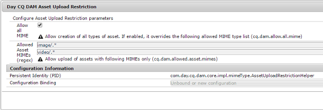
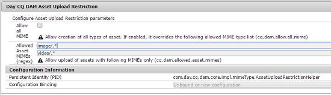

# Configure asset upload restrictions {#configuring-asset-upload-restrictions}

You can configure [!DNL Adobe Experience Manager Assets] to restrict the type of assets that users can upload. It helps prevent accidental uploads of undesired format and malicious files. The `Day CQ DAM Asset Upload Restriction` service enables you to control the type of files that users can upload. By default, [!DNL Assets] allows users to upload assets of all MIME types. However, you can configure the service to restrict users to upload files of specific MIME types only.

1. Open the Configuration Manager web console. Access `https://[aem_server]:[port]/system/console/configMgr`.
1. Open the **[!UICONTROL Day CQ DAM Asset Upload Restriction]** service in Edit mode. By default, the **Allow all MIME** option is selected, which allows users to upload files of all MIME types.

   

1. To restrict users to upload files of certain MIME types only, unselect the **[!UICONTROL Allow all MIME]** option and specify allowed MIME types in the **[!UICONTROL Allowed Asset MIMEs (regex)]** fields using regular expressions.

   

1. Click **[!UICONTROL Save]** to save the changes. If you specify MIME-strings for allowed MIME types, the upload operation fails for any asset with MIME type that doesn't match the configured MIME strings in these fields.
