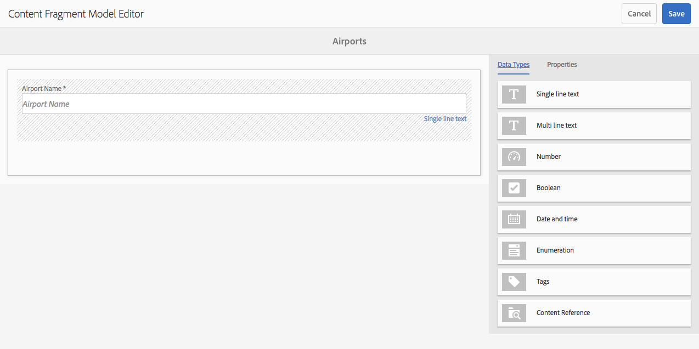
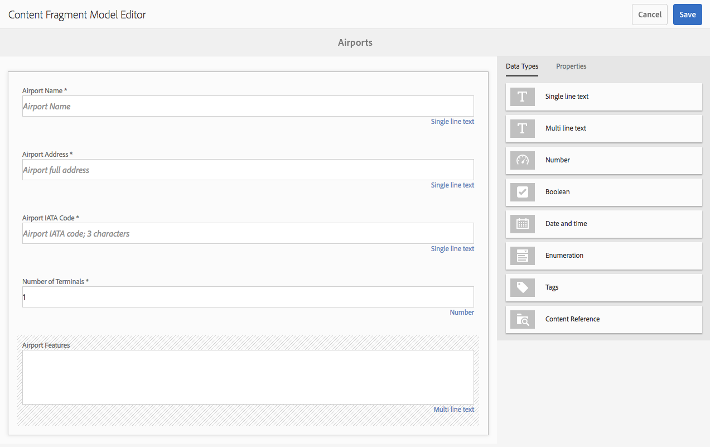

# Content Fragment Models {#content-fragment-models}

>[!CAUTION]
>
>Some Content Fragment functionality requires the application of [AEM 6.4 Service Pack 2 (6.4.2.0) or later](../release-notes/sp-release-notes.md).

Content Fragment Models define the structure of content for your [content fragments](content-fragments.md).

## Enable Content Fragment Models {#enable-content-fragment-models}

>[!CAUTION]
>
>If you do not enable **[!UICONTROL Content Fragment Models]**, the **[!UICONTROL Create]** option will not be available for creating new models.

To enable content fragment models you need to:

* Enable the use of content fragment models in the configuration manager
* Apply the configuration to your Assets folder

### Enable Content Fragment Models in Configuration Manager {#enable-content-fragment-models-in-configuration-manager}

To [create a new Content Fragment Model](#creating-a-content-fragment-model) you **must** first enable them using the Configuration Manager:

1. Navigate to **[!UICONTROL Tools]**, **[!UICONTROL General]**, then open the **[!UICONTROL Configuration Browser]**.
1. Select the location appropriate to your website.
1. Use **[!UICONTROL Create]** to open the dialog, where you:

    1. Specify a **[!UICONTROL Title]**. 
    1. Select **[!UICONTROL Content Fragment Models]** to enable their use.

   

1. Select **[!UICONTROL Create]** to save the definition.

### Apply the Configuration to your Assets Folder {#apply-the-configuration-to-your-assets-folder}

When the configuration **[!UICONTROL global]** is enabled for content fragment models, then any models that users create can be used in any Assets folder.

To use other configurations (i.e. excluding global) with a comparable Assets folder, then you have to define the connection. This is done using **[!UICONTROL Configuration]** in the **[!UICONTROL Cloud Services]** tab of the **[!UICONTROL Folder Properties]** of the appropriate folder.

## Creating a Content Fragment Model {#creating-a-content-fragment-model}

1. Navigate to **[!UICONTROL Tools]**, **[!UICONTROL Assets]**, then open **[!UICONTROL Content Fragment Models]**.
1. Navigate to the folder appropriate to your [configuration](#enable-content-fragment-models).
1. Use **[!UICONTROL Create]** to open the wizard.

   >[!CAUTION]
   >
   >If the [use of content fragment models have not been enabled](#enable-content-fragment-models), the **Create** option will not be available.

1. Specify the **[!UICONTROL Model Title]**. You can also add a **[!UICONTROL Description]** if required.

   

1. Use **[!UICONTROL Create]** to save the empty model. A message will indicate the success of the action, you can select **[!UICONTROL Open]** to immediately edit the model, or **[!UICONTROL Done]** to return to the console.

## Defining your Content Fragment Model {#defining-your-content-fragment-model}

The content fragment model effectively defines the structure of the resulting content fragments. Using the model editor you can add, and configure, the required fields:

>[!CAUTION]
>
>Editing an existing content fragment model can impact dependent fragments.

1. Navigate to **[!UICONTROL Tools]**, **[!UICONTROL Assets]**, then open **[!UICONTROL Content Fragment Models]**.  

1. Navigate to the folder holding your content fragment model.
1. Open the required model for **[!UICONTROL Edit]**; use either the quick action, or select the model and then the action from the toolbar.

   Once open the model editor shows:

    * left: fields already defined
    * right: **[!UICONTROL Data Types]** available for creating fields (and **[!UICONTROL Properties]** for use once fields have been created)

   >[!NOTE]
   >
   >When a field is **Required**, the **Label** indicated in the left pane will be marked with an asterix (**&ast;**).

   

1. **To Add a Field**

    * Drag a required data type to the required location for a field:

   

    * Once a field has been added to the model, the right panel will show the **Properties** that can be defined for that particular data type. Here you can define what is required for that field. For example:

   

1. **To Remove a Field**

   Select the required field, then click/tap the trash-can icon. You will be asked to confirm the action.

   

1. After adding all required fields, and defining the properties, use **[!UICONTROL Save]** to persist the definition. For example:

   

## Deleting a Content Fragment Model {#deleting-a-content-fragment-model}

>[!CAUTION]
>
>Deleting a content fragment model can impact dependent fragments.

To delete a content fragment model:

1. Navigate to **[!UICONTROL Tools]**, **[!UICONTROL Assets]**, then open **[!UICONTROL Content Fragment Models]**.  

1. Navigate to the folder holding your content fragment model.
1. Select your model, followed by **[!UICONTROL Delete]** from the toolbar.

   >[!NOTE]
   >
   >If the model is referenced a warning will be given. Take action appropriately.

## Publishing a Content Fragment Model {#publishing-a-content-fragment-model}

Content fragment models need to be published when/before any dependent content fragments are published.

To publish a content fragment model:

1. Navigate to **[!UICONTROL Tools]**, **[!UICONTROL Assets]**, then open **[!UICONTROL Content Fragment Models]**.  

1. Navigate to the folder holding your content fragment model.
1. Select your model, followed by **[!UICONTROL Publish]** from the toolbar.

   >[!NOTE]
   >
   >If you publish a content fragment for which the model has not yet been published, a selection list will indicate this and the model will be published with the fragment.

