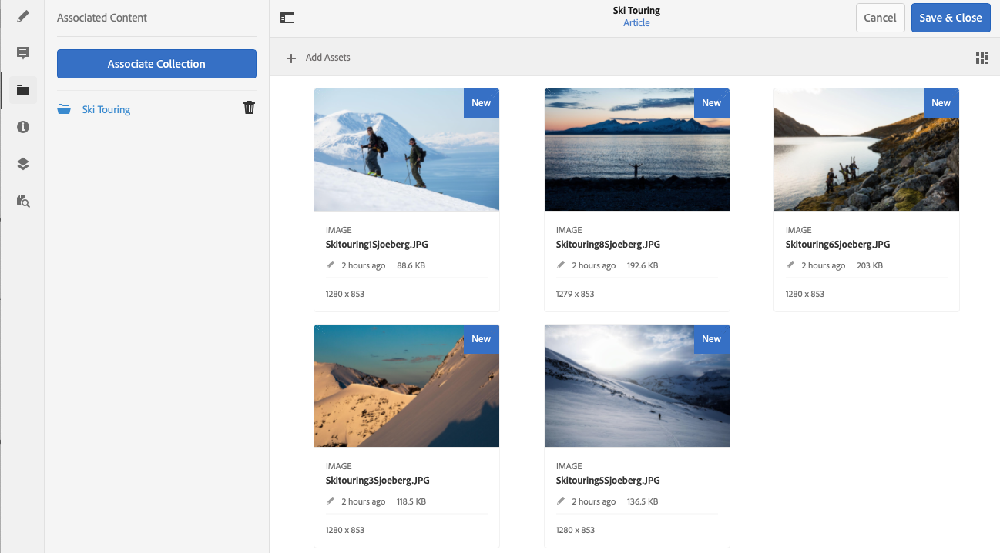

# Associated Content{#associated-content}

AEM's Associated content feature provides the connection so that assets can be optionally used with the fragment when it is added to a content page. This provides flexibility for your headless content delivery by [providing a range of assets to access when using the content fragment on a page,](/help/sites-cloud/authoring/fundamentals/content-fragments.md#using-associated-content) while also helping to reduce the time required to search for the appropriate asset.

## Adding Associated Content {#adding-associated-content}

>[!NOTE]
>
>There are various methods of adding [visual assets (e.g. images)](/help/assets/content-fragments/content-fragments.md#fragments-with-visual-assets) to the fragment and/or page.

To make the association you first need to [add your media asset(s) to a collection](/help/assets/manage-collections.md). After that is done you can:

1. Open your fragment and select **Associated Content** from the side panel.

   

1. Depending on whether any collections have already been associated, or not - select either:

   * **Associate Content** - this will be the first associated collection
   * **Associate Collection** - associated collections already are already configured

1. Select the required collection.

   You can optionally add the fragment itself to the selected collection; this aids tracking.

   

1. Confirm (with **Select**). The collection will be listed as associated.

   

## Editing Associated Content {#editing-associated-content}

Once you have associated a collection you can:

* **Remove** the association.
* **Add Assets** to the collection.
* Select an asset for further action.
* Edit the asset.
