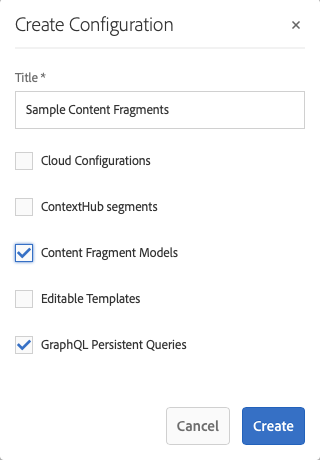
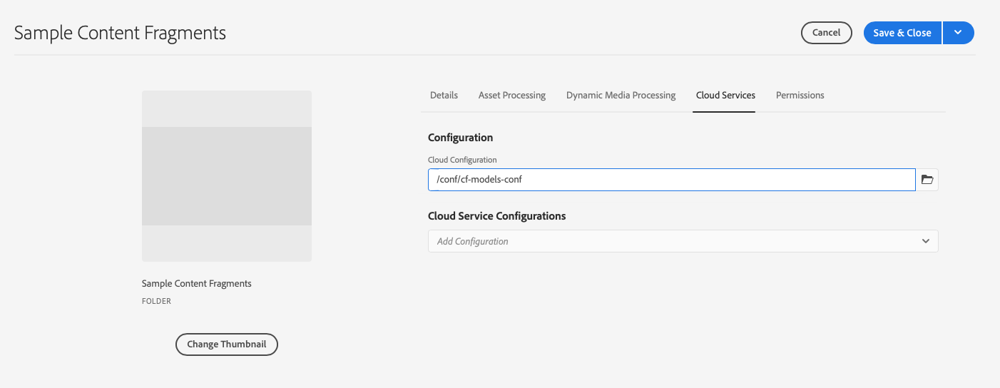

# Content Fragments - Configuration Browser{#content-fragments-configuration-browser}

Learn how to enable certain Content Fragment functionality in the Configuration Browser to use Adobe Experience Manager's (AEM) powerful headless delivery features.

## Enable Content Fragment Functionality for your Instance {#enable-content-fragment-functionality-instance}

Before using Content Fragments, use the **Configuration Browser** to enable the following:

* **Content Fragment Models** - mandatory
* **GraphQL Persistent Queries** - optional

>[!CAUTION]
>
>If you do not enable **Content Fragment Models**:
>
>* the **Create** option will not be available for creating models.
>* you cannot [select the Sites configuration to create the related end-point](/help/sites-developing/headless/graphql-api/graphql-endpoint.md#enabling-graphql-endpoint).

To enable content fragment functionality, you must do the following:

* Enable the use of content fragment functionality by way of the configuration browser
* Apply the configuration to your Assets folder

### Enable Content Fragment Functionality in Configuration Browser {#enable-content-fragment-functionality-in-configuration-browser}

To [use certain Content Fragment functionality](#creating-a-content-fragment-model), you **must** first enable them by way of the **Configuration Browser**:

>[!NOTE]
>
>For more information, see [Configuration Browser:](/help/sites-administering/configurations.md#using-configuration-browser).

1. Navigate to **Tools**, **General**, then open the **Configuration Browser**.

1. Use **Create** to open the dialog, where you:

   1. Specify a **Title**.
   1. To enable their use select 
      * **Content Fragment Models** 
      * **GraphQL Persistent Queries**

      

1. Select **Create** to save the definition.

<!-- 1. Select the location appropriate to your website. -->

### Apply the Configuration to your Assets Folder {#apply-the-configuration-to-your-assets-folder}

When the configuration **global** is enabled for content fragment functionality, then applies to any Assets folder.

To use other configurations (that is, excluding global) with a comparable Assets folder, then you have to define the connection. This is done by selecting the appropriate **Configuration** in the **Cloud Services** tab of the **Folder Properties** of the appropriate folder.

