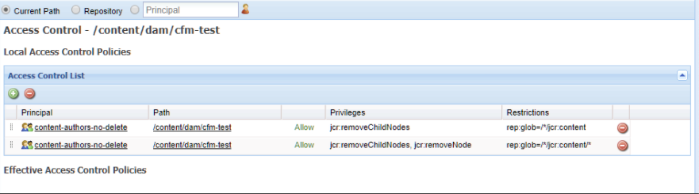

# Content Fragments - Delete Considerations {#content-fragments-delete-considerations}

Review these important considerations before defining your Content Fragments deletion policies in AEM. Content Fragments are a powerful tool for delivering headless content, and the implications of deleting them must be carefully considered.

## Permissions - Delete or Not Delete {#permissions-delete-or-not-delete}

The ability to delete content is powerful, but potentially sensitive, with many industries needing to restrict and control how these privileges are distributed.

In relation to delete permissions, Content Fragments must be considered at two levels:

1. **The Content Fragment as a single entity.**

    * **Use case**: A user who needs to edit/update a content fragment - **and delete an entire fragment**.
    * **Permissions**: The Delete permission can be assigned through User and/or Group Management. <!-- The [Delete](/help/sites-administering/security.md#actions) permission can be [assigned through User and/or Group Management](/help/sites-administering/security.md#managing-permissions). -->

2. **The multiple sub-entities that make up a content fragment; for example, variations, sub-nodes.**

   Basic operation of the content fragment editor requires that such transient sub-elements can be deleted. For example, when manipulating variations; also when editing metadata or managing associated content.

    * **Use case**: A user who needs to edit/update a content fragment - **without being allowed to delete an entire fragment**.
    * **Permissions**: See [Permissions Required for Editor Functionality Only](#permissions-required-for-editor-functionality-only).

>[!NOTE]
>
>When a user does not have any Delete permissions, the Content Fragment editor operates in *read-only* mode. <!-- When a user does not have any [Delete](/help/sites-administering/security.md#actions) permissions, the Content Fragment editor operates in *read-only* mode. -->

>[!NOTE]
>
>See also How to Audit User Management Operations in AEM. <!-- See also [How to Audit User Management Operations in AEM](/help/sites-administering/audit-user-management-operations.md). -->

## Permissions Required for Editor Functionality Only {#permissions-required-for-editor-functionality-only}

For users that need to edit/update a content fragment, **without allowing them to delete an entire fragment**, specific permissions must be assigned, as basic operation of the content fragment editor requires that transient sub-elements can be deleted.

For example, when manipulating variations; also when editing metadata or managing associated content.

>[!NOTE]
>
>The delete permissions, required to edit/update a Content Fragment, are included in the Delete permission assigned through User and/or Group Management. <!-- The delete permissions, required to edit/update a Content Fragment, are included in the Delete permission [assigned through User and/or Group Management](/help/sites-administering/security.md#managing-permissions). -->

The permissions needed to edit/update a fragment need to be applied to either the node containing the content fragment, or an appropriate parent node (at any level under `/content/dam`). When assigned to such a parent node, the permissions will be applied to all nodes within that branch.

For example, a folder that will hold all content fragments, such as:

* `/content/dam/contentfragments`

>[!CAUTION]
>
>Setting the permissions on `/content/dam` is also possible, as all content fragments are stored here.
>
>However this action applies the same delete permissions to *all* other asset types as well.

The permissions prerequisite to allowing a specific user and/or group to edit/update a content fragment are:

>[!NOTE]
>
>This list shows all the privileges required, not just the delete privileges.

* For the Content Fragment nodes or folders:

  * `jcr:addChildNodes`, `jcr:modifyProperties`

* For the `jcr:content`node of all Content Fragments:

  * `jcr:addChildNodes`, `jcr:modifyProperties` and `jcr:removeChildNodes`

* For all nodes below `jcr:content` of all Content Fragments:

  * `jcr:addChildNodes`, `jcr:modifyProperties` and `jcr:removeChildNodes`, `jcr:removeNode`

<!-- There is no CRXDE Lite -->

<!--
These `remove` privileges must be [administered using Access Control Lists, within CRXDE Lite](/help/sites-administering/user-group-ac-admin.md#access-right-management). 

The `add` and `modify` privileges can also be administered in CRXDE Lite, or using the User Management console.

For example, the definition of the `remove` privileges for a group `content-authors-no-delete`:

-->
