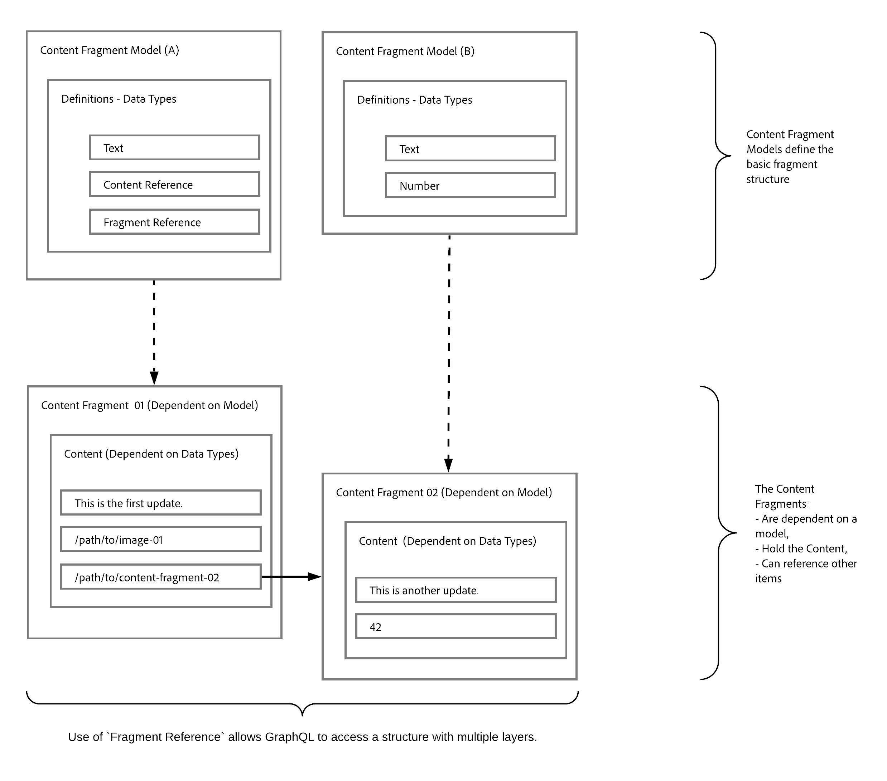

# Headless Content Delivery using Content Fragments with GraphQL {#headless-content-delivery-using-content-fragments-with-graphQL}

With Adobe Experience Manager (AEM), you can use Content Fragments, together with the AEM GraphQL API (a customized implementation, based on standard GraphQL), to headlessly deliver structured content for use in your applications. The ability to customize a single API query allows you to retrieve and deliver the specific content that you want/need to render (as the response to the single API query).

<!--
>[!NOTE]
>
>See [Headless and AEM](/help/implementing/developing/headless/introduction.md) for an introduction to Headless Development for AEM Sites.
-->

>[!NOTE]
>
>GraphQL is currently used in two (separate) scenarios in Adobe Experience Manager (AEM):
>
>* [AEM Commerce consumes data from a commerce platform via GraphQL](/help/commerce/cif/integrating/magento.md).
>* [AEM Content Fragments work together with the AEM GraphQL API (a customized implementation, based on standard GraphQL), to deliver structured content for use in your applications](/help/sites-developing/headless/graphql-api/graphql-api-content-fragments.md).

## Headless CMS {#headless-cms}

A Headless Content Management System (CMS) is:

* "*A headless content management system, or headless CMS, is a back-end only content management system (CMS) built from the ground up as a content repository that makes content accessible via an API for display on any device.*

  See [Wikipedia](https://en.wikipedia.org/wiki/Headless_content_management_system).

In terms of authoring Content Fragments in AEM this means that:

* You can use Content Fragments to author content that is not primarily intended to be directly published (1:1) on formatted pages.

* The content of your Content Fragments will be structured in a predetermined manner - according to the Content Fragment Models. This simplifies access for your applications, which will further process your content. 

## GraphQL - An Overview {#graphql-overview}

GraphQL is:

* "*...a query language for APIs and a runtime for fulfilling those queries with your existing data.*". 

  See [GraphQL.org](https://graphql.org)

The [AEM GraphQL API](#aem-graphql-api) allows you to perform (complex) queries on your [Content Fragments](/help/assets/content-fragments/content-fragments.md); with each query being according to a specific model type. The content returned can then be used by your applications. 

## AEM GraphQL API {#aem-graphql-api}

For Adobe Experience, a customized implementation of the standard GraphQL API has been developed. See [AEM GraphQL API for use with Content Fragments](/help/sites-developing/headless/graphql-api/graphql-api-content-fragments.md) for details. 

The AEM GraphQL API implementation is based on the [GraphQL Java libraries](https://graphql.org/code/#java).

## Content Fragments for use with the AEM GraphQL API {#content-fragments-use-with-aem-graphql-api}

[Content Fragments](#content-fragments) can be used as a basis for GraphQL for AEM queries as:

* They enable you to design, create, curate and publish page-independent content.
* The [Content Fragment Models](#content-fragments-models) provide the required structure by means of defined data types.
* The [Fragment Reference](#fragment-references), available when defining a model, can be used to define additional layers of structure.

### Content Fragments {#content-fragments}

Content Fragments:

* Contain structured content.

* They are based on a [Content Fragment Model](#content-fragments-models), which predefines the structure for the resulting fragment.
  
### Content Fragment Models {#content-fragments-models}

These [Content Fragment Models](/help/assets/content-fragments/content-fragments-models.md):

* Are used to generate the [Schemas](https://graphql.org/learn/schema/), once **Enabled**.

* Provide the data types and fields required for GraphQL. They ensure that your application only requests what is possible, and receives what is expected.

* The data type **[Fragment References](#fragment-references)** can be used in your model to reference another Content Fragment, and so introduce additional levels of structure.

### Fragment References {#fragment-references}

The **[Fragment Reference](/help/assets/content-fragments/content-fragments-models.md#fragment-reference-nested-fragments)**:

* Is of particular interest in conjunction with GraphQL.

* Is a specific data type that can be used when defining a Content Fragment Model.

* References another fragment, dependent on a specific Content Fragment Model.

* Allows you to retrieve structured data.

  * When defined as a **multifeed**, multiple sub-fragments can be referenced (retrieved) by the prime fragment.

### JSON Preview {#json-preview}

To help with designing and developing your Content Fragment Models, you can preview [JSON output](/help/assets/content-fragments/content-fragments-json-preview.md).

## Learning to use GraphQL with AEM - Sample Content and Queries {#learn-graphql-with-aem-sample-content-queries}

See [Learning to use GraphQL with AEM - Sample Content and Queries](/help/sites-developing/headless/graphql-api/content-fragments-graphql-samples.md) for an introduction to using the AEM GraphQL API.

## Tutorial - Getting Started with AEM Headless and GraphQL

Looking for a hands-on tutorial? Check out [Getting Started with AEM Headless and GraphQL](https://experienceleague.adobe.com/docs/experience-manager-learn/getting-started-with-aem-headless/graphql/overview.html) end-to-end tutorial illustrating how to build-out and expose content using AEM’s GraphQL APIs and consumed by an external app, in a headless CMS scenario.
