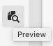
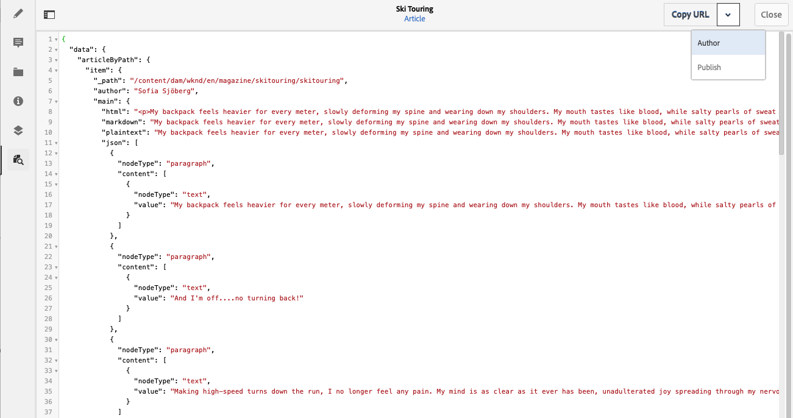

# Preview - JSON Representation {#preview-json-representation}

When developing the models for Content Fragments as part of your AEM headless implementation, you might want to view sample JSON output for a content fragment, as based on a model. For example, to get an idea of how the final output will look. This could be helpful when validating the model JSON structure, maybe with default sample content per data type.

Using the **Preview** icon:

You can view the JSON representation of the current fragment. For example:

