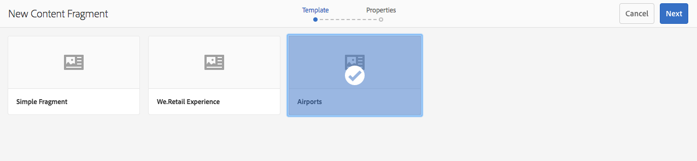
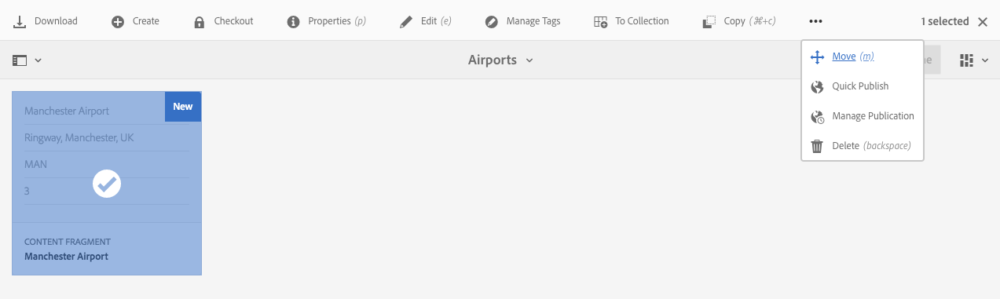
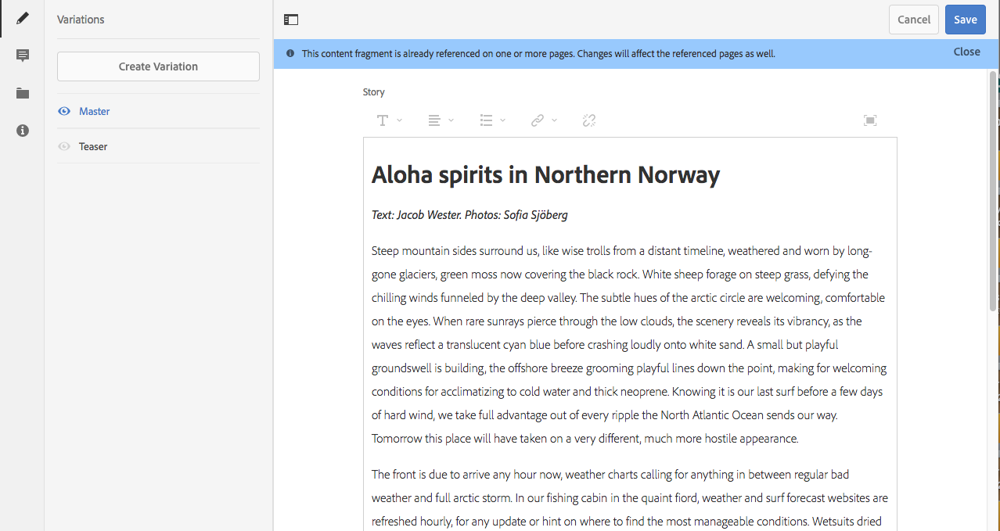
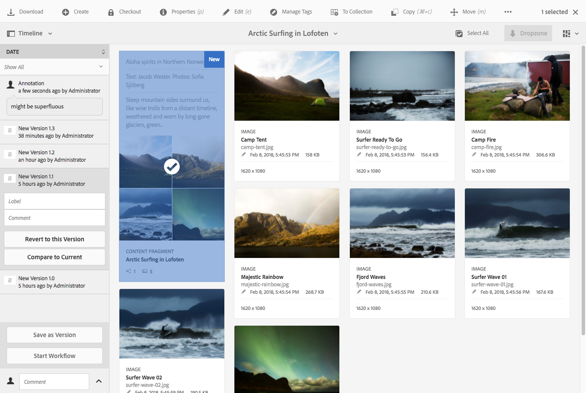
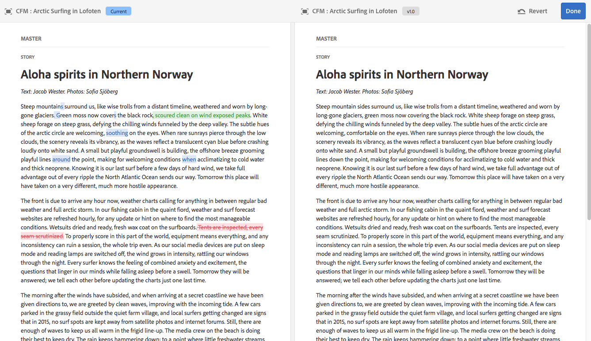

# Managing Content Fragments{#managing-content-fragments}

Content Fragments are stored as **Assets**, so are primarily managed from the **Assets** console.

>[!NOTE]
>
>Content fragments are then used with authoring pages; see [Page Authoring with Content Fragments](/help/sites-authoring/content-fragments.md).

## Creating Content Fragments {#creating-content-fragments}

### Creating a Content Model {#creating-a-content-model}

[Content fragment models](/help/assets/content-fragments/content-fragments-models.md) can be enabled and created, prior to creating content fragments with structured content.

>[!NOTE]
>
>See [Developing Content Fragments](/help/sites-developing/customizing-content-fragments.md) for further information on templates; used for simple content fragments.

### Creating a Content Fragment {#creating-a-content-fragment}

The method of creating a content fragment is (basically) the same for both simple and structured fragments:

1. Navigate to the **Assets** folder where you want to create the fragment.
1. Select **Create**, then **Content Fragment** to open the wizard.
1. The first step of the wizard requires you to specify the basis of the new fragment.

    * This can be a:

        * [Template](/help/sites-developing/content-fragment-templates.md) - for example **Simple Fragment**

        * [Model](/help/assets/content-fragments/content-fragments-models.md) - used to create a fragment that requires structured content; for example the **Airport** model

    * All available templates and models are displayed.

   After selection, use **Next** to proceed.

   

1. In the **Properties** step specify:

    * **Basic**

        * **Title**
  
          The fragment title.

          Mandatory.

        * **Description**

        * **Tags**

    * **Advanced**

        * **Name**

          The name; will be used to form the URL.

          Mandatory; will be automatically derived from the title, but can be updated.

1. Select **Create** to complete the action, then either **Open** the fragment for editing or return to the console with **Done**.

## Actions for a Content Fragment {#actions-for-a-content-fragment}

In the **Assets** console a range of actions are available for your content fragments, either:

* From the toolbar; after selection of your fragment all appropriate actions are available.
* As [quick actions](/help/sites-authoring/basic-handling.md#quick-actions); a subset of actions available for the individual fragment cards.

Select the fragment to reveal the toolbar with applicable actions:

* **Download**

    * Save the fragment as a ZIP file; you can define whether to include Elements, Variations, Metadata.

* **Create**
* **Checkout**
* **Properties**

    * Allows you to view and/or edit the fragment's metadata.

* **Edit**

    * Allows you to [open the fragment for editing content](/help/assets/content-fragments/content-fragments-variations.md) together with its elements, variations, associated content and metadata.

* **Manage Tags**
* **To Collection**

    * Add the fragment to a collection.
    * This can also be done when [associating a collection with the fragment](/help/assets/content-fragments/content-fragments-assoc-content.md#adding-associated-content).

* **Copy**/**Paste**

* **Move**
* **Quick Publish**
* **Manage Publication**
* **Delete**

>[!NOTE]
>
>Many of these are [standard actions for Assets](/help/assets/manage-assets.md) and/or the [AEM desktop app](https://docs.adobe.com/content/help/en/experience-manager-desktop-app/using/using.html).

## Opening the Fragment Editor {#opening-the-fragment-editor}

To open your fragment for editing:

>[!CAUTION]
>
>To edit a content fragment you need [the appropriate permissions](/help/sites-developing/customizing-content-fragments.md#asset-permissions). Please contact your system administrator if you are experiencing issues.

1. Use the **Assets** console to navigate to the location of your content fragment.
1. Open the fragment for editing, by either:

    * Clicking/tapping on the fragment or fragment link (this is dependent on the console view).
    * Selecting the fragment, then **Edit** from the toolbar.

   The fragment editor will open:

   

   >[!NOTE]
   >
   >1. A message will be shown when the fragment is already referenced on a content page.
   >2. The side panel can be hidden/shown using the **Toggle Side Panel** icon.

1. Navigate through the three modes using the icons in the side panel:

    * Variations: [Editing the content](#editing-the-content-of-your-fragment) and [Managing your Variations](#creating-and-managing-variations-within-your-fragment)

    * [Annotations](/help/assets/content-fragments/content-fragments-variations.md#annotating-a-content-fragment)
    * [Associated Content](#associating-content-with-your-fragment)
    * [Metadata](#viewing-and-editing-the-metadata-properties-of-your-fragment)

   

1. After making changes, use **Save** or **Cancel** as required.

   >[!NOTE]
   >
   >Both **Save** and **Cancel** will exit the editor - see [Save, Cancel and Versions](#save-cancel-and-versions) for full information on how both options operate for content fragments.

## Save, Cancel and Versions {#save-cancel-and-versions}

>[!NOTE]
>
>Versions can also be [created, compared and reverted from the Timeline](/help/assets/content-fragments/content-fragments-managing.md#timeline-for-content-fragments).

The editor has two options:

* **Save**

  Will save the latest changes and exit the editor.

  >[!CAUTION]
  >
  >To edit a content fragment you need [the appropriate permissions](/help/sites-developing/customizing-content-fragments.md#asset-permissions). Please contact your system administrator if you are experiencing issues.

  >[!NOTE]
  >
  >It is possible to remain in the editor, making a series of changes, before selecting **Save**.

  >[!CAUTION]
  >
  >In addition to simply saving your changes, **Save** also updates any references and ensures that the dispatcher is flushed as required. These changes can take time to process. Due to this, there can be a performance impact on a large/complex/heavily-loaded system.
  >
  >
  >Please bear this in mind when using **Save** and then quickly re-entering the fragment editor to make and save further changes.

* **Cancel**

  Will exit the editor without saving the latest changes.

While editing your content fragment AEM automatically creates versions to ensure that prior content can be restored if you **Cancel** your changes:

1. When a content fragment is opened for editing AEM checks for the existence of the cookie-based token that indicates whether an *editing session* exists:

    1. If the token is found, the fragment is considered to be part of the existing editing session.
    2. If the token is *not* available and the user starts editing content, a version is created and a token for this new editing session is sent to the client, where it is saved in a cookie.

2. While there is an *active* editing session, the content being edited is automatically saved every 600 seconds (default).

   >[!NOTE]
   >
   >The auto save interval is configurable using the `/conf` mechanism.
   >
   >
   >Default value, see:
   >
   >
   >`/libs/settings/dam/cfm/jcr:content/autoSaveInterval`

3. If the user selects to **Cancel** the edit, the version created at the start of the editing session is restored and the token is removed to end the editing session.
4. If the user selects to **Save** the edits, the updated elements/variations are persisted and the token is removed to end the editing session.

## Editing the Content of your Fragment {#editing-the-content-of-your-fragment}

Once you have opened your fragment, you can use the [Variations](/help/assets/content-fragments/content-fragments-variations.md) tab to author your content.

## Creating and Managing Variations within your Fragment {#creating-and-managing-variations-within-your-fragment}

Once you have created the Master content, you can create, and manage, [Variations](/help/assets/content-fragments/content-fragments-variations.md) of that content.

## Associating Content with your Fragment {#associating-content-with-your-fragment}

You can also [associate content](/help/assets/content-fragments/content-fragments-assoc-content.md) with a fragment. This provides a connection so that assets (i.e. images) can be (optionally) used with the fragment when it is added to a content page.

## Viewing and Editing the Metadata (Properties) of your Fragment {#viewing-and-editing-the-metadata-properties-of-your-fragment}

You can view, and edit, the properties of a fragment using the [Metadata](/help/assets/content-fragments/content-fragments-metadata.md) tab.

## Timeline for Content Fragments {#timeline-for-content-fragments}

In addition to the standard options, [Timeline](/help/assets/manage-assets.md#timeline) provides both information and actions specific to content fragments:

* View information about versions, comments, and annotations
* Actions for Versions

    * **[Revert to this Version](#reverting-to-a-version)** (select an existing fragment, then a specific version)

    * **[Compare to Current](#comparing-fragment-versions)** (select an existing fragment, then a specific version)

    * Add a **Label** and/or **Comment** (select an existing fragment, then a specific version)

    * **Save as Version** (select an existing fragment, then the up arrow at the bottom of Timeline)

* Actions for Annotations

    * **Delete**

>[!NOTE]
>
>Comments are:
>
>* Standard functionality for all assets
>* Made in Timeline
>* Related to the fragment asset
>
>Annotations (for Content Fragments) are:  
>
>* Entered in the fragment editor
>* Specific to a selected segment of text within the fragment
>

For example:

## Comparing Fragment Versions {#comparing-fragment-versions}

The **Compare to Current** action is available from the [Timeline](/help/assets/content-fragments/content-fragments-managing.md#timeline-for-content-fragments) after you have selected a specific version.

This will open:

* the **Current** (latest) version (left)

* the selected version **v&lt;*x.y*&gt;** (right)

They will be shown side-by-side, where:

* Any differences are highlighted

    * Deleted text - red
    * Inserted text - green
    * Replaced text - blue

* The full-screen icon allows you to open either version on its own; then toggle back to the parallel view
* You can **Revert** to the specific version
* **Done** will return you to the console

>[!NOTE]
>
>You cannot edit the fragment content when comparing fragments.

## Reverting to a Version  {#reverting-to-a-version}

You can revert to a specific version of your fragment:

* Directly from the [Timeline](/help/assets/content-fragments/content-fragments-managing.md#timeline-for-content-fragments).

  Select the required version, then the **Revert to this Version** action.

* While [comparing a version to the current version](/help/assets/content-fragments/content-fragments-managing.md#comparing-fragment-versions) you can **Revert** to the selected version.

## Publishing and Referencing a Fragment {#publishing-and-referencing-a-fragment}

>[!CAUTION]
>
>If your fragment is based on a model, then you should ensure that the [model has been published](/help/assets/content-fragments/content-fragments-models.md#publishing-a-content-fragment-model).
>
>If you publish a content fragment for which the model has not yet been published, a selection list will indicate this and the model will be published with the fragment.

Content Fragments must be published for use in the publish enviroment. They can be published:

* After creation; from the **Assets** console.
* When you [publish a page that uses the fragment](/help/sites-authoring/content-fragments.md#publishing); the fragment will be listed in the page references.

>[!CAUTION]
>
>After a fragment has been published and/or referenced, AEM will display a warning when an author opens the fragment for editing again. This is to warn that changes to the fragment will affect the referenced pages as well.

## Deleting a Fragment {#deleting-a-fragment}

To delete a fragment:

1. In the **Assets** console navigate to the location of the content fragment.
2. Select the fragment.

   >[!NOTE]
   >
   >The **Delete** action is not available as a quick action.

3. Select **Delete** from the toolbar.
4. Confirm the **Delete** action.

   >[!CAUTION]
   >
   >If the fragment is already referenced in a page you will then see a warning message and be required to confirm that you want to proceed with a **Force Delete**. The fragment, together with its content fragment component, will be deleted from any content pages.
