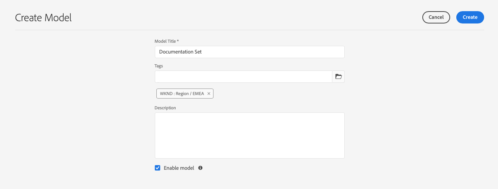
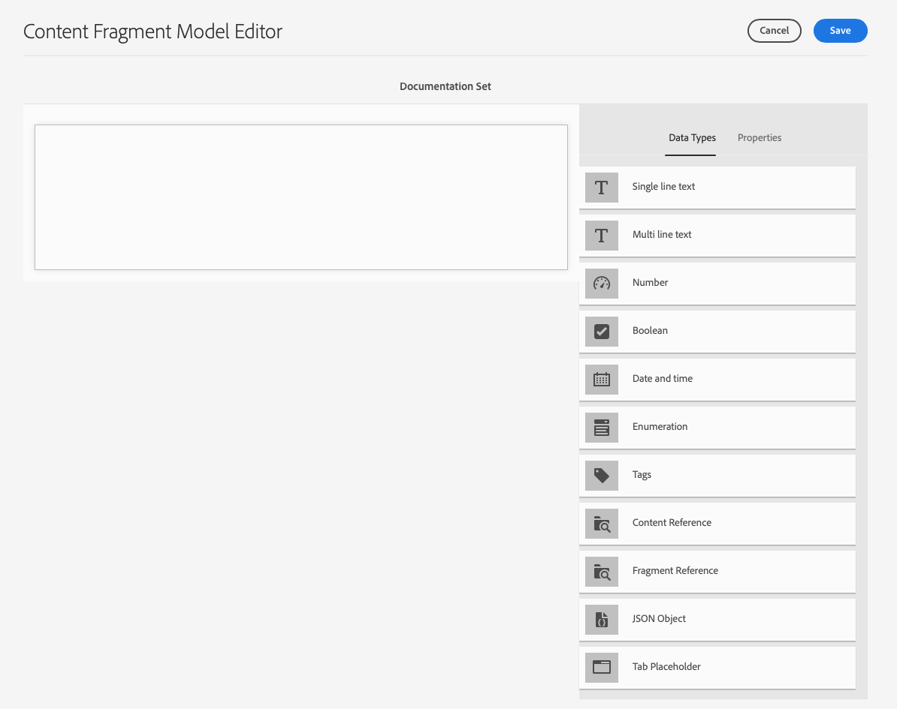
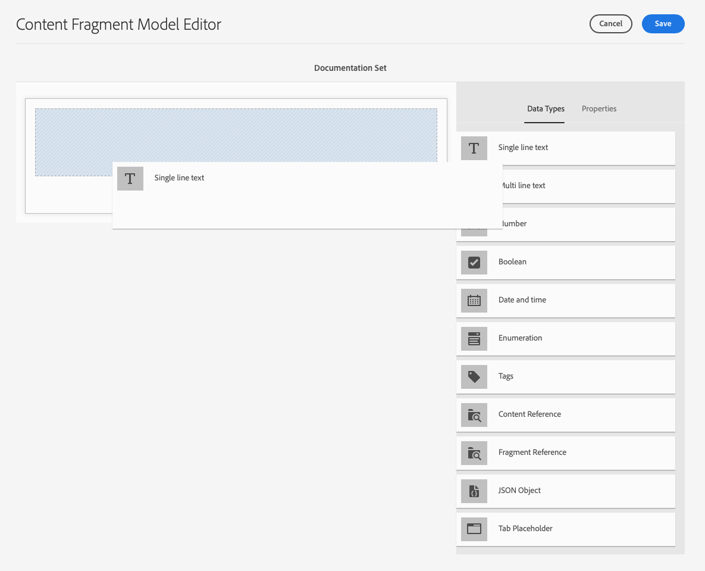
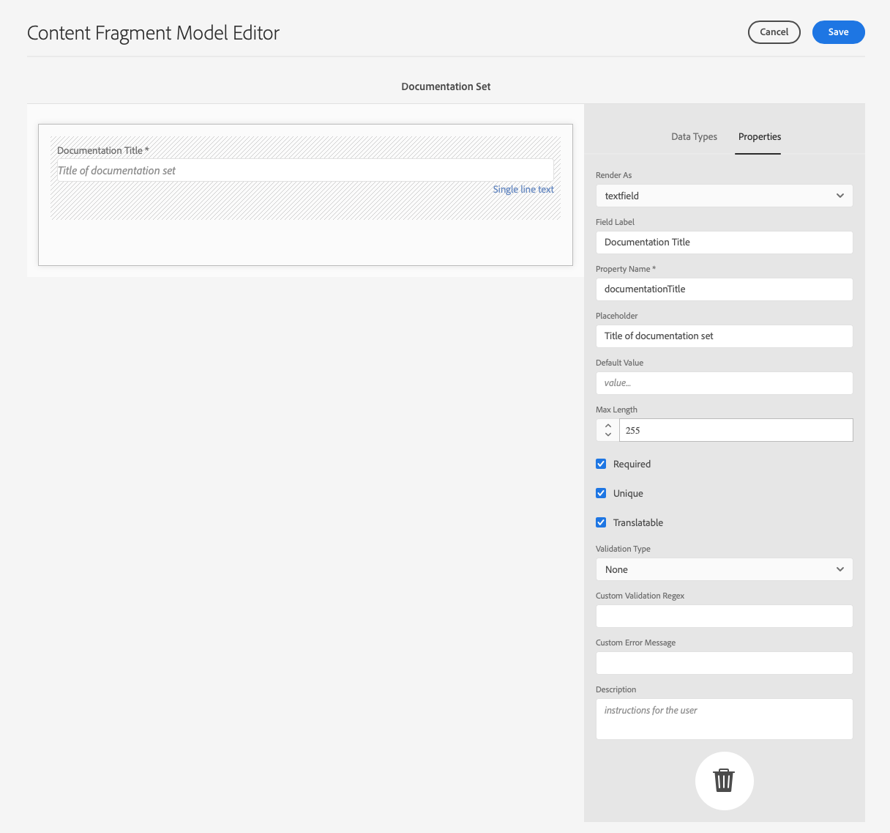
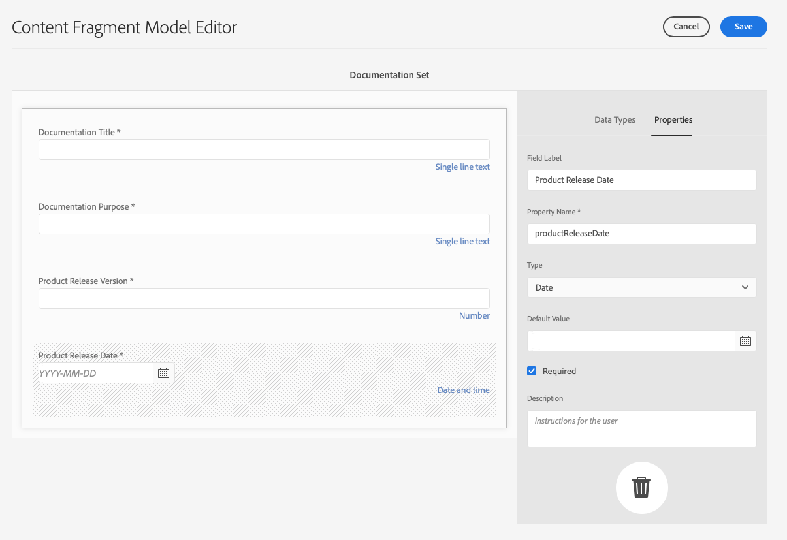
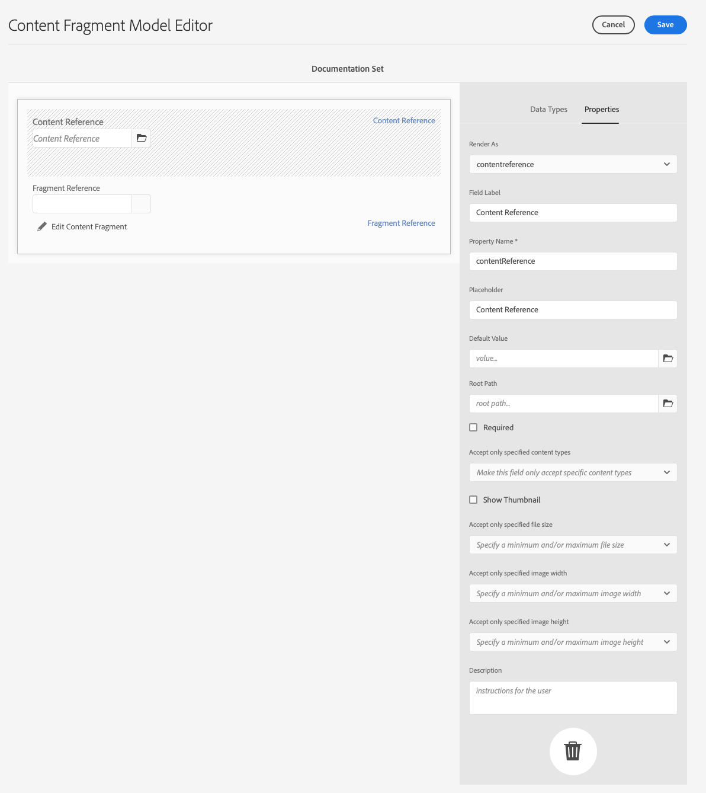
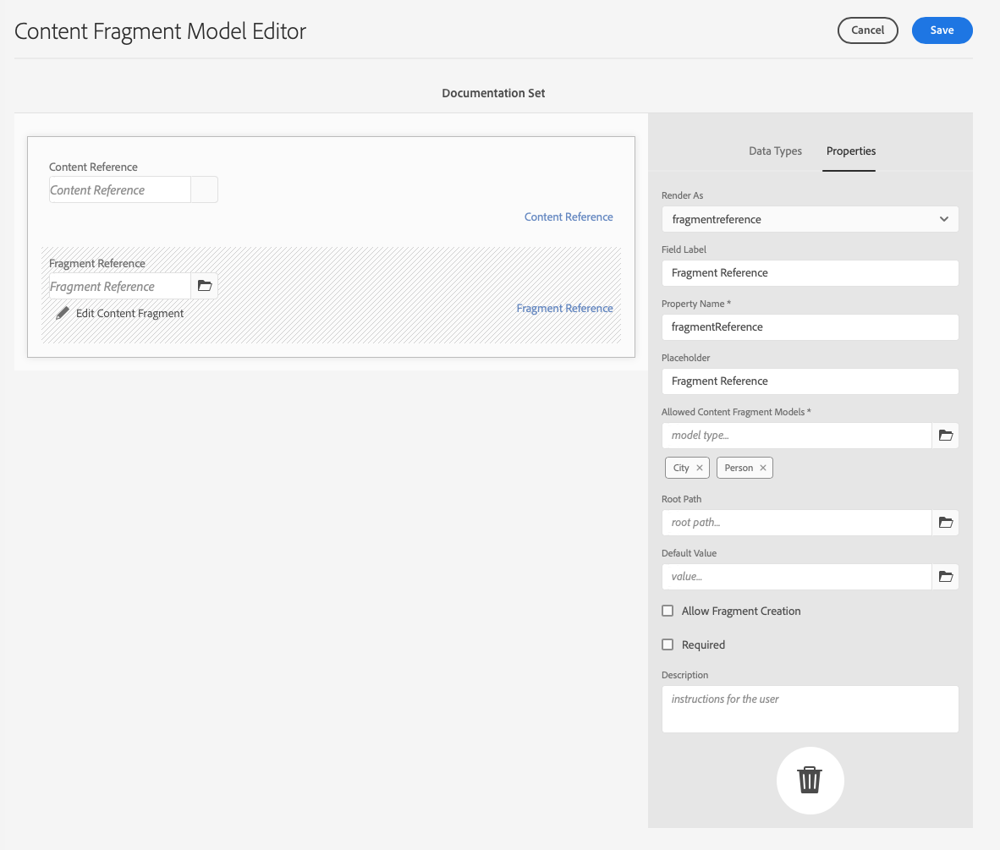
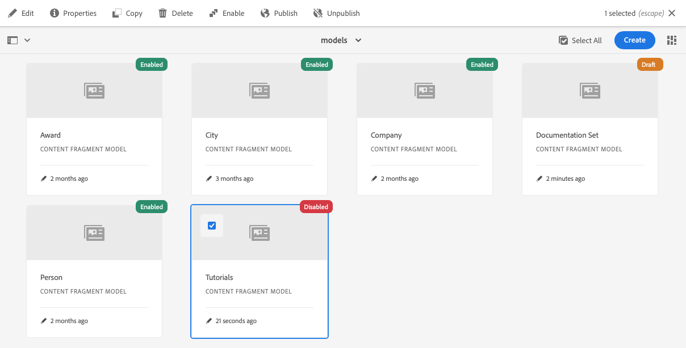
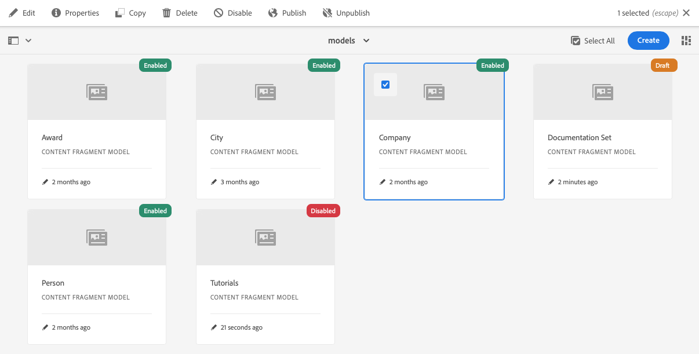
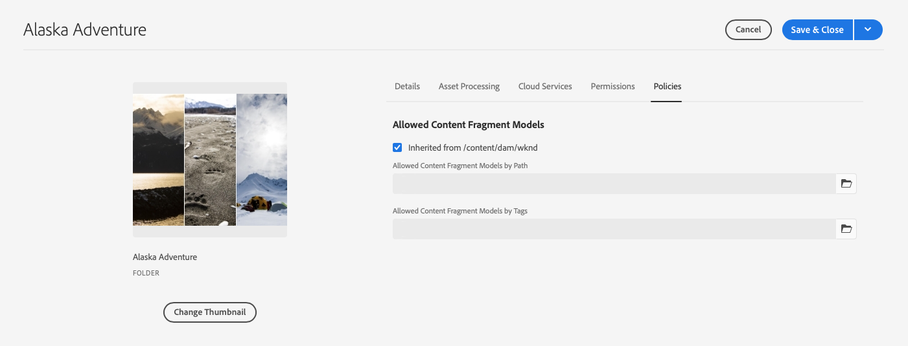

# Content Fragment Models {#content-fragment-models}

Content Fragment Models in AEM define the structure of content for your [content fragments,](/help/assets/content-fragments/content-fragments.md) serving as a foundation of your headless content.

To use Content Fragment Models, you can:

1. [Enable Content Fragment Model functionality for your instance](/help/assets/content-fragments/content-fragments-configuration-browser.md).
1. [Create](#creating-a-content-fragment-model), and [configure](#defining-your-content-fragment-model), your Content Fragment Models.
1. [Enable your Content Fragment Models](#enabling-disabling-a-content-fragment-model) for use when creating Content Fragments. 
1. [Allow your Content Fragment Models on the required Assets folders](#allowing-content-fragment-models-assets-folder) by configuring **Policies**.

>[!NOTE]
>
>Be aware of the [Best Practices](/help/assets/content-fragments/content-fragments.md#best-practices) when working with your Content Fragment Models and Content Fragments.

## Creating a Content Fragment Model {#creating-a-content-fragment-model}

1. Navigate to **Tools**, **Assets**, then open **Content Fragment Models**.
1. Navigate to the folder appropriate to your [configuration](/help/assets/content-fragments/content-fragments-configuration-browser.md).
1. Use **Create** to open the wizard.

   >[!CAUTION]
   >
   >If the [use of content fragment models have not been enabled](/help/assets/content-fragments/content-fragments-configuration-browser.md), the **Create** option is not available.

1. Specify the **Model Title**. You can also add **Tags**, a **Description**, and select **Enable model** to [enable the model](#enabling-disabling-a-content-fragment-model) if necessary.

   

1. Use **Create** to save the empty model. A message indicates the success of the action, you can select **Open** to immediately edit the model, or **Done** to return to the console.

## Defining your Content Fragment Model {#defining-your-content-fragment-model}

The content fragment model effectively defines the structure of the resulting content fragments using a selection of **[Data Types](#data-types)**. Using the model editor you can add instances of the data types, then configure them to create the required fields:

>[!CAUTION]
>
>Editing an existing content fragment model can impact dependent fragments.

1. Navigate to **Tools**, **Assets**, then open **Content Fragment Models**.

1. Navigate to the folder holding your content fragment model.

1. Open the required model for **Edit**; use either the quick action, or select the model and then the action from the toolbar.

   Once open the model editor shows:

    * left: fields already defined
    * right: **Data Types** available for creating fields (and **Properties** for use once fields have been created)

   >[!NOTE]
   >
   >When a field as **Required**, the **Label** indicated in the left pane is marked with an asterix (**&#42;**).

   

1. **To Add a Field**

   * Drag a required data type to the required location for a field:

     

   * Once a field has been added to the model, the right panel shows the **Properties** that can be defined for that particular data type. Here you can define what is required for that field. 

     * Many properties are self-explanatory, for additional details see [Properties](#properties).
     * Typing a **Field Label** auto-completes the **Property Name**  - if empty, and it can be manually updated afterwards.

       >[!CAUTION]
       >
       >When manually updating the property **Property Name** for a data type, names must contain only A-Z, a-z, 0-9, and the underscore "_" as a special character.
       >
       >If models created in earlier versions of AEM contain illegal characters, remove or update those characters.

     For example:

     

1. **To Remove a Field**

   Select the required field, then click the trash-can icon. You are asked to confirm the action.

   

1. Add all the required fields, and define the related properties, as required. For example:

   

1. Select **Save** to persist the definition.

## Data Types {#data-types}

A selection of data types is available for defining your model:

* **Single line text**
  * Add one, or more, fields of a single line of text; the maximum length can be defined
* **Multi line text**
  * A text area that can be Rich Text, Plain Text, or Markdown

    >[!NOTE]
    >
    >For performance reasons it is not recommended to have more than ten Rich Text fields in one model. 
    >
    >If needed, it is recommended that you use [nested Content Fragments](#fragment-reference-nested-fragments).

* **Number**
  * Add one, or more, numerical fields
* **Boolean**
  * Add a boolean checkbox
* **Date and time**
  * Add a date and/or time
* **Enumeration**
  * Add a set of checkboxes, radio buttons, or drop-down fields
* **Tags**
  * Allows fragment authors to access and select areas of tags
* **Content Reference**
  * References other content, of any type; can be used to [create nested content](#using-references-to-form-nested-content)
  * If an image is referenced, you can opt to show a thumbnail
* **Fragment Reference**
  * References other content fragments; can be used to [create nested content](#using-references-to-form-nested-content)
  * The data type can be configured to allow fragment authors to:
    * Edit the referenced fragment directly.
    * Create a content fragment, based on the appropriate model  
* **JSON Object**
  * Allows the content fragment author to enter JSON syntax into the corresponding elements of a fragment. 
    * To allow AEM to store direct JSON that you have copied and pasted from another service.
    * The JSON is passed through, and output as JSON in GraphQL.
    * Includes JSON syntax-highlighting, auto-complete, and error-highlighting in the content fragment editor.
* **Tab Placeholder**
  * Allows the introduction of tabs for use when editing the Content Fragment content.
    This is shown as a divider in the model editor, separating sections of the list of content data types. Each instance represents the start of a new tab.
    In the fragment editor, each instance appears as a tab.

    >[!NOTE]
    >
    >This data type is purely used for formatting, it is ignored by the AEM GraphQL schema.

## Properties {#properties}

Many properties are self-explanatory, for certain properties additional details are below:


* **Property Name**

  When manually updating this property for a data type, the names **must** contain *only* A-Z, a-z, 0-9, and the underscore "_" as a special character.

  >[!CAUTION]
  >
  >If models created in earlier versions of AEM contain illegal characters, remove or update those characters.

* **Render As**
  The various options for realizing/rendering the field in a fragment. Often, this lets you define whether the author sees a single instance of the field, or is allowed to create multiple instances.

* **Field Label**
  Entering a **Field Label** autogenerates a **Property Name**, which can then be manually updated, if necessary.

* **Validation**
  Basic validation is available by mechanisms such as the **Required** property. Some data types have additional validation fields. See [Validation](#validation) for further details.

* For the data type **Multi line text** it is possible to define the **Default Type** as either:

  * **Rich Text**
  * **Markdown**
  * **Plain Text**

  If not specified, the default value **Rich Text** is used for this field.

  Changing the **Default Type** in a content fragment model only takes effect on an existing, related, content fragment after that fragment is opened in the editor and saved.

* **Unique**
  Content (for the specific field) must be unique across all content fragments created from the current model. 

  This is used to ensure that content authors cannot repeat content already added in another fragment of the same model. 

  For example, a **Single line text** field called `Country` in the Content Fragment Model cannot have the value `Japan` in two dependent Content Fragments. A warning is issued when the second instance is attempted.

  >[!NOTE]
  >
  >Uniqueness is ensured per language root. 

  >[!NOTE]
  >
  >Variations can have the same *unique* value as variations of the same fragment, but not the same value as used in any variation of other fragments.

* See **[Content Reference](#content-reference)** for more details about that specific data type and its properties.

* See **[Fragment Reference (Nested Fragments)](#fragment-reference-nested-fragments)** for more details about that specific data type and its properties.

<!--
* **Translatable**
  Checking the **Translatable** checkbox on a field in the Content Fragment Model editor does the following:

  * Ensures that the field's property name is added to the translation configuration, context `/content/dam/<sites-configuration>`, if not already present. 
  * For GraphQL: sets a `<translatable>` property on the Content Fragment field to `yes`, to allow GraphQL query filter for JSON output with only translatable content.
-->

## Validation {#validation}

Various data types now include the possibility to define validation requirements for when content is entered in the resulting fragment:

* **Single line text**
  * Compare against a predefined regex.
* **Number**
  * Check for specific values.
* **Content Reference**
  * Test for specific types of content.
  * Only assets of specified file size or smaller can be referenced. 
  * Only images within a predefined range of width and/or height (in pixels) can be referenced. 
* **Fragment Reference**
  * Test for a specific content fragment model.

## Using References to form Nested Content {#using-references-to-form-nested-content}

Content Fragments can form nested content, using either of the following data types:

* **[Content Reference](#content-reference)**
  * Provides a simple reference to other content; of any type.
  * It can be configured for one reference or multiple references (in the resulting fragment).

* **[Fragment Reference](#fragment-reference-nested-fragments)** (Nested Fragments)
  * References other fragments, dependent on the specific models specified.
  * Lets you include/retrieve structured data.

    >[!NOTE]
    >
    >This method is of particular interest with [Headless Content Delivery using Content Fragments with GraphQL](/help/assets/content-fragments/content-fragments-graphql.md).
  * It can be configured for one reference or multiple references (in the resulting fragment).

>[!NOTE]
>
>AEM has a recurrence protection for:
>
>* Content References
>  This prevents the user from adding a reference to the current fragment. This may lead to an empty Fragment Reference picker dialog.
>
>* Fragment References in GraphQL 
>  If you create a deep query that returns multiple Content Fragments referenced by each other, it returns null at first occurrence.

### Content Reference {#content-reference}

The Content Reference lets you render content from another source; for example, an image or content fragment.

In addition to standard properties you can specify:

* The **Root Path** for any referenced content
* The content types that can be referenced
* Limitations for file sizes
* If an image is referenced:
  * Show Thumbnail
  * Image restraints of height and width



### Fragment Reference (Nested Fragments) {#fragment-reference-nested-fragments}

The Fragment Reference references one, or more, content fragments. This feature is of particular interest when retrieving content for use in your app, because it lets you retrieve structured data with multiple layers.

For example:

* A model defining details for an employee; these include:
  * A reference to the model that defines the employer (company)

```xml
type EmployeeModel {
    name: String
    firstName: String
    company: CompanyModel
}

type CompanyModel {
    name: String
    street: String
    city: String
}
```

>[!NOTE]
>
>This is of particular interest with [Headless Content Delivery using Content Fragments with GraphQL](/help/assets/content-fragments/content-fragments-graphql.md).

In addition to standard properties you can define:

* **Render As**:

  * **multifield** - the fragment author can create multiple, individual, references

  * **fragmentreference** - allows the fragment author to select a single reference to a fragment

* **Model Type**
  Multiple models can be selected. When authoring the Content Fragment, any referenced fragments must have been created using these models.

* **Root Path**
  This specifies a root path for any fragments referenced.

* **Allow Fragment Creation**

  This allows the fragment author to create a fragment based on the appropriate model.

  * **fragmentreferencecomposite** - allows the fragment author to build a composite, by selecting multiple fragments

  

>[!NOTE]
>
>A recurrence protection mechanism is in place. It prohibits the user from selecting the current Content Fragment in the Fragment Reference. This may lead to an empty Fragment Reference picker dialog.
>
>There is also a recurrence protection for Fragment References in GraphQL. If you create a deep query across two Content Fragments that reference each other, it returns null.

## Enabling or Disabling a Content Fragment Model {#enabling-disabling-a-content-fragment-model}

For full control over the use of your Content Fragment Models, they have a status that you can set.

### Enabling a Content Fragment Model {#enabling-a-content-fragment-model}

Once a model is created, it must be enabled so that:

* It is available for selection when creating a Content Fragment.
* It can be referenced from within a Content Fragment Model.
* It is available to GraphQL; so the schema is generated.

To enable a Model that is flagged as either:

* **Draft** : mew (never enabled).
* **Disabled** : has been disabled.

You can use the **Enable** option from either:

* The top toolbar, when the required Model is selected.
* The corresponding Quick Action (mouse-over the required Model).



### Disabling a Content Fragment Model {#disabling-a-content-fragment-model}

A model can also be disabled so that:

* The model is no longer available as a basis for creating *new* Content Fragments.
* However:
  * The GraphQL schema keeps being generated and is still queryable (to avoid impacting the JSON API).
  * Any Content Fragments based of the model can still be queried and returned from the GraphQL endpoint.
* The model cannot be referenced anymore, but existing references are kept untouched, and can still be queried and returned from the GraphQL endpoint.

To disable a Model that is flagged as **Enabled**, you use the **Disable** option from either:

* The top toolbar, when the required Model is selected.
* The corresponding Quick Action (mouse-over the required Model).



## Allowing Content Fragment Models on your Assets Folder {#allowing-content-fragment-models-assets-folder}

To implement content governance, you can configure **Policies** on an Assets folder to control which Content Fragment Models are allowed for Fragment creation in that folder. 

>[!NOTE]
>
>The mechanism is similar to [allowing page templates](/help/sites-authoring/templates.md#allowing-a-template-author) for a page, and its children, in advanced properties of a page. 

To configure the **Policies** for **Allowed Content Fragment Models**:

1. Navigate and open **Properties** for the required Assets folder.

1. Open the **Policies** tab, where you can configure:

   * **Inherited from `<folder>`**

     Policies are automatically inherited when creating child folders; the policy can be reconfigured (and the inheritance broken) if sub-folders need to allow models different to the parent folder. 

   * **Allowed Content Fragment Models by Path**

     Multiple models can be allowed.

   * **Allowed Content Fragment Models by Tag**

     Multiple models can be allowed.

   

1. **Save** any changes.

The Content Fragment Models allowed for a folder are resolved as follows:

* The **Policies** for **Allowed Content Fragment Models**.
* If empty, then try to determine the policy using the inheritance rules.
* If the inheritance chain does not deliver a result, then look at the **Cloud Services** configuration for that folder (also first directly and then via inheritance).
* If none of the above deliver any results, then there are no allowed models for that folder.

## Deleting a Content Fragment Model {#deleting-a-content-fragment-model}

>[!CAUTION]
>
>Deleting a content fragment model can impact dependent fragments.

To delete a content fragment model:

1. Navigate to **Tools**, **Assets**, then open **Content Fragment Models**.

1. Navigate to the folder holding your content fragment model.
1. Select your model, followed by **Delete** from the toolbar.

   >[!NOTE]
   >
   >If the model is referenced, a warning is given. Take appropriate action.

## Publishing a Content Fragment Model {#publishing-a-content-fragment-model}

Content fragment models must be published when/before any dependent content fragments are published.

To publish a content fragment model:

1. Navigate to **Tools**, **Assets**, then open **Content Fragment Models**.

1. Navigate to the folder holding your content fragment model.
1. Select your model, followed by **Publish** from the toolbar.
   The published status is indicated in the console. 

   >[!NOTE]
   >
   >If you publish a content fragment for which the model has not yet been published, a selection list indicates this and the model is published with the fragment.

## Unpublishing a Content Fragment Model {#unpublishing-a-content-fragment-model}

Content fragment models can be unpublished if they are not referenced by any fragments.

To unpublish a content fragment model:

1. Navigate to **Tools**, **Assets**, then open **Content Fragment Models**.

1. Navigate to the folder holding your content fragment model.
1. Select your model, followed by **Unpublish** from the toolbar.
   The published status is indicated in the console. 

## Content Fragment Model - Properties {#content-fragment-model-properties}

You can edit the **Properties** of a Content Fragment Model:

* **Basic**
  * **Model Title**
  * **Tags**
  * **Description**
  * **Upload Image**
