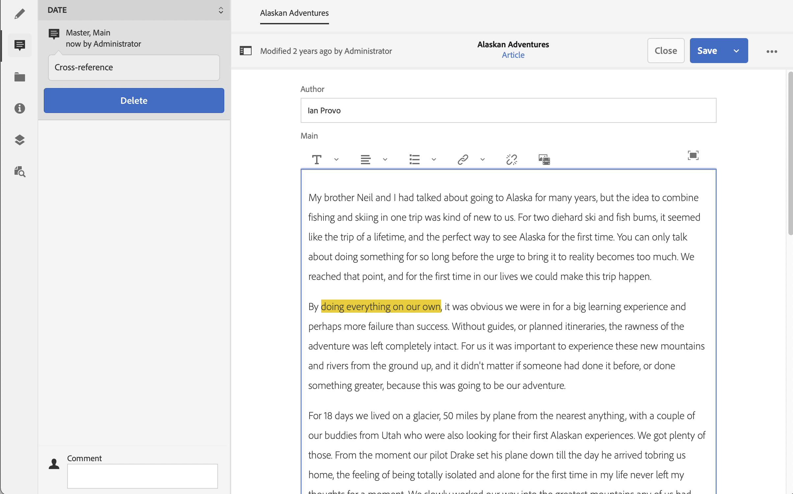

# Variations - Authoring Fragment Content{#variations-authoring-fragment-content}

[Variations](/help/assets/content-fragments/content-fragments.md#constituent-parts-of-a-content-fragment) are a significant feature of AEM's content fragments, as they allow you to create and edit copies of the master content for use on specific channels, and/or scenarios, making headless content delivery even more flexible.

From the **Variations** tab you can:

* [Enter the content](#authoring-your-content) for your fragment,
* [Create and manage variations](#managing-variations) of the **Master** content,

Perform a range of other actions depending on the data-type being edited; for example:

* [Insert visual assets into your fragment](#inserting-assets-into-your-fragment) (images)

* Select between [Rich Text](#rich-text), [Plain Text](#plain-text) and [Markdown](#markdown) for editing

* [Upload Content](#uploading-content)

* [View key statistics](#viewing-key-statistics) (about multi-line text)

* [Summarize Text](#summarizing-text)

* [Synchronize variations with Master content](#synchronizing-with-master)

>[!CAUTION]
>
>After a fragment has been published and/or referenced, AEM will display a warning when an author opens the fragment for editing again. This is to warn that changes to the fragment will affect the referenced pages as well.

## Authoring your Content {#authoring-your-content}

When you open your content fragment for editing, the **Variations** tab will be open by default. Here you can author the content, for Master or any variations you have. The structured fragment contains various fields, of various data-types, that were defined in the content model. 

For example:

You can:

* make edits directly in the **Variations** tab

  * each data type provides different editing options

* for **Multi line text** fields you can also open the [full-screen editor](#full-screen-editor) to:

  * select the [Format](#formats)
  * see more editing options (for [Rich Text](#rich-text) format)
  * access a range of [actions](#actions)

* For **Fragment Reference** fields the **[Edit Content Fragment](#fragment-references-edit-content-fragment)** option can be available, depending on the model definition.

### Full Screen Editor {#full-screen-editor}

When editing a multi-line text field you can open the full screen editor; tap or click within the actual text, then select the following action icon:

This will open the full screen text editor:

The full screen text editor provides:

* Access to various [actions](#actions)
* Depending on the [format](#formats), additional formatting options ([Rich Text](#rich-text))

### Actions {#actions}

The following actions are also available (for all the [formats](#formats)) when the full-screen editor (i.e. multi-line text) is open:

* Select the [format](#formats) ([Rich Text](#rich-text), [Plain Text,](#plain-text) [Markdown](#markdown))

* [Upload content](#uploading-content)

* [Show Text Statistics](#viewing-key-statistics)

* [Synchronize with Master](#synchronizing-with-master) (when editing a variation)
 
* [Summarize Text](#summarizing-text)

### Formats {#formats}

The options for editing multi-line text depend on the format selected:

* [Rich Text](#rich-text)
* [Plain Text](#plain-text)
* [Markdown](#markdown)

The format can be selected when the full-screen editor.

### Rich Text {#rich-text}

Rich text editing allows you to format:

* Bold
* Italic
* Underline
* Alignment: left, center, right
* Bulleted list
* Numbered list
* Indentation: increase, decrease
* Create/Break hyperlinks
* Paste Text/from Word
* Insert a table
* Paragraph style: Paragraph, Heading 1/2/3
* [Insert asset](#inserting-assets-into-your-fragment)
* Open the full-screen editor, where the following formatting options are available:
  * Search
  * Find/Replace
  * Spellchecker
  * [Annotations](/help/assets/content-fragments/content-fragments-variations.md#annotating-a-content-fragment)
* [Insert Content Fragment](#inserting-content-fragment-into-your-fragment); available when your **Multi line text** field is configured with **Allow Fragment Reference**.

The [actions](#actions) are also accessible from the full-screen editor.

### Plain Text {#plain-text}

Plain Text allows for rapid entry of content without formatting or markdown information. You can also open the full-screen editor for further [actions](#actions).

>[!CAUTION]
>
>If you select **Plain Text** you might lose any formatting, markdown and/or assets that you have inserted in either **Rich Text** or **Markdown**.

### Markdown {#markdown}

>[!NOTE]
>
>For full information see the [Markdown](/help/assets/content-fragments/content-fragments-markdown.md) documentation.

This allows you to format your text using markdown. You can define:

* Headings
* Paragraphs and Line Breaks
* Links
* Images
* Block Quotes
* Lists
* Emphasis
* Code Blocks
* Backslash Escapes

You can also open the full-screen editor for further [actions](#actions).

>[!CAUTION]
>
>If you switch between **Rich Text** and **Markdown** you might experience unexpected effects with Block Quotes and Code Blocks, as these two formats can have differences in how they are handled.

### Fragment References {#fragment-references}

If the Content Fragment Model contains Fragment References, your fragment authors may have additional options:

* [Edit Content Fragment](#fragment-references-edit-content-fragment)
* [New Content Fragment](#fragment-references-new-content-fragment)

#### Edit Content Fragment {#fragment-references-edit-content-fragment}

The option **Edit Content Fragment** will open that fragment in a new editor tab (within the same browser tab).

Selecting the original tab again (for example, **Little Pony Inc.**), will close this secondary tab (in this case, **Adam Smith**).

#### New Content Fragment {#fragment-references-new-content-fragment}

The option **New Content Fragment** will allow you to create a completely new fragment. To achieve this a variation of the create content fragment wizard will open in the editor. 

You will then be able to create a new fragment by:

1. Navigating to, and selecting the required folder.
1. Selecting **Next**.
1. Specifying properties; for example **Title**.
1. Selecting **Create**.
1. Finally:
   1. **Done** will return (to the original fragment) and reference the new fragment.
   1. **Open** will reference the new fragment as well as opening the new fragment, for editing, in a new browser tab.

### Viewing Key Statistics {#viewing-key-statistics}

When the full-screen editor is open, the action **Text Statistics** will display a range of information about the text. 

For example:

### Uploading Content {#uploading-content}

To ease the process of authoring content fragments you can upload text, prepared in an external editor, and add it directly to the fragment.

### Summarizing Text {#summarizing-text}

Summarizing text is designed to help users reduce the length of their text to a predefined number of words, while keeping the key points and overall meaning.

>[!NOTE]
>
>On a more technical level the system keeps the sentences which it rates as providing the *best ratio of information density and uniqueness* according to specific algorithms.

>[!CAUTION]
>
>The content fragment must have a valid language folder (ISO Code) as an ancestor; this is used to determine the language model to be used.
>
>For example, `en/` as in the following path:
>
>&nbsp;&nbsp;`/content/dam/my-brand/en/path-down/my-content-fragment`

>[!CAUTION]
>
>English is available out-of-the-box.
>
>Other languages are available as Language Model Packages from Package Share:
>
>* [French (fr)](https://experience.adobe.com/#/downloads/content/software-distribution/en/aem.html?package=/content/software-distribution/en/details.html/content/dam/aem/public/adobe/packages/cq630/product/smartcontent-model-fr)
>* [German (de)](https://experience.adobe.com/#/downloads/content/software-distribution/en/aem.html?package=/content/software-distribution/en/details.html/content/dam/aem/public/adobe/packages/cq630/product/smartcontent-model-de)
>* [Italian (it)](https://experience.adobe.com/#/downloads/content/software-distribution/en/aem.html?package=/content/software-distribution/en/details.html/content/dam/aem/public/adobe/packages/cq630/product/smartcontent-model-it)
>* [Spanish (es)](https://experience.adobe.com/#/downloads/content/software-distribution/en/aem.html?package=/content/software-distribution/en/details.html/content/dam/aem/public/adobe/packages/cq630/product/smartcontent-model-es)
>

1. Select **Master** or the required variation.
1. Open the full-screen editor.

1. Select **Summarize text** from the toolbar.

   

1. Specify the target number of words and select **Start**:
1. The original text is displayed side-by-side with the proposed summarization:

    * Any sentences to be eliminated are highlighted in red, with strike-through.
    * Click on any highlighted sentence to keep it in the summarized content.
    * Click on any non-highlighted sentence to have it eliminated.

1. Select **Summarize** to confirm the changes.

1. The original text is displayed side-by-side with the proposed summarization:

    * Any sentences to be eliminated are highlighted in red, with strike-through.
    * Click on any highlighted sentence to keep it in the summarized content.
    * Click on any non-highlighted sentence to have it eliminated.
    * The summarization statistics are shown: **Actual** and **Target**-
    * You can **Preview** the changes.

   

### Annotating a Content Fragment {#annotating-a-content-fragment}

To annotate a fragment:

1. Select **Master** or the required variation.

1. Open the full-screen editor.

1. The **Annotate** icon is available in the top toolbar. You can select some text if required.

   

1. A dialog will open. Here you can enter your annotation.

   

1. Select **Apply** on the dialog. 

   

   If the annotation was applied to selected text, then that text will remain highlighted.

   

1. Close the full-screen editor, annotations are still highlighted. If selected, a dialog will open so that you can edit the annotation further.

1. Select **Save**.

1. Close the full-screen editor, annotations are still highlighted. If selected, a dialog will open so that you can edit the annotation further.

   

### Viewing, Editing, Deleting Annotations {#viewing-editing-deleting-annotations}

Annotations:

* Are indicated by the highlight on the text, in both full-screen and normal mode of the editor. Full details of an annotation can then be viewed, edited, and/or deleted, by clicking on the highlighted text, which will re-open the dialog.

  >[!NOTE]
  >
  >A drop-down selector is provided if multiple annotations have been applied to one piece of text.

* When you delete the entire text to which the annotation was applied, the annotation is deleted as well.

* Can be listed, and deleted, by selecting the **Annotations** tab in the fragment editor.

  

* Can be viewed, and deleted, in [Timeline](/help/assets/content-fragments/content-fragments-managing.md#timeline-for-content-fragments) for the selected fragment.

### Inserting Assets into your Fragment {#inserting-assets-into-your-fragment}

To ease the process of authoring content fragments you can add [Assets](/help/assets/manage-digital-assets.md) (images) directly to the fragment.

They will be added to the paragraph sequence of the fragment without any formatting; formatting can be done when the [fragment is used/referenced on a page](/help/sites-cloud/authoring/fundamentals/content-fragments.md).

>[!CAUTION]
>
>These assets cannot be moved or deleted on a referencing page, this must be done in the fragment editor.
>
>However, formatting of the asset (e.g. size) must be done in the [page editor](/help/sites-cloud/authoring/fundamentals/content-fragments.md). The representation of the asset in the fragment editor is purely for authoring the content flow.

>[!NOTE]
>
>There are various methods of adding [images](/help/assets/content-fragments/content-fragments.md#fragments-with-visual-assets) to the fragment and/or page.

1. Position the cursor at the position you want to add the image.
1. Use the **Insert Asset** icon to open the search dialog.

   

1. In the dialog you can either:

   * navigate to the required asset in DAM
   * search for the asset in DAM

   Once located, select the required asset by clicking on the thumbnail.

1. Use **Select** to add the asset to the paragraph system of your content fragment at the current location.

   >[!CAUTION]
   >
   >If, after adding an asset, you change format to:
   >* **Plain Text**: the asset will be completely lost from the fragment.
   >* **Markdown**: the asset will not be visible, but will still be there when you return to **Rich Text**.

### Inserting a Content Fragment into your Fragment {#inserting-content-fragment-into-your-fragment}

To ease the process of authoring content fragments you can also add another Content Fragment to your fragment.

They will be added as a reference, in your current location in your fragment.

>[!NOTE]
>
>This option is available when your **Multi line text** is configured with **Allow Fragment Reference**.

>[!CAUTION]
>
>These assets cannot be moved or deleted on a referencing page, this must be done in the fragment editor.
>
>However, formatting of the asset (e.g. size) must be done in the [page editor](/help/sites-cloud/authoring/fundamentals/content-fragments.md). The representation of the asset in the fragment editor is purely for authoring the content flow.

>[!NOTE]
>
>There are various methods of adding [images](/help/assets/content-fragments/content-fragments.md#fragments-with-visual-assets) to the fragment and/or page.

1. Position the cursor at the position you want to add the fragment.
1. Use the **Insert Content Fragment** icon to open the search dialog.

   

1. In the dialog you can either:

    * navigate to the required fragment in the Assets folder
    * search for the fragment

   Once located, select the required fragment by clicking on the thumbnail.

1. Use **Select** to add a reference to the selected Content Fragment to your current content fragment (at the current location).

   >[!CAUTION]
   >
   >If, after adding an reference to another fragment, you change format to:
   >* **Plain Text**: the reference will be completely lost from the fragment.
   >* **Markdown**: the reference will remain.

## Managing Variations {#managing-variations}

### Creating a Variation {#creating-a-variation}

Variations allow you to take the **Master** content and vary it according to purpose (if required).

To create a new variation:

1. Open your fragment and ensure that the side panel is visible.
1. Select **Variations** from the icon bar in the side panel.
1. Select **Create Variation**.
1. A dialog will open, specify the **Title** and **Description** for the new variation.
1. Select **Add**; the fragment **Master** will be copied to the new variation, which is now open for [editing](#editing-a-variation).

   >[!NOTE]
   >
   >When creating a new variation it is always **Master** that is copied, not the variation that is currently open.

### Editing a Variation {#editing-a-variation}

You can make changes to the variation content after either:

* [Creating your variation](#creating-a-variation).
* Opening an existing fragment, then selecting the required variation from the side panel.

### Renaming a Variation {#renaming-a-variation}

To rename an existing variation:

1. Open your fragment and select **Variations** from the side panel.
1. Select the required variation.
1. Select **Rename** from the **Actions** drop down.

1. Enter the new **Title** and/or **Description** in the resulting dialog box.

1. Confirm the **Rename** action.

>[!NOTE]
>
>This only affects the variation **Title**.

### Deleting a Variation {#deleting-a-variation}

To delete an existing variation:

1. Open your fragment and select **Variations** from the side panel.
1. Select the required variation.
1. Select **Delete** from the **Actions** drop down.

1. Confirm the **Delete** action in the dialog.

>[!NOTE]
>
>You cannot delete **Master**.

### Synchronizing with Master {#synchronizing-with-master}

**Master** is an integral part of a content fragment and by definition it holds the master copy of the content, whereas the variations hold the individual updated and tailored versions of that content. When Master is updated it is possible that these changes are also relevant to the variations and, therefore, need to be propagated to them..

When editing a variation you have access to the action for synchronizing the current element of the variation with Master. This allows you to automatically copy changes made to Master to the required variation.

>[!CAUTION]
>
>Synchronization is only available to copy changes *from **Master** to the variation*.
>
>Only the current element of the variation will be synchronized.
>
>Synchronization only works on the **Multi line text** data-type.
>
>Transferring changes *from a variation to **Master*** is not available as an option.

1. Open your content fragment in the fragment editor. Ensure that the **Master** has been edited.

1. Select a specific variation, then the appropriate synchronization action from either:

   * the **Actions** drop down selector - **Sync current element with master**

      

   * the toolbar of the full-screen editor - **Sync with master**

      

1. Master and the variation will be shown side-by-side:

   * green indicates content added (to the variation)
   * red indicates content removed (from the variation)
   * blue indicates replaced text

   

1. Select **Synchronize**, the variation will updated and shown.
