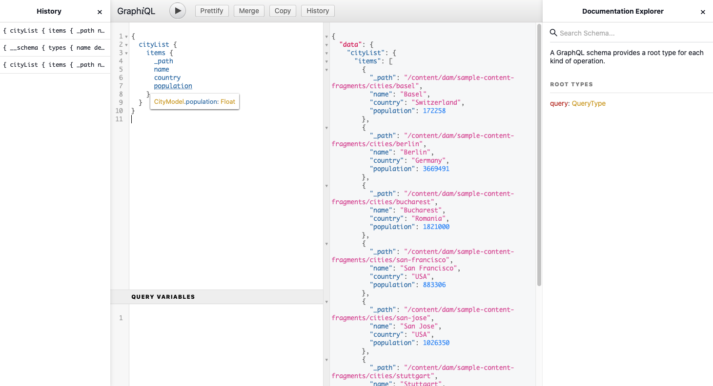
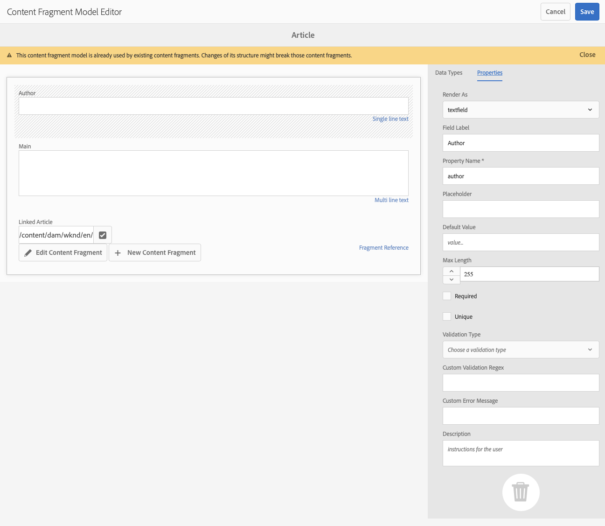
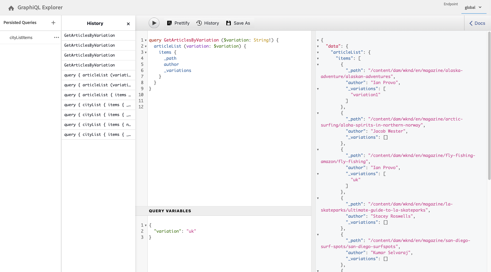
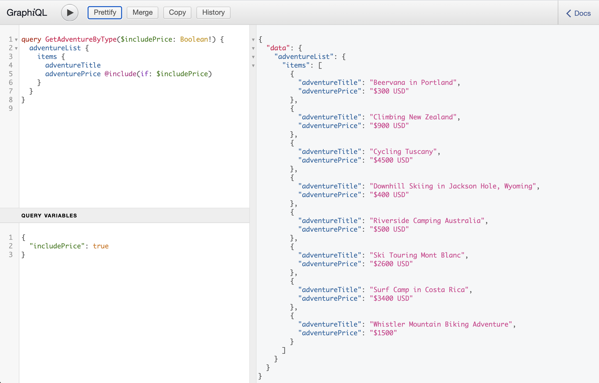

# AEM GraphQL API for use with Content Fragments {#graphql-api-for-use-with-content-fragments}

Learn how to use Content Fragments in Adobe Experience Manager (AEM) as a Cloud Service with the AEM GraphQL API for headless content delivery.

AEM as a Cloud Service GraphQL API used with Content Fragments is heavily based on the standard, open source GraphQL API.

Using the GraphQL API in AEM enables the efficient delivery of Content Fragments to JavaScript clients in headless CMS implementations:

* Avoiding iterative API requests as with REST,
* Ensuring that delivery is limited to the specific requirements,
* Allowing for bulk delivery of exactly what is needed for rendering as the response to a single API query.

>[!NOTE]
>
>GraphQL is currently used in two (separate) scenarios in Adobe Experience Manager (AEM) as a Cloud Service:
>
>* [AEM Commerce consumes data from a Commerce platform via GraphQL](/help/commerce-cloud/integrating/magento.md).
>* AEM Content Fragments work together with the AEM GraphQL API (a customized implementation, based on standard GraphQL), to deliver structured content for use in your applications.

## The GraphQL API {#graphql-api}

GraphQL is:

* "*...a query language for APIs and a runtime for fulfilling those queries with your existing data. GraphQL provides a complete and understandable description of the data in your API, gives clients the power to ask for exactly what they need and nothing more, makes it easier to evolve APIs over time, and enables powerful developer tools.*". 

  See [GraphQL.org](https://graphql.org)

* "*...an open spec for a flexible API layer. Put GraphQL over your existing backends to build products faster than ever before....*". 

  See [Explore GraphQL](https://www.graphql.com). 

* *"...a data query language and specification developed internally by Facebook in 2012 before being publicly open sourced in 2015. It provides an alternative to REST-based architectures with the purpose of increasing developer productivity and minimizing amounts of data transferred. GraphQL is used in production by hundreds of organizations of all sizes..."* 
  
  See [GraphQL Foundation](https://foundation.graphql.org/).

<!--
"*Explore GraphQL is maintained by the Apollo team. Our goal is to give developers and technical leaders around the world all of the tools they need to understand and adopt GraphQL.*". 
-->

For further information about the GraphQL API, see the following sections (amongst many other resources):

* At [graphql.org](https://graphql.org):

  * [Introduction to GraphQL](https://graphql.org/learn)

  * [The GraphQL Specification](http://spec.graphql.org/)

* At [graphql.com](https://graphql.com):

  * [Guides](https://www.graphql.com/guides/)

  * [Tutorials](https://www.graphql.com/tutorials/)

  * [Case Studies](https://www.graphql.com/case-studies/)

The GraphQL for AEM implementation is based on the standard GraphQL Java Library. See:

* [graphQL.org - Java](https://graphql.org/code/#java)

* [GraphQL Java at GitHub](https://github.com/graphql-java)

### GraphQL Terminology {#graphql-terminology}

GraphQL uses the following:

* **[Queries](https://graphql.org/learn/queries/)**
  
* **[Schemas and Types](https://graphql.org/learn/schema/)**:

  * Schemas are generated by AEM based on the Content Fragment Models.
  * Using your schemas, GraphQL presents the types and operations allowed for the GraphQL for AEM implementation.
  
* **[Fields](https://graphql.org/learn/queries/#fields)**

* **[GraphQL Endpoint](#graphql-aem-endpoint)**
  * The path in AEM that responds to GraphQL queries, and provides access to the GraphQL schemas. 

  * See [Enabling your GraphQL Endpoint](#enabling-graphql-endpoint) for further details.

See the [(GraphQL.org) Introduction to GraphQL](https://graphql.org/learn/) for comprehensive details, including the [Best Practices](https://graphql.org/learn/best-practices/).

### GraphQL Query Types {#graphql-query-types}

With GraphQL you can perform queries to return either:

* A **single entry**
  
* A **[list of entries](https://graphql.org/learn/schema/#lists-and-non-null)**

You can also perform:

* [Persisted Queries, that are cached](#persisted-queries-caching)

>[!NOTE]
>You can test and debug GraphQL queries using the [GraphiQL IDE](#graphiql-interface).

## The GraphQL for AEM Endpoint {#graphql-aem-endpoint}

The endpoint is the path used to access GraphQL for AEM. Using this path you (or your app) can:

* access the GraphQL schema,
* send your GraphQL queries, 
* receive the responses (to your GraphQL queries).

There are two types of endpoints in AEM:

* Global
  * Available for use by all sites.
  * This endpoint can use all Content Fragment Models from all Sites configurations (defined in the [Configuration Browser](/help/assets/content-fragments/content-fragments-configuration-browser.md#enable-content-fragment-functionality-in-configuration-browser)).
  * If there are any Content Fragment Models that should be shared among Sites configurations, then these should be created under the global Sites configurations.
* Sites configurations:
  * Corresponds to a Sites configuration, as defined in the [Configuration Browser](/help/assets/content-fragments/content-fragments-configuration-browser.md#enable-content-fragment-functionality-in-configuration-browser).
  * Specific to a specified site/project.
  * A Sites configuration specific endpoint will use the Content Fragment Models from that specific Sites configuration together with those from the global Sites configuration.

>[!CAUTION]
>
>The Content Fragment Editor can allow a Content Fragment of one Sites configuration to reference a Content Fragment of another Sites configuration (via polices). 
>
>In such a case not all content will be retrievable using a Sites configuration specific endpoint. 
>
>The content author should control this scenario; for example, it may be useful to consider putting shared Content Fragment Models under the Global Sites configuration.

The repository path of the GraphQL for AEM global endpoint is:

`/content/cq:graphql/global/endpoint`

For which your app can use the following path in the request URL:

`/content/_cq_graphql/global/endpoint.json`

To enable an endpoint for GraphQL for AEM you need to:

* [Enable your GraphQL Endpoint](#enabling-graphql-endpoint)
* [Publish your GraphQL Endpoint](#publishing-graphql-endpoint)

### Enabling your GraphQL Endpoint {#enabling-graphql-endpoint}

To enable a GraphQL Endpoint you first need to have an appropriate configuration. See [Content Fragments - Configuration Browser](/help/assets/content-fragments/content-fragments-configuration-browser.md).

>[!CAUTION]
>
>If the [use of content fragment models have not been enabled](/help/assets/content-fragments/content-fragments-configuration-browser.md), the **Create** option will not be available.

To enable the corresponding endpoint:

1. Navigate to **Tools**, **Assets**, then select **GraphQL**.
1. Select **Create**.
1. The **Create new GraphQL Endpoint** dialog will open. Here you can specify:
   * **Name**: name of the endpoint; you can enter any text.
   * **Use GraphQL schema provided by**: use the dropdown to select the required site/project.

   >[!NOTE]
   >
   >The following warning is shown in the dialog:
   >
   >* *GraphQL endpoints may introduce data security and performance issues if not managed carefully. Please ensure to set appropriate permissions after creating an endpoint.*
   
1. Confirm with **Create**.
1. The **Next steps** dialog will provide a direct link to the Security console so that you can ensure that newly created endpoint has suitable permissions.

   >[!CAUTION]
   >
   >The endpoint is accessible to everyone. This can - especially on publish instances - pose a security concern, as GraphQL queries can impose a heavy load on the server.
   >
   >You can set up ACLs, appropriate to your use case, on the endpoint. 

### Publishing your GraphQL Endpoint {#publishing-graphql-endpoint}

Select the new endpoint and **Publish** to make it fully available in all environments.

>[!CAUTION]
>
>The endpoint is accessible to everyone. 
>
>On publish instances this can pose a security concern, as GraphQL queries can impose a heavy load on the server.
>
>You must set up ACLs appropriate to your use case on the endpoint. 

## GraphiQL Interface {#graphiql-interface}

An implementation of the standard [GraphiQL](https://graphql.org/learn/serving-over-http/#graphiql) interface is available for use with AEM GraphQL. This can be [installed with AEM](#installing-graphiql-interface). 

>[!NOTE]
>
>GraphiQL is bound the global endpoint (and does not work with other endpoints for specific Sites configurations).

This interface allows you to directly input, and test, queries.

For example: 

* `http://localhost:4502/content/graphiql.html`

This provides features such as syntax-highlighting, auto-complete, auto-suggest, together with a history and online documentation:



### Installing the AEM GraphiQL interface {#installing-graphiql-interface}

The GraphiQL user interface can be installed on AEM with a dedicated package: the [GraphiQL Content Package v0.0.6 (2021.3)](https://experience.adobe.com/#/downloads/content/software-distribution/en/aemcloud.html?package=/content/software-distribution/en/details.html/content/dam/aemcloud/public/aem-graphql/graphiql-0.0.6.zip) package.

## Use Cases for Author and Publish Environments {#use-cases-author-publish-environments}

The use cases can depend on the type of AEM as a Cloud Service environment:

* Publish environment; used to: 
  * Query data for JS application (standard use-case)

* Author environment; used to: 
  * Query data for "content management purposes":
    * GraphQL in AEM as a Cloud Service is currently a read-only API.
    * The REST API can be used for CR(u)D operations.

## Permissions {#permission}

The permissions are those required for accessing Assets.

## Schema Generation {#schema-generation}

GraphQL is a strongly typed API, which means that data must be clearly structured and organized by type.

The GraphQL specification provides a series of guidelines on how to create a robust API for interrogating data on a certain instance. To do this, a client needs to fetch the [Schema](#schema-generation), which contains all the types necessary for a query. 

For Content Fragments, the GraphQL schemas (structure and types) are based on **Enabled** [Content Fragment Models](/help/assets/content-fragments/content-fragments-models.md) and their data types.

>[!CAUTION]
>
>All the GraphQL schemas (derived from Content Fragment Models that have been **Enabled**) are readable through the GraphQL endpoint.
>
>This means that you need to ensure that no sensitive data is available, as it could be leaked this way; for example, this includes information that could be present as field names in the model definition.

For example, if a user created a Content Fragment Model called `Article`, then AEM generates the object `article` that is of a type `ArticleModel`. The fields within this type correspond to the fields and data types defined in the model.

1. A Content Fragment Model:

   

1. The corresponding GraphQL schema (output from GraphiQL automatic documentation):
   

   This shows that the generated type `ArticleModel` contains several [fields](#fields). 
   
   * Three of them have been controlled by the user: `author`, `main` and `referencearticle`.

   * The other fields were added automatically by AEM, and represent helpful methods to provide information about a certain Content Fragment; in this example, `_path`, `_metadata`, `_variations`. These [helper fields](#helper-fields) are marked with a preceding `_` to distinguish between what has been defined by the user and what has been auto-generated.

1. After a user creates a Content Fragment based on the Article model, it can then be interrogated through GraphQL. For examples, see the [Sample Queries](/help/assets/content-fragments/content-fragments-graphql-samples.md#graphql-sample-queries) (based on a [sample Content Fragment structure for use with GraphQL](/help/assets/content-fragments/content-fragments-graphql-samples.md#content-fragment-structure-graphql)).

In GraphQL for AEM, the schema is flexible. This means that it is auto-generated each and every time a Content Fragment Model is created, updated or deleted. The data schema caches are also refreshed when you update a Content Fragment Model.

The Sites GraphQL service listens (in the background) for any modifications made to a Content Fragment Model. When updates are detected, only that part of the schema is regenerated. This optimization saves time and provides stability.

So for example, if you:

1. Install a package containing `Content-Fragment-Model-1` and `Content-Fragment-Model-2`:
 
   1. GraphQL types for `Model-1` and `Model-2` will be generated.

1. Then modify `Content-Fragment-Model-2`:

   1. Only the `Model-2` GraphQL type will get updated.

   1. Whereas `Model-1` will remain the same. 

>[!NOTE]
>
>This is important to note in case you want to do bulk updates on Content Fragment Models through the REST api, or otherwise.

The schema is served through the same endpoint as the GraphQL queries, with the client handling the fact that the schema is called with the extension `GQLschema`. For example, performing a simple `GET` request on `/content/cq:graphql/global/endpoint.GQLschema` will result in the output of the schema with the Content-type: `text/x-graphql-schema;charset=iso-8859-1`.

### Schema Generation - Unpublished Models {#schema-generation-unpublished-models}

When Content Fragments are nested it can happen that a parent Content Fragment Model is published, but a referenced model is not.

>[!NOTE]
>
>The AEM UI prevents this happening, but if publishing is made programmatically, or with content packages, it can occur.

When this happens, AEM generates an *incomplete* Schema for the parent Content Fragment Model. This means that the Fragment Reference, which is dependent on the unpublished model, is removed from the schema.

## Fields {#fields}

Within the schema there are individual fields, of two basic categories:

* Fields that you generate.

  A selection of [Field Types](#field-types) are used to create fields based on how you configure your Content Fragment Model. The field names are taken from the **Property Name** field of the **Data Type**.
  
  * There is also the **Render As** property to take into consideration, because users can configure certain data types; for example, as either a single line text or a multifield. 

* GraphQL for AEM also generates a number of [helper fields](#helper-fields).

  These are used to identify a Content Fragment, or to get more information about a content fragment.

### Field Types {#field-types}

GraphQL for AEM supports a list of types. All the supported Content Fragment Model Data Types and the corresponding GraphQL types are represented:

| Content Fragment Model - Data Type | GraphQL Type | Description |
|--- |--- |--- |
| Single line Text | String, [String] | Used for simple strings such as author names, location names, etc. |
| Multi line Text | String | Used for outputting text such as the body of an article |
| Number | Float, [Float] | Used to display floating point number and regular numbers |
| Boolean | Boolean | Used to display checkboxes → simple true/false statements |
| Date And Time | Calendar | Used to display date and time in an ISO 8086 format. Depending on the type selected, there are three flavors available for use in AEM GraphQL: `onlyDate`, `onlyTime`, `dateTime` |
| Enumeration | String | Used to display an option from a list of options defined at model creation |
| Tags | [String] | Used to display a list of Strings representing Tags used in AEM |
| Content Reference | String | Used to display the path towards another asset in AEM |
| Fragment Reference | *A model type* | Used to reference another Content Fragment of a certain Model Type, defined when the model was created |

### Helper Fields {#helper-fields}

In addition to the data types for user generated fields, GraphQL for AEM also generates a number of *helper* fields in order to help identify a Content Fragment, or to provide additional information about a Content Fragment.

#### Path {#path}

The path field is used as an identifier in GraphQL. It represents the path of the Content Fragment asset inside the AEM repository. We have chosen this as the identifier of a content fragment, because it:

* is unique within AEM,
* can be easily fetched.

The following code will display the paths of all Content Fragments that were created based on the Content Fragment Model `Person`. 

```xml
{
  personList {
    items {
      _path
    }
  }
}
```

To retrieve a single Content Fragment of a specific type, you also need to determine its path first. for example:

```xml
{
  personByPath(_path: "/content/dam/path/to/fragment/john-doe") {
    item {
      _path
      firstName
      name
    }
  }
}
```

See [Sample Query - A Single Specific City Fragment](/help/assets/content-fragments/content-fragments-graphql-samples.md#sample-single-specific-city-fragment).

#### Metadata {#metadata}

Through GraphQL, AEM also exposes the metadata of a Content Fragment. Metadata is the information that describes a content fragment, such as the title of a content fragment, the thumbnail path, the description of a Content Fragment, the date it was created, amongst others.

Because Metadata is generated through the Schema Editor and as such does not have a specific structure, the `TypedMetaData` GraphQL type was implemented to expose the metadata of a Content Fragment. `TypedMetaData` exposes the information grouped by the following scalar types:

| Field |
|--- |
|`stringMetadata:[StringMetadata]!`|
|`stringArrayMetadata:[StringArrayMetadata]!`|
|`intMetadata:[IntMetadata]!`|
|`intArrayMetadata:[IntArrayMetadata]!`|
|`floatMetadata:[FloatMetadata]!`|
|`floatArrayMetadata:[FloatArrayMetadata]!`|
|`booleanMetadata:[BooleanMetadata]!`|
|`booleanArrayMetadata:[booleanArrayMetadata]!` |
|`calendarMetadata:[CalendarMetadata]!`|
|`calendarArrayMetadata:[CalendarArrayMetadata]!`|

Each scalar type represents either a single name-value pair or an array of name-value pairs, where the value of that pair is of the type it was grouped in. 

For example, if you want to retrieve the title of a Content Fragment, we know that this property is a String property, so we would query for all the String Metadata:

To query for metadata:

```xml
{
  personByPath(_path: "/content/dam/path/to/fragment/john-doe") {
    item {
      _path
      _metadata {
        stringMetadata {
          name
          value
        }
      }
    }
  }
}
```

You can view all the metadata GraphQL types if you view the Generated GraphQL schema. All model types have the same `TypedMetaData`. 

>[!NOTE]
>
>**Difference between normal and array metadata**
>Keep in mind that `StringMetadata` and `StringArrayMetadata` both refer to what is stored in the repository, not how you retrieve them. 
>
>So for example, by calling the `stringMetadata` field, you would receive an array of all the metadata that was stored in the repository as a `String` , and if you call `stringArrayMetadata` you would receive an array of all the metadata that was stored in the repository as `String[]`.

See [Sample Query for Metadata - List the Metadata for Awards titled GB](/help/assets/content-fragments/content-fragments-graphql-samples.md#sample-metadata-awards-gb).

#### Variations {#variations}

The `_variations` field has been implemented to simplify querying the variations that a Content Fragment has. For example:

```xml
{
  personByPath(_path: "/content/dam/path/to/fragment/john-doe") {
    item {
      _variations
    }
  }
}
```

See [Sample Query - All Cities with a Named Variation](/help/assets/content-fragments/content-fragments-graphql-samples.md#sample-cities-named-variation).

<!--
## Security Considerations {#security-considerations}
-->

## GraphQL Variables {#graphql-variables}

GraphQL permits variables to be placed in the query. For more information you can see the [GraphQL documentation for Variables](https://graphql.org/learn/queries/#variables).

For example, to get all Content Fragments of type `Article` that have a specific variation, you can specify the variable `variation` in GraphiQL.



```xml
### query
query GetArticlesByVariation($variation: String!) {
    articleList(variation: $variation) {
        items {
            _path
            author
        }
    }
}
 
### in query variables
{
    "variation": "uk"
}
```

## GraphQL Directives {#graphql-directives}

In GraphQL there is a possibility to change the query based on variables, called GraphQL Directives.

For example there you can include the `adventurePrice` field in a query for all the `AdventureModels`, based on a variable `includePrice`.



```xml
### query
query GetAdventureByType($includePrice: Boolean!) {
  adventureList {
    items {
      adventureTitle
      adventurePrice @include(if: $includePrice)
    }
  }
}
 
### in query variables
{
    "includePrice": true
}
```

## Filtering {#filtering}

You can also use filtering in your GraphQL queries to return specific data. 

Filtering uses a syntax based on logical operators and expressions. 

For example, the following (basic) query filters all persons that have a name of `Jobs` or `Smith`:

```xml
query {
  personList(filter: {
    name: {
      _logOp: OR
      _expressions: [
        {
          value: "Jobs"
        },
        {
          value: "Smith"
        }
      ]
    }
  }) {
    items {
      name
      firstName
    }
  }
}
```

For further examples, see:

* details of the [GraphQL for AEM extensions](#graphql-extensions)

* [Sample Queries using this Sample Content and Structure](/help/assets/content-fragments/content-fragments-graphql-samples.md#graphql-sample-queries-sample-content-fragment-structure)

  * And the [Sample Content and Structure](/help/assets/content-fragments/content-fragments-graphql-samples.md#content-fragment-structure-graphql) prepared for use in sample queries

* [Sample Queries based on the WKND Project](/help/assets/content-fragments/content-fragments-graphql-samples.md#sample-queries-using-wknd-project)

## GraphQL for AEM - Summary of Extensions {#graphql-extensions}

The basic operation of queries with GraphQL for AEM adhere to the standard GraphQL specification. For GraphQL queries with AEM there are a few extensions:

* If you require a single result:
  * use the model name; eg city

* If you expect a list of results:
  * add `List` to the model name; for example,  `cityList`
  * See [Sample Query - All Information about All Cities](#sample-all-information-all-cities)

* If you want to use a logical OR:
  * use ` _logOp: OR`
  * See [Sample Query - All Persons that have a name of "Jobs" or "Smith"](#sample-all-persons-jobs-smith)

* Logical AND also exists, but is (often) implicit

* You can query on field names that correspond to the fields within the Content Fragment Model
  * See [Sample Query - Full Details of a Company's CEO and Employees](#sample-full-details-company-ceos-employees)

* In addition to the fields from your model, there are some system-generated fields (preceded by underscore):

  * For content:

    * `_locale` : to reveal the language; based on Language Manager
      * See [Sample Query for multiple Content Fragments of a given locale](#sample-wknd-multiple-fragments-given-locale)

    * `_metadata` : to reveal metadata for your fragment
      * See [Sample Query for Metadata - List the Metadata for Awards titled GB](#sample-metadata-awards-gb)

    * `_model` : allow querying for a Content Fragment Model (path and title)
      * See [Sample Query for a Content Fragment Model from a Model](#sample-wknd-content-fragment-model-from-model)
  
    * `_path` : the path to your Content Fragment within the repository
      * See [Sample Query - A Single Specific City Fragment](#sample-single-specific-city-fragment)

    * `_reference` : to reveal references; including inline references in the Rich Text Editor
      * See [Sample Query for multiple Content Fragments with Prefetched References](#sample-wknd-multiple-fragments-prefetched-references)

    * `_variation` : to reveal specific Variations within your Content Fragment
      * See [Sample Query - All Cities with a Named Variation](#sample-cities-named-variation)

  * And operations:
  
    * `_operator` : apply specific operators; `EQUALS`, `EQUALS_NOT`, `GREATER_EQUAL`, `LOWER`, `CONTAINS`, `STARTS_WITH` 
      * See [Sample Query - All Persons that do not have a name of "Jobs"](#sample-all-persons-not-jobs)
      * See [Sample Query - All Adventures where the `_path` starts with a specific prefix](#sample-wknd-all-adventures-cycling-path-filter)
  
    * `_apply` : to apply specific conditions; for example,  `AT_LEAST_ONCE`
      * See [Sample Query - Filter on an array with an item that must occur at least once](#sample-array-item-occur-at-least-once)

    * `_ignoreCase` : to ignore the case when querying
      * See [Sample Query - All cities with SAN in the name, irrespective of case](#sample-all-cities-san-ignore-case)

* GraphQL union types are supported:

  * use `... on` 
    * See [Sample Query for a Content Fragment of a specific Model with a Content Reference](#sample-wknd-fragment-specific-model-content-reference)

## Persisted Queries (Caching) {#persisted-queries-caching}

After preparing a query with a POST request, it can be executed with a GET request that can be cached by HTTP caches or a CDN.

This is required as POST queries are usually not cached, and if using GET with the query as a parameter there is a significant risk of the parameter becoming too large for HTTP services and intermediates.

Persisted queries must always use the endpoint related to the [appropriate Sites configuration](#graphql-aem-endpoint); so they can use either, or both:

* The Global configuration and endpoint
  The query has access to all Content Fragment Models.
* Specific Sites configuration(s) and endpoint(s)
  Creating a persisted query for a specific Sites configuration requires a corresponding Sites-configuration-specific endpoint (to provide access to the related Content Fragment Models). 
  For example, to create a persisted query specifically for the WKND Sites configuration, a corresponding WKND-specific Sites configuration, and a WKND-specific endpoint must be created in advance.

>[!NOTE]
>
>See [Enable Content Fragment Functionality in Configuration Browser](/help/assets/content-fragments/content-fragments-configuration-browser.md#enable-content-fragment-functionality-in-configuration-browser) for more details.
>
>The **GraphQL Persistence Queries** need to be enabled, for the appropriate Sites configuration. 

For example, if there is a particular query called `my-query`, which uses a model `my-model` from the Sites configuration `my-conf`:

* You can create a query using the `my-conf` specific endpoint, and then the query will be saved as following: 
`/conf/my-conf/settings/graphql/persistentQueries/my-query`
* You can create the same query using `global` endpoint, but then the query will be saved as following:
`/conf/global/settings/graphql/persistentQueries/my-query`

>[!NOTE]
>
>These are two different queries - saved under different paths. 
>
>They just happen to use the same model - but via different endpoints.


Here are the steps required to persist a given query:

1. Prepare the query by PUTing it to the new endpoint URL `/graphql/persist.json/<config>/<persisted-label>`.

   For example, create a persisted query:

   ```xml
   $ curl -X PUT \
       -H 'authorization: Basic YWRtaW46YWRtaW4=' \
       -H "Content-Type: application/json" \
       "http://localhost:4502/graphql/persist.json/wknd/plain-article-query" \
       -d \
   '{
     articleList {
       items{
           _path
           author
           main {
               json
           }
       }
     }
   }'
   ```

1. At this point, check the response.

   For example, check for success:

     ```xml
     {
       "action": "create",
       "configurationName": "wknd",
       "name": "plain-article-query",
       "shortPath": "/wknd/plain-article-query",
       "path": "/conf/wknd/settings/graphql/persistentQueries/plain-article-query"
     }
     ```

1. You can then replay the persisted query by GETing the URL `/graphql/execute.json/<shortPath>`.

   For example, use the persisted query:

   ```xml
   $ curl -X GET \
       http://localhost:4502/graphql/execute.json/wknd/plain-article-query
   ```

1. Update a persisted query by POSTing to an already existing query path.

   For example, use the persisted query:

   ```xml
   $ curl -X POST \
       -H 'authorization: Basic YWRtaW46YWRtaW4=' \
       -H "Content-Type: application/json" \
       "http://localhost:4502/graphql/persist.json/wknd/plain-article-query" \
       -d \
   '{
     articleList {
       items{
           _path
           author
           main {
               json
           }
         referencearticle {
           _path
         }
       }
     }
   }'
   ```

1. Create a wrapped plain query.

   For example:

   ```xml
   $ curl -X PUT \
       -H 'authorization: Basic YWRtaW46YWRtaW4=' \
       -H "Content-Type: application/json" \
       "http://localhost:4502/graphql/persist.json/wknd/plain-article-query-wrapped" \
       -d \
   '{ "query": "{articleList { items { _path author main { json } referencearticle { _path } } } }"}'
   ```

1. Create a wrapped plain query with cache control.

   For example:

   ```xml
   $ curl -X PUT \
       -H 'authorization: Basic YWRtaW46YWRtaW4=' \
       -H "Content-Type: application/json" \
       "http://localhost:4502/graphql/persist.json/wknd/plain-article-query-max-age" \
       -d \
   '{ "query": "{articleList { items { _path author main { json } referencearticle { _path } } } }", "cache-control": { "max-age": 300 }}'
   ```

1. Create a persisted query with parameters:

   For example:

   ```xml
   $ curl -X PUT \
       -H 'authorization: Basic YWRtaW46YWRtaW4=' \
       -H "Content-Type: application/json" \
       "http://localhost:4502/graphql/persist.json/wknd/plain-article-query-parameters" \
       -d \
   'query GetAsGraphqlModelTestByPath($apath: String!, $withReference: Boolean = true) {
     articleByPath(_path: $apath) {
       item {
         _path
           author
           main {
           plaintext
           }
           referencearticle @include(if: $withReference) {
           _path
           }
         }
       }
     }'
   ```

1. Executing a query with parameters.

   For example:

   ```xml
   $ curl -X POST \
       -H 'authorization: Basic YWRtaW46YWRtaW4=' \
       -H "Content-Type: application/json" \
       "http://localhost:4502/graphql/execute.json/wknd/plain-article-query-parameters;apath=%2fcontent2fdam2fwknd2fen2fmagazine2falaska-adventure2falaskan-adventures;withReference=false"

   $ curl -X GET \
       "http://localhost:4502/graphql/execute.json/wknd/plain-article-query-parameters;apath=%2fcontent2fdam2fwknd2fen2fmagazine2falaska-adventure2falaskan-adventures;withReference=false"
   ```

1. To execute the query on publish, the related persist tree need to replicated

   * Using a POST for replication:

     ```xml
     $curl -X POST   http://localhost:4502/bin/replicate.json \
       -H 'authorization: Basic YWRtaW46YWRtaW4=' \
       -F path=/conf/wknd/settings/graphql/persistentQueries/plain-article-query \
       -F cmd=activate
     ```

   * Using a package:
     1. Create a new package definition.
     1. Include the configuration (for example, `/conf/wknd/settings/graphql/persistentQueries`).
     1. Build the package.
     1. Replicate the package.

   * Using replication/distribution tool.
     1. Go to the Distribution tool.
     1. Select tree activation for the configuration (for example, `/conf/wknd/settings/graphql/persistentQueries`).

   * Using a workflow (via workflow launcher configuration):
     1. Define a workflow launcher rule for executing a workflow model that would replicate the configuration on different events (for example, create, modify, amongst others).

1. Once the query configuration is on publish, the same principles apply, just using the publish endpoint.

   >[!NOTE]
   >
   >For anonymous access the system assumes that the ACL allows "everyone" to have access to the query configuration.
   >
   >If that is not the case it will not be able to execute.

   >[!NOTE]
   >
   >Any semicolons (";") in the URLs need to be encoded.
   >
   >For example, as in the request to Execute a persisted query:
   >
   >```xml
   >curl -X GET \ "http://localhost:4502/graphql/execute.json/wknd/plain-article-query-parameters%3bapath=%2fcontent2fdam2fwknd2fen2fmagazine2falaska-adventure2falaskan-adventures;withReference=false"
   >```

## Querying the GraphQL endpoint from an External Website {#query-graphql-endpoint-from-external-website}

To access the GraphQL endpoint from an external website you need to configure the:

* [CORS Filter](#cors-filter)
* [Referrer Filter](#referrer-filter)

### CORS Filter {#cors-filter}

>[!NOTE]
>
>For a detailed overview of the CORS resource sharing policy in AEM see [Understand Cross-Origin Resource Sharing (CORS)](https://experienceleague.adobe.com/docs/experience-manager-learn/foundation/security/understand-cross-origin-resource-sharing.html?lang=en#understand-cross-origin-resource-sharing-(cors)).

To access the GraphQL endpoint, a CORS policy must be configured in the customer Git repository. This is done by adding an appropriate OSGi CORS configuration file for the desired endpoint(s). 

This configuration must specify a trusted website origin `alloworigin` or `alloworiginregexp` for which access must be granted.

For example, to grant access to the GraphQL endpoint and persisted queries endpoint for `https://my.domain` you can use:

```xml
{
  "supportscredentials":true,
  "supportedmethods":[
    "GET",
    "HEAD",
    "POST"
  ],
  "exposedheaders":[
    ""
  ],
  "alloworigin":[
    "https://my.domain"
  ],
  "maxage:Integer":1800,
  "alloworiginregexp":[
    ""
  ],
  "supportedheaders":[
    "Origin",
    "Accept",
    "X-Requested-With",
    "Content-Type",
    "Access-Control-Request-Method",
    "Access-Control-Request-Headers"
  ],
  "allowedpaths":[
    "/content/_cq_graphql/global/endpoint.json",
    "/graphql/execute.json/.*"
  ]
}
```

If you have configured a vanity path for the endpoint, you can also use it in `allowedpaths`.

### Referrer Filter {#referrer-filter}

In addition to CORS configuration, a Referrer filter must be configured to allow access from third party hosts.

This is done by adding an appropriate OSGi Referrer Filter configuration file that:

* specifies a trusted website host name; either `allow.hosts` or `allow.hosts.regexp`,
* grants access for this host name.

For example, to grant access for requests with the Referrer `my.domain` you can:

```xml
{
    "allow.empty":false,
    "allow.hosts":[
      "my.domain"
    ],
    "allow.hosts.regexp":[
      ""
    ],
    "filter.methods":[
      "POST",
      "PUT",
      "DELETE",
      "COPY",
      "MOVE"
    ],
    "exclude.agents.regexp":[
      ""
    ]
}
```

>[!CAUTION]
>
>It remains the customer's responsibility to:
>
>* only grant access to trusted domains 
>* make sure no sensitive information is exposed 
>* not use a wildcard [*] syntax; this will both disable authenticated access to the GraphQL endpoint and also expose it to the entire world.

>[!CAUTION]
>
>All the GraphQL [schemas](#schema-generation) (derived from Content Fragment Models that have been **Enabled**) are readable through the GraphQL endpoint.
>
>This means that you need to ensure that no sensitive data is available, as it could be leaked this way; for example, this includes information that could be present as field names in the model definition.

## Authentication {#authentication}

See [Authentication for Remote AEM GraphQL Queries on Content Fragments](/help/assets/content-fragments/graphql-authentication-content-fragments.md).

<!-- to be addressed later -->

<!--
## Sorting {#sorting}
-->

<!-- to be addressed later -->

<!--
## Paging {#paging}
-->

## FAQs {#faqs}

Questions that have arisen:

1. **Q**: "*How is the GraphQL API for AEM different from Query Builder API?*"

   * **A**: 
     "*The AEM GraphQL API offers total control on the JSON output, and is an industry standard for querying content. 
     Moving forward, AEM is planning to invest in the AEM GraphQL API.*"

## Tutorial - Getting Started with AEM Headless and GraphQL {#tutorial}

Looking for a hands-on tutorial? Check out [Getting Started with AEM Headless and GraphQL](https://experienceleague.adobe.com/docs/experience-manager-learn/getting-started-with-aem-headless/graphql/overview.html) end-to-end tutorial illustrating how to build-out and expose content using AEM’s GraphQL APIs and consumed by an external app, in a headless CMS scenario.
