# Creating Translation Projects for Content Fragments {#creating-translation-projects-for-content-fragments}

In addition to assets, Adobe Experience Manager (AEM) Assets supports language copy workflows for [content fragments](/help/assets/content-fragments/content-fragments.md) (including variations). No additional optimization is required to run language copy workflows on content fragments. In each workflow, the entire content fragment is sent for translation.

The types of workflows that you can run on content fragments is exactly similar to the workflow types you run for assets. Also, the options available within each workflow type match the options available under the corresponding workflows types for assets.

You can run the following types of language copy workflows on content fragments:

**Create and translate**

In this workflow, content fragments to be translated are copied to the language root of the language to which you want to translate. In addition, depending upon the options you choose, a translation project is created for the content fragments in the Projects console. Depending on the settings, the translation project can be started manually or allowed to run automatically as soon as the translation project is created.

**Update language copies**

When the source content fragment is updated or modified, the corresponding locale/language specific content fragment requires retranslation. The update language copies workflow translates an additional group of content fragments and includes it in a Language copy for a particular locale. In this case, the translated content fragments are added to the target folder that already contains previously translated content fragments.

## Create and translate workflow {#create-and-translate-workflow}

The Create and translate workflow includes the following options. The procedural steps associated with each option are similar to those associated with the corresponding option for assets.

* Create structure only: For procedure steps, see [Create structure only for assets](translation-projects.md#create-structure-only).
* Create a translation project: For procedure steps, see [Create a translation project for assets](translation-projects.md#create-a-new-translation-project).
* Add to existing translation project: For procedure steps, see [Add to existing translation project for assets](translation-projects.md#add-to-existing-translation-project).

## Update language copies workflow {#update-language-copies-workflow}

The Update language copies workflow includes the following options. The procedural steps associated with each option are similar to those associated with the corresponding option for assets.

* Create a translation project: For procedure steps, see [Create a translation project for assets](translation-projects.md#create-a-new-translation-project) (update workflow).
* Add to existing translation project: For procedure steps, see [Add to existing translation project for assets](translation-projects.md#add-to-existing-translation-project) (update workflow).

You can also create temporary language copies for fragments similar to the way you create temporary copies for assets. For details, see [Creating temporary language copies for assets](translation-projects.md#creating-temporary-language-copies).

## Translating mixed media fragments {#translating-mixed-media-fragments}

AEM lets you translate content fragments that include various types of media assets and collections. If you translate a content fragment that includes inline assets, the translated copies of these assets are stored under the target language root.

If the content fragment includes a collection, the assets within the collection are translated along with the content fragment. The translated copies of the assets are stored within the appropriate target language root at a location that matches the physical location of the source assets under the source language root.

To be able to translate content fragments that include mixed media, first edit the default translation framework to enable the translation of inline assets and collections associated with content fragments.

1. Click the AEM logo, and navigate to **[!UICONTROL Tools > Deployment > Cloud Services]**.
1. Locate **[!UICONTROL Translation Integration]** under **[!UICONTROL Adobe Marketing Cloud]**, and click **[!UICONTROL Show Configurations]**.

   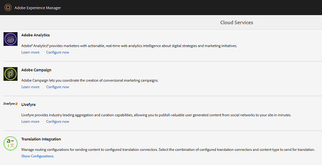

1. From the list of available configurations, click **[!UICONTROL Default configuration (Translation Integration configuration)]** to open the **[!UICONTROL Default configuration]** page.

   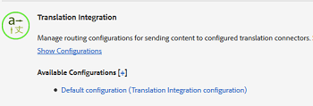

1. Click **[!UICONTROL Edit]** from the toolbar to display the **[!UICONTROL Translation Config]** dialog.

   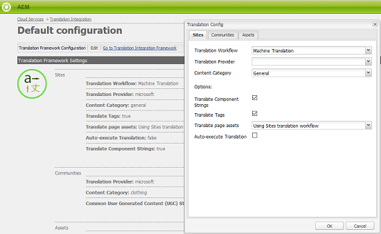

1. Navigate to the **[!UICONTROL Assets]** tab, and choose **[!UICONTROL Inline Media Assets and Associated Collections]** from the **[!UICONTROL Translate Content Fragment Assets]** list. Click **[!UICONTROL OK]** to save the changes.

   

1. From within the English root folder, open a content fragment.

   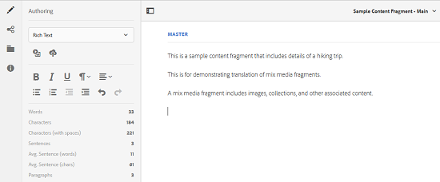

1. Click the **[!UICONTROL Insert Asset]** icon.

   

1. Insert an asset into the content fragment.

   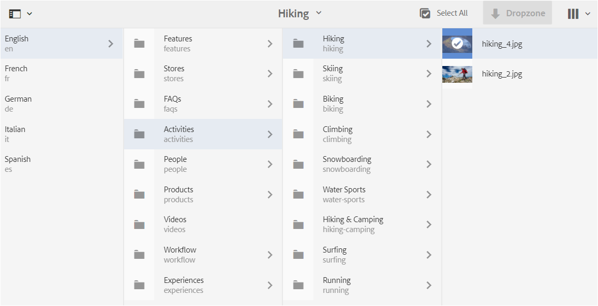

1. Click the **[!UICONTROL Associate Content]** icon.

   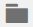

1. Click **[!UICONTROL Associate Content]**.

   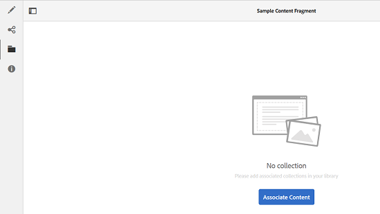

1. Select a collection and include it into the content fragment. Click **[!UICONTROL Save]**.

   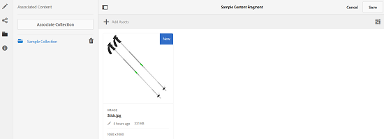

1. Select the content fragment, and click the **[!UICONTROL GlobalNav]** icon.
1. Select **[!UICONTROL References]** from the menu to display the **[!UICONTROL References]** pane.

   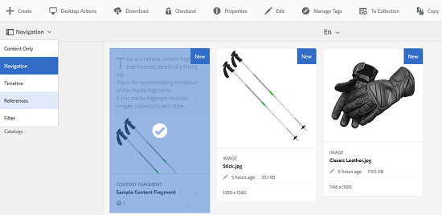

1. Click **[!UICONTROL Language Copies]** under **[!UICONTROL Copies]** to display the language copies.

   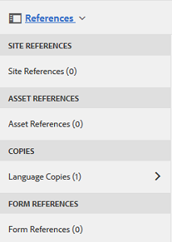

1. Click **[!UICONTROL Create & Translate]** from at the bottom of the panel to display the **[!UICONTROL Create & Translate]** dialog.

   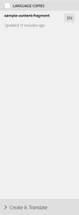

1. Select the target language from the **[!UICONTROL Target Languages]** list.

   

1. Select the translation project type from the **[!UICONTROL Project]** list.

   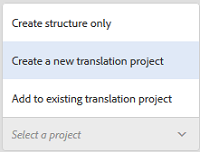

1. Specify the title of the project in the **[!UICONTROL Project Title]** box and then click **Create**.

   

1. Navigate to the **[!UICONTROL Projects]** console, and open the project folder for the translation project you created.

   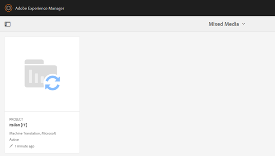

1. Click the project tile to open the project details page.

   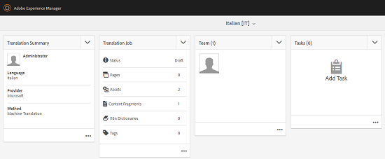

1. From the Translation Job tile, verify the number of assets to be translated.
1. From the **[!UICONTROL Translation Job]** tile, start the translation job.

   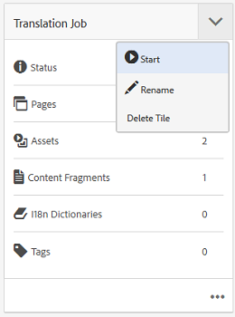

1. Click the ellipses at the bottom of the Translation Job tile to display the status of the translation job.

   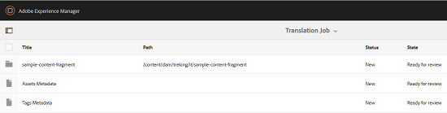

1. Click the content fragment to check the path of the translated associated assets.

   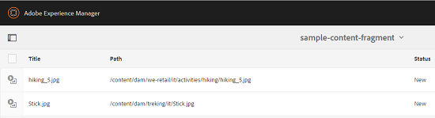

1. Review the language copy for the collection in the Collections console.

   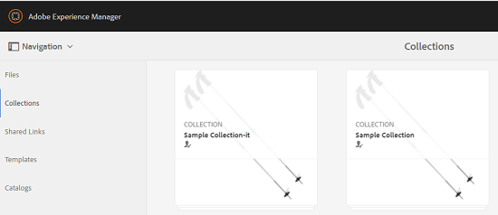

   Notice that only the content of the collection are translated. The collection itself is not translated.

1. Navigate to the path of the translated associated asset. Observe that the translated asset is stored under the target language root.

   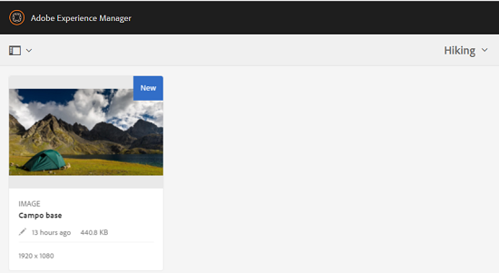

1. Navigate to the assets within the collection that are translated along with the content fragment. Observe that the translated copies of the assets are stored at the appropriate target language root.

   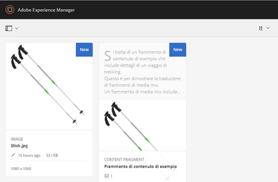

   >[!NOTE]
   >
   >The procedures for adding a content fragment to an existing project or to perform update workflows are similar to the corresponding procedures for assets. For guidance on these procedures, see the procedures described for assets.
