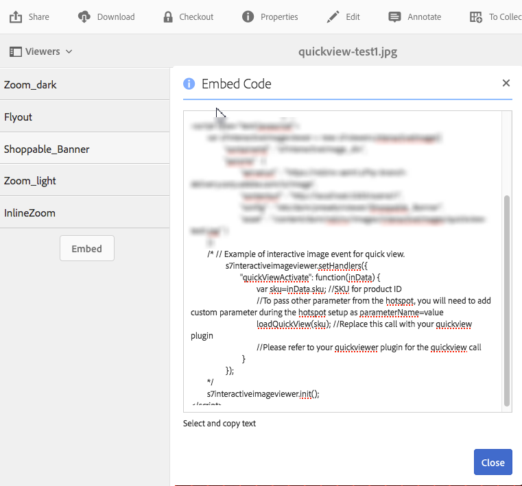

# Using Quickviews to create custom pop-ups {#using-quickviews-to-create-custom-pop-ups}

The default Quickview is used in ecommerce experiences whereby a pop-up is displayed with product information to drive a purchase. However, you can trigger custom content to display in the pop-ups. Depending on the viewer you are using, this functionality lets users click on a hotspot, or a thumbnail image, or on an image map to see information or related content.

Quickviews are supported by the following viewers in Dynamic Media:

* Interactive Images (clickable hotspots)  
* Interactive Video (clickable thumbnail images during video playback)  
* Carousel Banners (clickable hotspots or image maps)

While the functionality of each viewer differs, the process of creating a Quickview is the same across all three supported viewers.

**To use Quickviews to create custom pop-ups,**

1. Create a Quickview for an uploaded asset.

   You typically create a Quickview the same time you edit an asset for use with the viewer you are using.

   <table> 
    <tbody> 
    <tr> 
    <td><strong>Viewer you are using</strong></td> 
    <td><strong>Complete these steps to create the Quickview</strong></td> 
    </tr> 
    <tr> 
    <td>Interactive Images</td> 
    <td><a href="/help/assets/interactive-images.md#adding-hotspots-to-an-image-banner" target="_blank">Adding hotspots to an image banner</a>.</td> 
    </tr> 
    <tr> 
    <td>Interactive Videos</td> 
    <td><a href="/help/assets/interactive-videos.md#adding-interactivity-to-your-video" target="_blank">Adding interactivity to your video</a>.</td> 
    </tr> 
    <tr> 
    <td>Carousel Banners</td> 
    <td><a href="/help/assets/carousel-banners.md#adding-hotspots-or-image-maps-to-an-image-banner" target="_blank">Adding Hotspots or Image Maps to a Banner</a>.<br /> </td> 
    </tr> 
    </tbody> 
   </table>

1. Obtain the viewer embed code to Integrate the viewer within your website.

   <table> 
    <tbody> 
    <tr> 
    <td><strong>Viewer you are using</strong><br /> </td> 
    <td><strong>Complete these steps to integrate the viewer with your website</strong></td> 
    </tr> 
    <tr> 
    <td>Interactive image</td> 
    <td><a href="/help/assets/interactive-images.md#integrating-an-interactive-image-with-your-website" target="_blank">Integrating an interactive image with your website</a>.<br /> </td> 
    </tr> 
    <tr> 
    <td>Interactive video<br /> </td> 
    <td><a href="/help/assets/interactive-videos.md#integrating-an-interactive-video-with-your-website" target="_blank">Integrating an interactive video with your website</a>.<br /> </td> 
    </tr> 
    <tr> 
    <td>Carousel banner</td> 
    <td><a href="/help/assets/carousel-banners.md#adding-a-carousel-banner-to-your-website-page" target="_blank">Adding a carousel banner to your website page</a>.<br /> </td> 
    </tr> 
    </tbody> 
   </table>

1. The viewer you are using now needs to know how to use the Quickview.

   To do this the viewer uses a handler called `QuickViewActive`.

   **Example** 
   Suppose you were using the following sample embed code on your web page for an interactive image:

   

   The handler is loaded into the viewer using `setHandlers`:

   `*viewerInstance*.setHandlers({ *handler 1*, *handler 2*}, ...`

   **Using the sample embed code example from above, we have the following code:** 

   ```xml
   s7interactiveimageviewer.setHandlers({
       quickViewActivate": function(inData) {
           var sku=inData.sku;
           var genericVariable1=inData.genericVariable1;
           var genericVariable2=inData.genericVariable2;
          loadQuickView(sku,genericVariable1,genericVariable2);
       }
   })
   ```

   Learn more about `setHandlers()` method at the following:

    * Interactive Image viewer: [https://marketing.adobe.com/resources/help/en_US/s7/viewers_ref/r_html5_aem_int_image_viewer_javascriptapiref_sethandlers.html](https://marketing.adobe.com/resources/help/en_US/s7/viewers_ref/r_html5_aem_int_image_viewer_javascriptapiref_sethandlers.html)
    * Interactive Video viewer: [https://marketing.adobe.com/resources/help/en_US/s7/viewers_ref/r_html5_aem_int_video_javascriptapiref_sethandlers.html](https://marketing.adobe.com/resources/help/en_US/s7/viewers_ref/r_html5_aem_int_video_javascriptapiref_sethandlers.html)

1. You now need to configure the quickViewActivate `` handler.

   The quickViewActivate handler controls the Quickviews in the viewer. The handler contains the variable list and function calls for use with the Quickview. The embed code provides mapping for the SKU variable set in the Quickview as well as a sample loadQuickView function call.

   **Variable mapping** 
   Map variables for use in your web page to the SKU value and generic variables contained in the Quickview:

   `var *variable1*= inData.*quickviewVariable*`

   The provided embed code has a sample mapping for the SKU variable:

   `var sku=inData.sku`

   Map additional variables from the Quickview too, as in the following:

   ```
   var <i>variable2</i>= inData.<i>quickviewVariable2</i> 
    var <i>variable3</i>= inData.<i>quickviewVariable3</i>
   ```

   **Function call** 
   The handler also requires a function call for the Quickview to work. The function is assumed to be accessible by your host page. The embed code provides a sample function call:

   `loadQuickView(sku)`

   The sample function call assumes the function `loadQuickView()` exists and is accessible.

   Learn more about quickViewActivate method at the following:

    * Interactive Image viewer: [https://marketing.adobe.com/resources/help/en_US/s7/viewers_ref/c_html5_aem_interactive_image_event_callbacks.html](https://marketing.adobe.com/resources/help/en_US/s7/viewers_ref/c_html5_aem_interactive_image_event_callbacks.html)
    * Interactive Video viewer: [https://marketing.adobe.com/resources/help/en_US/s7/viewers_ref/c_html5_aem_int_video_event_callbacks.html](https://marketing.adobe.com/resources/help/en_US/s7/viewers_ref/c_html5_aem_int_video_event_callbacks.html)
    * Interactive data support in Interactive Video viewer: [https://marketing.adobe.com/resources/help/en_US/s7/viewers_ref/c_html5_aem_int_video_int_data_support.html](https://marketing.adobe.com/resources/help/en_US/s7/viewers_ref/c_html5_aem_int_video_int_data_support.html)

1. Do the following:

    * Uncomment the setHandlers section of the embed code.
    * Map any additional variables contained in the Quickview.

        * Update the `loadQuickView(sku,*var1*,*var2*)` call if you are adding additional variables.

    * Create a simple loadQuickView () function on page, outside of the viewer.

      For example, the following writes the value of sku to the browser console:

   ```xml
   function loadQuickView(sku){
       console.log ("quickview sku value is " + sku);
   }
   ```

    * Upload a test HTML page to a webserver and open.  

      With the variables from the Quickview mapped and the function call in place, the browser console writes the variable value to the browser console using the sample function provided.

1. You can now use a function to invoke a simple pop-up in the Quickview. The following example uses a `DIV` for a popup.
1. Style the pop-up `DIV` in the following manner. Add your own additional styling as desired.

   ```xml
   <style type="text/css">
       #quickview_div{
           position: absolute;
           z-index: 99999999;
           display: none;
       }
   </style>
   ```

1. Place the pop-up `DIV` in the body of your HTML page.

   One of the elements is set with an ID that is updated with sku value when the user invokes a Quickview. The example also includes a simple button to hide the pop-up again after it becomes visible.

   ```xml
   <div id="quickview_div" >
       <table>
           <tr><td><input id="btnClosePopup" type="button" value="Close"        onclick='document.getElementById("quickview_div").style.display="none"' /><br /></td></tr>
           <tr><td>SKU</td><td><input type="text" id="txtSku" name="txtSku"></td></tr>
       </table>
   </div>
   ```

1. Add a function to update the sku value in the pop-up; make the pop-up visible by replacing the simple function created in step 5. with the following:

   ```xml
   <script type="text/javascript">
       function loadQuickView(sku){
           document.getElementById("txtSku").setAttribute("value",sku); // write sku value
           document.getElementById("quickview_div").style.display="block"; // show popup
       }
   </script>
   ```

1. Upload a test HTML page to your webserver and open. The viewer displays the pop-up `DIV` when a user invokes a Quickview.
1. **How to display the custom pop-up in full screen mode**

   Some viewers, such as the Interactive Video viewer, support display in fullscreen mode. However, using the pop-up as described in the previous steps causes it to display behind the viewer while in full screen mode.

   To have the pop-up display in both standard and full screen modes, you attach the pop-up to the viewer container. To accomplish this, you can use a second handler method, `initComplete`.

   The `initComplete` hander is invoked after the viewer is initialized.

   ```xml
   "initComplete":function() { code block }
   ```

   Learn more about `init()` method at the following:

    * Interactive Image viewer: [https://marketing.adobe.com/resources/help/en_US/s7/viewers_ref/r_html5_aem_int_image_viewer_javascriptapiref_init.html](https://marketing.adobe.com/resources/help/en_US/s7/viewers_ref/r_html5_aem_int_image_viewer_javascriptapiref_init.html)
    * Interactive Video viewer: [https://marketing.adobe.com/resources/help/en_US/s7/viewers_ref/r_html5_aem_int_video_javascriptapiref_init.html](https://marketing.adobe.com/resources/help/en_US/s7/viewers_ref/r_html5_aem_int_video_javascriptapiref_init.html)

1. To attach the pop-up--described in the previous steps--to the viewer, use the following code:

   ```xml
   "initComplete":function() {
       var popup = document.getElementById('quickview_div');
       popup.parentNode.removeChild(popup);
       var sdkContainerId = s7interactivevideoviewer.getComponent("container").getInnerContainerId();
       var inner_container = document.getElementById(sdkContainerId);
       inner_container.appendChild(popup);
   }
   ```

   In the code above, we have done the following:

    * Identified our custom pop-up.
    * Removed it from the DOM.
    * Identified the viewer container.
    * Attached the pop-up to the viewer container.

1. Your entire setHandlers code should now look similar to the following (Interactive Video viewer was used):

   ```xml
   s7interactivevideoviewer.setHandlers({
       "quickViewActivate": function(inData) {
           var sku=inData.sku;
           loadQuickView(sku);

       },
       "initComplete":function() {
           var popup = document.getElementById('quickview_div'); // get custom quick view container
           popup.parentNode.removeChild(popup); // remove it from current DOM
           var sdkContainerId = s7interactivevideoviewer.getComponent("container").getInnerContainerId();
           var inner_container = document.getElementById(sdkContainerId);
           inner_container.appendChild(popup);
       }
   });
   ```

1. After the handlers are loaded, you initialize the viewer:

   `*viewerInstance.*init()`

   **Example** 
   This example uses the Interactive image viewer.

   `s7interactiveimageviewer.init()`

   After you embed the viewer into your host page, be sure that the viewer instance is created and the handlers are loaded before the viewer is invoked using `init()`.

